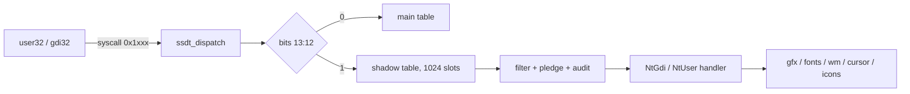

<!-- docs: covers=todo/08-graphics-ui/TODO-15-win32k-shadow-ssdt.md sources=src/kernel/nt/ssdt.c,include/kernel/nt/ssdt.h,src/kernel/nt/syscall_filter.c,src/kernel/nt/pledge.c reviewed=2026-09-29 order=15 -->
# Win32k Shadow SSDT

## What is it?

The shadow SSDT is the second system service table, numbered from `0x1000`, that carries the graphics and windowing system calls: `NtGdi*` for drawing and `NtUser*` for windows, messages, input, menus and the clipboard. This roadmap plans its handlers in 27 waves, wrapping the kernel's existing graphics, font, window manager, cursor and icon code, and ends with 55 Impossible OS calls for compositor effects. None of its sections has shipped: the table exists and is dispatched, but no service is registered in it.

## How does it work?

**Today.** The table and its routing already exist in [`ssdt.c`](../../src/kernel/nt/ssdt.c):

- **Routing.** Every system call number carries a table selector in bits 13:12 and an index in bits 11:0 ([`ssdt.h`](../../include/kernel/nt/ssdt.h)). Selector 0 is the main table, 1 is the shadow table, and 2 and 3 return `STATUS_INVALID_PARAMETER`. So `0x1000` to `0x13FF` reach the shadow table and `0x3000` does not.
- **Contents.** `ssdt_init()` fills all 1,024 shadow slots with the not-implemented stub, so a shadow call that passes the policy checks below returns `STATUS_NOT_IMPLEMENTED`. Nothing calls `ssdt_register()` for table 1 yet.
- **Policy already applies.** The [syscall filter](../kernel/native-api-ssdt.md) has a shadow bitmap and a one-switch "disallow Win32k" option, and a pledged process that calls any shadow service is terminated for a pledge violation, because [`pledge.c`](../../src/kernel/nt/pledge.c) gives the shadow table no pledge category. Audit hooks run for table 1 exactly as for table 0.
- **Capacity gap.** The [master table](win32k-shadow-master-table.md) plans 1,300 services up to `0x15A2`, but the table holds 1,024 slots, so 419 planned rows cannot be registered as numbered. Resolving that is filed in section 1.

**Planned design.** Section 1 adds `win32k_init()` and the service base. Sections 2 to 11 are the core: a GDI device context table, drawing, text and fonts, bitmaps, pens, brushes and regions, then USER windows, message queues, input and cursors, menus and the clipboard. Section 12 moves the legacy desktop calls into this table. Sections 13 to 26 extend GDI (paths, transforms, printing, advanced fonts) and USER (properties, dialogs, scroll bars, hooks, DPI, touch, monitors, shell integration, DirectX thunks). Section 27 adds the Impossible OS calls from `0x1300`.

## What are its interfaces?

| Interface | Status |
| --- | --- |
| `ssdt_dispatch()`, `ssdt_register()`, `ssdt_get_table()`, `SSDT_TABLE_SHADOW`, `SSDT_SHADOW_MAX` | Shipped ([`ssdt.h`](../../include/kernel/nt/ssdt.h)) |
| Shadow filter bitmap and `SYSCALL_FILTER_OP_DISALLOW_WIN32K` | Shipped ([`syscall_filter.c`](../../src/kernel/nt/syscall_filter.c)) |
| `win32k_init()`, `WIN32K_SERVICE_BASE`, `win32k_ssdt.h` | Planned, section 1 |
| `NtGdi*` device context, drawing, text, bitmap and object calls | Planned, sections 2 to 6 and 13 to 17 |
| `NtUser*` window, message, input, menu and clipboard calls | Planned, sections 7 to 11 and 18 to 25 |
| DirectX thunks and Impossible OS extensions | Planned, sections 26 and 27 |

## How do I use it?

Nothing is callable beyond the stub result, and even that is not a safe probe: a filtered process gets `STATUS_ACCESS_DENIED`, and a pledged one is terminated. The filter's shadow switch is covered by the ABI suite (`bash scripts/test.sh SUITE=abi`).

## What is not implemented yet?

- [Shadow SSDT Infrastructure (Table 1 Dispatch)](../../todo/08-graphics-ui/TODO-15-win32k-shadow-ssdt.md#1-shadow-ssdt-infrastructure-table-1-dispatch), including the capacity gap.
- The GDI core: [device contexts](../../todo/08-graphics-ui/TODO-15-win32k-shadow-ssdt.md#2-gdi-device-context-dc-object-table), [drawing](../../todo/08-graphics-ui/TODO-15-win32k-shadow-ssdt.md#3-gdi-drawing-syscalls), [text and fonts](../../todo/08-graphics-ui/TODO-15-win32k-shadow-ssdt.md#4-gdi-text-and-font-syscalls), [bitmaps](../../todo/08-graphics-ui/TODO-15-win32k-shadow-ssdt.md#5-gdi-bitmap-and-dib-syscalls) and [pens, brushes and regions](../../todo/08-graphics-ui/TODO-15-win32k-shadow-ssdt.md#6-gdi-pen-brush-and-region-syscalls).
- The USER core: [windows](../../todo/08-graphics-ui/TODO-15-win32k-shadow-ssdt.md#7-user-window-management-syscalls), [message queues](../../todo/08-graphics-ui/TODO-15-win32k-shadow-ssdt.md#8-user-message-queue-syscalls), [input and cursors](../../todo/08-graphics-ui/TODO-15-win32k-shadow-ssdt.md#9-user-input-and-cursor-syscalls), [menus](../../todo/08-graphics-ui/TODO-15-win32k-shadow-ssdt.md#10-user-menu-and-accelerator-syscalls) and [the clipboard](../../todo/08-graphics-ui/TODO-15-win32k-shadow-ssdt.md#11-user-clipboard-syscalls).
- [Migrate Legacy SYS_* to Shadow SSDT](../../todo/08-graphics-ui/TODO-15-win32k-shadow-ssdt.md#12-migrate-legacy-sys_-to-shadow-ssdt), then the extension waves 13 to 26 and [Impossible OS Exclusive Graphics Extensions](../../todo/08-graphics-ui/TODO-15-win32k-shadow-ssdt.md#27-impossible-os-exclusive-graphics-extensions).
- The routing contract is in [Win32k Shadow Native API](win32k-shadow-router.md), and the user-mode side in [Win32 GDI and USER32](win32-gdi-user32.md).

## How does it compare with Windows 11 and Linux?

Windows 11 puts about 1,300 `NtGdi` and `NtUser` services in `win32k.sys`'s shadow table, selected by the `0x1000` bit of the service number, and exposes compositor effects only through DWM or WinUI. Linux has no Win32k-style graphics system call table: the kernel exposes display and buffer operations through DRM/KMS `ioctl`s, while windowing, drawing and composition belong to X11 or Wayland servers and Mesa in user space. Impossible OS follows the Windows split and adds kernel calls for its own compositor effects.

## See also

- [Win32k Shadow SSDT roadmap](../../todo/08-graphics-ui/TODO-15-win32k-shadow-ssdt.md)
- [Native API and the SSDT](../kernel/native-api-ssdt.md)
- [Win32k Shadow SSDT Master Table](win32k-shadow-master-table.md)
- [Win32k Shadow Native API](win32k-shadow-router.md)
