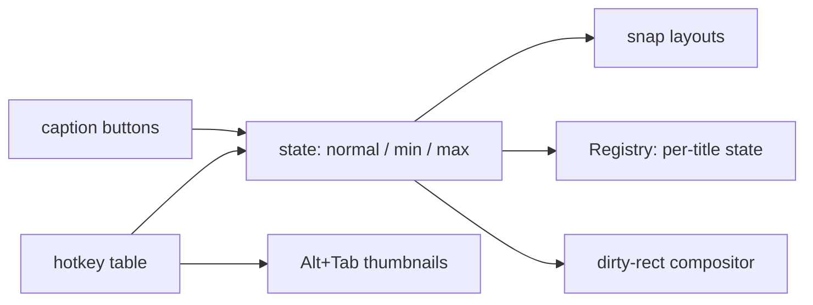

<!-- docs: covers=todo/08-graphics-ui/TODO-08-window-manager.md sources=src/desktop/wm.c,include/desktop/wm.h,src/desktop/desktop.c,src/kernel/main/compositor.c,src/kernel/drivers/keyboard.c reviewed=2026-09-29 order=8 -->
# Window Manager Enhancements

## What is it?

This roadmap takes the basic window manager to a Windows 11 quality experience, and is the single owner of window-management work that older desktop roadmaps also listed. It plans Fluent window chrome with a Mica title bar, minimize, maximize and restore with remembered state, snap layouts, a real desktop icon grid, global keyboard shortcuts, an Alt+Tab switcher with live thumbnails, drag and drop, and a compositor that repaints only what changed. None of its eight sections has shipped, but three already have partial groundwork in the code.

## How does it work?

**Today.** [`wm.c`](../../src/desktop/wm.c) keeps up to 32 windows, each with a client framebuffer, flags and a stacking order. What already exists toward this roadmap:

- **Chrome (partial, section 2).** A 32 pixel title bar with a Mica-style tint computed from the wallpaper beneath it, the title in 14 pixel semibold, and 46 pixel close, maximize and minimize buttons with hover states and 10 pixel line glyphs; close turns red on hover. Colours are fixed `WM_COLOR_*` constants, the corner radius is 6 rather than the design's 8, there is no app icon or restore glyph, and shadows use their own values instead of the elevation tokens.
- **Minimize and maximize (section 1).** The buttons are drawn and hit-tested, but their handlers only raise and focus the window.
- **Desktop icons (partial, section 4).** Three fixed icons drawn in a right-edge column; see [Desktop Icons](../desktop/desktop-icons.md).
- **Shortcuts (partial, section 5).** Alt+F4 closes the focused window through an interrupt-safe queue; there is no hotkey table, Windows key, Alt+Tab or Win+D.
- **Compositor (partial, section 8).** The [compositor](../desktop/compositor.md) skips frames when nothing is dirty, presents only the drag rectangle while a window moves, and counts late frames against a 16.67 ms budget. It still repaints the full screen for every change.
- **Moving.** Title bar dragging, clamped on screen. Edge resizing shows the cursor but does nothing.

**Planned design.**

1. **Minimize, maximize, restore**: minimized and maximized flags, a saved restore rectangle, title bar double-click, and state remembered per window title in the Registry.
2. **Decorations**: Mica through `gfx_mica()`, theme colours, radius 8, elevation shadows, a 16 pixel app icon, restore and pressed states, and the edge resize grab zone.
3. **Snap layouts**: a six-layout flyout after 500 ms hovering over maximize or on Win+Z, Win+arrow keyboard snapping, and edge-drag snapping with a preview.
4. **Desktop icons**: icons read from the Desktop folder on a 76 by 86 grid, with selection, launch and dragging.
5. **Shortcuts**: a kernel hotkey table checked before the focused window, with Win+D, Win+M, Win+Shift+M, Win+L, Win+number and Alt+F4.
6. **Alt+Tab**: a panel of live window thumbnails 158 pixels tall.
7. **Drag and drop**: a borderless ghost window following the pointer between windows.
8. **Compositor performance**: a dirty-rectangle union, an animation gate and a warning for late frames.

## What are its interfaces?

| Interface | Status |
| --- | --- |
| `wm_create_window()`, `wm_destroy_window()`, `wm_move_window()`, `wm_raise_window()`, `wm_focus_window()` | Shipped ([`wm.h`](../../include/desktop/wm.h)) |
| `wm_close_focused_window()` and the Alt+F4 check in [`keyboard.c`](../../src/kernel/drivers/keyboard.c) | Shipped |
| `wm_get_frame_stats()`, `wm_get_drag_dirty_rect()` | Shipped |
| `wm_minimize()`, `wm_maximize()`, `wm_restore()`, `WM_FLAG_MINIMIZED`, `WM_FLAG_MAXIMIZED` | Planned, section 1 |
| Snap layout flyout, hotkey table, Alt+Tab panel, drag-and-drop ghost | Planned, sections 3 to 7 |

## How do I use it?

Drag windows by the title bar and close them with the close button or Alt+F4 (`bash scripts/build.sh run`). Window counting, focus, rectangles, Alt+F4 and frame statistics are covered by `bash scripts/test.sh SUITE=desktop`.

## What is not implemented yet?

- [Minimize / Maximize / Restore](../../todo/08-graphics-ui/TODO-08-window-manager.md#1-minimize--maximize--restore-sonnet), which also owns a teardown defect found while writing these pages: destroying a window mid-drag leaves the drag flag set, and the slot's controls are not released.
- [Window Decorations](../../todo/08-graphics-ui/TODO-08-window-manager.md#2-window-decorations-sonnet), including the edge resize drag that is still missing.
- [Snap Layouts](../../todo/08-graphics-ui/TODO-08-window-manager.md#3-snap-layouts-sonnet) and [Desktop Icons](../../todo/08-graphics-ui/TODO-08-window-manager.md#4-desktop-icons-sonnet).
- [Keyboard Shortcuts and Task Switching](../../todo/08-graphics-ui/TODO-08-window-manager.md#5-keyboard-shortcuts--task-switching-sonnet), whose hotkey table overlaps the one planned in [Global Hotkey Dispatch Table](../../todo/06-desktop-foundation/TODO-03-input-system.md#4-global-hotkey-dispatch-table) (reconciliation filed there), and [Alt+Tab Task Switcher](../../todo/08-graphics-ui/TODO-08-window-manager.md#6-alttab-task-switcher-opus).
- [Drag and Drop](../../todo/08-graphics-ui/TODO-08-window-manager.md#7-drag-and-drop-opus) and [Compositor Performance](../../todo/08-graphics-ui/TODO-08-window-manager.md#8-compositor-performance-opus).
- Window motion comes from the [Animation Engine](animation-engine.md) and colours from the [Theme System](theme-system.md).

## How does it compare with Windows 11 and Linux?

Windows 11 has Mica title bars, remembered window state, the six-zone Snap Layouts flyout, Alt+Tab with thumbnails and OLE drag and drop, all composited on the GPU with damage tracking. GNOME's Mutter and KDE's KWin offer maximize and restore, edge tiling, Alt+Tab switchers and drag and drop, with snap layouts only as KWin tiling or extensions. The plan follows Windows 11 and adds a kernel-native drag ghost and a software dirty-rectangle compositor.

## See also

- [Window Manager Enhancements roadmap](../../todo/08-graphics-ui/TODO-08-window-manager.md)
- [Shell design: window chrome](../design/shell.md#window-chrome), [snap layouts](../design/shell.md#snap-layouts) and [Alt+Tab](../design/shell.md#alttab)
- [Window Management Basics](../desktop/window-management.md)
- [Desktop Compositor](../desktop/compositor.md)
