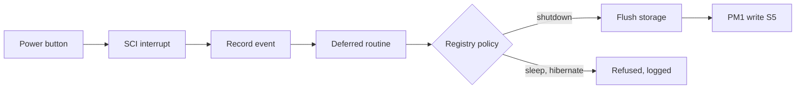

<!-- docs: covers=todo/04-drivers-hardware/TODO-03-acpi-power-management.md sources=src/kernel/acpi.c,include/kernel/acpi.h,src/kernel/acpi_osl.c,src/kernel/drivers/acpi_ec.c,src/kernel/pm_idle.c,include/kernel/pm.h,src/kernel/main/boot_storage.c,src/kernel/test/test_acpi_power.c reviewed=2026-09-28 order=3 -->
# ACPI and Power Management

## What is it?

ACPI is how firmware describes the machine and how the operating system powers it down, sleeps, reads batteries and temperatures and scales CPU speed. Impossible OS reads the ACPI tables it needs, handles the power button and powers off after a best-effort storage flush, and ships the ACPICA interpreter in release builds. It does not run AML yet, so everything that needs firmware methods (sleep, hibernate, battery, thermal zones, CPU frequency) is still to come. Only this roadmap's power profiles section has progress, and it is superseded by the kernel power roadmap.

## How does it work?

**Table parsing without an interpreter.** [`acpi.c`](../../src/kernel/acpi.c) validates the RSDP, RSDT or XSDT and each table's checksum, parses the MADT for processors and interrupt controllers, and exposes getters for the HPET, PM timer, FADT flags and MSI support. It finds the sleep type values for S1 to S5 by scanning the DSDT bytes rather than evaluating it.

**ACPICA is present but dormant.** The upstream ACPICA source is vendored in `src/kernel/acpica/`, and [`acpi_osl.c`](../../src/kernel/acpi_osl.c) implements its operating system layer (memory, ports, PCI config, locks, interrupts). Nothing calls `AcpiInitializeSubsystem()` yet, so no AML runs. It is compiled only when kernel tests are off, so the unit test image does not include it.

**Power button and shutdown.** At boot, [`boot_storage.c`](../../src/kernel/main/boot_storage.c) enters ACPI mode, arms exactly the power and sleep button fixed events, and registers the SCI as a shared interrupt, logging `SCI registered (SCI_INT ..., GSI ..., vec ...)`. The interrupt handler only records the event; a deferred routine applies the Registry button policy. The only working actions are shut down and ignore: sleep, hibernate and lock are refused with a log line. `acpi_shutdown()` flushes only the `X:` volume's cache (a failure is logged, not fatal), runs each block device's controller flush or shutdown callback, then writes the S5 sleep type to the PM1 control registers. Dirty data cached for any other volume is not written first, and running writers are not stopped.

**Sleep states.** `acpi_enter_sleep_state()` refuses S3 and S4 with `S3 entry refused: suspend/resume machinery not implemented`, and S5 goes through the shutdown path instead.

**Embedded controller and idle.** [`acpi_ec.c`](../../src/kernel/drivers/acpi_ec.c) talks to the laptop embedded controller by polling, using the ECDT table. [`pm_idle.c`](../../src/kernel/pm_idle.c) idles a CPU in C1 with a race-free `sti; hlt` and counts idle cycles; deeper C-states are not entered.



## What are its interfaces?

| Interface | Purpose |
| --- | --- |
| `acpi_init()`, `acpi_get_fadt()`, `acpi_get_raw_table()` | Table access ([`acpi.h`](../../include/kernel/acpi.h)) |
| `acpi_hw_reduced()`, `acpi_msi_supported()`, `acpi_sleep_supported()` | Firmware capability queries |
| `acpi_shutdown()`, `acpi_reboot()` | Power-off after a best-effort flush, and restart ([`acpi.c`](../../src/kernel/acpi.c)) |
| `acpi_enter_sleep_state()` | S1 only; S3 and S4 refused |
| `acpi_ec_init()` | Embedded controller ([`acpi_ec.c`](../../src/kernel/drivers/acpi_ec.c)) |
| `pm_idle_c1()`, `pm_idle_cycles()` | CPU idle ([`pm.h`](../../include/kernel/pm.h)) |

## How do I use it?

Pressing the power button on a running system shuts it down under the default policy. The ACPI power, embedded controller and idle tests run in the `boot` category, and the ACPI global lock tests in `x86`:

```bash
bash scripts/test.sh SUITE=boot
bash scripts/test.sh SUITE=x86
```

[`test_acpi_power.c`](../../src/kernel/test/test_acpi_power.c) includes cases that assert S3 and S4 are refused, so an accidental enable fails the suite rather than hanging a machine.

## What is not implemented yet?

- **Running ACPICA.** The interpreter is linked but not initialised, and there is no namespace evaluation ([ACPICA AML Interpreter Integration](../../todo/04-drivers-hardware/TODO-03-acpi-power-management.md#1-acpica-aml-interpreter-integration-opus)).
- **A shutdown orchestrator** that stops writers, flushes every volume, handles flush failures and records a reason ([Clean Shutdown Sequence](../../todo/04-drivers-hardware/TODO-03-acpi-power-management.md#2-clean-shutdown-sequence-sonnet)).
- **Control-method buttons and the roadmap's button design.** A fixed-event button path ships under the kernel power roadmap ([ACPI Power Button SCI](../../todo/04-drivers-hardware/TODO-03-acpi-power-management.md#3-acpi-power-button-sci-sonnet)).
- **Thermal monitoring** ([Thermal Monitoring](../../todo/04-drivers-hardware/TODO-03-acpi-power-management.md#4-thermal-monitoring-sonnet)) and **battery status** ([Battery Status](../../todo/04-drivers-hardware/TODO-03-acpi-power-management.md#5-battery-status-_bst--_bif-sonnet)).
- **CPU frequency scaling** ([CPU Frequency Scaling](../../todo/04-drivers-hardware/TODO-03-acpi-power-management.md#6-cpu-frequency-scaling----dvfs-opus)).
- **Power profiles**, parked here and owned by the kernel power roadmap ([Power Profiles](../../todo/04-drivers-hardware/TODO-03-acpi-power-management.md#7-power-profiles-sonnet)).
- **Deeper C-states** from `_CST` ([ACPI C-States Idle](../../todo/04-drivers-hardware/TODO-03-acpi-power-management.md#8-acpi-c-states-idle-opus)).
- **Sleep and hibernate** ([ACPI S3 Suspend / Resume](../../todo/04-drivers-hardware/TODO-03-acpi-power-management.md#9-acpi-s3-suspend--resume-opus), [Hibernate (S4)](../../todo/04-drivers-hardware/TODO-03-acpi-power-management.md#10-hibernate-s4-opus)).

## How does it compare with Windows 11 and Linux?

Windows 11 runs AML in `ACPI.sys` and manages sleep, hibernate, batteries and processor power states through the kernel power manager, `battc.sys` and power plans. Linux runs ACPICA in `drivers/acpi` with suspend, hibernate, `cpufreq` and `cpuidle`, and exposes batteries through `upower`. Impossible OS reads tables, powers off and handles the power button, but cannot sleep, read a battery or change CPU speed. The roadmap's own addition is per-core temperature bars in Task Manager.

## See also

- [ACPI and power roadmap](../../todo/04-drivers-hardware/TODO-03-acpi-power-management.md)
- [Power Management](../kernel/power-management.md)
- [Interrupt Architecture and Timers](../boot/interrupt-timer-architecture.md)
- [Firmware Platform Inventory](../boot/firmware-platform-inventory.md)
- [APIC and Interrupt Routing](apic-interrupt-routing.md)
