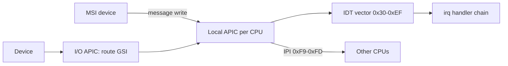

<!-- docs: covers=todo/04-drivers-hardware/TODO-02-apic-interrupt-routing.md sources=include/kernel/drivers/lapic.h,src/kernel/drivers/lapic.c,src/kernel/drivers/ioapic.c,include/kernel/irq.h,src/kernel/irq.c,include/kernel/vectors.h,src/kernel/acpi.c,src/kernel/timer.c,src/kernel/test/test_irq_timer.c reviewed=2026-09-28 order=2 -->
# APIC and Interrupt Routing

## What is it?

The APIC is the x86 interrupt controller: a local APIC in every CPU delivers interrupts and timer ticks, and an I/O APIC routes device interrupt lines to them. Impossible OS routes interrupts through the APIC, falling back to the legacy PIC only on a PC-compatible platform whose I/O APIC fails, and has a working local APIC, one I/O APIC, a calibrated timer and a dynamic vector allocator. This roadmap adds the advanced layer: x2APIC mode, MSI vector helpers, cross-CPU TLB shootdown, an NMI watchdog and an interrupt profiler. None of its six sections is complete.

## How does it work?

**Local APIC.** `lapic_init()` in [`lapic.c`](../../src/kernel/drivers/lapic.c) maps the APIC registers uncached, enables the APIC, masks every local vector table entry and logs `LAPIC enabled: base=..., ID=..., ver=..., maxLVT=...`. Registers are reached through memory-mapped I/O (xAPIC mode), so APIC IDs are 8 bits wide. Inter-processor interrupts go through `lapic_send_ipi()` and its variants, and the reserved vectors live in one table, [`vectors.h`](../../include/kernel/vectors.h), with compile-time uniqueness checks.

**I/O APIC.** [`ioapic.c`](../../src/kernel/drivers/ioapic.c) drives a single I/O APIC under a lock: `ioapic_route_irq()` programs a redirection entry, `ioapic_isa_to_gsi()` applies the ACPI interrupt source overrides, and mask, unmask and destination calls follow. If the I/O APIC does not respond, a PC-compatible platform falls back to the 8259 PIC (and the PIT for the tick); a platform whose firmware declares no PIC halts instead, since devices would otherwise never interrupt.

**Vectors and handlers.** [`irq.c`](../../src/kernel/irq.c) hands out vectors `0x30` to `0xEF` with `irq_alloc_vector()`, lets drivers request a global system interrupt with `irq_request_gsi_ex()` (shared chains allowed), sets affinity and counts interrupts per vector. On a shared line, a vector that keeps firing while every handler reports it was not theirs is quarantined; an interrupt a handler keeps claiming without clearing is not caught.

**Timer calibration.** `lapic_timer_calibrate()` tries three tiers in order: a frequency the hypervisor or CPUID reports directly, then a measurement against the HPET or ACPI PM timer, then the legacy PIT when the platform still has one. Each result must pass a plausibility check, and the log names the tier that succeeded. [`timer.c`](../../src/kernel/timer.c) then starts the tick at 100 Hz.



**CPUs above ID 255.** Because the APIC runs in xAPIC mode, the MADT parser in [`acpi.c`](../../src/kernel/acpi.c) skips processors whose x2APIC ID does not fit in 8 bits, and if the boot CPU is one of them it logs `x2APIC mode required; forcing BSP-only, no AP bringup`.

## What are its interfaces?

| Interface | Purpose |
| --- | --- |
| `lapic_init()`, `lapic_send_ipi()`, `lapic_send_ipi_all_but_self()` | Local APIC setup and IPIs ([`lapic.h`](../../include/kernel/drivers/lapic.h)) |
| `lapic_timer_calibrate()`, `lapic_timer_init()`, `lapic_timer_set_hz()` | Timer calibration and tick rate |
| `ioapic_route_irq()`, `ioapic_mask_irq()`, `ioapic_isa_to_gsi()` | I/O APIC routing ([`ioapic.c`](../../src/kernel/drivers/ioapic.c)) |
| `irq_alloc_vector()`, `irq_request_gsi_ex()`, `irq_set_affinity()`, `irq_get_counts()` | Vectors, handlers, affinity and counts ([`irq.h`](../../include/kernel/irq.h)) |
| `VECTOR_*`, `IPI_VECTOR_*` | Reserved vector map ([`vectors.h`](../../include/kernel/vectors.h)) |

## How do I use it?

A driver requests its interrupt line and receives a vector; it never programs the I/O APIC directly. The interrupt and timer layer is tested in the `boot` category by [`test_irq_timer.c`](../../src/kernel/test/test_irq_timer.c), covering MADT parsing, the ISA-to-vector map, allocator bounds, affinity and calibration state:

```bash
bash scripts/test.sh SUITE=boot
```

At boot, look for the calibration tier line and a `LAPIC/IOAPIC` line in the serial log; its absence means the machine fell back to the PIC.

## What is not implemented yet?

- **x2APIC mode** with MSR register access and 32-bit APIC IDs ([x2APIC Mode](../../todo/04-drivers-hardware/TODO-02-apic-interrupt-routing.md#1-x2apic-mode----msr-register-access-opus)).
- **The roadmap's HPET-only calibration and 1 ms tick.** Calibration ships as the three-tier design above; the section's specific items differ ([LAPIC Timer Calibration via HPET](../../todo/04-drivers-hardware/TODO-02-apic-interrupt-routing.md#2-lapic-timer-calibration-via-hpet-opus)).
- **MSI address and data helpers** on top of the vector allocator ([MSI Vector Bitmap Allocator](../../todo/04-drivers-hardware/TODO-02-apic-interrupt-routing.md#3-msi-vector-bitmap-allocator-sonnet)).
- **TLB shootdown.** Vector `0xFE` is reserved with no handler ([TLB Shootdown IPI](../../todo/04-drivers-hardware/TODO-02-apic-interrupt-routing.md#4-tlb-shootdown-ipi-opus)).
- **An NMI watchdog** that catches a CPU stuck with interrupts off ([NMI Watchdog via PMI Counter Overflow](../../todo/04-drivers-hardware/TODO-02-apic-interrupt-routing.md#5-nmi-watchdog-via-pmi-counter-overflow-opus)).
- **An interrupt profiler** with per-vector time as well as counts ([Interrupt Profiler](../../todo/04-drivers-hardware/TODO-02-apic-interrupt-routing.md#6-interrupt-profiler----sysinterrupts-sonnet)).

## How does it compare with Windows 11 and Linux?

Windows 11 and Linux both run x2APIC where the firmware enables it, flush remote TLBs with IPIs and allocate MSI vectors from a pool; Linux adds an NMI watchdog and `/proc/interrupts` counts, while Windows keeps per-interrupt timing inside ETW. Impossible OS has the xAPIC base, calibration and vector allocation but no x2APIC, shootdown or watchdog. The roadmap's additions are an NMI watchdog and a readable per-vector time profile.

## See also

- [APIC roadmap](../../todo/04-drivers-hardware/TODO-02-apic-interrupt-routing.md)
- [Interrupt Architecture and Timers](../boot/interrupt-timer-architecture.md)
- [SMP Phase 2](../memory/smp-phase2.md)
- [CPU Boot Sequencing](../boot/cpu-boot-sequencing.md)
- [Core Built-in Drivers](core-drivers.md)
