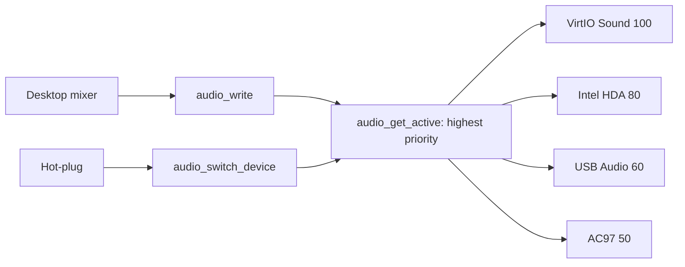

<!-- docs: covers=todo/04-drivers-hardware/TODO-18-audio-drivers.md sources=include/kernel/drivers/virtio/virtio.h,include/kernel/drivers/xhci_dev.h reviewed=2026-09-28 order=18 -->
# Audio Drivers

## What is it?

The audio roadmap plans sound output for Impossible OS: a small audio device interface, drivers for AC97, Intel High Definition Audio (HDA), VirtIO Sound and USB Audio Class 1.0, switching between devices when headphones or a USB headset are plugged in, and conversion of every driver into a loadable module. Nothing in it has shipped. The system has no audio support today, so this page describes the plan.

## How will it work?

**A pass-through interface.** Each driver fills in an `audio_device_t` table with five functions: `init` (sample rate, channels, bits per sample), `write` for playback, `read` for capture (optional), `set_volume` (0 to 100 percent) and `stop`. The kernel layer only moves PCM samples; mixing, resampling and effects belong to the desktop's audio mixer. A new device starts at 44,100 Hz, two channels, 16 bits.

**Choosing the device.** Drivers register with a priority and `audio_get_active()` returns the highest: VirtIO Sound 100, HDA 80, USB audio 60, AC97 50. Helpers such as `audio_write()` go to the active device, and `audio_switch_device()` forces a choice, for example when a USB headset arrives.

**The drivers.** AC97 and HDA are PCI devices that play from a DMA ring of buffer descriptors refilled from the interrupt handler; HDA adds codec discovery over its command ring. VirtIO Sound uses the existing VirtIO transport ([`virtio.h`](../../include/kernel/drivers/virtio/virtio.h)), which today defines no sound device. USB Audio Class 1.0 needs isochronous transfers, which the USB stack does not have yet ([USB Stack](usb-stack.md)).

**Hot-plug.** A device arriving or leaving switches the active output, persists the choice in `HKLM\SYSTEM\Audio\DefaultDevice` and tells the desktop with a `WM_AUDIO_DEVICE_CHANGED` message.

## What are its interfaces?

None yet. The planned surface is `audio_register()`, `audio_get_active()`, `audio_write()`, `audio_set_volume()`, `audio_stop()` and `audio_switch_device()`, the `HKLM\SYSTEM\Audio\DefaultDevice` Registry value and the `WM_AUDIO_DEVICE_CHANGED` window message.

## How do I use it?

You cannot yet. No sound device is driven, so the system is silent on every machine and VM.

## What is not implemented yet?

Everything:

- **The interface** ([Audio HAL](../../todo/04-drivers-hardware/TODO-18-audio-drivers.md#1-audio-hal----audio_device_t-vtable-opus)).
- **Drivers**: [AC97](../../todo/04-drivers-hardware/TODO-18-audio-drivers.md#2-ac97-sound-driver-opus), [Intel HDA](../../todo/04-drivers-hardware/TODO-18-audio-drivers.md#3-intel-hda-driver-opus), [VirtIO Sound](../../todo/04-drivers-hardware/TODO-18-audio-drivers.md#4-virtio-sound-module-sonnet) and [USB Audio Class 1.0](../../todo/04-drivers-hardware/TODO-18-audio-drivers.md#5-usb-audio-class-10-uac1-playback-opus), which also needs [isochronous USB transfers](../../todo/04-drivers-hardware/TODO-10-usb-stack.md#3-isochronous-endpoint-support-opus).
- **Device switching** ([Audio Device Hot-Plug](../../todo/04-drivers-hardware/TODO-18-audio-drivers.md#6-audio-device-hot-plug-sonnet)).
- **Loadable modules** ([Convert All Audio Drivers to `.kmod`](../../todo/04-drivers-hardware/TODO-18-audio-drivers.md#7-convert-all-audio-drivers-to-kmod-sonnet)), which needs the [Kernel Module System](kernel-modules.md).

## How does it compare with Windows 11 and Linux?

Windows 11 drives HD Audio with `HDAudBus.sys` and `hdaudio.sys` under the WaveRT port driver, USB Audio 1.0 with `usbaudio.sys` (an AVStream driver) and USB Audio 2.0 with `usbaudio2.sys` (WaveRT); the audio engine behind WASAPI does the mixing in user mode. Linux uses ALSA drivers such as `snd_hda_intel`, `snd_intel8x0` and `snd_usb_audio`, with PipeWire or PulseAudio mixing in user space. Impossible OS plans the same split, a thin kernel pass-through with mixing in the desktop, and has no audio today.

## See also

- [Audio drivers roadmap](../../todo/04-drivers-hardware/TODO-18-audio-drivers.md)
- [USB Stack](usb-stack.md)
- [Bluetooth](bluetooth.md) (A2DP headphones)
- [Hardware Monitoring and Sensors](hardware-monitoring-sensors.md) (jack detection)
- [Kernel Module System](kernel-modules.md)
