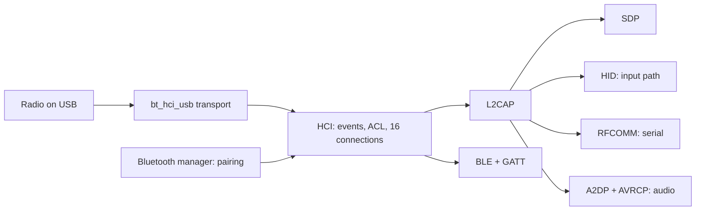

<!-- docs: covers=todo/04-drivers-hardware/TODO-16-bluetooth.md sources=include/kernel/drivers/xhci_dev.h,src/kernel/drivers/xhci_dev.c,include/kernel/csprng.h reviewed=2026-09-28 order=16 -->
# Bluetooth

## What is it?

The Bluetooth roadmap plans a complete Bluetooth stack in the kernel: the HCI transport to the radio, chipset firmware loading, L2CAP, service discovery, wireless keyboards and mice, BLE, serial ports, headphone audio, pairing and the `bluetooth.cpl` and `btctl` tools. Nothing in it has shipped. There is no Bluetooth code in the tree today, so this page describes the plan and what it still waits on.

## How will it work?

**HCI, the radio link.** Most laptop Bluetooth radios sit on an internal USB port. A USB transport (planned as `bt_hci_usb.c` in the [USB stack roadmap](../../todo/04-drivers-hardware/TODO-10-usb-stack.md#13-bluetooth-hci-via-usb-opus)) carries HCI packets: commands out, events and ACL data in. The HCI layer above it sends the start-up sequence (reset, read version, read the local address, enable scanning), keeps a table of 16 connections and dispatches events. Intel and Realtek radios first need a firmware patch from `C:\Impossible\System\Firmware\bt\`. The firmware section plans to open those files directly, and the firmware roadmap's [Driver Conversion Pass](../../todo/04-drivers-hardware/TODO-06-firmware-loader-device-blobs.md#9-driver-conversion-pass) later moves them to the shared [Firmware Loader](firmware-loader.md) and its integrity and provenance checks.

**Protocols on top.** L2CAP multiplexes channels over each connection. SDP discovers what a remote device offers. Profiles then turn channels into devices: HID feeds keyboard and mouse reports into the existing input path, RFCOMM exposes serial ports, A2DP streams SBC-encoded audio to headphones with AVRCP for play and volume keys, and BLE with GATT reads values such as battery level.

**Pairing and control.** A Bluetooth manager owns discovery, Secure Simple Pairing and the paired-device list. Pairing nonces must be random; the kernel CSPRNG (`csprng_fill()` in [`csprng.h`](../../include/kernel/csprng.h)) provides that today, although the roadmap names a `hwrng_read()` source that does not exist.

## What does it wait on?

- **The USB transport.** The roadmap calls `bt_hci_usb.c` an existing stub; it does not exist yet. The USB host driver today only claims mass storage (class `0x08`) and boot-protocol keyboards and mice (class `0x03`) in [`xhci_dev.h`](../../include/kernel/drivers/xhci_dev.h), so a Bluetooth radio (class `0xE0`) is ignored ([USB Stack](usb-stack.md)).
- **A HID report parser.** Bluetooth keyboards and mice send full HID reports; the planned parser belongs to the [I2C and Precision Touchpad](i2c-touchpad.md) roadmap.
- **An audio subsystem** for A2DP ([Audio Drivers](audio-drivers.md)).

## What are its interfaces?

None yet. The planned surface is the HCI API (`hci_send_cmd()`, `hci_acl_send()`), the Bluetooth manager, Registry keys under `HKLM\SYSTEM\Bluetooth`, a `/dev/rfcomm0` serial node, the `bluetooth.cpl` control panel, a Quick Settings tile and the `btctl` command.

## How do I use it?

You cannot yet. Bluetooth keyboards, mice and headphones do not work; use USB or PS/2 input ([Input System](input-system.md)).

## What is not implemented yet?

Everything:

- **HCI and firmware** ([HCI Transport Layer](../../todo/04-drivers-hardware/TODO-16-bluetooth.md#1-hci-transport-layer-opus), [HCI Firmware Loading](../../todo/04-drivers-hardware/TODO-16-bluetooth.md#2-hci-firmware-loading-sonnet)).
- **Core protocols** ([L2CAP](../../todo/04-drivers-hardware/TODO-16-bluetooth.md#3-l2cap----logical-link-control-and-adaptation-protocol-opus), [SDP](../../todo/04-drivers-hardware/TODO-16-bluetooth.md#4-sdp----service-discovery-protocol-sonnet)).
- **Profiles** ([HID](../../todo/04-drivers-hardware/TODO-16-bluetooth.md#5-hid-profile----bluetooth-hid-sonnet), [BLE](../../todo/04-drivers-hardware/TODO-16-bluetooth.md#6-ble----bluetooth-low-energy-opus), [RFCOMM and SPP](../../todo/04-drivers-hardware/TODO-16-bluetooth.md#7-rfcomm--serial-port-profile-spp-sonnet), [A2DP, SBC and AVRCP](../../todo/04-drivers-hardware/TODO-16-bluetooth.md#8-a2dp--sbc-encoder--avrcp-opus)).
- **Management and tools** ([Bluetooth Manager, Pairing UI and `bluetooth.cpl`](../../todo/04-drivers-hardware/TODO-16-bluetooth.md#9-bluetooth-manager--pairing-ui--bluetoothcpl-opus), [`btctl` Shell Command](../../todo/04-drivers-hardware/TODO-16-bluetooth.md#10-btctl-shell-command-sonnet)).

## How does it compare with Windows 11 and Linux?

Windows 11 splits Bluetooth between kernel drivers (`BTHUSB.sys`, `bthport.sys`, `hidbth.sys`) and the user-mode `bthserv` service. Linux keeps HCI, L2CAP and RFCOMM in the kernel and the rest in the BlueZ daemon `bluetoothd`, driven by `bluetoothctl`. Impossible OS plans the whole stack in the kernel with no daemon, plus a `btctl` command, and has no Bluetooth support today.

## See also

- [Bluetooth roadmap](../../todo/04-drivers-hardware/TODO-16-bluetooth.md)
- [USB Stack](usb-stack.md)
- [Wi-Fi Drivers](wifi-drivers.md)
- [Game Controllers and Haptics](game-controllers.md)
- [Input System](input-system.md)
