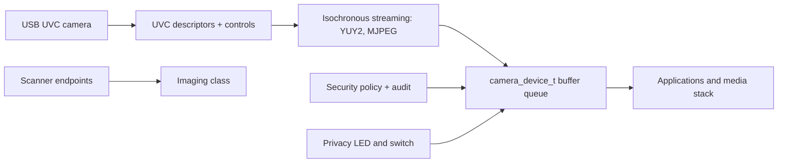

<!-- docs: covers=todo/04-drivers-hardware/TODO-22-camera-imaging-devices.md sources=include/kernel/drivers/xhci_dev.h reviewed=2026-09-28 order=22 -->
# Cameras and Imaging Devices

## What is it?

The camera roadmap plans the driver layer for webcams, built-in laptop cameras, video capture devices and scanners: a camera device class with streaming buffers, the USB Video Class (UVC) driver, privacy LED and privacy switch enforcement, a boundary for laptop cameras that need vendor image processors, and permission checks before any stream starts. Camera applications and media frameworks belong to other roadmaps. Nothing in this one has shipped, and the system has no camera support today.

## Why does a webcam not work today?

Two missing foundations. First, the USB driver only claims mass storage and boot keyboards and mice ([`xhci_dev.h`](../../include/kernel/drivers/xhci_dev.h) defines no video class), so a UVC camera (class `0x0E`) is ignored. Second, video streams over USB isochronous transfers, which the USB stack does not support yet ([Isochronous Endpoint Support](../../todo/04-drivers-hardware/TODO-10-usb-stack.md#3-isochronous-endpoint-support-opus)). Many recent Intel laptops are harder still: their cameras sit behind an IPU image processor that needs vendor firmware and its own processing pipeline, not UVC.

## How will it work?

**A class and a buffer model.** Every camera registers as a `camera_device_t` with its frame formats, controls and a queue of frame buffers. Buffers are pinned or DMA-safe pages with one explicit owner at a time, so the driver and the application never write the same frame.

**UVC.** The UVC driver parses the VideoControl descriptors, exposes brightness, contrast, focus, exposure and privacy controls, and streams uncompressed YUY2 or MJPEG frames through isochronous transfers. USB HDMI grabbers that present themselves as UVC devices use the same path, with frame-drop and bandwidth diagnostics.

**Privacy first.** When the hardware can control the camera LED, streaming does not start until the LED is on. A hardware privacy switch is honoured and reported as a blocked state. Every stream start goes through the security policy, and the first use and every denied access produce audit events; privacy violations are recorded in BlackBox.

**Laptop image processors.** Cameras behind IPU3 or IPU6 are detected and reported as limited or unsupported in Device Manager, with the firmware they would need, rather than failing silently.

**Scanners.** USB scanners get a driver-level scan request and image buffer contract here; the printing roadmap routes multifunction scanner endpoints to it.

## What are its interfaces?

None yet. The planned surface is the `camera_device_t` class and buffer queue, the scanner request contract, Device Manager camera details (active client, firmware, format, privacy state) and the permission and audit hooks.

## How do I use it?

You cannot yet. No camera, capture device or scanner is driven on any machine or VM.

## What is not implemented yet?

Everything:

- **The class** ([Camera Class API and Buffer Model](../../todo/04-drivers-hardware/TODO-22-camera-imaging-devices.md#1-camera-class-api-and-buffer-model)).
- **UVC** ([USB UVC Discovery and Controls](../../todo/04-drivers-hardware/TODO-22-camera-imaging-devices.md#2-usb-uvc-discovery-and-controls), [UVC Streaming and Frame Formats](../../todo/04-drivers-hardware/TODO-22-camera-imaging-devices.md#3-uvc-streaming-and-frame-formats)).
- **Privacy and permissions** ([Privacy LED and Switch Enforcement](../../todo/04-drivers-hardware/TODO-22-camera-imaging-devices.md#4-privacy-led-and-switch-enforcement), [Permissions and Audit](../../todo/04-drivers-hardware/TODO-22-camera-imaging-devices.md#8-permissions-and-audit)).
- **Other devices** ([MIPI/IPU Boundary](../../todo/04-drivers-hardware/TODO-22-camera-imaging-devices.md#5-mipiipu-boundary), [Capture Devices](../../todo/04-drivers-hardware/TODO-22-camera-imaging-devices.md#6-capture-devices), [Scanner Class](../../todo/04-drivers-hardware/TODO-22-camera-imaging-devices.md#7-scanner-class)).
- **Diagnostics and tests** ([Diagnostics](../../todo/04-drivers-hardware/TODO-22-camera-imaging-devices.md#9-diagnostics), [Tests](../../todo/04-drivers-hardware/TODO-22-camera-imaging-devices.md#10-tests)).

## How does it compare with Windows 11 and Linux?

Windows 11 drives webcams with `usbvideo.sys` and shares them through the Camera Frame Server, with camera privacy settings per app. Linux uses the `uvcvideo` driver under V4L2, with desktop portals mediating access. Impossible OS plans UVC with privacy enforcement in the driver and a privacy report in diagnostics, and has no camera support today.

## See also

- [Cameras and imaging devices roadmap](../../todo/04-drivers-hardware/TODO-22-camera-imaging-devices.md)
- [USB Stack](usb-stack.md)
- [Firmware Loader and Device Blobs](firmware-loader.md)
- [Printing and Scanning Device Path](printing-scanning.md)
- [Device Manager and Driver Diagnostics](device-manager.md)
