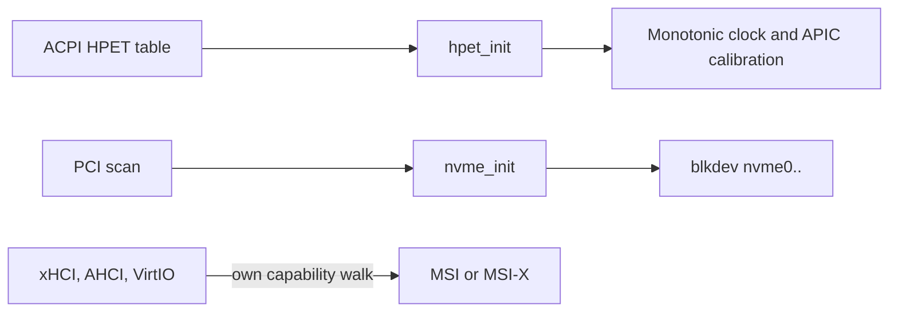

<!-- docs: covers=todo/04-drivers-hardware/TODO-08-core-driver-enhancements.md sources=include/kernel/drivers/hpet.h,src/kernel/drivers/hpet.c,include/kernel/drivers/nvme.h,src/kernel/drivers/nvme.c,src/kernel/drivers/pci.c,src/kernel/drivers/xhci.c,include/kernel/drivers/virtio/virtio.h,src/kernel/main/boot_storage.c,src/kernel/test/test_irq_timer.c reviewed=2026-09-28 order=8 -->
# Core Built-in Drivers

## What is it?

The drivers that must live inside the kernel image because everything else depends on them: the HPET timer, PCI Express configuration and capabilities, MSI and MSI-X interrupts, PCIe hot-plug and NVMe storage. Two of these already work: the HPET clock and a single-queue NVMe driver. The PCIe pieces (extended configuration space, a capability scanner, a common MSI layer and hot-plug) do not. The roadmap's Implementation Order table still shows all six rows open, including the two that ship.

## How does it work?

**HPET.** `hpet_init()` in [`hpet.c`](../../src/kernel/drivers/hpet.c) takes the base address from the ACPI HPET table and maps it uncached. It rejects a base below 1 MiB or a period outside the specification's range, then enables the main counter and logs `HPET: N MHz (... fs/tick), counter enabled`. `hpet_ns()` converts the counter to nanoseconds and splits the multiplication so the result does not overflow after a few hours. The comparators and legacy interrupt routing are deliberately unused: the HPET is a clock source, not an interrupt source. It starts from [`boot_storage.c`](../../src/kernel/main/boot_storage.c) once ACPI is ready. The monotonic clock uses it when the CPU has no invariant TSC, and the local APIC timer calibration measures against it in its second tier.

**NVMe.** [`nvme.c`](../../src/kernel/drivers/nvme.c) supports up to four controllers on PCI buses 0 to 7, with one admin queue and one I/O queue each. It polls for completions instead of taking interrupts, and poisons a queue that times out so later requests fail rather than hang. Disks register as `nvme0` onward through the block-device layer, with flush and a clean `CC.SHN` shutdown at power-off. The driver shipped as boot-critical storage and is documented in [NVMe Boot Storage](../boot/nvme-boot-storage.md).

**PCI configuration.** [`pci.c`](../../src/kernel/drivers/pci.c) uses only the legacy `0xCF8`/`0xCFC` ports, so the 4 KiB PCIe extended space, which holds capabilities such as AER, is unreachable. There is no MCFG-based ECAM path.

**MSI is per driver.** xHCI, AHCI and VirtIO each walk the capability list and program their own message address and data. xHCI finds MSI-X but logs that it is deferring to `pci_enable_msix()`, a function this roadmap has yet to add; VirtIO has its own `virtio_pci_setup_msix()` in [`virtio.h`](../../include/kernel/drivers/virtio/virtio.h). The ACPI FADT flag that forbids MSI is exposed by `acpi_msi_supported()`, but no driver checks it yet, so a platform that declares MSI unsupported still gets it.



## What are its interfaces?

| Interface | Purpose |
| --- | --- |
| `hpet_init()`, `hpet_available()`, `hpet_frequency_hz()`, `hpet_read_counter()`, `hpet_ns()` | HPET clock ([`hpet.h`](../../include/kernel/drivers/hpet.h)) |
| `nvme_init()`, `nvme_read_sectors()`, `nvme_write_sectors()`, `nvme_flush()`, `nvme_shutdown()` | NVMe storage ([`nvme.h`](../../include/kernel/drivers/nvme.h)) |
| `virtio_pci_setup_msix()` | VirtIO-local MSI-X setup ([`virtio.h`](../../include/kernel/drivers/virtio/virtio.h)) |
| `pci_enable_msi()`, `pci_find_capability()`, ECAM access | Planned, not present |

## How do I use it?

The HPET consistency check runs in the `boot` category ([`test_irq_timer.c`](../../src/kernel/test/test_irq_timer.c)) and the NVMe geometry test in `storage`; both skip cleanly on a machine without the device:

```bash
bash scripts/test.sh SUITE=boot
bash scripts/test.sh SUITE=storage
```

## What is not implemented yet?

- **PCIe ECAM** through the ACPI MCFG table ([PCI Enhanced Config Space (ECAM)](../../todo/04-drivers-hardware/TODO-08-core-driver-enhancements.md#1-pci-enhanced-config-space-ecam-sonnet)).
- **A capability chain scanner** with link speed and width ([PCIe Capability Chain Scanner](../../todo/04-drivers-hardware/TODO-08-core-driver-enhancements.md#2-pcie-capability-chain-scanner-sonnet)).
- **A common MSI and MSI-X layer** replacing the per-driver code ([MSI / MSI-X Interrupt Support](../../todo/04-drivers-hardware/TODO-08-core-driver-enhancements.md#3-msi--msi-x-interrupt-support-opus)).
- **The HPET section's remaining items.** The clock ships as described above; the section's bookkeeping has not been reconciled with it ([HPET Timer Driver](../../todo/04-drivers-hardware/TODO-08-core-driver-enhancements.md#4-hpet-timer-driver-opus)).
- **Multi-queue, interrupt-driven NVMe** on top of the shipped polled driver ([NVMe Storage Driver (Built-in)](../../todo/04-drivers-hardware/TODO-08-core-driver-enhancements.md#5-nvme-storage-driver-built-in-opus)).
- **PCIe hot-plug** ([PCIe Hot-Plug](../../todo/04-drivers-hardware/TODO-08-core-driver-enhancements.md#6-pcie-hot-plug-opus)).

## How does it compare with Windows 11 and Linux?

Windows 11 reaches PCIe configuration through ECAM, uses the HPET in its HAL, runs multi-queue NVMe through `stornvme.sys` and allocates MSI vectors centrally. Linux does the same with `pci_find_capability()`, `pci_enable_msix()` with interrupt affinity, `pciehp` and a per-CPU-queue NVMe driver. Impossible OS has an HPET clock and a working single-queue NVMe driver, but reaches only the legacy configuration space and leaves MSI to each driver.

## See also

- [Core driver roadmap](../../todo/04-drivers-hardware/TODO-08-core-driver-enhancements.md)
- [NVMe Boot Storage](../boot/nvme-boot-storage.md)
- [Interrupt Architecture and Timers](../boot/interrupt-timer-architecture.md)
- [Time and FILETIME](../kernel/time-filetime.md)
- [PCI, Plug and Play and Resource Manager](pci-pnp-resource-manager.md)
