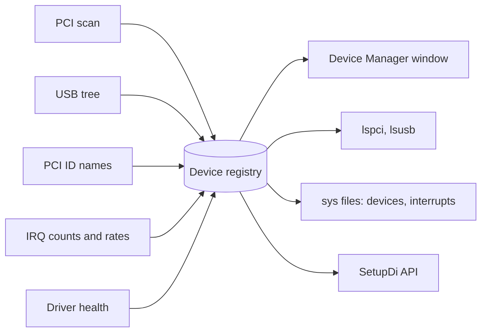

<!-- docs: covers=todo/04-drivers-hardware/TODO-07-device-manager.md sources=include/kernel/drivers/pci.h,src/kernel/drivers/pci.c,include/kernel/irq.h,include/kernel/drivers/xhci_dev.h reviewed=2026-09-28 order=7 -->
# Device Manager and Driver Diagnostics

## What is it?

A Device Manager answers "what hardware is in this machine, which driver owns it, and is it healthy?", as a window for users and as commands and APIs for tools. Impossible OS does not have one yet. Nothing records the devices it finds, so there is no device registry for a window, an `lspci` command or the `SetupDi` API to read. All ten sections of this roadmap are open; this page explains where the information lives today.

## How does it work?

**Today the information is scattered.** The pieces a Device Manager would present already exist, but each is private to the code that produced it:

- **PCI devices.** `pci_scan()` in [`pci.c`](../../src/kernel/drivers/pci.c) logs every function it finds with a short class name and a count, then keeps nothing. A driver that wants its device calls `pci_find_device()`, which walks the bus again. See [PCI, Plug and Play and Resource Manager](pci-pnp-resource-manager.md).
- **Interrupts.** [`irq.h`](../../include/kernel/irq.h) keeps a count per vector (`irq_get_counts()`) and a name per handler (`irq_get_name()`), but no time spent and no rate, and nothing publishes them.
- **USB devices.** The xHCI driver keeps its own table of attached devices, reachable through `xhci_get_device()` in [`xhci_dev.h`](../../include/kernel/drivers/xhci_dev.h); it is shaped for boot storage and input, not for a device tree.
- **Driver state.** Each driver logs its own success or failure at boot; there is no shared health record.

**The planned design.** The roadmap turns this into one pipeline: the PCI scan fills a registry, an embedded copy of the PCI ID database turns vendor and device numbers into names, the interrupt layer adds live counts and rates, and each driver reports its health. Everything else reads from that one place.

## What are its interfaces?

| Interface | Status |
| --- | --- |
| `pci_scan()`, `pci_find_device()` | Shipped; log and look up only ([`pci.h`](../../include/kernel/drivers/pci.h)) |
| `irq_get_counts()`, `irq_get_name()` | Shipped per-vector counts and names ([`irq.h`](../../include/kernel/irq.h)) |
| `xhci_get_device()` | Shipped USB device table ([`xhci_dev.h`](../../include/kernel/drivers/xhci_dev.h)) |
| Device registry, `lspci`, `lsusb`, `/sys/devices`, `SetupDiGetClassDevs()` | Planned, not present |

## How do I use it?

Until the registry exists, the boot serial log is the device list: search it for the `pci` lines from the scan and for each driver's own init line. The machine matrix in [Machine Matrix](../infrastructure/machine-matrix.md) records which devices each test machine exposes.

## What is not implemented yet?

- **A PCI device registry** that the scan fills and drivers bind to ([PCI Device Registry](../../todo/04-drivers-hardware/TODO-07-device-manager.md#1-pci-device-registry-sonnet)).
- **Device names** from an embedded PCI ID database ([Embedded PCI ID Database](../../todo/04-drivers-hardware/TODO-07-device-manager.md#2-embedded-pci-id-database-sonnet)).
- **Live interrupt counters** with rates ([Live Interrupt Counter](../../todo/04-drivers-hardware/TODO-07-device-manager.md#3-live-interrupt-counter-sonnet)).
- **A driver health registry** ([Driver Health Registry](../../todo/04-drivers-hardware/TODO-07-device-manager.md#4-driver-health-registry-sonnet)).
- **`/sys/devices` and `/sys/interrupts` files** ([VFS Files](../../todo/04-drivers-hardware/TODO-07-device-manager.md#5-sysdevices--sysinterrupts-vfs-files-sonnet)).
- **`lspci` and `lsusb` shell commands** ([Shell Commands](../../todo/04-drivers-hardware/TODO-07-device-manager.md#6-lspci--lsusb-shell-commands-sonnet)).
- **The Device Manager window** ([Device Manager GUI](../../todo/04-drivers-hardware/TODO-07-device-manager.md#7-device-manager-gui-opus)).
- **USB devices in the tree** ([USB Device Tree Integration](../../todo/04-drivers-hardware/TODO-07-device-manager.md#8-usb-device-tree-integration-sonnet)).
- **The `SetupDi` Win32 API** ([Win32 API](../../todo/04-drivers-hardware/TODO-07-device-manager.md#9-setupdigetclassdevs--setupdienumdeviceinfo-win32-api-sonnet)).
- **Driver unload and reload** ([Driver Unload / Reload](../../todo/04-drivers-hardware/TODO-07-device-manager.md#10-driver-unload--reload-sonnet)).

## How does it compare with Windows 11 and Linux?

Windows 11 keeps a PnP device tree, exposes it through SetupAPI and WMI and shows it in the `devmgmt.msc` snap-in, and reads live interrupt counters through Perfmon and `NtQuerySystemInformation`, but has no inbox `lspci` and its Device Manager shows no interrupt rates. Linux exposes devices in sysfs, interrupt counts in `/proc/interrupts` and names through `pci.ids`, with `lspci` and `lsusb`, but no built-in graphical Device Manager. Impossible OS has none of these yet. The roadmap aims for both: a native Device Manager window that refreshes interrupt rates and shows health badges live, plus Linux-style command-line tools and the Windows `SetupDi` API.

## See also

- [Device Manager roadmap](../../todo/04-drivers-hardware/TODO-07-device-manager.md)
- [PCI, Plug and Play and Resource Manager](pci-pnp-resource-manager.md)
- [APIC and Interrupt Routing](apic-interrupt-routing.md)
- [USB Stack](usb-stack.md)
- [Kernel Module System](kernel-modules.md)
