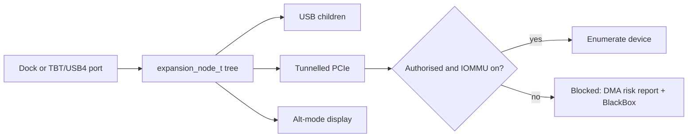

<!-- docs: covers=todo/04-drivers-hardware/TODO-24-docking-thunderbolt-usb4-expansion.md sources=src/kernel/drivers/ahci/ahci_hotplug.c,include/kernel/drivers/virtio/blk.h reviewed=2026-09-28 order=24 -->
# Docking, Thunderbolt and USB4

## What is it?

This roadmap owns external expansion: USB-C docks, Thunderbolt and USB4 topology, the security policy that decides whether a device plugged into a Thunderbolt port may reach memory, display alt-mode hand-off, the eGPU boundary, dock power and wake events, hot-plug storms and a report of external DMA risk. It does not write the drivers for the devices inside a dock; it owns the fabric and the policy around them. Nothing in it has shipped.

## What happens with a dock today?

Very little. The pieces a dock needs are missing or partial:

- **USB hubs are not enumerated**, so devices behind a USB-C dock's hub are invisible; only root-port devices work ([USB Stack](usb-stack.md)).
- **PCIe hot-plug is not implemented** ([Hot-Plug and Surprise Removal](../../todo/04-drivers-hardware/TODO-01-pci-pcie-pnp-resource-manager.md#7-hot-plug-and-surprise-removal)), so a Thunderbolt device that appears after boot is never enumerated.
- **There is no IOMMU driver** ([Security Hardware and DMA Safety](security-hardware.md)), so nothing could stop an external PCIe device from writing anywhere in memory.
- **Only one screen** is driven ([GPU and Display Drivers](gpu-display-drivers.md)), so an alt-mode display on a dock is not used.

Hot-plug exists only for single ports. On an xHCI controller with MSI, a root-port connect enumerates the new device and a disconnect is only logged, with the device slot not released ([USB Stack](usb-stack.md)). The AHCI interrupt handler detects insertion and removal through [`ahci_hotplug.c`](../../src/kernel/drivers/ahci/ahci_hotplug.c) (logging `Port N: hot-plug insertion detected`), and the VirtIO block driver has hot-plug and surprise-removal functions ([`blk.h`](../../include/kernel/drivers/virtio/blk.h)) that nothing calls yet. None of these is a dock topology.

## How will it work?

**A topology tree.** An `expansion_node_t` represents each dock, port and tunnelled bus, and the USB, PCIe, display, audio and network devices behind a dock hang under its physical node, so Device Manager can show the dock as one thing with its ports, authorisation, bandwidth and child health.

**Security before PCIe.** Thunderbolt and USB4 can tunnel PCIe, which gives a plugged-in device direct memory access. The planned security levels are disabled, user-authorised, secure-connect and internal-only, and external PCIe tunnelling is never authorised without an active IOMMU. Tunnelled devices stay blocked until authorised and are revoked and surprise-removed safely on unplug. Devices blocked for want of an IOMMU or by policy appear in an external DMA risk report, and denials are recorded in BlackBox.

**Displays, eGPUs and power.** Alt-mode display changes are passed to the display stack, and eGPU support has a defined boundary with a safe failure. Dock power buttons, lid-like events and wake sources are surfaced as events.

**Storms.** Docking can attach dozens of devices at once. Attach and detach bursts are coalesced, and child drivers probe only after the fabric settles.

## What are its interfaces?

None yet. The planned surface is the `expansion_node_t` topology, the Thunderbolt security level setting, device authorisation, Device Manager topology details and the external DMA risk report.

## How do I use it?

You cannot yet. Connect disks to SATA ports and other devices to a root USB port, before booting.

## What is not implemented yet?

Everything:

- **Topology and classification** ([External Expansion Topology Model](../../todo/04-drivers-hardware/TODO-24-docking-thunderbolt-usb4-expansion.md#1-external-expansion-topology-model), [USB-C Dock and Hub Classification](../../todo/04-drivers-hardware/TODO-24-docking-thunderbolt-usb4-expansion.md#2-usb-c-dock-and-hub-classification)).
- **Security** ([Thunderbolt/USB4 Security Policy](../../todo/04-drivers-hardware/TODO-24-docking-thunderbolt-usb4-expansion.md#3-thunderboltusb4-security-policy), [PCIe Tunneling Authorization](../../todo/04-drivers-hardware/TODO-24-docking-thunderbolt-usb4-expansion.md#4-pcie-tunneling-authorization), [External DMA Risk Report](../../todo/04-drivers-hardware/TODO-24-docking-thunderbolt-usb4-expansion.md#9-external-dma-risk-report)), which needs the [IOMMU driver](../../todo/04-drivers-hardware/TODO-04-security-hardware.md#4-iommu--vt-d--amd-vi-opus).
- **Displays and power** ([Display Alt-mode and eGPU Boundary](../../todo/04-drivers-hardware/TODO-24-docking-thunderbolt-usb4-expansion.md#5-display-alt-mode-and-egpu-boundary), [Dock Power and Wake Events](../../todo/04-drivers-hardware/TODO-24-docking-thunderbolt-usb4-expansion.md#6-dock-power-and-wake-events)).
- **Robustness, diagnostics and certification** ([Hot-Plug Storm Resilience](../../todo/04-drivers-hardware/TODO-24-docking-thunderbolt-usb4-expansion.md#7-hot-plug-storm-resilience), [Device Manager Topology](../../todo/04-drivers-hardware/TODO-24-docking-thunderbolt-usb4-expansion.md#8-device-manager-topology), [Certification Matrix](../../todo/04-drivers-hardware/TODO-24-docking-thunderbolt-usb4-expansion.md#10-certification-matrix)).

## How does it compare with Windows 11 and Linux?

Windows 11 manages Thunderbolt through its USB4 and Thunderbolt drivers and relies on Kernel DMA Protection, which uses the IOMMU to block external devices until they are trusted. Linux's `thunderbolt` driver exposes security levels in sysfs, with the `bolt` daemon handling authorisation. Impossible OS plans the same IOMMU-first rule plus a single external DMA risk report, and has no dock or Thunderbolt support today.

## See also

- [Docking, Thunderbolt and USB4 roadmap](../../todo/04-drivers-hardware/TODO-24-docking-thunderbolt-usb4-expansion.md)
- [USB Stack](usb-stack.md)
- [PCI, Plug and Play and Resource Manager](pci-pnp-resource-manager.md)
- [Security Hardware and DMA Safety](security-hardware.md)
- [Device Manager and Driver Diagnostics](device-manager.md)
