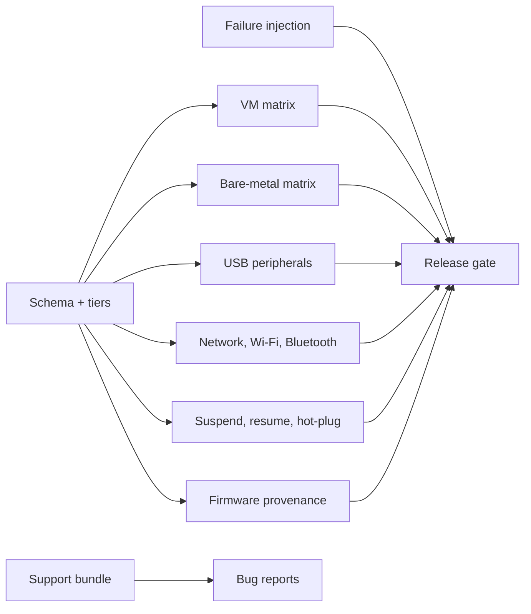

<!-- docs: covers=todo/04-drivers-hardware/TODO-25-driver-hardware-certification-matrix.md sources=tools/boot-cert/boot-cert.yml,tools/boot-cert/lint.py,scripts/test-smoke-matrix.sh reviewed=2026-09-28 order=25 -->
# Driver Hardware Certification Matrix

## What is it?

The driver certification matrix is the planned release gate for drivers and hardware. It turns every driver promise into a check: a VM test, a fixture or a bare-metal checklist covering enumeration, probe, I/O, suspend and resume, hot-plug, error recovery, diagnostics and removal, with each hardware class given a support tier. Nothing in this roadmap has shipped. Boot certification, a separate and narrower matrix, is partly built and is the model this one follows.

## What exists today?

**Boot certification, not driver certification.** The boot platform roadmap ships a machine-readable matrix, [`boot-cert.yml`](../../tools/boot-cert/boot-cert.yml), checked by [`lint.py`](../../tools/boot-cert/lint.py) against a schema. It records whether the system boots on each platform class, including rows for xHCI USB boot, USB HID input and NVMe storage, and five bare-metal classes (desktop SATA, laptop NVMe, USB-only, Secure Boot with TPM, and no TPM). [Boot Validation and Certification Matrix](../boot/boot-validation-matrix.md) and the [Bare-Metal Boot Lab Inventory](boot-lab.md) describe it. That answers "does it boot", not "does every driver behave".

The boot matrix is itself unfinished: its schema, linter and reliability tooling ship, but several of its suites and its release gate are still open, as its page explains.

**Automated VM coverage.** A separate smoke check, [`test-smoke-matrix.sh`](../../scripts/test-smoke-matrix.sh), boots a build on QEMU at one and two CPUs in legs labelled TCG and KVM and writes logs, not certification results. The TCG legs force TCG, but the KVM legs use KVM only when `/dev/kvm` is writable; otherwise they also run under TCG, so check the accelerator in each leg's log before claiming both engines were tested. The [machine matrix](../infrastructure/machine-matrix.md) lists the QEMU and VirtualBox launchers and their emulated devices. Individual driver suites (storage, USB HID, AHCI) run in the kernel test runner. None of this is organised per driver or per hardware class.

## How will it work?

**One schema.** Each row names the owning roadmap file, the device class, the hardware it needs, its VM coverage, its bare-metal coverage, suspend, hot-plug, firmware and diagnostics status, and a tier: required, supported, best-effort, experimental or unsupported.

**Matrices by area.** Rows are grouped into a VM matrix (QEMU, VirtualBox, Hyper-V and VMware-compatible devices: VirtIO, e1000, AHCI, NVMe, USB, display, input, audio), a desktop and laptop bare-metal matrix, a USB peripheral matrix (hubs, storage, HID, audio, cameras, printers, serial, controllers, Bluetooth and Wi-Fi dongles), a network, wireless and Bluetooth matrix, and a suspend, resume and hot-plug matrix. Every hardware class must pass S3 and S4 or state that it is unsupported.

**Firmware provenance.** Every device that loads firmware records its source, licence, hash and redistribution status, and a release is blocked on unknown provenance ([Firmware Loader and Device Blobs](firmware-loader.md)).

**Failure injection.** Drivers are tested against probe failure, interrupt storms, DMA allocation failure, missing firmware, hot-unplug during I/O and reset timeouts.

**Support bundles and the gate.** A driver support bundle captures PCI, USB and I2C topology, firmware hashes, interrupt modes, driver versions and last errors, so a bug report carries its hardware context. A CI and manual checklist gate then fails a release when a required hardware class is not supported.



## What are its interfaces?

None yet for drivers. The shipped boot matrix is [`boot-cert.yml`](../../tools/boot-cert/boot-cert.yml) with its schemas and linter under [`tools/boot-cert/`](../../tools/boot-cert/lint.py).

## How do I use it?

There is no driver matrix to run yet. The nearest automated check is the boot smoke matrix, which proves an image boots, not that it is certified:

```bash
bash scripts/test-smoke-matrix.sh
```

## What is not implemented yet?

Everything in this roadmap:

- **Schema and tiers** ([Certification Schema and Support Tiers](../../todo/04-drivers-hardware/TODO-25-driver-hardware-certification-matrix.md#1-certification-schema-and-support-tiers)).
- **Matrices**: [VM Driver Test Matrix](../../todo/04-drivers-hardware/TODO-25-driver-hardware-certification-matrix.md#2-vm-driver-test-matrix), [Desktop/Laptop Bare-Metal Matrix](../../todo/04-drivers-hardware/TODO-25-driver-hardware-certification-matrix.md#3-desktoplaptop-bare-metal-matrix), [USB/Peripheral Matrix](../../todo/04-drivers-hardware/TODO-25-driver-hardware-certification-matrix.md#4-usbperipheral-matrix), [Network/Wireless/Bluetooth Matrix](../../todo/04-drivers-hardware/TODO-25-driver-hardware-certification-matrix.md#5-networkwirelessbluetooth-matrix), [Suspend/Resume and Hot-Plug Matrix](../../todo/04-drivers-hardware/TODO-25-driver-hardware-certification-matrix.md#6-suspendresume-and-hot-plug-matrix) and [Firmware and License Matrix](../../todo/04-drivers-hardware/TODO-25-driver-hardware-certification-matrix.md#7-firmware-and-license-matrix).
- **Robustness and tooling** ([Failure Injection and Recovery](../../todo/04-drivers-hardware/TODO-25-driver-hardware-certification-matrix.md#8-failure-injection-and-recovery), [Support Bundle and Hardware Fingerprint](../../todo/04-drivers-hardware/TODO-25-driver-hardware-certification-matrix.md#9-support-bundle-and-hardware-fingerprint), [Release Gate Automation](../../todo/04-drivers-hardware/TODO-25-driver-hardware-certification-matrix.md#10-release-gate-automation)).

## How does it compare with Windows 11 and Linux?

Windows 11 certifies drivers through the Hardware Lab Kit (HLK) and WHQL signing, and collects system information with `msinfo32` and event logs. Linux has no single certification: distributions run their own hardware QA, and `sosreport` and `hw-probe` collect support data. Impossible OS plans a matrix that ties every row to the roadmap file that owns the driver, and today has only the partly built boot matrix.

## See also

- [Driver hardware certification matrix roadmap](../../todo/04-drivers-hardware/TODO-25-driver-hardware-certification-matrix.md)
- [Boot Validation and Certification Matrix](../boot/boot-validation-matrix.md)
- [Bare-Metal Boot Lab Inventory](boot-lab.md)
- [Machine Matrix](../infrastructure/machine-matrix.md)
- [Firmware Loader and Device Blobs](firmware-loader.md)
