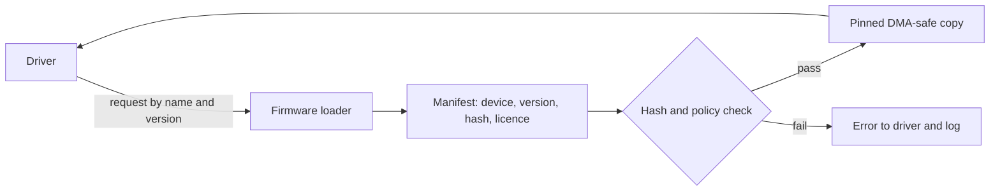

<!-- docs: covers=todo/04-drivers-hardware/TODO-06-firmware-loader-device-blobs.md sources=src/kernel/crypto/sha256.c,include/kernel/ci/ci.h reviewed=2026-09-28 order=6 -->
# Firmware Loader and Device Blobs

## What is it?

Many devices, most Wi-Fi and Bluetooth chips and some GPUs, need a binary firmware file loaded into them before they work. A firmware loader is the kernel service that finds the right file, checks it, hands the driver a stable copy and records which version is running. Impossible OS has no such loader yet: no driver requests a firmware file today, and none of the roadmap's ten sections has started.

## How does it work?

**Nothing loads device firmware today.** Every driver in the tree works without an external blob, which is one reason the current hardware list centres on AHCI, NVMe, xHCI, VirtIO and simple network cards. There is no `request_firmware()` function and no firmware directory on the system disk.

**Do not confuse this with platform firmware.** The files named `firmware_*.c` in `src/kernel/` inspect the machine's UEFI and ACPI firmware (tables, the ESRT, capsule refusal, quirks). That work is documented in [Firmware Platform Inventory](../boot/firmware-platform-inventory.md) and has nothing to do with loading blobs into devices.

**The planned design.** Firmware files live under a system directory with a manifest per file recording its device, version, hash and licence. A driver asks for a file by name with version constraints; the loader matches the manifest, checks the hash (and, under a stricter policy, a signature), copies the data into memory that stays pinned and is safe for DMA, and returns it. The Device Manager and the log record what was loaded, and a licence report lists every blob the system carries.

Two existing pieces are the planned building blocks: the freestanding SHA-256 in [`sha256.c`](../../src/kernel/crypto/sha256.c) for hashing, and the code-integrity policy in [`ci.h`](../../include/kernel/ci/ci.h) for deciding what an unsigned or unknown blob is allowed to do.

## What are its interfaces?

| Interface | Status |
| --- | --- |
| `sha256_init()`, `sha256_update()`, `sha256_final()` | Shipped hashing primitive ([`sha256.c`](../../src/kernel/crypto/sha256.c)) |
| Code-integrity policy | Shipped ([`ci.h`](../../include/kernel/ci/ci.h)) |
| `request_firmware()`, `release_firmware()`, firmware manifest format | Planned, not present |

## How do I use it?

There is nothing to call yet. A driver that needs a blob today cannot be added without this subsystem, so such hardware waits on it; see the Wi-Fi and Bluetooth roadmaps, which list the firmware loader as a dependency.

## What is not implemented yet?

All ten sections are open:

- **The firmware directory and manifest format** ([Firmware Directory and Manifest Format](../../todo/04-drivers-hardware/TODO-06-firmware-loader-device-blobs.md#1-firmware-directory-and-manifest-format)).
- **The request and release API** ([`request_firmware()` Kernel API](../../todo/04-drivers-hardware/TODO-06-firmware-loader-device-blobs.md#2-request_firmware-kernel-api)).
- **Pinned, DMA-safe copies** ([Pinning and DMA-safe Copies](../../todo/04-drivers-hardware/TODO-06-firmware-loader-device-blobs.md#3-pinning-and-dma-safe-copies)).
- **Hash and signature policy** ([Integrity and Signature Policy](../../todo/04-drivers-hardware/TODO-06-firmware-loader-device-blobs.md#4-integrity-and-signature-policy)).
- **Version matching** ([Version Matching](../../todo/04-drivers-hardware/TODO-06-firmware-loader-device-blobs.md#5-version-matching)).
- **Update and rollback** ([Firmware Update and Rollback](../../todo/04-drivers-hardware/TODO-06-firmware-loader-device-blobs.md#6-firmware-update-and-rollback)).
- **Device Manager and log integration** ([Device Manager and Log Integration](../../todo/04-drivers-hardware/TODO-06-firmware-loader-device-blobs.md#7-device-manager-and-log-integration)).
- **A licence audit report** ([License Audit Report](../../todo/04-drivers-hardware/TODO-06-firmware-loader-device-blobs.md#8-license-audit-report)).
- **Converting drivers to the loader** ([Driver Conversion Pass](../../todo/04-drivers-hardware/TODO-06-firmware-loader-device-blobs.md#9-driver-conversion-pass)) and its [Tests](../../todo/04-drivers-hardware/TODO-06-firmware-loader-device-blobs.md#10-tests).

## How does it compare with Windows 11 and Linux?

Windows 11 ships device firmware inside signed driver packages, keeps licence terms in the package catalog and reports load failures in Event Viewer. Linux drivers call `request_firmware()` against the `linux-firmware` tree, which carries a licence file per vendor, and report failures in `dmesg`. Impossible OS has neither yet. The roadmap follows Linux's request model with Windows-style signed metadata, and adds a single licence report plus firmware failures in the BlackBox crash record.

## See also

- [Firmware loader roadmap](../../todo/04-drivers-hardware/TODO-06-firmware-loader-device-blobs.md)
- [Firmware Platform Inventory](../boot/firmware-platform-inventory.md)
- [Code Integrity and Trust Policy](../kernel/code-integrity-trust-policy.md)
- [Kernel Module System](kernel-modules.md)
- [Device Manager](device-manager.md)
