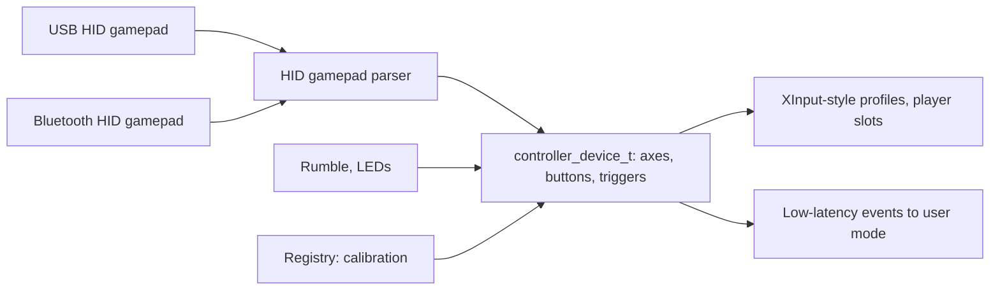

<!-- docs: covers=todo/04-drivers-hardware/TODO-21-game-controller-haptics.md sources=include/kernel/drivers/xhci_dev.h,src/kernel/drivers/xhci_dev.c,src/kernel/test/test_usb_hid.c reviewed=2026-09-28 order=21 -->
# Game Controllers and Haptics

## What is it?

The game controller roadmap plans first-class support for gamepads and joysticks: a controller device class separate from the keyboard and mouse, a HID gamepad parser, Xbox-compatible (XInput-style) profiles, Bluetooth controllers, rumble, battery and LED control, calibration and a live tester. Nothing in it has shipped. A gamepad plugged in today is not used at all, and this page explains why and what the plan is.

## Why does a gamepad not work today?

The USB driver only accepts two kinds of HID device: boot-protocol keyboards and boot-protocol mice. When it enumerates a device, [`xhci_dev.c`](../../src/kernel/drivers/xhci_dev.c) looks for an interface with class `USB_CLASS_HID` (`0x03`), the boot subclass and the keyboard or mouse protocol ([`xhci_dev.h`](../../include/kernel/drivers/xhci_dev.h)). A gamepad reports class `0x03` with no boot subclass, so it is skipped with a debug line:

```text
Slot <n>: no HID boot interface (hid=0, int_in=0)
```

Boot keyboards and mice work because their reports have a fixed layout. Gamepads describe their buttons, sticks and triggers in a HID report descriptor, and the kernel has no report descriptor parser yet. Bluetooth controllers additionally need the [Bluetooth](bluetooth.md) stack, which does not exist.

## How will it work?

**A class of its own.** Controllers register as `controller_device_t`, not as mice or keyboards, and report a fixed event packet of axes, buttons, hats and triggers. The HID parser reads the Generic Desktop game pad and joystick usages and normalises sticks to signed 16-bit values and triggers to unsigned values.

**Stable players.** Xbox-compatible layouts map to fixed player slots and profile ids that user-mode game APIs can rely on, the role XInput plays on Windows. A Bluetooth controller keeps its identity and battery state across reconnects.

**Output and tuning.** Rumble and simple haptics go out through HID output reports and fail gracefully on devices without them. Battery level, player LEDs and light bars are handled where the device supports them. Dead zones, axis inversion and calibration are stored in the Registry per device.

**Low latency.** The event path allocates nothing once a controller is open, and add and remove events are published to user mode.



## What are its interfaces?

None yet. The planned surface is the `controller_device_t` class and event packet, profile ids for user-mode game APIs, Registry calibration values, a `joy.cpl` style tester and Device Manager details.

## How do I use it?

You cannot yet. The existing HID tests cover the keyboard and mouse boot path this roadmap will build beside ([`test_usb_hid.c`](../../src/kernel/test/test_usb_hid.c)), in the storage suite:

```bash
bash scripts/test.sh SUITE=storage
```

## What is not implemented yet?

Everything:

- **The class and parser** ([Controller Class API](../../todo/04-drivers-hardware/TODO-21-game-controller-haptics.md#1-controller-class-api), [HID Gamepad Parser](../../todo/04-drivers-hardware/TODO-21-game-controller-haptics.md#2-hid-gamepad-parser)), which also needs the generic [USB HID class driver](../../todo/04-drivers-hardware/TODO-10-usb-stack.md#5-usb-hid-class-driver-sonnet).
- **Profiles and Bluetooth** ([XInput-Compatible Profiles](../../todo/04-drivers-hardware/TODO-21-game-controller-haptics.md#3-xinput-compatible-profiles), [Bluetooth Controllers](../../todo/04-drivers-hardware/TODO-21-game-controller-haptics.md#4-bluetooth-controllers)).
- **Output and state** ([Force Feedback and Rumble](../../todo/04-drivers-hardware/TODO-21-game-controller-haptics.md#5-force-feedback-and-rumble), [Battery, LED and Player Index](../../todo/04-drivers-hardware/TODO-21-game-controller-haptics.md#6-battery-led-and-player-index), [Calibration and Profiles](../../todo/04-drivers-hardware/TODO-21-game-controller-haptics.md#7-calibration-and-profiles)).
- **Events, tools and tests** ([Hot-Plug and Latency](../../todo/04-drivers-hardware/TODO-21-game-controller-haptics.md#8-hot-plug-and-latency), [Diagnostics](../../todo/04-drivers-hardware/TODO-21-game-controller-haptics.md#9-diagnostics), [Tests](../../todo/04-drivers-hardware/TODO-21-game-controller-haptics.md#10-tests)).

## How does it compare with Windows 11 and Linux?

Windows 11 handles gamepads through HIDClass with XInput and Windows.Gaming.Input on top, and ships the `joy.cpl` tester. Linux parses them in the HID and input layers into evdev devices, with force feedback through `ff-memless`, and tests them with `evtest` and `jstest`. Impossible OS plans a dedicated controller class plus a unified live tester, and ignores gamepads today.

## See also

- [Game controllers and haptics roadmap](../../todo/04-drivers-hardware/TODO-21-game-controller-haptics.md)
- [Input System](input-system.md)
- [USB Stack](usb-stack.md)
- [USB HID Boot Protocol](../boot/usb-hid-boot-protocol.md)
- [Bluetooth](bluetooth.md)
