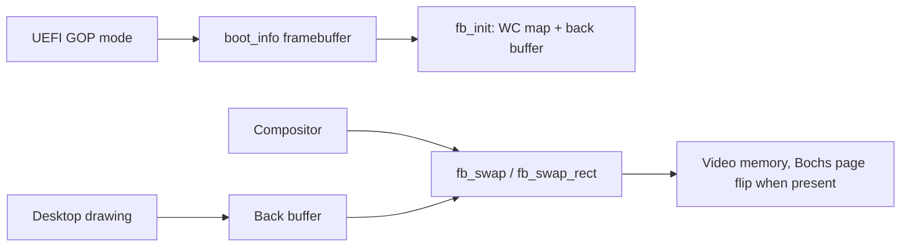

<!-- docs: covers=todo/04-drivers-hardware/TODO-17-gpu-display-drivers.md sources=include/kernel/drivers/framebuffer.h,src/kernel/drivers/framebuffer.c,src/kernel/main/compositor.c,include/kernel/boot_info.h reviewed=2026-09-28 order=17 -->
# GPU and Display Drivers

## What is it?

Display drivers put pixels on the screen. Impossible OS draws everything today through the framebuffer the UEFI firmware sets up at boot (the Graphics Output Protocol, GOP), with a page-flip shortcut on QEMU's Bochs display. This roadmap puts a `display_device_t` driver interface in front of that, adds real drivers for Bochs, VirtIO-GPU and VMware SVGA with hardware cursors and 2D acceleration, then multi-monitor support and Intel and AMD modesetting stubs. None of its eight sections is complete.

## How does it work?

**One framebuffer from firmware.** Before the kernel starts, the bootloader picks a 32-bit GOP mode and passes its address, size and pitch in `boot_info`. `fb_init()` in [`framebuffer.c`](../../src/kernel/drivers/framebuffer.c) accepts only 32-bit BGRX or RGBX pixels, maps video memory write-combining and allocates a back buffer, logging `Framebuffer WC-mapped` and `Framebuffer back buffer` lines. With `Resolution=WxH` in `boot.conf` it takes only an exact match; with no setting it takes the mode with the most pixels up to 1920 by 1080 (larger modes are skipped to avoid huge framebuffers on some VMs). When nothing matches, or `SetMode` fails and mode 0 fails too, it keeps the firmware's current mode. After boot nothing changes the mode: the kernel has no mode-setting driver.

**Drawing and presenting.** The desktop draws into the back buffer (`fb_get_backbuffer()`), and the compositor loop in [`compositor.c`](../../src/kernel/main/compositor.c) presents it with `fb_swap()` for a whole frame or `fb_swap_rect()` for a damaged rectangle. On ordinary hardware that is a fast memory copy into video memory.

**Bochs page flipping.** Under QEMU's default display, `fb_init()` probes the Bochs VBE registers (I/O port `0x01CE`, ID `0xB0Cx`), doubles the virtual height and logs `VBE page flip enabled`. `fb_swap()` then renders into the hidden half and flips by changing the Y offset, which removes tearing. The mode itself is still GOP's; only the virtual height and offset are programmed.

**One screen.** The bootloader already records up to `BOOT_GOP_HANDLE_MAX` (4) GOP outputs in `boot_info` ([`boot_info.h`](../../include/kernel/boot_info.h)), but the kernel reads only the primary one, and `fb_get_output_count()` returns 1.



## What are its interfaces?

| Interface | Purpose |
| --- | --- |
| `fb_init()` | Map the firmware framebuffer and allocate the back buffer ([`framebuffer.h`](../../include/kernel/drivers/framebuffer.h)) |
| `fb_get_backbuffer()`, `fb_get_width()`, `fb_get_height()`, `fb_get_stride()` | Where and how big to draw |
| `fb_swap()`, `fb_swap_rect()` | Present a frame or a rectangle |
| `fb_snapshot()`, `fb_snapshot_size()` | Copy the screen, for screenshots |
| `fb_get_output_count()` | Number of screens; always 1 today |
| `HKLM\SYSTEM\Display` | Registry key created at boot for display settings |

## How do I use it?

The display comes up at the largest firmware mode no bigger than 1920 by 1080. For any other size, including higher resolutions, set `Resolution=WxH` in `boot.conf` to a mode GOP lists and reboot; a size GOP does not list leaves the firmware's current mode in place. The framebuffer snapshot tests run in the desktop suite:

```bash
bash scripts/test.sh SUITE=desktop
```

## What is not implemented yet?

- **A driver interface** that the compositor presents through, with the GOP framebuffer as the lowest-priority fallback ([`display_device_t` Vtable + Compositor Hook](../../todo/04-drivers-hardware/TODO-17-gpu-display-drivers.md#1-display_device_t-vtable--compositor-hook-opus), [VBE/GOP Fallback Display Device](../../todo/04-drivers-hardware/TODO-17-gpu-display-drivers.md#2-vbegop-fallback-display-device-sonnet)).
- **Mode setting and a hardware cursor** on virtual GPUs: [Bochs/BGA](../../todo/04-drivers-hardware/TODO-17-gpu-display-drivers.md#3-bochsbga-display-module-sonnet), [VirtIO-GPU](../../todo/04-drivers-hardware/TODO-17-gpu-display-drivers.md#4-virtio-gpu-display-module-opus) and [VMSVGA](../../todo/04-drivers-hardware/TODO-17-gpu-display-drivers.md#5-vmsvga-2d-display-module-opus). These are planned as loadable modules, which need the [Kernel Module System](kernel-modules.md).
- **More than one screen** ([Multi-Head Support](../../todo/04-drivers-hardware/TODO-17-gpu-display-drivers.md#6-multi-head-support-opus)).
- **Native modesetting on real GPUs** ([Intel HD/UHD](../../todo/04-drivers-hardware/TODO-17-gpu-display-drivers.md#7-intel-hduhd-igpu-modesetting-stub-p3-opus), [AMD APU](../../todo/04-drivers-hardware/TODO-17-gpu-display-drivers.md#8-amd-apu-vegardna-display-stub-p4-opus)).

## How does it compare with Windows 11 and Linux?

Windows 11 drives displays through WDDM miniport drivers under DWM, and falls back to the Basic Display Driver on the firmware framebuffer. Linux uses DRM and KMS drivers such as `i915`, `amdgpu`, `virtio-gpu` and `bochs-drm`, falling back to `efifb` or `simpledrm`. Impossible OS runs on the firmware framebuffer alone, the equivalent of those fallbacks, with Bochs page flipping as its only device-specific path.

## See also

- [GPU and display drivers roadmap](../../todo/04-drivers-hardware/TODO-17-gpu-display-drivers.md)
- [Graphics](../graphics/index.md)
- [Boot Info Fields](../boot/boot-info-fields.md)
- [Hypervisor Abstraction and Guest Support](hypervisor-abstraction.md)
- [Kernel Module System](kernel-modules.md)
