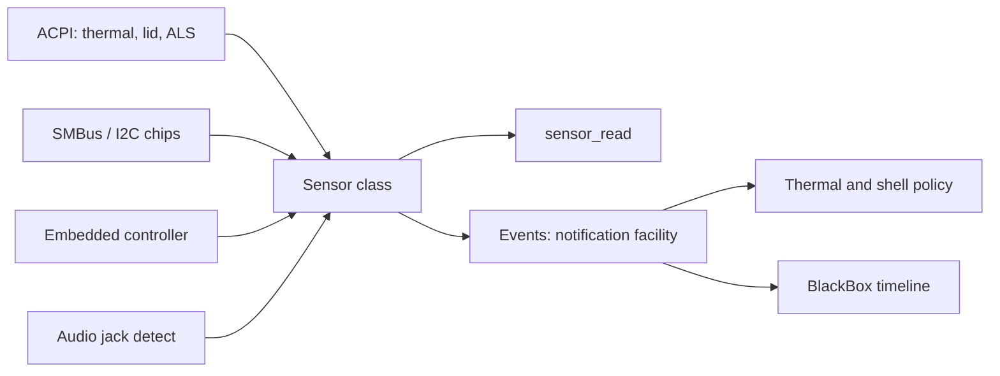

<!-- docs: covers=todo/04-drivers-hardware/TODO-19-hardware-monitoring-sensors.md sources=include/kernel/drivers/acpi_ec.h,src/kernel/drivers/acpi_ec.c,src/kernel/drivers/lapic.c,src/kernel/test/test_acpi_ec.c reviewed=2026-09-28 order=19 -->
# Hardware Monitoring and Sensors

## What is it?

Hardware monitoring reads the machine's own sensors: temperatures, fan speeds, voltages, the laptop lid, ambient light, accelerometers, chassis intrusion and headphone jacks. This roadmap plans one sensor class that every source registers with, so thermal policy, the shell and diagnostics can read any sensor without knowing its bus. Nothing in it has shipped; the only related code today is the ACPI embedded controller transport, and it stays switched off.

## How does it work today?

**The embedded controller, discovered but off.** On laptops many sensors sit behind the ACPI embedded controller (EC). [`acpi_ec.c`](../../src/kernel/drivers/acpi_ec.c) finds it through the ECDT table and implements the EC protocol: read, write, burst and query commands over its command and data ports (`EC_CMD_READ` `0x80` to `EC_CMD_QUERY` `0x84` in [`acpi_ec.h`](../../include/kernel/drivers/acpi_ec.h)). It does not enable the EC, because doing so safely needs GPE acknowledgement and the ACPI Global Lock, and the boot log says so:

```text
EC found (cmd=0x<port> data=0x<port> gpe=<n>) but NOT enabled: needs GPE acknowledgement and ACPI Global Lock arbitration
```

A machine without an ECDT logs `no ECDT -- EC unavailable (namespace discovery not implemented)`. This driver belongs to the [ACPI and Power Management](acpi-power-management.md) roadmap.

**No thermal readings.** The local APIC's thermal interrupt entry exists but is masked (`LAPIC_REG_LVT_THERMAL` in [`lapic.c`](../../src/kernel/drivers/lapic.c)), and nothing reads ACPI thermal zones, battery status, the lid switch or CPU temperature registers. The roadmap text says ACPI power work "covers battery and thermal policy"; no such code exists yet.

## How will it work?

A driver fills in a `sensor_device_t` and calls `sensor_register()`. Readers call `sensor_read()` for a typed reading (value, unit, scale, accuracy, update rate) or `sensor_subscribe()` for threshold and change events, published through the kernel notification facility and rate-limited so a noisy sensor cannot flood it. Backends for ACPI, SMBus and I2C chips and the EC all feed the same model, and important events (thermal throttling, fan faults, lid changes) go to the BlackBox timeline.



## What are its interfaces?

Shipped: the EC transport, `acpi_ec_init()`, `acpi_ec_ready()`, `acpi_ec_discovered()`, `acpi_ec_read()`, `acpi_ec_write()` and `acpi_ec_read_block()`. Planned: `sensor_register()`, `sensor_read()`, `sensor_subscribe()`, a `sensors` shell command, a Device Manager sensor tab and Registry mirrors of critical readings.

## How do I use it?

There are no sensor readings to use yet. The EC parser and transport tests run in the boot suite ([`test_acpi_ec.c`](../../src/kernel/test/test_acpi_ec.c)):

```bash
bash scripts/test.sh SUITE=boot
```

## What is not implemented yet?

- **The sensor class** ([Sensor Class API](../../todo/04-drivers-hardware/TODO-19-hardware-monitoring-sensors.md#1-sensor-class-api)).
- **Backends**: [ACPI Sensors](../../todo/04-drivers-hardware/TODO-19-hardware-monitoring-sensors.md#2-acpi-sensors), [SMBus/I2C hwmon Transport](../../todo/04-drivers-hardware/TODO-19-hardware-monitoring-sensors.md#3-smbusi2c-hwmon-transport) (needs the I2C bus from [I2C and Precision Touchpad](i2c-touchpad.md)).
- **Sensor types**: [Fan, Voltage, and Chassis Sensors](../../todo/04-drivers-hardware/TODO-19-hardware-monitoring-sensors.md#4-fan-voltage-and-chassis-sensors), [Accelerometer and Orientation Sensors](../../todo/04-drivers-hardware/TODO-19-hardware-monitoring-sensors.md#5-accelerometer-and-orientation-sensors), [Audio Jack and Presence Sensors](../../todo/04-drivers-hardware/TODO-19-hardware-monitoring-sensors.md#6-audio-jack-and-presence-sensors) (needs [Audio Drivers](audio-drivers.md)).
- **Delivery and diagnostics**: [Event Notifications](../../todo/04-drivers-hardware/TODO-19-hardware-monitoring-sensors.md#7-event-notifications), [Diagnostics](../../todo/04-drivers-hardware/TODO-19-hardware-monitoring-sensors.md#8-diagnostics), [BlackBox Timeline](../../todo/04-drivers-hardware/TODO-19-hardware-monitoring-sensors.md#9-blackbox-timeline) and [Tests](../../todo/04-drivers-hardware/TODO-19-hardware-monitoring-sensors.md#10-tests).
- **Enabling the EC** itself, which is owned by the ACPI roadmap.

## How does it compare with Windows 11 and Linux?

Windows 11 exposes sensors through the Sensor Class Extension and thermal data through ACPI and WMI. Linux has three families: `hwmon` for temperatures, fans and voltages, `iio` for accelerometers and light sensors, and `input` for switches such as the lid. Impossible OS plans one class for all of them, plus a BlackBox record of environmental events, and reads no sensors today.

## See also

- [Hardware monitoring and sensors roadmap](../../todo/04-drivers-hardware/TODO-19-hardware-monitoring-sensors.md)
- [ACPI and Power Management](acpi-power-management.md)
- [Device Manager and Driver Diagnostics](device-manager.md)
- [Kernel Notification Facility](../kernel/kernel-notification-facility.md)
- [BlackBox Artifacts](../boot/black-box-artifacts.md)
