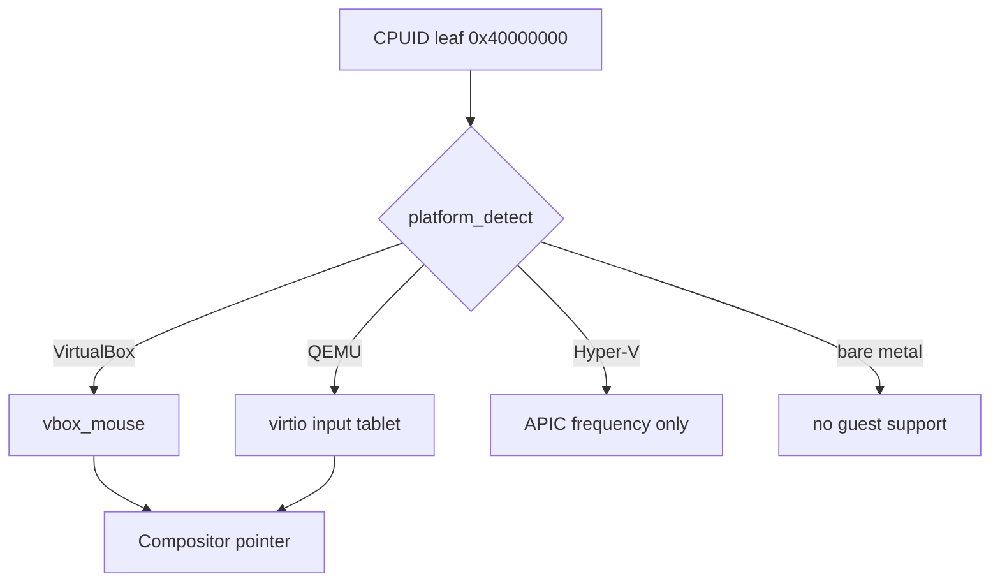

<!-- docs: covers=todo/04-drivers-hardware/TODO-09-hypervisor-abstraction.md sources=include/kernel/cpuid_platform.h,src/kernel/cpuid_platform.c,src/kernel/drivers/vbox_mouse.c,src/kernel/drivers/virtio/input.c,include/kernel/drivers/virtio/virtio.h,src/kernel/main/compositor.c,src/kernel/test/test_cpu_security.c reviewed=2026-09-28 order=9 -->
# Hypervisor Abstraction and Guest Support

## What is it?

When Impossible OS runs inside VirtualBox, QEMU or Hyper-V, guest support lets it cooperate with the host: an absolute mouse pointer, a display that follows the window size, shared folders and a shared clipboard. Impossible OS detects which hypervisor it is running under and supports two absolute pointers, VirtualBox's and VirtIO's tablet. The rest of the guest additions, and the single backend interface the roadmap plans for them, do not exist yet. None of the roadmap's twelve sections is complete.

## How does it work?

**Detection.** `platform_detect()` in [`cpuid_platform.c`](../../src/kernel/cpuid_platform.c) checks the CPUID hypervisor bit, then reads the vendor string at leaf `0x40000000`. It classifies the machine as one of the `platform_id_t` values in [`cpuid_platform.h`](../../include/kernel/cpuid_platform.h): bare metal, Hyper-V, VMware, VirtualBox, QEMU with KVM, QEMU with TCG, or an unknown hypervisor. On Hyper-V and KVM it also records whether the hypervisor publishes the APIC timer frequency, which the timer calibration uses to skip measurement. The result is cached and logged, for example `Detected: VirtualBox (CPUID 0x40000000)`.

**VirtualBox pointer.** [`vbox_mouse.c`](../../src/kernel/drivers/vbox_mouse.c) finds the VirtualBox guest device (PCI `80EE:CAFE`), speaks the VMMDev request protocol and reports absolute pointer positions, logging `VBox absolute mouse enabled`. It handles only the mouse: no display change events, HGCM, shared folders or clipboard.

**VirtIO tablet.** [`input.c`](../../src/kernel/drivers/virtio/input.c) drives a VirtIO input device in tablet mode on top of the shared VirtIO queue code in [`virtio.h`](../../include/kernel/drivers/virtio/virtio.h). There is no VirtIO GPU, 9P or entropy device.

**Hyper-V.** Only detection and the APIC frequency shortcut exist. Every IDT vector has a stub because Hyper-V Generation 2 delivers a VMBus interrupt on vector `0xF6` whether or not a driver listens, but there is no VMBus, synthetic storage, keyboard or video driver.

**No abstraction yet.** Callers choose the backend by hand: the compositor in [`compositor.c`](../../src/kernel/main/compositor.c) asks whether the VirtIO tablet is available and otherwise the VirtualBox mouse. The roadmap replaces that chain with one `hv_ops_t` table, with a null backend on bare metal so every call is safe there.



## What are its interfaces?

| Interface | Purpose |
| --- | --- |
| `platform_detect()`, `platform_get()`, `platform_name()`, `platform_is_tcg()` | Hypervisor identity ([`cpuid_platform.h`](../../include/kernel/cpuid_platform.h)) |
| `vbox_mouse_init()`, `vbox_mouse_available()`, `vbox_mouse_get_state()` | VirtualBox absolute pointer ([`vbox_mouse.c`](../../src/kernel/drivers/vbox_mouse.c)) |
| `virtio_input_init()`, `virtio_input_available()`, `virtio_input_get_state()` | VirtIO tablet ([`input.c`](../../src/kernel/drivers/virtio/input.c)) |
| `hv.h`, `hv_ops_t` | Planned, not present |

## How do I use it?

Run the image under VirtualBox or QEMU as described in [Running in VirtualBox](../getting-started/virtualbox.md) and [Running in QEMU](../getting-started/qemu.md); when the guest pointer device is present, the pointer reports absolute positions and the boot log names the driver that took it. The detection checks run in the `x86` category ([`test_cpu_security.c`](../../src/kernel/test/test_cpu_security.c)):

```bash
bash scripts/test.sh SUITE=x86
```

## What is not implemented yet?

- **The roadmap's detection API and PCI fallback.** Detection ships as `platform_detect()` above ([Hypervisor Detection](../../todo/04-drivers-hardware/TODO-09-hypervisor-abstraction.md#1-hypervisor-detection-sonnet)).
- **The `hv.h` backend table** ([Unified `hv.h` Interface + Backend Dispatch](../../todo/04-drivers-hardware/TODO-09-hypervisor-abstraction.md#2-unified-hvh-interface--backend-dispatch-sonnet)) and its **bare-metal null backend** ([Bare-Metal Null Backend](../../todo/04-drivers-hardware/TODO-09-hypervisor-abstraction.md#3-bare-metal-null-backend-sonnet)).
- **VirtualBox guest additions:** display resize ([VBox Display Auto-Resize](../../todo/04-drivers-hardware/TODO-09-hypervisor-abstraction.md#4-vbox-display-auto-resize-sonnet)), HGCM ([VBox HGCM Client](../../todo/04-drivers-hardware/TODO-09-hypervisor-abstraction.md#5-vbox-hgcm-client-sonnet)), shared folders ([VBox Shared Folders](../../todo/04-drivers-hardware/TODO-09-hypervisor-abstraction.md#6-vbox-shared-folders-sonnet)) and clipboard ([VBox Shared Clipboard](../../todo/04-drivers-hardware/TODO-09-hypervisor-abstraction.md#7-vbox-shared-clipboard-sonnet)).
- **VirtIO GPU** ([VirtIO GPU Display Resize + Page Flip](../../todo/04-drivers-hardware/TODO-09-hypervisor-abstraction.md#8-virtio-gpu-display-resize--page-flip-sonnet)), **9P shared folders** ([VirtIO 9P Shared Folders](../../todo/04-drivers-hardware/TODO-09-hypervisor-abstraction.md#9-virtio-9p-shared-folders-sonnet)) and **VirtIO RNG** ([VirtIO RNG Guest Entropy](../../todo/04-drivers-hardware/TODO-09-hypervisor-abstraction.md#12-virtio-rng-guest-entropy)).
- **Hyper-V synthetic devices**, which need a VMBus driver first ([Hyper-V Synthetic HID](../../todo/04-drivers-hardware/TODO-09-hypervisor-abstraction.md#10-hyper-v-synthetic-hid-opus), [Hyper-V Synthetic Video](../../todo/04-drivers-hardware/TODO-09-hypervisor-abstraction.md#11-hyper-v-synthetic-video-opus)).

## How does it compare with Windows 11 and Linux?

Windows 11 runs a separate set of guest drivers per hypervisor (VirtualBox Guest Additions, VirtIO drivers, Hyper-V integration services). Linux ships `vboxguest`, `vboxsf`, `virtio-gpu`, 9P and the Hyper-V `hv_*` drivers in-tree, detected through CPUID. Neither has one interface across hypervisors. Impossible OS detects every major hypervisor and supports two absolute pointers; the roadmap's addition is a single backend table with a bare-metal null backend.

## See also

- [Hypervisor abstraction roadmap](../../todo/04-drivers-hardware/TODO-09-hypervisor-abstraction.md)
- [Running in VirtualBox](../getting-started/virtualbox.md)
- [VM Boot Testing](../guides/vm-boot-testing.md)
- [Interrupt Architecture and Timers](../boot/interrupt-timer-architecture.md)
- [Input System](input-system.md)
