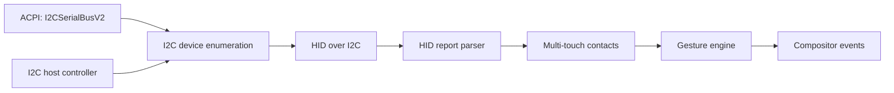

<!-- docs: covers=todo/04-drivers-hardware/TODO-12-i2c-touchpad.md sources=src/kernel/drivers/mouse.c reviewed=2026-09-28 order=12 -->
# I2C and Precision Touchpad

## What is it?

Most modern laptop touchpads are not PS/2 or USB devices: they sit on an I2C bus and speak HID over I2C, described to the operating system by ACPI. Supporting them needs an I2C host controller driver, ACPI enumeration of the devices on the bus, the HID-over-I2C transport, a HID report parser and a multi-touch and gesture layer. Impossible OS has none of this yet, and all ten sections of this roadmap are open. On such a laptop the touchpad does not work; a USB mouse does.

## How does it work?

**What happens today.** The PS/2 mouse driver in [`mouse.c`](../../src/kernel/drivers/mouse.c) probes for an auxiliary port. When the controller has none, which is common on laptops whose touchpad is on I2C, it gives up with the exit reason `no auxiliary port (touchpad/USB?)`. Nothing else looks for the touchpad. The vendored ACPICA code can decode the `I2CSerialBusV2` resource descriptors a touchpad's ACPI entry carries, but ACPICA is not initialised and no driver consumes them.

**The planned design** follows the same layers Windows and Linux use:

1. An I2C and SMBus host controller driver for the chipset's controller.
2. ACPI enumeration of the devices behind it, reading each one's bus address and interrupt.
3. The HID-over-I2C transport, which fetches the HID descriptor and reports.
4. A HID report descriptor parser, shared with full USB HID.
5. Precision Touchpad multi-touch decoding, with vendor quirks for ELAN and Goodix parts.
6. A gesture engine that turns contacts into scroll, pinch and swipe events.

A Synaptics PS/2 mode is planned as a fallback for older touchpads.

The roadmap's distinguishing choice is to run the gesture engine in the kernel and post gesture events straight to the compositor, where Windows and Linux both do gesture recognition in user space.

## What are its interfaces?

| Interface | Status |
| --- | --- |
| PS/2 auxiliary port probe with `no auxiliary port` exit | Shipped ([`mouse.c`](../../src/kernel/drivers/mouse.c)) |
| I2C host API, HID-over-I2C, touchpad events, `touchpad-info` | Planned, not present |

## How do I use it?

On a laptop with an I2C touchpad, use a USB mouse for now. The serial log's PS/2 mouse line shows whether an auxiliary port was found; if its exit reason reads `no auxiliary port (touchpad/USB?)`, the touchpad is almost certainly on I2C.

## What is not implemented yet?

All ten sections are open:

- **The host controller** ([I2C/SMBus Host Controller Driver](../../todo/04-drivers-hardware/TODO-12-i2c-touchpad.md#1-i2csmbus-host-controller-driver-opus)) and a **PS/2 fallback** for older pads ([Synaptics PS/2 Touchpad Fallback](../../todo/04-drivers-hardware/TODO-12-i2c-touchpad.md#2-synaptics-ps2-touchpad-fallback-sonnet)).
- **Finding devices** through ACPI ([ACPI I2C Device Enumeration](../../todo/04-drivers-hardware/TODO-12-i2c-touchpad.md#3-acpi-i2c-device-enumeration-sonnet)).
- **The transport and parser** ([HID-over-I2C (HoI2C) Transport](../../todo/04-drivers-hardware/TODO-12-i2c-touchpad.md#4-hid-over-i2c-hoi2c-transport-opus), [HID Report Descriptor Parser](../../todo/04-drivers-hardware/TODO-12-i2c-touchpad.md#5-hid-report-descriptor-parser-opus)).
- **Multi-touch** ([Microsoft Precision Touchpad (PTP) Multi-Touch](../../todo/04-drivers-hardware/TODO-12-i2c-touchpad.md#6-microsoft-precision-touchpad-ptp-multi-touch-sonnet)) and **vendor quirks** ([ELAN and Goodix I2C Touchpad Quirks](../../todo/04-drivers-hardware/TODO-12-i2c-touchpad.md#7-elan-and-goodix-i2c-touchpad-quirks-sonnet)).
- **Gestures** ([PTP Gesture Engine](../../todo/04-drivers-hardware/TODO-12-i2c-touchpad.md#8-ptp-gesture-engine-opus)).
- **Settings and diagnostics** ([Touchpad Control Panel](../../todo/04-drivers-hardware/TODO-12-i2c-touchpad.md#9-touchpad-control-panel-mousecpl-touchpad-tab-sonnet), [Shell Commands](../../todo/04-drivers-hardware/TODO-12-i2c-touchpad.md#10-xinput-list--touchpad-info-shell-commands-sonnet)).

## How does it compare with Windows 11 and Linux?

Windows 11 enumerates I2C devices through ACPI, drives them with `hidi2c.sys` and `HIDCLASS.sys`, supports Precision Touchpads inbox and recognises gestures in user space. Linux uses `i2c-i801` or `i2c-piix4`, `i2c-acpi`, `i2c-hid` and `hid-core`, with `libinput` handling multi-touch and gestures in user space. Impossible OS has neither the bus nor the transport. The roadmap's planned difference is a kernel-resident gesture engine that posts gesture events directly to the compositor.

## See also

- [I2C and touchpad roadmap](../../todo/04-drivers-hardware/TODO-12-i2c-touchpad.md)
- [Input System](input-system.md)
- [USB Stack](usb-stack.md)
- [ACPI and Power Management](acpi-power-management.md)
