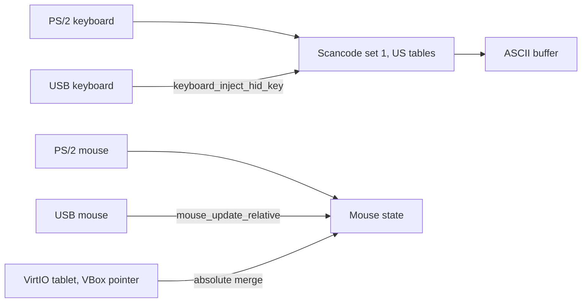

<!-- docs: covers=todo/04-drivers-hardware/TODO-11-input-system.md sources=include/kernel/drivers/keyboard.h,src/kernel/drivers/keyboard.c,include/kernel/drivers/mouse.h,src/kernel/drivers/mouse.c,src/kernel/main/boot_storage.c,src/kernel/main/boot_interrupts.c reviewed=2026-09-28 order=11 -->
# Input System

## What is it?

The input system turns key presses and mouse movement from any source into characters and pointer events. Impossible OS has a PS/2 keyboard with a fixed US layout, a three-button PS/2 mouse, and shared keyboard and mouse state that USB, VirtIO and VirtualBox input also feed. This roadmap adds keyboard layouts with Unicode output and dead keys, scroll wheels and extra mouse buttons, acceleration, raw input and accessibility options. None of its eleven sections is complete.

## How does it work?

**Keyboard.** `keyboard_init()` in [`keyboard.c`](../../src/kernel/drivers/keyboard.c) runs in Phase 1 from [`boot_interrupts.c`](../../src/kernel/main/boot_interrupts.c). It skips a hardware-reduced ACPI platform and a missing i8042 controller (`PS/2 keyboard: skipped (no i8042 -- port 0x64 reads 0xFF)`), then claims the keyboard interrupt and logs `PS/2 keyboard initialized (US QWERTY, IRQ N)`. Scancode set 1 is translated through two fixed US tables, shifted and unshifted, into a 256-byte ASCII buffer. Shift, Ctrl, Alt, Caps Lock and extended-key prefixes are tracked; arrows, Alt+F4 and Ctrl+C get special handling. There is no layout choice, no Unicode, no AltGr and no typematic setting.

**Other keyboards share the same path.** USB keyboards arrive through `keyboard_inject_hid_key()` and injected scancodes through `keyboard_inject_scancode()`, so every source produces the same characters.

**Mouse.** `mouse_init()` in [`mouse.c`](../../src/kernel/drivers/mouse.c) runs in deferred init from [`boot_storage.c`](../../src/kernel/main/boot_storage.c), because the PS/2 self-test can take up to two seconds. It resets the mouse, reads its device ID, sets 100 samples per second and 4 counts per millimetre, and logs `PS/2 mouse initialized (IRQ N, 100 samples/sec, 4 counts/mm)`. The device ID is read but not acted on, so the mouse is always treated as a basic three-byte, three-button device, and the wheel is ignored. The packet parser accepts a first byte only when its always-one bit is set, which recovers from most lost bytes, but it does not count or report desynchronisation.

**Merging sources.** The mouse state takes relative movement from PS/2 and USB, and absolute positions from the VirtIO tablet and the VirtualBox pointer. It keeps one button slot per source class (PS/2, USB and absolute) and merges them under a lock, so a PS/2 mouse releasing a button does not release it for a USB mouse. Two USB mice share one slot, so a report from either overwrites the other's buttons.



## What are its interfaces?

| Interface | Purpose |
| --- | --- |
| `keyboard_getchar()`, `keyboard_trygetchar()`, `keyboard_is_present()` | Read characters ([`keyboard.h`](../../include/kernel/drivers/keyboard.h)) |
| `keyboard_inject_scancode()`, `keyboard_inject_hid_key()` | Feed other keyboard sources |
| `mouse_get_state()` | Current position and buttons ([`mouse.h`](../../include/kernel/drivers/mouse.h)) |
| `mouse_update_relative()`, `mouse_merge_absolute()`, `mouse_inject_state()` | Feed other pointer sources |

## How do I use it?

A PS/2 keyboard and mouse work out of the box under QEMU and on machines with an i8042 controller; on hardware-reduced laptops, input comes from USB instead. There is no dedicated PS/2 test file; the shared keyboard and mouse paths are exercised by the USB HID tests in the `storage` category:

```bash
bash scripts/test.sh SUITE=storage
```

## What is not implemented yet?

- **Keyboard layouts** ([Keyboard Layout System](../../todo/04-drivers-hardware/TODO-11-input-system.md#1-keyboard-layout-system-sonnet)) and the **built-in set** ([Built-in Layouts](../../todo/04-drivers-hardware/TODO-11-input-system.md#2-built-in-layouts----en-us-en-gb-de-de-fr-fr-es-es-dvorak-sonnet)).
- **Unicode output** ([UTF-8 / Unicode Codepoint Output](../../todo/04-drivers-hardware/TODO-11-input-system.md#3-utf-8--unicode-codepoint-output-sonnet)) and **dead keys** ([Dead Key Compose](../../todo/04-drivers-hardware/TODO-11-input-system.md#4-dead-key-compose-sonnet)).
- **Counted packet resynchronisation** ([PS/2 Packet Resync](../../todo/04-drivers-hardware/TODO-11-input-system.md#5-ps2-packet-resync-sonnet)).
- **Scroll wheel** ([PS/2 Intellimouse Scroll Wheel (ID 3)](../../todo/04-drivers-hardware/TODO-11-input-system.md#6-ps2-intellimouse-scroll-wheel-id-3-sonnet)) and **five buttons** ([Explorer 5-Button Extension (ID 4)](../../todo/04-drivers-hardware/TODO-11-input-system.md#7-explorer-5-button-extension-id-4-sonnet)).
- **Acceleration and sensitivity** ([Mouse Acceleration + Sensitivity](../../todo/04-drivers-hardware/TODO-11-input-system.md#8-mouse-acceleration--sensitivity-sonnet)).
- **Raw input grab** for games and remote desktops ([Raw Input Grab API](../../todo/04-drivers-hardware/TODO-11-input-system.md#9-raw-input-grab-api-sonnet)).
- **Layout switching** with Win+Space ([Layout Switching](../../todo/04-drivers-hardware/TODO-11-input-system.md#10-layout-switching----winspace-tray-indicator-sonnet)).
- **Sticky Keys and typematic rate** ([Sticky Keys + Typematic Rate](../../todo/04-drivers-hardware/TODO-11-input-system.md#11-sticky-keys--typematic-rate-sonnet)).

## How does it compare with Windows 11 and Linux?

Windows 11 drives PS/2 through `i8042prt.sys`, translates keys with layout files and `ToUnicodeEx`, delivers wheel and raw input as `WM_MOUSEWHEEL` and `WM_INPUT`, and has Win+Space switching and Sticky Keys. Linux uses `psmouse`, `evdev` with exclusive grab, `libinput` acceleration and `xkb` layouts with dead keys. Impossible OS has working PS/2 and merged multi-source input, but only a US layout and a three-button mouse. The roadmap's design difference is Unicode code points from the driver layer up.

## See also

- [Input roadmap](../../todo/04-drivers-hardware/TODO-11-input-system.md)
- [USB HID Boot Protocol](../boot/usb-hid-boot-protocol.md)
- [USB Stack](usb-stack.md)
- [I2C and Precision Touchpad](i2c-touchpad.md)
- [Hypervisor Abstraction and Guest Support](hypervisor-abstraction.md)
