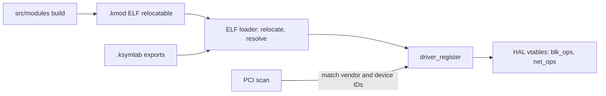

<!-- docs: covers=todo/04-drivers-hardware/TODO-05-kernel-module-system.md sources=include/kernel/kimage.h,include/kernel/nt/service_numbers.h,src/kernel/drivers/rtl8139.c,src/kernel/main/boot_storage.c reviewed=2026-09-28 order=5 -->
# Kernel Module System

## What is it?

A loadable module system would let drivers ship as separate `.kmod` files that the kernel links in at boot or on demand, instead of being compiled into `kernel.exe`. It is not built yet: every driver today is part of the kernel image, and there is no exported symbol table, no module loader, no driver model and no module build. This page explains what exists around it and what the roadmap will add.

## How does it work?

**Today, every driver is built in.** Drivers are C files under `src/kernel/drivers/` linked into the one kernel image, and boot code calls each one's init function directly. The network card is the roadmap's chosen first module: `rtl8139_init()` in [`rtl8139.c`](../../src/kernel/drivers/rtl8139.c) is called straight from [`boot_storage.c`](../../src/kernel/main/boot_storage.c) on both the asynchronous and the sequential boot paths.

**The module format is already named.** The kernel image registry in [`kimage.h`](../../include/kernel/kimage.h) reserves `KIMAGE_TYPE_KMOD` for an ELF relocatable kernel module, next to its ELF, PE and EIF format tags. The UEFI loader can already carry module files alongside the kernel. Nothing in the kernel consumes them yet.

**The format choice is separate from the kernel's own format.** The kernel image is ELF and stays ELF, while drivers may later be EIF native or PE32+ as well. CLAUDE.md records why: the kernel's file format is internal to the bootloader, and nothing about loading a `.sys` driver requires a PE kernel.

**The planned design** follows the familiar shape used by Linux and Windows, with a kernel-resident hardware layer instead of a separate `HAL.dll`:



An `EXPORT_SYMBOL` macro would place chosen kernel functions in a `.ksymtab` section; the loader would relocate a module and resolve its imports against that table; a driver would register a PCI match table and a set of operations; and a boot pass would load every module listed for the machine. Plug and Play system calls would then let a user-mode Device Manager list and control devices.

## What are its interfaces?

| Interface | Status |
| --- | --- |
| `KIMAGE_TYPE_KMOD` | Image-type tag for `.kmod` files ([`kimage.h`](../../include/kernel/kimage.h)) |
| `SSDT_NtPlugPlayControl`, `SSDT_NtGetPlugPlayEvent`, `SSDT_NtSerializeBoot` | Service numbers `0x0270` to `0x0272` reserved in [`service_numbers.h`](../../include/kernel/nt/service_numbers.h), no handler registered |
| `EXPORT_SYMBOL`, `module_load()`, `driver_register()` | Planned, not present |

## How do I use it?

There is nothing to load yet. To see how a built-in driver is wired today, follow `rtl8139_init()` from [`boot_storage.c`](../../src/kernel/main/boot_storage.c), and read [Kernel Image and Module Registry](../kernel/kernel-image-module-registry.md) for how the kernel names the images it knows about. The image registry's tests run in the `exec` category:

```bash
bash scripts/test.sh SUITE=exec
```

## What is not implemented yet?

- **An exported kernel symbol table** built from `EXPORT_SYMBOL` ([Kernel Symbol Table](../../todo/04-drivers-hardware/TODO-05-kernel-module-system.md#1-kernel-symbol-table--export_symbol-sonnet)).
- **A module build** under `src/modules/` that produces and installs `.kmod` files ([Module Build System](../../todo/04-drivers-hardware/TODO-05-kernel-module-system.md#2-module-build-system-sonnet)).
- **A driver model** with PCI match tables and operation vtables ([Driver Model + HAL Vtables + PCI Match Tables](../../todo/04-drivers-hardware/TODO-05-kernel-module-system.md#3-driver-model--hal-vtables--pci-match-tables-sonnet)).
- **The ELF relocatable loader** ([ELF Relocatable Module Loader](../../todo/04-drivers-hardware/TODO-05-kernel-module-system.md#4-elf-relocatable-module-loader-opus)).
- **Automatic loading at boot** ([Auto-Load Modules at Boot](../../todo/04-drivers-hardware/TODO-05-kernel-module-system.md#5-auto-load-modules-at-boot-sonnet)).
- **RTL8139 moved out of the kernel image** as the first module ([RTL8139 as First Loadable Module](../../todo/04-drivers-hardware/TODO-05-kernel-module-system.md#6-rtl8139-as-first-loadable-module-sonnet)).
- **Plug and Play system calls** behind the reserved service numbers ([Plug and Play syscalls wired to SSDT](../../todo/04-drivers-hardware/TODO-05-kernel-module-system.md#7-plug-and-play-syscalls-wired-to-ssdt)).

## How does it compare with Windows 11 and Linux?

Windows 11 loads PE `.sys` drivers against `ntoskrnl` and `HAL.dll` exports, binds them through WDM driver objects and starts them from the Services registry. Linux loads ELF `.ko` files with `insmod` and `modprobe`, resolves them against `EXPORT_SYMBOL`, binds them through `struct bus_type` and loads them early from the initrd. Impossible OS has neither yet. The roadmap takes Linux's module mechanics and Windows's registry-driven start, and keeps the hardware abstraction inside the kernel rather than in a separate binary.

## See also

- [Kernel module system roadmap](../../todo/04-drivers-hardware/TODO-05-kernel-module-system.md)
- [Kernel Image and Module Registry](../kernel/kernel-image-module-registry.md)
- [Code Integrity and Trust Policy](../kernel/code-integrity-trust-policy.md)
- [Native API and the SSDT](../kernel/native-api-ssdt.md)
- [Device Manager](device-manager.md)
