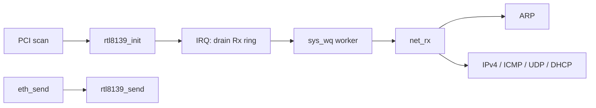

<!-- docs: covers=todo/04-drivers-hardware/TODO-14-network-drivers.md sources=include/kernel/drivers/rtl8139.h,src/kernel/drivers/rtl8139.c,src/kernel/net/ethernet.c,include/kernel/net/net.h,src/kernel/main/boot_storage.c,include/kernel/drivers/virtio/virtio.h reviewed=2026-09-28 order=14 -->
# Network Drivers

## What is it?

Network drivers connect the TCP/IP stack to a wired network card. Impossible OS ships one: a built-in driver for the Realtek RTL8139, the card QEMU emulates by default. This roadmap adds Intel e1000, VirtIO-net, Realtek RTL8169/8111, Intel igc (I225/I226) and Realtek RTL8125 as loadable modules, a driver test suite, a per-driver licence record and early Wi-Fi stubs. None of its ten sections is complete.

## How does it work?

**One card, wired straight in.** `rtl8139_init()` in [`rtl8139.c`](../../src/kernel/drivers/rtl8139.c) looks for PCI vendor `0x10EC`, device `0x8139` ([`rtl8139.h`](../../include/kernel/drivers/rtl8139.h)). It resets the chip, reads the MAC and sets up one receive ring and four transmit buffers using port I/O. A machine without the card logs `NIC not found on PCI bus` and boots on without networking, and a reset timeout or buffer allocation failure also abandons the card. A found card logs `RTL8139 NIC initialized (IRQ N)` at debug level.

**Interrupts and receive.** On a machine with an I/O APIC the driver requests its interrupt through the GSI router; otherwise it falls back to a legacy IRQ line. If routing fails (`INTx GSI N not routable -- IRQ disabled`) or the PCI IRQ line is not a valid legacy line (`not a valid ISA line -- IRQ disabled`), initialisation still succeeds and can send, but nothing ever receives: the interrupt handler is the only caller of `rtl8139_receive()`, with no polling fallback, so DHCP never completes. The interrupt handler drains the receive ring and normally copies each frame to a work item on the system work queue (`sys_wq`), so `net_rx()` runs in thread context. Two fallbacks call `net_rx()` directly inside the interrupt: early boot before `sys_wq` exists, and a failed work-item allocation. If the work queue is full, the frame is dropped. Protocol code must therefore be safe in both contexts. Error bits are handled in a DPC.

**The stack above it.** [`ethernet.c`](../../src/kernel/net/ethernet.c) is the Ethernet layer. `net_init()` copies the MAC from `rtl8139_get_mac()`, `eth_send()` calls `rtl8139_send()`, and `net_rx()` dispatches ARP and IPv4 frames. The IPv4, ICMP, UDP and DHCP code beside it belongs to the networking roadmaps. At boot, `deferred_net_init` in [`boot_storage.c`](../../src/kernel/main/boot_storage.c) brings up the card, the stack and a DHCP request, in that order.

**Why there is only one driver.** The Ethernet layer calls the RTL8139 functions by name. There is no driver table (the roadmap calls it `net_ops_t`) that a second card could register with, and no module loader to load one ([Kernel Module System](kernel-modules.md)). Both have to exist before the e1000 or VirtIO-net modules can ship.



## What are its interfaces?

| Interface | Purpose |
| --- | --- |
| `rtl8139_init()`, `rtl8139_send()`, `rtl8139_get_mac()`, `rtl8139_receive()` | The one card driver ([`rtl8139.h`](../../include/kernel/drivers/rtl8139.h)) |
| `net_init()`, `eth_send()`, `net_rx()` | Ethernet layer entry points ([`net.h`](../../include/kernel/net/net.h)) |
| `net_cfg` | The interface's MAC, IP, gateway and DNS, filled by DHCP |
| `virtio_pci_init()`, `virtq_*()` | The VirtIO transport a VirtIO-net module would reuse ([`virtio.h`](../../include/kernel/drivers/virtio/virtio.h)) |

## How do I use it?

The QEMU launchers ([`run-qemu-kvm.sh`](../../scripts/machines/run-qemu-kvm.sh), [`run-qemu-tcg.sh`](../../scripts/machines/run-qemu-tcg.sh)) already attach an RTL8139 card (`-device rtl8139,netdev=net0`). Boot one and look for the driver line and the DHCP lease in the serial log; the driver line alone does not prove receive works, the lease does:

```text
RTL8139 NIC initialized (IRQ <n>)
DHCP: IP <a.b.c.d>, GW <a.b.c.d>, DNS <a.b.c.d>
```

The IRQ and addresses depend on the machine and the DHCP server. No unit suite covers the network driver yet.

## What is not implemented yet?

- **A licence record per driver** ([License Tracking](../../todo/04-drivers-hardware/TODO-14-network-drivers.md#1-license-tracking-sonnet)).
- **Intel e1000** ([Intel e1000 Module](../../todo/04-drivers-hardware/TODO-14-network-drivers.md#2-intel-e1000-module-sonnet)) and **VirtIO-net** ([VirtIO-net Module](../../todo/04-drivers-hardware/TODO-14-network-drivers.md#3-virtio-net-module-sonnet)).
- **Gigabit and 2.5 GbE cards**: [RTL8169 / RTL8111](../../todo/04-drivers-hardware/TODO-14-network-drivers.md#4-rtl8169--rtl8111-gigabit-module-sonnet), [Intel igc](../../todo/04-drivers-hardware/TODO-14-network-drivers.md#5-intel-igc-i225--i226-25-gbe-module-sonnet) and [RTL8125](../../todo/04-drivers-hardware/TODO-14-network-drivers.md#6-rtl8125-25-gbe-module-sonnet).
- **A driver test suite** ([Network Driver Test Suite](../../todo/04-drivers-hardware/TODO-14-network-drivers.md#7-network-driver-test-suite-sonnet)).
- **Wi-Fi stubs** ([WiFi 802.11 MAC Layer Stub](../../todo/04-drivers-hardware/TODO-14-network-drivers.md#8-wifi-80211-mac-layer-stub-opus), [iwlwifi](../../todo/04-drivers-hardware/TODO-14-network-drivers.md#9-intel-iwlwifi-stub-p4-stretch-sonnet), [rtw89](../../todo/04-drivers-hardware/TODO-14-network-drivers.md#10-realtek-rtw89-stub-p4-stretch-sonnet)), which the [Wi-Fi Drivers](wifi-drivers.md) roadmap supersedes.

## How does it compare with Windows 11 and Linux?

Windows 11 drives network cards through NDIS miniport drivers, some inbox and others from the vendor (the VirtIO `netkvm` driver comes from the separate virtio-win package), and Linux ships `e1000`, `virtio_net`, `r8169` and `igc` under `drivers/net/`. Both put every card behind a common driver interface (NDIS, `struct net_device`), so any number of cards can coexist. Impossible OS has one built-in card driver and no such interface yet.

## See also

- [Network drivers roadmap](../../todo/04-drivers-hardware/TODO-14-network-drivers.md)
- [Networking](../networking/index.md)
- [Network Boot](../boot/network-boot.md)
- [Kernel Module System](kernel-modules.md)
- [Wi-Fi Drivers](wifi-drivers.md)
- [Core Built-in Drivers](core-drivers.md)
