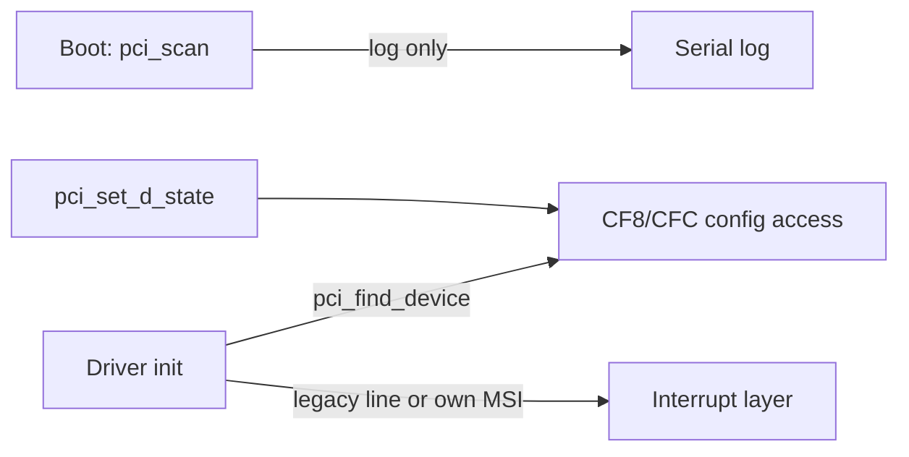

<!-- docs: covers=todo/04-drivers-hardware/TODO-01-pci-pcie-pnp-resource-manager.md sources=include/kernel/drivers/pci.h,src/kernel/drivers/pci.c,include/kernel/drivers/pci_pm.h,src/kernel/drivers/pci_pm.c,src/kernel/main/boot_storage.c,src/kernel/test/test_pci_pm.c reviewed=2026-09-28 order=1 -->
# PCI, Plug and Play and Resource Manager

## What is it?

PCI is the bus almost every device sits on, and the resource manager is what decides which memory windows, I/O ports and interrupts each device gets, then binds the right driver to it. Impossible OS can read and write PCI configuration space safely, list the devices at boot and move a device between power states. It has no device tree, no bridge or BAR allocator, no central interrupt routing and no driver binding yet: each driver searches the bus for its own hardware. None of this roadmap's ten sections is complete.

## How does it work?

**Configuration space access.** [`pci.c`](../../src/kernel/drivers/pci.c) uses the legacy `0xCF8`/`0xCFC` port pair, so it reaches the first 256 bytes of each function's configuration space; the 4 KiB extended space behind PCIe ECAM is not mapped. Every access holds `s_pci_cfg_lock`, an interrupt-safe spinlock, across the address write and data read, so two CPUs cannot interleave a transaction. `pci_write16()` is a true 16-bit write, which matters because a read-modify-write of the whole dword would clear write-one-to-clear status bits by accident.

**Enumeration.** `pci_scan()`, called during Phase 2 storage init from [`boot_storage.c`](../../src/kernel/main/boot_storage.c), walks buses 0 to 254, skips a bus whose device 0 is absent, follows the multifunction bit and logs each function with a class name, ending with `pci: N devices found`. It stores nothing. `pci_find_device()` walks the bus again on every call and returns a `struct pci_device` by value with the six raw BAR values, unsized. Bridges, secondary bus numbers and BAR sizes are not decoded.

**Interrupts.** There is no central routing. A driver reads the device's legacy interrupt line and asks the interrupt layer for it, or programs MSI or MSI-X itself: AHCI, xHCI and VirtIO each carry their own capability walk and message setup.

**Power states.** [`pci_pm.c`](../../src/kernel/drivers/pci_pm.c) moves a function between D0, D1, D2 and D3hot through its power management capability, waits the required recovery time (10 ms after D3hot, 200 microseconds after D2), reads the state back from hardware and refuses unsafe requests with a `pci_dx_status_t` reason. D3cold is excluded because it needs ACPI methods. No driver calls it yet; the code and its tests shipped under the power management roadmap.



## What are its interfaces?

| Interface | Purpose |
| --- | --- |
| `pci_read32()`, `pci_read16()`, `pci_read8()`, `pci_write32()`, `pci_write16()` | Locked configuration access ([`pci.h`](../../include/kernel/drivers/pci.h)) |
| `pci_scan()` | Log every device at boot |
| `pci_find_device(vendor, device)` | Find one function by ID; check `.found` |
| `pci_enable_bus_mastering()` | Enable memory, I/O and bus-master decoding |
| `pci_pmcap_find()`, `pci_get_d_state()`, `pci_set_d_state()` | Device power states ([`pci_pm.h`](../../include/kernel/drivers/pci_pm.h)) |

## How do I use it?

A driver finds its device, enables decoding and then reads its BARs:

```c
struct pci_device d = pci_find_device(0x10EC, 0x8139);
if (d.found)
    pci_enable_bus_mastering(&d);
```

The boot log lists every device the scan saw, which is the quickest way to check what the machine exposes. The power-state logic is covered in the `boot` category by [`test_pci_pm.c`](../../src/kernel/test/test_pci_pm.c):

```bash
bash scripts/test.sh SUITE=boot
```

## What is not implemented yet?

- **A device tree** with stable bus paths for every device ([Canonical Device Node and Bus Path Schema](../../todo/04-drivers-hardware/TODO-01-pci-pcie-pnp-resource-manager.md#1-canonical-device-node-and-bus-path-schema)).
- **Bridge-aware enumeration** that records what it finds ([Full PCI/PCIe Enumeration with Bridges](../../todo/04-drivers-hardware/TODO-01-pci-pcie-pnp-resource-manager.md#2-full-pcipcie-enumeration-with-bridges)).
- **BAR sizing and a resource window allocator** ([BAR Sizing and Resource Window Allocator](../../todo/04-drivers-hardware/TODO-01-pci-pcie-pnp-resource-manager.md#3-bar-sizing-and-resource-window-allocator)).
- **Matching devices to their ACPI objects** ([ACPI Correlation](../../todo/04-drivers-hardware/TODO-01-pci-pcie-pnp-resource-manager.md#4-acpi-correlation)).
- **Central interrupt routing and MSI handoff** ([IRQ Routing and MSI/MSI-X Handoff](../../todo/04-drivers-hardware/TODO-01-pci-pcie-pnp-resource-manager.md#5-irq-routing-and-msimsi-x-handoff)).
- **Driver bind and unbind** ([Driver Bind/Unbind State Machine](../../todo/04-drivers-hardware/TODO-01-pci-pcie-pnp-resource-manager.md#6-driver-bindunbind-state-machine)).
- **Hot-plug and surprise removal** ([Hot-Plug and Surprise Removal](../../todo/04-drivers-hardware/TODO-01-pci-pcie-pnp-resource-manager.md#7-hot-plug-and-surprise-removal)).
- **A device power policy** with wake and runtime idle on top of the transitions above ([Device Power States](../../todo/04-drivers-hardware/TODO-01-pci-pcie-pnp-resource-manager.md#8-device-power-states)).
- **Resource conflict diagnostics** ([Resource Conflict Diagnostics](../../todo/04-drivers-hardware/TODO-01-pci-pcie-pnp-resource-manager.md#9-resource-conflict-diagnostics)) and enumeration tests ([Tests](../../todo/04-drivers-hardware/TODO-01-pci-pcie-pnp-resource-manager.md#10-tests)).

## How does it compare with Windows 11 and Linux?

Windows 11 builds a device tree in the PnP Manager, assigns resources through its arbiters and reports conflicts as Device Manager problem codes. Linux does the same in its driver core and PCI core, with `pciehp` for hot-plug and conflicts reported in `dmesg` and sysfs. Impossible OS has safe configuration access and power transitions but no tree, allocator or binding. The roadmap's addition is a single resource conflict report that names both claimants.

## See also

- [PCI and resource manager roadmap](../../todo/04-drivers-hardware/TODO-01-pci-pcie-pnp-resource-manager.md)
- [Power Management](../kernel/power-management.md)
- [Interrupt Architecture and Timers](../boot/interrupt-timer-architecture.md)
- [Core Built-in Drivers](core-drivers.md)
- [Device Manager](device-manager.md)
