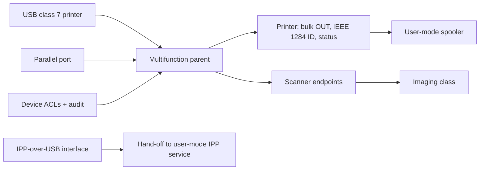

<!-- docs: covers=todo/04-drivers-hardware/TODO-23-printing-scanning-device-path.md sources=include/kernel/drivers/xhci_dev.h reviewed=2026-09-28 order=23 -->
# Printing and Scanning Device Path

## What is it?

This roadmap owns the hardware side of printers, scanners and multifunction devices: the USB printer class, IPP-over-USB, legacy parallel-port printers, the hand-off of scanner endpoints to the imaging class, status reporting and device permissions. Print queues, rendering and applications live in other roadmaps; this one ends where a user-mode spooler or imaging service takes over. Nothing in it has shipped, and no printer or scanner can be used today.

## Why does a printer not work today?

The USB driver only claims mass storage (class `0x08`) and boot-protocol keyboards and mice (class `0x03`), as [`xhci_dev.h`](../../include/kernel/drivers/xhci_dev.h) shows; a USB printer (class `0x07`) is ignored. There is no parallel port driver either: the [Serial, Parallel and Debug I/O](serial-parallel-debug-io.md) roadmap owns it and has not shipped it. USB hubs are not enumerated yet ([USB Stack](usb-stack.md)), so even a future printer driver would only see printers on a root port until they are.

## How will it work?

**One physical device, several functions.** A multifunction device appears as one parent with print, scan, card-reader and fax-like children, registered from USB, the parallel port or a future network discovery hand-off.

**USB printers.** The printer class driver detects class 7 interfaces, moves print data over bulk OUT and status over bulk IN, and reads the IEEE 1284 device ID that names the printer's make, model and command languages.

**IPP-over-USB.** Modern driverless printers speak IPP over HTTP through USB. The kernel only detects the IPP-over-USB interfaces and hands an endpoint to a user-mode service; HTTP and IPP parsing stay out of the kernel.

**Parallel printers.** Parallel ports from the serial and parallel roadmap become printer transports with writes and status reads.

**Scanners.** Scanner endpoints are routed to the imaging class from the [Cameras and Imaging Devices](camera-imaging.md) roadmap rather than getting print-specific buffers.

**Status and access.** Paper out, cover open, offline, jam, ink or toner and transport errors are surfaced where the device reports them. Raw printer and scanner access is gated by device ACLs and audited.

## What are its interfaces?

None yet. The planned surface is the printer and scanner class devices, the IPP-over-USB endpoint hand-off, Device Manager printer and scanner details and a `print-devices` shell command.

## How do I use it?

You cannot yet. No printer or scanner is driven on any machine or VM.

## What is not implemented yet?

Everything:

- **The device model** ([Device Class Model](../../todo/04-drivers-hardware/TODO-23-printing-scanning-device-path.md#1-device-class-model), [Multifunction Composition](../../todo/04-drivers-hardware/TODO-23-printing-scanning-device-path.md#5-multifunction-composition)).
- **Transports** ([USB Printer Class Transport](../../todo/04-drivers-hardware/TODO-23-printing-scanning-device-path.md#2-usb-printer-class-transport), [IPP-over-USB Boundary](../../todo/04-drivers-hardware/TODO-23-printing-scanning-device-path.md#3-ipp-over-usb-boundary), [Parallel/LPT Transport](../../todo/04-drivers-hardware/TODO-23-printing-scanning-device-path.md#4-parallellpt-transport), [Scanner Transport Handoff](../../todo/04-drivers-hardware/TODO-23-printing-scanning-device-path.md#6-scanner-transport-handoff)).
- **Status and access** ([Status Reporting](../../todo/04-drivers-hardware/TODO-23-printing-scanning-device-path.md#7-status-reporting), [Permissions](../../todo/04-drivers-hardware/TODO-23-printing-scanning-device-path.md#8-permissions)).
- **Diagnostics and tests** ([Diagnostics](../../todo/04-drivers-hardware/TODO-23-printing-scanning-device-path.md#9-diagnostics), [Tests](../../todo/04-drivers-hardware/TODO-23-printing-scanning-device-path.md#10-tests)).

## How does it compare with Windows 11 and Linux?

Windows 11 uses `usbprint.sys` under the print spooler and WIA drivers for scanners, and supports driverless IPP printers through its IPP class driver. Linux uses `usblp` or, more often today, `ipp-usb` feeding CUPS, with SANE backends for scanners. Impossible OS plans the same kernel boundary, with protocol work in user mode, and has no printing or scanning today.

## See also

- [Printing and scanning device path roadmap](../../todo/04-drivers-hardware/TODO-23-printing-scanning-device-path.md)
- [Serial, Parallel and Debug I/O](serial-parallel-debug-io.md)
- [Cameras and Imaging Devices](camera-imaging.md)
- [USB Stack](usb-stack.md)
- [Device Manager and Driver Diagnostics](device-manager.md)
