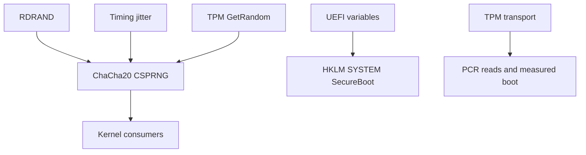

<!-- docs: covers=todo/04-drivers-hardware/TODO-04-security-hardware.md sources=src/kernel/cpu_security.c,include/kernel/cpu_security.h,src/kernel/random.c,src/kernel/csprng.c,src/kernel/entropy.c,src/kernel/main/boot_seed.c,src/kernel/tpm_transport.c,include/kernel/tpm.h,src/kernel/uefi_runtime.c,src/kernel/main/boot_hw.c reviewed=2026-09-28 order=4 -->
# Security Hardware and DMA Safety

## What is it?

The hardware features a kernel leans on to protect itself: supervisor-mode execution and access prevention (SMEP and SMAP), the CPU's random number instructions, an IOMMU that stops devices writing anywhere in memory, the TPM, Secure Boot state, and Intel CET shadow stacks. Some of this already works under other owners: a seeded ChaCha20 random generator, a TPM transport with PCR reads, and Secure Boot state in the Registry. None of this roadmap's eight sections is complete, and the protective features themselves (SMEP, SMAP, IOMMU, DMA bounce buffers, CET, kernel self-measurement) are not active.

## How does it work?

**SMEP and SMAP are wired but switched off.** `cpu_enable_smep()` and `cpu_enable_smap()` in [`cpu_security.c`](../../src/kernel/cpu_security.c) both ask `hv_supports_cr4_smep_smap()`, which returns 0 on every platform. The reason is structural: the boot page tables set the User bit on every 2 MiB page, including kernel code, so turning SMEP on would fault the kernel on its first instruction. The serial log says so at boot with `SMEP: skipped (kernel pages have User bit -- needs KPTI S6)`, and `cpu_verify_hardening()` repeats it after the page tables are finalised in [`boot_hw.c`](../../src/kernel/main/boot_hw.c). User copies are ready for the day SMAP is on: `copy_from_user()` and `copy_to_user()` open the user-access window with `stac` and `clac` when the CPU has SMAP, and recover from a fault instead of crashing.

**Random numbers.** `rdrand_bytes()` in [`random.c`](../../src/kernel/random.c) retries RDRAND up to ten times and fails cleanly on a CPU without it. The kernel generator in [`csprng.c`](../../src/kernel/csprng.c) is ChaCha20 with a BLAKE2b conditioner and fast key erasure, seeded at boot from the bootloader's seed payload plus RDRAND, timing jitter and TPM random bytes. The UEFI loader collects that payload RDSEED-first, falling back to RDRAND and marking the sample RDRAND-grade if it had to, and `early_entropy_init()` in [`boot_seed.c`](../../src/kernel/main/boot_seed.c) folds it into the first generator key. [`entropy.c`](../../src/kernel/entropy.c) records which sources contributed and logs one `entropy:` summary line. The kernel's own reseed path uses RDRAND only, and there is no separate hardware RNG driver.

**TPM.** [`tpm_transport.c`](../../src/kernel/tpm_transport.c) drives a TIS or CRB TPM 2.0, logging `TPM2 transport up` with the interface and vendor. It issues startup, GetRandom and PCR reads; `tpm2_pcr_read()` in [`tpm.h`](../../include/kernel/tpm.h) takes an algorithm, PCR index and output buffer and reports busy separately from failure. It does not send PCR_Extend or a general GetCapability, and there is no user-mode TPM device. Measured boot, PCR baselines, sealing and attestation build on this transport and are documented in [TPM Measured Boot](../boot/tpm-measured-boot.md).

**Secure Boot.** The kernel reads the firmware's Secure Boot and setup-mode variables and publishes them under `HKLM\SYSTEM\SecureBoot` from [`uefi_runtime.c`](../../src/kernel/uefi_runtime.c): `StateValid`, `State`, `SetupMode`, `DeployedMode`, `AuditMode`, key enrolment flags and `db`/`dbx` counts. Code asks `uefi_secureboot_enabled()`.



## What are its interfaces?

| Interface | Purpose |
| --- | --- |
| `cpu_enable_smep()`, `cpu_enable_smap()`, `cpu_verify_hardening()` | CR4 hardening, currently skipped ([`cpu_security.c`](../../src/kernel/cpu_security.c)) |
| `copy_from_user()`, `copy_to_user()` | Fault-recoverable user copies ([`cpu_security.h`](../../include/kernel/cpu_security.h)) |
| `rdrand_bytes()` | Raw RDRAND output ([`random.c`](../../src/kernel/random.c)) |
| `csprng_fill()`, `csprng_u64()`, `csprng_add_entropy()`, `csprng_is_seeded()` | Kernel random generator ([`csprng.c`](../../src/kernel/csprng.c)) |
| `tpm2_submit()`, `tpm2_pcr_read()` | TPM 2.0 commands ([`tpm.h`](../../include/kernel/tpm.h)) |
| `uefi_secureboot_enabled()`, `HKLM\SYSTEM\SecureBoot` | Secure Boot state ([`uefi_runtime.c`](../../src/kernel/uefi_runtime.c)) |

## How do I use it?

The CPU hardening state is tested in the `x86` category and the random generator and TPM layers in the `security` category; the TPM tests run against a fake TIS device, so they need no real TPM:

```bash
bash scripts/test.sh SUITE=x86
bash scripts/test.sh SUITE=security
```

On a booted system, the `[Phase0] CPU security` line shows the live SMEP and SMAP bits, and the `entropy:` line shows which random sources were present. An absent TPM or RDRAND is normal on some platforms and is reported, not treated as a failure.

## What is not implemented yet?

- **SMEP and SMAP enabled on every CPU.** Blocked until kernel pages lose the User bit ([SMEP + SMAP Late Init on All APs](../../todo/04-drivers-hardware/TODO-04-security-hardware.md#1-smep--smap-late-init-on-all-aps-sonnet)).
- **A kernel hardware RNG API that prefers RDSEED.** The generator and the bootloader's RDSEED-first seed exist; the roadmap's `hwrng_read()` does not ([Hardware RNG](../../todo/04-drivers-hardware/TODO-04-security-hardware.md#2-hardware-rng----rdrand--rdseed--chacha20-csprng-fallback-opus)).
- **DMA bounce buffers** for devices that cannot reach all of memory ([DMA Bounce Buffer Manager](../../todo/04-drivers-hardware/TODO-04-security-hardware.md#3-dma-bounce-buffer-manager-sonnet)).
- **An IOMMU driver.** The ACPI DMAR and IVRS table definitions arrive with ACPICA, but nothing reads them ([IOMMU / VT-d + AMD-Vi](../../todo/04-drivers-hardware/TODO-04-security-hardware.md#4-iommu--vt-d--amd-vi-opus)).
- **The roadmap's `Enabled` value and `secboot_is_enabled()` helper.** The state ships under different names, listed above ([Secure Boot UEFI Variable Read](../../todo/04-drivers-hardware/TODO-04-security-hardware.md#5-secure-boot-uefi-variable-read-sonnet)).
- **TPM PCR_Extend, GetCapability and an IOCTL surface** ([TPM 2.0 Command Layer and IOCTL Surface](../../todo/04-drivers-hardware/TODO-04-security-hardware.md#6-tpm-20-command-layer-and-ioctl-surface-opus)).
- **Measuring the kernel's own code into PCR 10.** A SHA-256 implementation exists; the measurement does not ([Boot-Time Kernel Integrity Check](../../todo/04-drivers-hardware/TODO-04-security-hardware.md#7-boot-time-kernel-integrity-check-opus)).
- **CET shadow stacks.** The CPU feature bit and the control-protection exception vector are known; nothing enables CET ([Intel CET Shadow Stacks](../../todo/04-drivers-hardware/TODO-04-security-hardware.md#8-intel-cet-shadow-stacks-opus)).

## How does it compare with Windows 11 and Linux?

Windows 11 enables SMEP and SMAP, uses the IOMMU for Kernel DMA Protection, exposes the TPM through `tpm.sys` and TBS, and runs CET on x64 with HVCI and Measured Boot. Linux does the same with `intel_iommu`, `/dev/tpm0`, CET from 6.6 and IMA extending PCR 10. Impossible OS has a comparable random generator, TPM transport and Secure Boot reporting, but none of the memory-protection features are active yet. The roadmap marks CET and kernel self-measurement as the areas it intends to lead on.

## See also

- [Security hardware roadmap](../../todo/04-drivers-hardware/TODO-04-security-hardware.md)
- [Memory Security Hardening](../memory/memory-security.md)
- [Kernel Security Hardening](../kernel/kernel-security-hardening.md)
- [Early Entropy and Random Seed](../boot/early-entropy-random-seed.md)
- [TPM Measured Boot](../boot/tpm-measured-boot.md)
- [Secure Boot Keys](../guides/secure-boot-keys.md)
