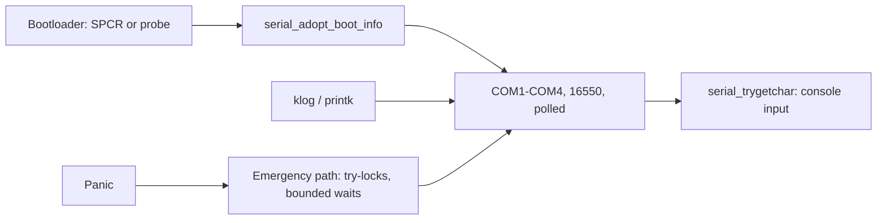

<!-- docs: covers=todo/04-drivers-hardware/TODO-20-serial-parallel-debug-io.md sources=include/kernel/drivers/serial.h,src/kernel/drivers/serial.c,include/kernel/drivers/serial_emergency.h,src/kernel/sched/syscall.c,src/kernel/nt/nt_syscall.c,src/kernel/test/test_serial_emergency.c reviewed=2026-09-28 order=20 -->
# Serial, Parallel and Debug I/O

## What is it?

This roadmap turns the serial port from a kernel log line into a real device stack: named `COMn` devices that programs can open, PCI multiport and USB serial adapters, a parallel port driver, GPIO and SPI frameworks, and rules for who owns a port when the kernel debugger, the console and a program all want it. None of its ten sections has shipped. What exists today is the kernel's own serial console, owned by the boot and logging work, which this page describes as the starting point.

## How does it work today?

**One console port.** [`serial.c`](../../src/kernel/drivers/serial.c) drives a single 16550-compatible UART. It starts on COM1 (`0x3F8`), then `serial_adopt_boot_info()` switches to the port the bootloader found: any of COM1 to COM4 when the ACPI SPCR table names it, or COM1 or COM2 when the bootloader's scratch-register probe found it. When the probe found no UART at all, `serial_uart_probed_absent()` reports it, and the bounded emergency and recoverable write paths stop spending their wait budget on a transmitter that will never answer (the flag clears if one does respond). Ordinary console output does not consult the flag: `serial_putchar_raw()` polls for transmitter-ready with no timeout while holding the serial lock with interrupts off, so a UART that never becomes ready can stall normal logging. The port constants live in [`serial_emergency.h`](../../include/kernel/drivers/serial_emergency.h).

**Polled, not interrupt-driven.** The UART is programmed for 8N1 with FIFOs enabled and interrupts disabled. The baud divisor the firmware set is kept, deliberately: changing the rate of a working console could leave a machine with no output at all, so the line rate is left to the [kernel debugger](../kernel/kernel-debugger-kd.md) work. Output is written byte by byte; input is polled with `serial_trygetchar()`, which the console read paths in [`syscall.c`](../../src/kernel/sched/syscall.c) and [`nt_syscall.c`](../../src/kernel/nt/nt_syscall.c) try after the keyboard, so a serial terminal can type into the shell.

**A panic-safe path.** When the system is crashing, `serial_enter_emergency()` switches to a separate write path that uses try-locks, per-epoch claim tokens and bounded waits, so a CPU that died holding the normal lock cannot silence the panic report. `serial_write_recoverable()` is the bounded variant for faults the system may survive.



## What are its interfaces?

| Interface | Purpose |
| --- | --- |
| `serial_init()`, `serial_adopt_boot_info()` | Bring up the console UART and adopt the bootloader's port ([`serial.h`](../../include/kernel/drivers/serial.h)) |
| `serial_putchar()`, `serial_write()`, `serial_trygetchar()` | Normal output and polled input |
| `serial_uart_probed_absent()` | True when the bootloader probe found no UART |
| `serial_enter_emergency()`, `serial_write_emergency()`, `serial_write_recoverable()` | Crash-time output |

There is no device that user programs can open: no `COM1` object, no `CreateFile("COM1")` and no `/dev/ttyS0`.

## How do I use it?

Connect a null-modem cable or, under QEMU, use the `-serial` option; the log and a shell prompt appear on the line. The port selection, absent-UART and emergency path tests run in the boot suite ([`test_serial_emergency.c`](../../src/kernel/test/test_serial_emergency.c)):

```bash
bash scripts/test.sh SUITE=boot
```

## What is not implemented yet?

- **Openable COM devices** with exclusive open, interrupt-driven receive and line settings ([Runtime COM Device Model](../../todo/04-drivers-hardware/TODO-20-serial-parallel-debug-io.md#1-runtime-com-device-model), [UART 16550A Cleanup](../../todo/04-drivers-hardware/TODO-20-serial-parallel-debug-io.md#2-uart-16550a-cleanup)).
- **Adapters**: [PCI Multiport Serial](../../todo/04-drivers-hardware/TODO-20-serial-parallel-debug-io.md#3-pci-multiport-serial) and [USB CDC-ACM Integration](../../todo/04-drivers-hardware/TODO-20-serial-parallel-debug-io.md#4-usb-cdc-acm-integration), which needs the [USB CDC-ACM class driver](../../todo/04-drivers-hardware/TODO-10-usb-stack.md#12-usb-cdc-acm-serial-sonnet).
- **Port ownership** between the debugger, the console and programs ([Ownership Arbitration](../../todo/04-drivers-hardware/TODO-20-serial-parallel-debug-io.md#5-ownership-arbitration)).
- **Parallel ports** ([Parallel/LPT Driver](../../todo/04-drivers-hardware/TODO-20-serial-parallel-debug-io.md#6-parallellpt-driver)), which printing also depends on ([Printing and Scanning Device Path](printing-scanning.md)).
- **GPIO, SPI and diagnostics** ([GPIO Framework](../../todo/04-drivers-hardware/TODO-20-serial-parallel-debug-io.md#7-gpio-framework), [SPI Framework](../../todo/04-drivers-hardware/TODO-20-serial-parallel-debug-io.md#8-spi-framework), [Industrial I/O Diagnostics](../../todo/04-drivers-hardware/TODO-20-serial-parallel-debug-io.md#9-industrial-io-diagnostics)).
- **Loopback and adapter tests** ([Tests](../../todo/04-drivers-hardware/TODO-20-serial-parallel-debug-io.md#10-tests)).

## How does it compare with Windows 11 and Linux?

Windows 11 exposes `COMn` through `serial.sys` and `usbser.sys`, with GPIO and SPI under the Simple Peripheral Bus framework. Linux has the tty serial core (`/dev/ttyS*`, `/dev/ttyACM*`), `parport`, `gpiolib` and the SPI subsystem. Impossible OS has a robust kernel console port, including a crash-safe path, but no user-openable serial devices yet.

## See also

- [Serial, parallel and debug I/O roadmap](../../todo/04-drivers-hardware/TODO-20-serial-parallel-debug-io.md)
- [Kernel Debugger](../kernel/kernel-debugger-kd.md)
- [Boot Info Fields](../boot/boot-info-fields.md)
- [USB Stack](usb-stack.md)
- [Printing and Scanning Device Path](printing-scanning.md)
