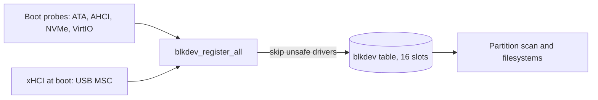

<!-- docs: covers=todo/04-drivers-hardware/TODO-13-storage-controller-device-drivers.md sources=include/kernel/drivers/blkdev.h,src/kernel/drivers/blkdev.c,src/kernel/main/blkdev_adapters.c,src/kernel/main/boot_storage.c,src/kernel/drivers/ahci/ahci_rw.c,src/kernel/drivers/ahci/ahci_atapi.c,src/kernel/drivers/ahci/ahci_hotplug.c,src/kernel/drivers/ata.c,src/kernel/drivers/virtio/blk_init.c,src/kernel/drivers/virtio/blk_api.c,src/kernel/drivers/virtio/blk_discard.c,src/kernel/drivers/usb_msc.c,src/kernel/test/test_storage.c reviewed=2026-09-28 order=13 -->
# Storage Controllers and Removable Media

## What is it?

The drivers that turn disk controllers into block devices the filesystems can mount: AHCI for SATA disks and optical drives, legacy ATA, VirtIO-blk for virtual machines, USB mass storage and NVMe. Every driver publishes its disks through one small block-device table, so a filesystem never needs to know which controller holds it. The drivers themselves are largely built; none of this roadmap's ten sections is complete, because what it adds is the shared layer above them: a capability model, SD and eMMC support, multi-LUN card readers, health reporting and safe surprise removal.

## How does it work?

**One table for every disk.** A driver describes a disk with a `struct blkdev` ([`blkdev.h`](../../include/kernel/drivers/blkdev.h)): a name, sector size and count, a mandatory `read` callback, and `write`, `flush`, `discard` and `shutdown` callbacks, any of which may be `NULL`. `blkdev_register()` in [`blkdev.c`](../../src/kernel/drivers/blkdev.c) adds it to a fixed table of `BLKDEV_MAX` (16) entries. `blkdev_register()` refuses a device without `read`. There is no capability field, and a non-`NULL` callback only means the adapter has an entry point, not that the device supports the operation: VirtIO's write refuses a read-only device, VirtIO's discard reports unsupported, and AHCI's TRIM callback returns success without sending anything when the drive lacks TRIM.

**Boot-time discovery.** [`boot_storage.c`](../../src/kernel/main/boot_storage.c) starts the ATA, AHCI, NVMe and VirtIO-blk probes, then calls `blkdev_register_all()` in [`blkdev_adapters.c`](../../src/kernel/main/blkdev_adapters.c). That function names the disks and wires each driver through a thin adapter. A driver whose probe finished only partly is flagged in an unsafe mask and skipped, with a `Skipping registration for degraded storage driver(s)` error, rather than registered half-initialised.

| Name | Controller | Callbacks wired |
| --- | --- | --- |
| `ata0` | Legacy ATA, PIO only ([`ata.c`](../../src/kernel/drivers/ata.c)) | read, write |
| `virtio0` | VirtIO-blk | read, write, flush, discard |
| `sata0`, `sata1`, ... | AHCI disk | read, write, flush, discard (TRIM) |
| `cdrom0`, ... | AHCI ATAPI optical drive | read only |
| `usb0`, ... | USB mass storage, routed to its xHCI controller | read, write |
| `nvme0`, ... | NVMe | read, write, flush, shutdown |

**AHCI.** `ahci_read()` in [`ahci_rw.c`](../../src/kernel/drivers/ahci/ahci_rw.c) uses native command queuing when the port supports it and interrupts are live, and a single-command DMA path otherwise; it refuses an ATAPI port, which needs packet commands. The optical path in [`ahci_atapi.c`](../../src/kernel/drivers/ahci/ahci_atapi.c) sends SCSI INQUIRY, TEST UNIT READY, REQUEST SENSE, READ CAPACITY and READ(10)/READ(12). Port hot-plug insert and remove handlers live in [`ahci_hotplug.c`](../../src/kernel/drivers/ahci/ahci_hotplug.c), and per-port error counters are written to the Registry.

**VirtIO-blk.** The driver under [`src/kernel/drivers/virtio/`](../../src/kernel/drivers/virtio/blk_init.c) negotiates flush, discard, write-zeroes, secure erase, zoned devices, multiple queues and a lifetime query, but the block-device table exposes only read, write, flush and discard. It also has `virtio_blk_hotunplug()` and `virtio_blk_hotplug()`, which nothing outside the driver calls yet.

**USB mass storage.** [`usb_msc.c`](../../src/kernel/drivers/usb_msc.c) speaks Bulk-Only Transport with INQUIRY, TEST UNIT READY and READ CAPACITY at attach. It addresses one logical unit per device, so a multi-slot card reader appears as a single `usbN` disk. `blkdev_register_all()` runs once during boot, so only a stick present at boot becomes a `usbN` disk; one plugged in later may be enumerated but is never registered or mounted.



## What are its interfaces?

| Interface | Purpose |
| --- | --- |
| `struct blkdev`, `blkdev_register()`, `blkdev_unregister()` | Describe and publish a disk ([`blkdev.h`](../../include/kernel/drivers/blkdev.h)) |
| `blkdev_read()`, `blkdev_write()`, `blkdev_sync()`, `blkdev_discard()` | Sector I/O, cache flush and TRIM through the table |
| `blkdev_list()`, `blkdev_shutdown_all()` | Enumerate disks; clean controller shutdown at power-off |
| `blkdev_register_all()` | Name and register every discovered disk ([`blkdev_adapters.c`](../../src/kernel/main/blkdev_adapters.c)) |
| `ahci_read()`, `ahci_write()`, `ahci_flush()`, `ahci_trim()` | AHCI disk I/O ([`ahci_rw.c`](../../src/kernel/drivers/ahci/ahci_rw.c)) |
| `ahci_atapi_read()`, `ahci_atapi_capacity()` | Optical media reads ([`ahci_atapi.c`](../../src/kernel/drivers/ahci/ahci_atapi.c)) |

## How do I use it?

Storage tests run in the `storage` category: [`test_storage.c`](../../src/kernel/test/test_storage.c) reads through AHCI and VirtIO, `test_nvme.c` checks controller count and namespace geometry, and `test_usb_boot.c` covers the USB boot disk. The test runner's QEMU machine attaches its disk through an ICH9 AHCI controller, so a test for a controller that is not present skips rather than fails:

```bash
bash scripts/test.sh SUITE=storage
make test-storage
```

If a disk is missing after boot, look for the `Skipping registration for degraded storage driver(s)` error in the serial log: its mask names the driver whose probe did not finish.

## What is not implemented yet?

- **A capability model.** There is no `blkdev_driver_caps_t` and no matrix of which driver owns which controller ([Storage Driver Capability Matrix](../../todo/04-drivers-hardware/TODO-13-storage-controller-device-drivers.md#1-storage-driver-capability-matrix)).
- **An AHCI parity audit and link power management.** Queuing, hot-plug, error counters and MSI exist; the audit and suspend callbacks do not ([AHCI/SATA Parity Completion](../../todo/04-drivers-hardware/TODO-13-storage-controller-device-drivers.md#2-ahcisata-parity-completion)).
- **Optical media change events**, and DMA or ATAPI on the legacy ATA path ([ATA/ATAPI and Optical Media](../../todo/04-drivers-hardware/TODO-13-storage-controller-device-drivers.md#3-ataatapi-and-optical-media)).
- **VirtIO-blk through Plug and Play**, with its extra features exposed through the common contract ([VirtIO-blk Production Integration](../../todo/04-drivers-hardware/TODO-13-storage-controller-device-drivers.md#4-virtio-blk-production-integration)).
- **SD, SDHCI and eMMC.** There is no driver ([SDHCI/eMMC/SD Card Driver](../../todo/04-drivers-hardware/TODO-13-storage-controller-device-drivers.md#5-sdhciemmcsd-card-driver)).
- **One disk per card-reader slot** ([USB Card Readers and Multi-LUN](../../todo/04-drivers-hardware/TODO-13-storage-controller-device-drivers.md#6-usb-card-readers-and-multi-lun)).
- **Identity and health.** No SMART or NVMe health log bridge ([Storage Identity and Health](../../todo/04-drivers-hardware/TODO-13-storage-controller-device-drivers.md#7-storage-identity-and-health)).
- **Surprise removal** that marks a disk gone before failing its I/O and tells the filesystem and Device Manager ([Surprise Removal and Media Change](../../todo/04-drivers-hardware/TODO-13-storage-controller-device-drivers.md#8-surprise-removal-and-media-change)).
- **A single storage diagnostics report** ([Diagnostics Report](../../todo/04-drivers-hardware/TODO-13-storage-controller-device-drivers.md#9-diagnostics-report)) and the VM and bare-metal test matrix ([Tests](../../todo/04-drivers-hardware/TODO-13-storage-controller-device-drivers.md#10-tests)).

## How does it compare with Windows 11 and Linux?

Windows 11 uses `storahci` and `sdstor` with SMART data surfaced through Storage Spaces; Linux uses `libata`, `ahci` and `sdhci`/`mmc`, with health read by `smartctl` through sysfs. Impossible OS matches their controller coverage for SATA, NVMe, VirtIO and USB but has no SD or eMMC driver and no health reporting. The roadmap's addition is one storage report covering every controller, where Windows spreads the same facts across several tools and Linux across sysfs and `dmesg`.

## See also

- [Storage controller roadmap](../../todo/04-drivers-hardware/TODO-13-storage-controller-device-drivers.md)
- [NVMe Boot Storage](../boot/nvme-boot-storage.md)
- [xHCI and USB Boot](../boot/xhci-usb-boot.md)
- [Storage](../storage/index.md)
- [USB Stack](usb-stack.md)
