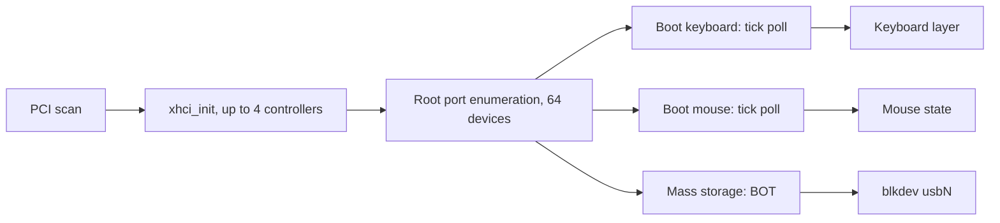

<!-- docs: covers=todo/04-drivers-hardware/TODO-10-usb-stack.md sources=include/kernel/drivers/xhci.h,src/kernel/drivers/xhci.c,include/kernel/drivers/xhci_dev.h,src/kernel/drivers/xhci_dev.c,src/kernel/drivers/usb_msc.c,include/kernel/drivers/usb_msc.h,src/kernel/drivers/usb_legacy.c,src/kernel/main/boot_storage.c,src/kernel/test/test_usb_hid.c reviewed=2026-09-28 order=10 -->
# USB Stack

## What is it?

The USB stack is what lets the system use anything plugged into a USB port. Impossible OS has an xHCI (USB 3) host driver that boots from USB sticks and drives boot-protocol keyboards and mice, which the boot platform roadmaps built. This roadmap turns that into a general stack: a USB core layer independent of the host controller, hubs, an EHCI fallback for USB 2 machines, full HID, isochronous transfers, and class drivers for Ethernet, serial and Bluetooth. None of its thirteen sections is complete.

## How does it work?

**Host controller.** `xhci_init()` in [`xhci.c`](../../src/kernel/drivers/xhci.c) finds up to `XHCI_MAX_CONTROLLERS` (4) xHCI controllers on PCI, takes ownership from the firmware and brings them up, logging `Found xHCI at PCI ...`. A machine with none carries on with `No xHCI controller -- continuing boot without USB (PS/2 + disk still work)`. Older EHCI, UHCI and OHCI controllers are detected and named by [`usb_legacy.c`](../../src/kernel/drivers/usb_legacy.c) but not driven.

**Devices and transfers.** [`xhci_dev.c`](../../src/kernel/drivers/xhci_dev.c) enumerates the root ports into a fixed table of `XHCI_MAX_DEVICES` (64) and offers control and bulk transfers, with halt detection and endpoint recovery. Everything is xHCI-specific: there is no host-independent USB core, and hubs are not enumerated, so only devices on root ports work.

**Keyboards and mice.** A boot-protocol keyboard or mouse gets an interrupt-in endpoint, is switched to boot protocol and is polled on the system tick. Keys go to the PS/2 keyboard layer and movement to the shared mouse state, where button state from each source is merged. Report descriptors are not parsed, so wheels, extra buttons and non-boot devices are ignored. [USB HID Boot Protocol](../boot/usb-hid-boot-protocol.md) has the details.

**Mass storage.** [`usb_msc.c`](../../src/kernel/drivers/usb_msc.c) speaks Bulk-Only Transport with reset and retry, and each stick registers as a `usbN` block device. It addresses one logical unit: `max_lun` in [`usb_msc.h`](../../include/kernel/drivers/usb_msc.h) is never filled in, because the driver does not send GET_MAX_LUN.

**Hot-plug, partly.** For the first controller, `xhci_setup_interrupts()` registers an MSI vector so port changes arrive as interrupts, and a connect then enumerates the new device. Without MSI there is no runtime attach: the command and transfer waits consume port-change events and drop them, so only devices present at boot are enumerated, despite the `hot-plug via event ring polling only` log line. With MSI, a disconnect is only logged (`Hot-unplug: device removed from port N`) and the device slot is not released.



## What are its interfaces?

| Interface | Purpose |
| --- | --- |
| `xhci_init()`, `xhci_controller_count()`, `xhci_get_controller()` | Controller discovery ([`xhci.h`](../../include/kernel/drivers/xhci.h)) |
| `xhci_enumerate_ports()`, `xhci_get_device()` | Device table ([`xhci_dev.h`](../../include/kernel/drivers/xhci_dev.h)) |
| `xhci_send_control()`, `xhci_bulk_transfer()`, `xhci_recover_endpoint()` | Control and bulk transfers with recovery |
| `usb_msc_init()`, `usb_msc_read_sectors()`, `usb_msc_write_sectors()` | Mass storage ([`usb_msc.h`](../../include/kernel/drivers/usb_msc.h)) |

## How do I use it?

Plug a USB stick, keyboard or mouse into a root port. The HID and USB boot tests run in the `storage` category, covering the report decoders and input merging ([`test_usb_hid.c`](../../src/kernel/test/test_usb_hid.c)) and the boot disk report:

```bash
bash scripts/test.sh SUITE=storage
```

The boot log's `[INPUT] Sources:` line shows which of PS/2, USB keyboard, USB mouse and VirtIO input were found.

## What is not implemented yet?

- **A USB core layer** independent of the host controller, with suspend and resume ([USB Core Abstraction Layer](../../todo/04-drivers-hardware/TODO-10-usb-stack.md#1-usb-core-abstraction-layer-opus)).
- **String descriptors** for product and vendor names ([USB String Descriptor Retrieval](../../todo/04-drivers-hardware/TODO-10-usb-stack.md#2-usb-string-descriptor-retrieval-sonnet)).
- **Isochronous endpoints** for audio and video ([Isochronous Endpoint Support](../../todo/04-drivers-hardware/TODO-10-usb-stack.md#3-isochronous-endpoint-support-opus)).
- **Generic interrupt endpoints and a full HID class driver** beyond the boot-protocol path above ([Interrupt Endpoint Setup for HID](../../todo/04-drivers-hardware/TODO-10-usb-stack.md#4-interrupt-endpoint-setup-for-hid-opus), [USB HID Class Driver](../../todo/04-drivers-hardware/TODO-10-usb-stack.md#5-usb-hid-class-driver-sonnet)).
- **PS/2 yielding to USB input** ([PS/2 ↔ USB Input Fallback](../../todo/04-drivers-hardware/TODO-10-usb-stack.md#6-ps2--usb-input-fallback-sonnet)).
- **Multi-LUN mass storage** ([USB MSC BOT Completion](../../todo/04-drivers-hardware/TODO-10-usb-stack.md#7-usb-msc-bot-completion-opus)).
- **Complete hot-plug** with teardown on disconnect ([Hot-Plug Interrupt Handling](../../todo/04-drivers-hardware/TODO-10-usb-stack.md#8-hot-plug-interrupt-handling-opus)).
- **Hubs** ([USB Hub Class Driver](../../todo/04-drivers-hardware/TODO-10-usb-stack.md#9-usb-hub-class-driver-opus)) and **EHCI** ([EHCI Fallback (USB 2.0)](../../todo/04-drivers-hardware/TODO-10-usb-stack.md#10-ehci-fallback-usb-20-opus)).
- **Class drivers** for Ethernet ([USB CDC-ECM Ethernet](../../todo/04-drivers-hardware/TODO-10-usb-stack.md#11-usb-cdc-ecm-ethernet-sonnet)), serial ([USB CDC-ACM Serial](../../todo/04-drivers-hardware/TODO-10-usb-stack.md#12-usb-cdc-acm-serial-sonnet)) and Bluetooth ([Bluetooth HCI via USB](../../todo/04-drivers-hardware/TODO-10-usb-stack.md#13-bluetooth-hci-via-usb-opus)).

## How does it compare with Windows 11 and Linux?

Windows 11 layers `USBXHCI.sys`, the USB hub driver and class drivers such as `USBSTOR.sys`, `BTHUSB.sys` and `usbser.sys` over a common USB driver interface. Linux does the same around `struct usb_hcd` and URBs, with `xhci_hcd`, `ehci_hcd`, `usbhid`, `usb-storage`, `btusb`, `cdc_ether` and `cdc_acm`. Impossible OS has a working xHCI driver with boot input and storage, but no core layer, hubs or class drivers.

## See also

- [USB stack roadmap](../../todo/04-drivers-hardware/TODO-10-usb-stack.md)
- [xHCI and USB Boot](../boot/xhci-usb-boot.md)
- [USB HID Boot Protocol](../boot/usb-hid-boot-protocol.md)
- [USB Boot Hardening](../boot/usb-boot-hardening.md)
- [Input System](input-system.md)
- [Storage Controllers and Removable Media](storage-controllers.md)
