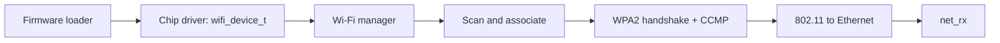

<!-- docs: covers=todo/04-drivers-hardware/TODO-15-wifi-drivers.md sources=src/kernel/net/ethernet.c,include/kernel/net/net.h,include/kernel/csprng.h reviewed=2026-09-28 order=15 -->
# Wi-Fi Drivers

## What is it?

The Wi-Fi roadmap plans wireless networking for Impossible OS: a common driver interface, an 802.11 frame layer, scanning and association, drivers for Realtek, Intel and MediaTek chips, a WPA2-PSK supplicant, power management, the `netsh wlan` commands and an Airplane mode coordinator. Nothing in it has shipped. There is no Wi-Fi code in the tree today, so this page describes the plan and the pieces it will build on.

## How will it work?

**A driver interface first.** Every chip driver will fill in a seven-function `wifi_device_t` table (scan, connect, disconnect, signal strength, set channel, transmit and receive poll) and register with a Wi-Fi manager, `wifi_manager.c`. The manager is the single owner of Wi-Fi state: the scan results, the active device and the connection state machine (disconnected, scanning, authenticating, associating, four-way handshake, connected). User mode reaches it through planned `SYS_WIFI_SCAN`, `SYS_WIFI_CONNECT`, `SYS_WIFI_DISCONNECT` and `SYS_WIFI_STATUS` system calls.

**Into the existing stack.** Once associated, a Wi-Fi interface carries ordinary Ethernet frames. Received data frames are converted from 802.11 to Ethernet framing and passed to `net_rx()` in [`ethernet.c`](../../src/kernel/net/ethernet.c), the same entry point the wired RTL8139 driver uses. That layer is currently hard-wired to one wired card ([Network Drivers](network-drivers.md)), so a second interface needs the driver table planned there too.

**Security.** The supplicant runs the EAPOL four-way handshake and CCMP encryption in the kernel. Random nonces come from the kernel CSPRNG (`csprng_fill()` in [`csprng.h`](../../include/kernel/csprng.h)). The roadmap names a `hwrng_read()` source that does not exist, and plans its own AES-CCM, PBKDF2 and HMAC-SHA1 code; the vendored mbedtls library already provides PBKDF2 and constant-time compare, which the project's vendor-first rule would prefer.

**Firmware.** Every supported chip needs a vendor firmware blob at start-up, so the drivers depend on the [Firmware Loader](firmware-loader.md), which is also unshipped.

## What are its interfaces?

None yet. The planned surface is the `wifi_device_t` table and manager, the `SYS_WIFI_*` system calls, Registry keys for saved networks (`HKLM\SYSTEM\Network\WiFi`), the `netsh wlan` commands and a Wi-Fi tab in the network control panel. The existing interfaces it will use are `net_rx()` and `net_cfg` ([`net.h`](../../include/kernel/net/net.h)) and `csprng_fill()`.

## How do I use it?

You cannot yet. A machine whose only network is Wi-Fi boots without networking. Under QEMU, use the emulated RTL8139 wired card described in [Network Drivers](network-drivers.md).

## What is not implemented yet?

Everything:

- **The driver interface and frame layer** ([WiFi Driver Abstraction Layer](../../todo/04-drivers-hardware/TODO-15-wifi-drivers.md#1-wifi-driver-abstraction-layer-opus), [802.11 Frame Layer](../../todo/04-drivers-hardware/TODO-15-wifi-drivers.md#2-80211-frame-layer-sonnet)).
- **Scanning and association** ([WiFi Scan & Association State Machine](../../todo/04-drivers-hardware/TODO-15-wifi-drivers.md#3-wifi-scan--association-state-machine-opus)).
- **WPA2-PSK** ([WPA2-PSK Supplicant](../../todo/04-drivers-hardware/TODO-15-wifi-drivers.md#5-wpa2-psk-supplicant----eapol-4-way-handshake--ccmp-opus)).
- **Chip drivers**: [RTL8188 / RTL8192 USB](../../todo/04-drivers-hardware/TODO-15-wifi-drivers.md#4-rtl8188--rtl8192-usb-wifi-driver-opus), [RTL8821CE / RTL8822BE](../../todo/04-drivers-hardware/TODO-15-wifi-drivers.md#6-rtl8821ce--rtl8822be-pcie-wifi-driver-opus), [Intel AX200 / AX210](../../todo/04-drivers-hardware/TODO-15-wifi-drivers.md#7-intel-ax200--ax210-iwlwifi-pcie-driver-opus) and [MediaTek MT7921 / MT7922](../../todo/04-drivers-hardware/TODO-15-wifi-drivers.md#8-mediatek-mt7921--mt7922-pcie-wifi-driver-sonnet). The USB driver also needs the unshipped USB core and hub support ([USB Stack](usb-stack.md)).
- **Power management** ([WiFi Power Management](../../todo/04-drivers-hardware/TODO-15-wifi-drivers.md#9-wifi-power-management-sonnet)).
- **User interface** ([`ncpa.cpl` WiFi Tab + `netsh wlan` Commands](../../todo/04-drivers-hardware/TODO-15-wifi-drivers.md#10-ncpacpl-wifi-tab--netsh-wlan-commands-sonnet)) and **Airplane mode** ([Airplane Mode Radio Coordinator](../../todo/04-drivers-hardware/TODO-15-wifi-drivers.md#11-airplane-mode-radio-coordinator)), shared with [Bluetooth](bluetooth.md).

## How does it compare with Windows 11 and Linux?

Windows 11 uses NDIS Wi-Fi miniport drivers under the `wlansvc` service, with the tray flyout and `netsh wlan`. Linux splits the work between `cfg80211` and `mac80211` in the kernel and `wpa_supplicant` or NetworkManager in user space. Impossible OS plans a single in-kernel manager and supplicant, and has no Wi-Fi support today.

## See also

- [Wi-Fi drivers roadmap](../../todo/04-drivers-hardware/TODO-15-wifi-drivers.md)
- [Network Drivers](network-drivers.md)
- [Bluetooth](bluetooth.md)
- [Firmware Loader and Device Blobs](firmware-loader.md)
- [Networking](../networking/index.md)
