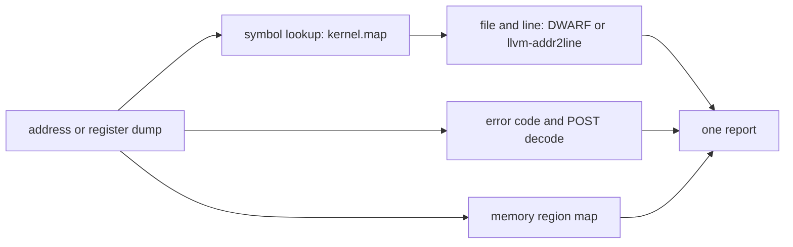

<!-- docs: covers=todo/14-host-tools/TODO-03-addr2line.md sources=tools/convert_symmap.py,src/kernel/symtab.c,include/kernel/boot_init.h,Makefile reviewed=2026-09-30 order=3 -->
# Address Resolver (ixfs-addr2line)

## What is it?

`ixfs-addr2line` is a planned host tool that turns a crash address into a function, a file and line, a few lines of surrounding source, a decoded exception error code and the memory region the address falls in, in one command. None of its five sections has been built. Today the job is done with the LLVM tool the project already installs, `llvm-addr2line-19 -e build/kernel.exe -f <RIP>`, plus the kernel's own symbol table, which already names every frame on the crash screen.

## How does it work?

**Today.** Every kernel link produces two symbol files (the rule is in the [`Makefile`](../../Makefile), just after the link step):

- `build/kernel.map` is the text output of `llvm-nm-19 -n build/kernel.exe`: one `address type name` line per symbol, sorted by address.
- `build/kernel.sym` is a packed binary table made from it by [`tools/convert_symmap.py`](../../tools/convert_symmap.py): the magic `KSYM`, a 32-bit entry count, then entries of a 64-bit address and a 32-byte name truncated to 31 characters.

The kernel loads `kernel.sym` from `C:\Impossible\System\kernel.sym` at boot ([`src/kernel/symtab.c`](../../src/kernel/symtab.c)), and `symtab_resolve()` gives the nearest preceding symbol and offset. The crash screen prints each stack frame as `#N  address  name+0xoffset`, so a kernel crash is already symbolised on screen; what it lacks is the file, line and source.

**Planned design.** The roadmap's tool builds on the same files:

1. Load the symbol list and binary-search the nearest symbol at or below the address, reporting `name+offset` and which section (`.text`, `.data`, `.bss`) it sits in.
2. Find the file and line from DWARF in `build/kernel.exe`, or by calling `llvm-addr2line` as a subprocess, and print five lines of context with the faulting line marked.
3. Decode page-fault, general-protection and double-fault error codes, and look up `POST16_*` boot progress codes from [`include/kernel/boot_init.h`](../../include/kernel/boot_init.h).
4. Map an address such as CR2 to a known region: kernel image, heap, user program range, framebuffer, local APIC, I/O APIC.
5. A `--crash RIP=... CR2=... ERR=... CR3=... CS=...` mode that decodes a whole register dump and suggests a likely cause.



## What are its interfaces?

| Interface | Status |
| --- | --- |
| `build/kernel.map` (nm text) and `build/kernel.sym` (`KSYM` binary) | Shipped, written on every kernel link |
| `symtab_resolve()` and the crash-screen stack trace | Shipped, in the kernel |
| `llvm-addr2line-19 -e build/kernel.exe -f <RIP>` | Available on every supported host |
| `ixfs-addr2line <address>` | Planned in sections 1 and 2 |
| Error-code and POST decoder | Planned in section 3 |
| Memory region mapper | Planned in section 4 |
| `ixfs-addr2line --crash ...` | Planned in section 5 |

## How do I use it?

Until the tool exists, resolve an address with LLVM and read the symbol list directly:

```bash
llvm-addr2line-19 -e build/kernel.exe -f -C 0x1234a0
grep -i ' isr_handler$' build/kernel.map
```

The first command prints the function name and `file:line`; the second shows the symbol's address and type. `CLAUDE.md` lists the same `llvm-addr2line-19` command under the toolchain, and the [crash screen](../kernel/panic-screen-crash-experience.md) already gives the symbol names for each frame.

## What is not implemented yet?

- [Symbol Map Parser](../../todo/14-host-tools/TODO-03-addr2line.md#1-symbol-map-parser)
- [Source Context Display](../../todo/14-host-tools/TODO-03-addr2line.md#2-source-context-display)
- [Error Code Decoder](../../todo/14-host-tools/TODO-03-addr2line.md#3-error-code-decoder)
- [Memory Region Mapper](../../todo/14-host-tools/TODO-03-addr2line.md#4-memory-region-mapper)
- [Full Crash Decode Mode](../../todo/14-host-tools/TODO-03-addr2line.md#5-full-crash-decode-mode)

Two parts of the roadmap need settling before section 1 is built. It describes `build/kernel.sym` as nm text; the text form is `kernel.map`, and `kernel.sym` is the binary table, whose 31-character names are too short for some kernel symbols. Its region list (kernel text at `0x101000`, heap at `0x57E000`) is a snapshot of an old layout; the address space is defined in [`include/kernel/mm/memmap.h`](../../include/kernel/mm/memmap.h) (see [Kernel Address Space](../infrastructure/kernel-address-space.md)), and a region mapper should read it from there rather than hard-code it. The tool's `ixfs-` prefix is also historical: it has nothing to do with IXFS.

## How does it compare with Windows 11 and Linux?

On Windows, WinDbg resolves addresses against PDB symbols and `!analyze -v` decodes the bug check. On Linux, `addr2line`, `scripts/faddr2line` and `scripts/decode_stacktrace.sh` in the kernel tree turn an oops into file and line. Impossible OS already symbolises frames inside the kernel at crash time, which Linux does only with `CONFIG_KALLSYMS`; the planned tool adds source context, error-code decoding and region mapping in a single command.

## See also

- [Address resolver roadmap](../../todo/14-host-tools/TODO-03-addr2line.md)
- [Crash Decoder](crash-decode.md), which plans to call this tool
- [Panic Screen and Crash Experience](../kernel/panic-screen-crash-experience.md)
- [Boot Diagnostics](../boot/boot-diagnostics.md) for POST codes
