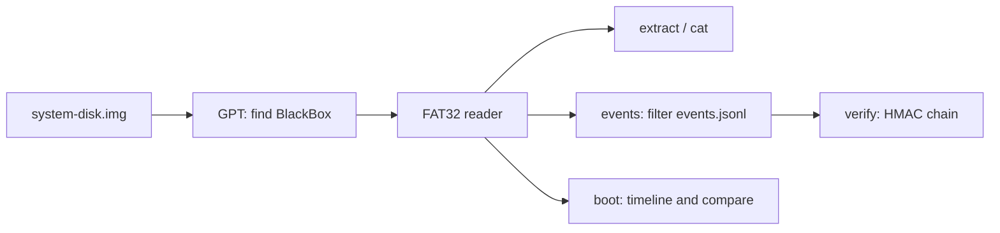

<!-- docs: covers=todo/14-host-tools/TODO-08-blackbox-log-extractor.md sources=scripts/tools/read-blackbox.sh,sdk/scripts/extract-logs.sh,tools/make-system-disk.c,tools/boot-timeline/boot_timeline.py reviewed=2026-09-30 order=8 -->
# BlackBox Log Extractor

## What is it?

The BlackBox extractor gets the kernel's logs, boot records and crash reports off the BlackBox partition (`X:\`) of a disk image without booting the OS, so a developer, a CI job or an agent can read them after a QEMU run. The planned tool is a `blackbox` command with `info`, `ls`, `extract`, `cat`, `events`, `boot` and `verify` subcommands on Linux and Windows; none of its nine sections has been built. A working extractor already exists as a shell script, [`scripts/tools/read-blackbox.sh`](../../scripts/tools/read-blackbox.sh), and covers most of what sections 1 to 3 describe.

## How does it work?

**What the OS writes.** The BlackBox partition is the second GPT partition of the system disk, a 128 MiB FAT32 volume labelled `BLACKBOX` ([`tools/make-system-disk.c`](../../tools/make-system-disk.c)). The kernel writes to fixed folders: `Logs\` (per-subsystem logs such as `kernel.log`, `fs.log` and `network.log`, plus `events.jsonl`), `Logs\Serial\` (the serial capture per boot session), `Boot\` (health and history records), `Crash\` and `Crash\WER\`, `Perf\` (`boot-profile.log`, `boot-timeline.json`), `Diag\` and `Tools\`. The layout is described on [BlackBox Service Partition](../boot/blackbox-service-partition.md).

**The extractor that ships.** `read-blackbox.sh` reads the partition's byte offset from `build/system-disk.img.info` (parsed as data, never executed), checks with mtools that a FAT volume is there and that its label is exactly `BLACKBOX`, and then copies every folder with `mcopy`, reporting a count per folder. Without the `.info` file it falls back to a fixed default offset and says so.

**The planned tool.** A self-contained C program with its own GPT and FAT32 reader, so it needs no mtools:

1. Find the partition by its GPT name `BlackBox`.
2. Read FAT32 directories, including long file names, and file contents.
3. `extract` everything to a local folder.
4. `cat` one file, with `--tail N` and decompression of rotated `.N.lz4` logs.
5. `events`: filter `events.jsonl` by level, subsystem, CPU, process and time, as a table or JSON.
6. `boot`: show a boot session's timeline and compare two sessions.
7. `verify` the HMAC chain in `events.jsonl`.
8. A Windows build, then 9. wrapper scripts for agents.



## What are its interfaces?

| Interface | Status |
| --- | --- |
| `bash scripts/tools/read-blackbox.sh [image] [outdir]` | Shipped; needs mtools; default output `build/blackbox-extract` |
| `build/system-disk.img.info` with `BB_OFFSET` | Shipped |
| `tools/boot-timeline/boot_timeline.py` for `Perf\boot-timeline.json` | Shipped |
| `blackbox info`, `ls`, `extract`, `cat` | Planned in sections 1 to 4 |
| `blackbox events`, `boot`, `verify` | Planned in sections 5 to 7 |
| `blackbox.exe` and `scripts/tools/blackbox-*.sh` wrappers | Planned in sections 8 and 9 |

## How do I use it?

After a build and a boot (for example `bash scripts/test-smoke.sh`), extract and read the logs:

```bash
sudo apt install mtools
out=build/blackbox-$(date +%Y%m%d-%H%M%S)
bash scripts/tools/read-blackbox.sh build/system-disk.img "$out"
less "$out"/Logs/kernel.log
jq -c 'select(.lvl == "WARN")' "$out"/Logs/events.jsonl
```

On the image built on 2026-09-30 the script reported 8 files in `Logs/`, 1 in `Logs/Serial/`, 5 in `Boot/`, 2 in `Perf/`, 10 in `Diag/`, 1 in `Tools/` and none in `Crash/`. Each `events.jsonl` line carries `ts`, `lvl`, `sub`, `cpu`, `pid`, `tid`, `msg` and `dropped`; the schema is on [System Logging](../kernel/system-logging.md). Always extract into a new directory: the script copies over whatever is already there and removes nothing, so a reused folder keeps files from an earlier image, such as an old `boot-timeline.json`, and counts them. The partition can also be mounted read-only with the offset from the `.info` file, as the script's header shows.

## What is not implemented yet?

- [GPT Parser](../../todo/14-host-tools/TODO-08-blackbox-log-extractor.md#1-gpt-parser----find-blackbox-partition-by-name), [FAT32 Reader](../../todo/14-host-tools/TODO-08-blackbox-log-extractor.md#2-fat32-reader----traverse-dirs-read-files) and [`blackbox extract`](../../todo/14-host-tools/TODO-08-blackbox-log-extractor.md#3-blackbox-extract----dump-all-logs-to-local-directory): partly met by `read-blackbox.sh`
- [`blackbox cat`](../../todo/14-host-tools/TODO-08-blackbox-log-extractor.md#4-blackbox-cat----view-a-specific-log-file), including rotated `.lz4` logs
- [`blackbox events`](../../todo/14-host-tools/TODO-08-blackbox-log-extractor.md#5-blackbox-events----parse-and-filter-eventsjsonl) and [`blackbox boot`](../../todo/14-host-tools/TODO-08-blackbox-log-extractor.md#6-blackbox-boot----show-boot-timeline-from-json)
- [`blackbox verify`](../../todo/14-host-tools/TODO-08-blackbox-log-extractor.md#7-blackbox-verify----hmac-chain-verification), [Windows Build](../../todo/14-host-tools/TODO-08-blackbox-log-extractor.md#8-windows-build) and [wrapper scripts](../../todo/14-host-tools/TODO-08-blackbox-log-extractor.md#9-shell-wrapper-scripts-for-claude-code-integration)

Three problems affect what you extract today:

- **The volume the OS writes is not clean.** `fsck.fat -n` on the partition after one boot reports a `Tools` folder whose `.` entry was overwritten, orphaned long-name entries, a long name whose checksum no longer matches its short name, and a wrong free-cluster count. mtools then shows some files by short name only (`BOOT-T~1.JSO`) and `Diag\boot-reserved.json` is missing. These are kernel FAT32 defects, filed with a reproduction in [section 18 of the FAT32 hardening roadmap](../../todo/05-storage-filesystems/TODO-04-fat32-hardening-vfs-semantics.md#18-post-ship-follow-up-backfill-orphan-cohort-2026-07-31), next to the short-name collision behind the lost `boot-timeline.json`.
- **`sdk/scripts/extract-logs.sh` looks in the wrong place.** It mounts partition 2 through `ixfs-mount` and reads `Impossible/System/Logs`; partition 2 is now the FAT32 BlackBox volume, and logs moved there. Use `read-blackbox.sh`.
- **The roadmap's opening claim that no host tool can read the logs is out of date**, and its plan should wrap or replace `read-blackbox.sh` rather than add a parallel extractor. Both points are filed in [section 3](../../todo/14-host-tools/TODO-08-blackbox-log-extractor.md#3-blackbox-extract----dump-all-logs-to-local-directory).

## How does it compare with Windows 11 and Linux?

Windows reads its logs with Event Viewer and `wevtutil`, and Linux with `journalctl`, which can also read a journal copied off another machine with `--directory`. Neither can open the other's image without mounting it. The BlackBox volume is plain FAT32 precisely so any host can read it with standard tools; the planned `blackbox` command adds structured filtering and a boot-time comparison on top.

## See also

- [BlackBox extractor roadmap](../../todo/14-host-tools/TODO-08-blackbox-log-extractor.md)
- [BlackBox Service Partition](../boot/blackbox-service-partition.md)
- [Black Box Artifacts](../boot/black-box-artifacts.md)
- [System Logging](../kernel/system-logging.md)
- [Boot Log Analyzer](serial-analyze.md)
