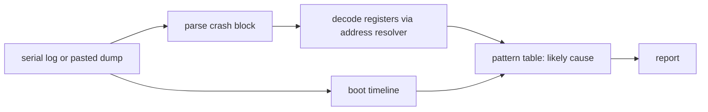

<!-- docs: covers=todo/14-host-tools/TODO-04-crash-decode.md sources=src/kernel/panic.c,src/kernel/wer.c,include/kernel/crashdump.h reviewed=2026-09-30 order=4 -->
# Crash Decoder (crash-decode)

## What is it?

`crash-decode` is a planned host tool that reads a serial log or a pasted crash-screen dump and prints one analysis: the stop code, the faulting function and line, the region the faulting address belongs to, where in boot the crash happened, and a likely cause. None of its four sections has been built. The kernel already writes everything the tool would read, so this page describes those formats and what the tool will add on top.

## How does it work?

**What the kernel writes today.** A kernel panic produces two different text blocks, both from [`src/kernel/panic.c`](../../src/kernel/panic.c):

- **A compact emergency block, on serial only**: `[PANIC] <description>`, an `at <file>` line, then `RIP= CS= ERR=`, `CR2= CR3=`, and two lines of general registers as hexadecimal. An early crash may leave only this.
- **The full block, on the crash screen and mirrored to serial** (every `printk()` line goes to both, see [`src/kernel/printk.c`](../../src/kernel/printk.c)): `Stop code:`, `Description:`, `Source:`, `Error code:`, `RIP:`, `CR2:`, then `--- Register Dump ---` with every general register, RFLAGS, CR2, CR3, CS and SS, and `--- Stack Trace ---` with each frame already symbolised as `#N  address  name+0xoffset`.

At panic time the kernel also tries to save a text dump to `C:\Impossible\System\crashdump.log`. The crash record it preserves is written out as `X:\Crash\last-panic.txt` on the BlackBox partition (or `C:\Impossible\System\Logs\` without BlackBox) only on the next successful boot, so a VM halted at the crash screen has no such file yet, or an older one. A user-mode crash writes a JSON report under `X:\Crash\WER\` ([`src/kernel/wer.c`](../../src/kernel/wer.c)). The minidump layout in [`include/kernel/crashdump.h`](../../include/kernel/crashdump.h) is the planned binary format, covered on [Crash Dump Generation](../kernel/crash-dump-generation.md).

**Planned design.**

1. **Parse.** Find the crash block in a serial log or standard input and extract RIP, CR2, CR3, CS, SS, RFLAGS, the error code, the general registers and any stack addresses; or take them from `--rip`, `--cr2` and `--err`.
2. **Decode.** Hand RIP and each frame to the [address resolver](addr2line.md), CR2 to its region mapper, CS to a privilege level, and flag unusual RFLAGS bits.
3. **Timeline.** Read the boot phase markers and the `Boot complete in` line to say how far boot got and the last POST code before the crash.
4. **Hypothesis.** Match the decoded pattern against a small, extensible table: a user-mode not-present page fault in the program range suggests a page missing its User bit; a double fault suggests stack overflow or a bad IDT.



## What are its interfaces?

| Interface | Status |
| --- | --- |
| Serial `[PANIC]` block | Shipped |
| Full `Stop code:` block with symbolised stack trace, on screen and serial | Shipped |
| `C:\Impossible\System\crashdump.log` at panic time; `X:\Crash\last-panic.txt` on the next boot | Shipped |
| `X:\Crash\WER\` JSON reports for user-mode crashes | Shipped |
| `crash-decode <serial.log>` | Planned in section 1 |
| `crash-decode --rip ... --cr2 ... --err ...` | Planned in section 1 |
| Register decode, timeline, hypotheses | Planned in sections 2 to 4 |

## How do I use it?

Until the tool exists, take the RIP from either block and resolve it by hand:

```bash
grep -n -A6 '\[PANIC\]' build/smoke-test.stripped.log
llvm-addr2line-19 -e build/kernel.exe -f -C <RIP>
# after the next boot, into a fresh directory:
out=build/blackbox-$(date +%Y%m%d-%H%M%S)
bash scripts/tools/read-blackbox.sh build/system-disk.img "$out"
cat "$out"/Crash/last-panic.txt
```

The repository's `diagnose-serial-log` skill is the current structured route: it builds an event model of a serial log and looks for crashes, races, leaks and regressions, with a person or agent confirming each finding. `crash-decode` is meant to be the deterministic, scriptable half of that.

## What is not implemented yet?

- [Serial Log Parser](../../todo/14-host-tools/TODO-04-crash-decode.md#1-serial-log-parser)
- [Register Dump Decoder](../../todo/14-host-tools/TODO-04-crash-decode.md#2-register-dump-decoder), which depends on the [address resolver](addr2line.md)
- [Timeline Extraction](../../todo/14-host-tools/TODO-04-crash-decode.md#3-timeline-extraction)
- [Root Cause Hypothesis Engine](../../todo/14-host-tools/TODO-04-crash-decode.md#4-root-cause-hypothesis-engine)

The roadmap assumes a single dump format with `Stop code:` and `Register Dump` markers. The serial log carries both blocks when the full one renders, and only the compact `[PANIC]` block when the crash is too early, so section 1 has to parse both. The roadmap's timeline section expects `[PHASE0]`-style markers with timestamps; the serial log has `[PHASEn] STEP (0xNNNN)` progress lines without a time, and the per-step times appear only in the boot-step timing block printed late in boot (see [Boot Log Analyzer](serial-analyze.md)), so a crash before that block has step order but no step times.

## How does it compare with Windows 11 and Linux?

Windows writes a minidump and WinDbg's `!analyze -v` names the faulting module, the bug check parameters and a probable cause. Linux prints an oops and `scripts/decode_stacktrace.sh` adds file and line, while `crash` and `kdump` work on full memory dumps. The planned tool sits between the two: it works from the text the OS already prints, with no dump file or debugger, and adds a boot timeline, which neither offers directly.

## See also

- [Crash decoder roadmap](../../todo/14-host-tools/TODO-04-crash-decode.md)
- [Address Resolver](addr2line.md)
- [Panic Screen and Crash Experience](../kernel/panic-screen-crash-experience.md)
- [Crash Dump Generation](../kernel/crash-dump-generation.md)
- [BlackBox Log Extractor](blackbox-extractor.md)
