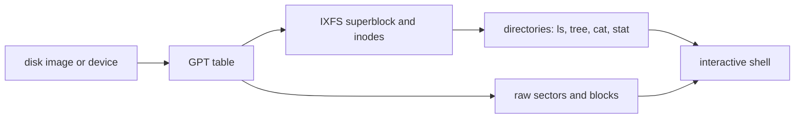

<!-- docs: covers=todo/14-host-tools/TODO-06-disk-inspect.md sources=tools/bootimg/bootimg.py,tools/make-system-disk.c,sdk/src/ixfs-mount reviewed=2026-09-30 order=6 -->
# Disk Image Inspector (disk-inspect)

## What is it?

`disk-inspect` is a planned interactive browser for Impossible OS disk images and drives: the GPT partition table, the IXFS superblock, inodes and their extents, the directory tree, the block bitmap and raw sectors, in the spirit of `fdisk -l` plus `debugfs`. None of its five sections has been built. The partition-table half already exists in the boot-artifact inspector, and the IXFS half would reuse the SDK's IXFS parser once that parser is back in step with the kernel's format.

## How does it work?

**What exists today.**

- `python3 tools/bootimg/bootimg.py inspect <image>` ([`tools/bootimg/bootimg.py`](../../tools/bootimg/bootimg.py)) reads raw, VHD, VHDX, VDI and ISO images and prints every GPT partition with its name, type GUID, detected filesystem, label, size and LBA range, plus signature and manifest status. `--json` gives the same data for scripts. It covers the roadmap's section 1 already.
- [`tools/make-system-disk.c`](../../tools/make-system-disk.c) writes the GPT and records the byte offset of each partition in `build/system-disk.img.info`, which scripts read rather than hard-coding offsets.
- The SDK's IXFS parser in [`sdk/src/ixfs-mount/`](../../sdk/src/ixfs-mount/) reads the superblock, inodes, extents and directories. Its inode layout is out of date (see [IXFS Mount](ixfs-mount.md)), so it cannot yet be the base for inode inspection.

**Planned design.**

1. **GPT table**: header, entries, type GUIDs named (EFI System, Basic Data, IXFS), sizes and filesystems.
2. **IXFS metadata**: superblock fields, used and free inodes, `inode N` with type, size, extents, timestamps and permissions, and a size-against-extents consistency check.
3. **Directory browsing**: `ls`, `tree`, `cat` and `stat` by path.
4. **Raw views**: `hexdump` of file data, `sector LBA count`, `block N` and a visual block bitmap.
5. **Shell**: a `disk-inspect>` prompt with tab completion, history and `help`.



## What are its interfaces?

| Interface | Status |
| --- | --- |
| `bootimg.py inspect <image> [--json]` | Shipped, lists partitions |
| `build/system-disk.img.info` partition offsets | Shipped |
| `ixfs_open`, `ixfs_read_inode`, `ixfs_readdir` in the SDK parser | Shipped, but reads the wrong inode size |
| `disk-inspect <image>` and its commands | Planned in sections 1 to 5 |

## How do I use it?

For the partition table, use the boot-artifact inspector. On the image built on 2026-09-30:

```text
$ python3 tools/bootimg/bootimg.py inspect build/system-disk.img
Partitions:
  [1] EFI System ... fs=fat32 label='NO NAME' size=64 MiB lba=[2048..133119]
  [2] BlackBox ... fs=fat32 label='BLACKBOX' size=128 MiB lba=[133120..395263]
  [3] Impossible OS A ... fs=ixfs label='Impossible OS' size=269 MiB lba=[397312..948223]
  [4] Impossible OS B ... fs=ixfs label='Impossible OS' size=270 MiB lba=[948224..1501183]
  [5] Impossible OS ABMeta ... fs=unknown label='' size=1 MiB lba=[395264..397311]
  [6] Impossible OS Recovery ... fs=fat32 label='RECOVERY' size=34 MiB lba=[1501184..1572829]
```

Type GUIDs are elided here. The build makes the A/B layout, so IXFS is partitions 3 and 4, not 3 alone as the roadmap's example shows. For the FAT32 partitions, `mdir` and `mcopy` from mtools read the volume at its offset (`mdir -i build/system-disk.img@@<offset> ::/`). Raw sectors can be read with `xxd -s <offset> -l 512 build/system-disk.img`.

## What is not implemented yet?

- [GPT Partition Table Parser](../../todo/14-host-tools/TODO-06-disk-inspect.md#1-gpt-partition-table-parser), largely covered by `bootimg.py inspect`; the section should reuse it rather than write a second GPT reader
- [IXFS Superblock + Inode Inspector](../../todo/14-host-tools/TODO-06-disk-inspect.md#2-ixfs-superblock--inode-inspector)
- [Directory Listing](../../todo/14-host-tools/TODO-06-disk-inspect.md#3-directory-listing)
- [Hex Dump and Raw Sector Read](../../todo/14-host-tools/TODO-06-disk-inspect.md#4-hex-dump-and-raw-sector-read)
- [Interactive Shell](../../todo/14-host-tools/TODO-06-disk-inspect.md#5-interactive-shell)

Sections 2 and 3 depend on the shared IXFS parser being resynchronised with the kernel's on-disk format, filed in [the IXFS mount roadmap](../../todo/14-host-tools/TODO-02-ixfs-mount.md#6-resync-the-sdk-parser-with-the-ixfs-v2-on-disk-format). The roadmap's example shows an inline file (`hello.txt ... inline`): the kernel stores up to 48 bytes of a small file in the inode itself (`IXFS_INLINE_MAX` in [`include/kernel/fs/ixfs.h`](../../include/kernel/fs/ixfs.h)), and the inspector's `inode` and `hexdump` views need to show that case rather than an empty extent list.

## How does it compare with Windows 11 and Linux?

On Linux, `fdisk -l` or `sgdisk -p` show the partition table and `debugfs` browses ext4 metadata interactively; Windows offers `diskpart` and `fsutil` for volumes but no NTFS metadata browser. For Impossible OS the partition view already exists in the artifact inspector; the planned tool adds the `debugfs`-style IXFS view that neither host OS can give for this filesystem.

## See also

- [Disk inspector roadmap](../../todo/14-host-tools/TODO-06-disk-inspect.md)
- [Boot Artifacts: Build, Verify, Write](../release/boot-artifacts.md) for `bootimg.py`
- [IXFS Mount](ixfs-mount.md) and [IXFS Consistency Checker](ixfs-fsck.md)
- [IXFS Core Filesystem](../storage/ixfs-core.md)
