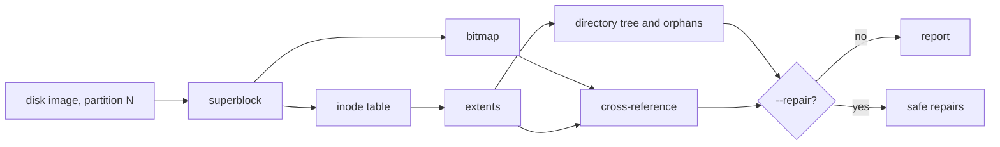

<!-- docs: covers=todo/14-host-tools/TODO-07-ixfs-fsck.md sources=src/kernel/fs/ixfs/ixfs_fsck.c,include/kernel/fs/ixfs.h,sdk/src/ixfs-mount reviewed=2026-09-30 order=7 -->
# IXFS Consistency Checker (ixfs-fsck)

## What is it?

`ixfs-fsck` is a planned host command that checks an IXFS partition inside a disk image, and optionally repairs it, before an image is released or after a crash. None of its seven sections has been built on the host. The checker itself already exists inside the kernel: `ixfs_fsck()` in [`src/kernel/fs/ixfs/ixfs_fsck.c`](../../src/kernel/fs/ixfs/ixfs_fsck.c) runs an 11-pass check with a safe repair subset, although nothing calls it yet.

## How does it work?

**The kernel checker (shipped).** `ixfs_fsck(fix, report)` flushes the write-back cache and then works on raw disk I/O, so it never reads stale cached blocks and a later flush cannot undo a repair. Its passes cover the superblock (magic, version, CRC32C, layout), the inode table, the free-block bitmap, the directory tree, per-block refcounts and the write-ahead journal. Results are tallied in `struct ixfs_fsck_report` in [`include/kernel/fs/ixfs.h`](../../include/kernel/fs/ixfs.h), one counter per error class.

In fix mode it repairs only what it can prove safe: it reconciles the bitmap, corrects the free count and refcounts, frees orphans that have a single owner, clears bad directory entries and replays a journal only after validating it. Cross-linked and snapshot-shared blocks are reported, never freed, and a failed walk of a directory's own inode stops the later repairs. It is not yet safe against read failures, though. An inode the table scan cannot read is skipped, so its blocks never enter the expected-use map and the bitmap reconcile can mark them free; a directory entry whose target inode cannot be read is treated as dangling and cleared; and a snapshot-table block that cannot be read is skipped, leaving the snapshot's blocks out of the map. The source header claims a partial walk disables every freeing pass. The fixes are filed in [section 8 of the recovery roadmap](../../todo/01-boot-platform/TODO-22-recovery-partition.md#8-gate-ixfs-fsck-repairs-on-complete-readable-scans), and a host port must not copy these gaps. The pure validators (`ixfs_fsck_check_superblock`, `ixfs_fsck_reconcile_bitmap`, `ixfs_fsck_journal_entry_valid`) are unit-tested in `test_ixfs_fsck.c`. The owner is [section 3 of the recovery partition roadmap](../../todo/01-boot-platform/TODO-22-recovery-partition.md#3-filesystem-integrity-check).

**The planned host tool.** Six checking passes over an image, printing one status line each: superblock, block bitmap, inode table, extent integrity, directory structure with orphan detection, and a cross-reference of the bitmap against extents; then `--repair` for out-of-bounds extents, orphans (into `/lost+found/`), bitmap rebuilds and the free count, asking before anything destructive unless `--yes` is given.



## What are its interfaces?

| Interface | Status |
| --- | --- |
| `ixfs_fsck(int fix, struct ixfs_fsck_report *report)` | Shipped, kernel |
| `ixfs_fsck_volume()` and the three pure validators | Shipped, kernel |
| A caller (recovery flow, `chkdsk`) | Not wired yet; see [Recovery Partition](../boot/recovery-partition.md) |
| `ixfs-fsck <image> <partition>` | Planned in sections 1 to 6 |
| `ixfs-fsck --repair [--yes]` | Planned in section 7 |

## How do I use it?

There is no host command yet, and no path in the OS runs the kernel checker either; when it runs, it reports to the serial log under the `fsck` category. Its validator tests run with the filesystem suite:

```bash
bash scripts/test.sh SUITE=fs
```

On the host, confirm at least that an IXFS partition is where you expect with `python3 tools/bootimg/bootimg.py inspect build/system-disk.img` (see [Disk Image Inspector](disk-inspect.md)).

## What is not implemented yet?

- [Superblock Validation](../../todo/14-host-tools/TODO-07-ixfs-fsck.md#1-superblock-validation)
- [Block Bitmap Verification](../../todo/14-host-tools/TODO-07-ixfs-fsck.md#2-block-bitmap-verification)
- [Inode Table Scan](../../todo/14-host-tools/TODO-07-ixfs-fsck.md#3-inode-table-scan)
- [Extent Integrity Check](../../todo/14-host-tools/TODO-07-ixfs-fsck.md#4-extent-integrity-check)
- [Directory Structure + Orphan Detection](../../todo/14-host-tools/TODO-07-ixfs-fsck.md#5-directory-structure--orphan-detection)
- [Cross-Reference](../../todo/14-host-tools/TODO-07-ixfs-fsck.md#6-cross-reference)
- [Repair Mode](../../todo/14-host-tools/TODO-07-ixfs-fsck.md#7-repair-mode)

The host roadmap predates the kernel checker and plans its passes from scratch. It omits the checks the kernel already knows are needed (superblock CRC32C, data-block checksums, refcounts, snapshots and the journal), and its repair list would free blocks the kernel deliberately leaves alone. The cheaper and safer design builds the host tool from the kernel's checker logic rather than a second implementation; that reconcile is filed as the first item of [section 1](../../todo/14-host-tools/TODO-07-ixfs-fsck.md#1-superblock-validation). In the kernel itself, large-volume performance and power-fail-atomic repair are open items in the recovery roadmap's section 3.

## How does it compare with Windows 11 and Linux?

Windows runs `chkdsk` against NTFS, online for scans and at boot for repairs; Linux runs `e2fsck` or `fsck.<type>` against an unmounted filesystem and can work on an image file. The kernel checker already follows the `e2fsck` model (idempotent re-run instead of a repair journal). The host tool would add what `e2fsck` gives Linux developers: checking a release image on the build machine before it is ever booted.

## See also

- [IXFS consistency checker roadmap](../../todo/14-host-tools/TODO-07-ixfs-fsck.md)
- [Recovery Partition](../boot/recovery-partition.md)
- [IXFS Advanced Features](../storage/ixfs-advanced.md)
- [IXFS Mount](ixfs-mount.md), whose parser the roadmap planned to share
