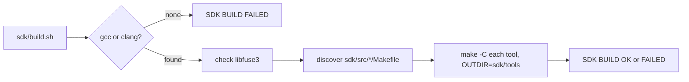

<!-- docs: covers=todo/14-host-tools/TODO-01-sdk-build-system.md sources=sdk/build.sh,sdk/src/ixfs-mount/Makefile,.gitignore reviewed=2026-09-30 order=1 -->
# SDK Build System

## What is it?

`sdk/build.sh` builds the host-side SDK tools: programs that run on the developer's Linux machine and work with Impossible OS formats, such as the IXFS mount tool. It is separate from the kernel build on purpose. The kernel uses the `clang-19 --target=x86_64-elf` cross toolchain through [`scripts/build.sh`](../../scripts/build.sh); SDK tools use the host's own C compiler and host libraries. The first three sections of the roadmap have shipped; section 4, honest skip reporting and a CI build, is open.

## How does it work?

The script runs in four steps, all in [`sdk/build.sh`](../../sdk/build.sh):

1. **Compiler.** It uses `gcc` when present and falls back to `clang`. With neither, it prints `FAIL No C compiler found` and ends with `=== SDK BUILD FAILED ===`.
2. **Dependencies.** It looks for libfuse3 with `pkg-config --exists fuse3`, then `dpkg -s libfuse3-dev`. A missing library is a warning with the install command, not an error.
3. **Discovery.** Every directory under `sdk/src/` that contains a `Makefile` is a tool. Directories without one are skipped silently. The list is sorted so the build order is deterministic.
4. **Build.** Each tool runs `make -C <dir> CC=<compiler> OUTDIR=sdk/tools`, timed individually. On failure the script prints only the lines matching `error:`, `undefined reference`, `fatal error` or `cannot find`, at most 20 of them.



Binaries land in `sdk/tools/`, which is gitignored ([`.gitignore`](../../.gitignore)) and created by the script when missing. Each tool's Makefile decides for itself what to do about a missing dependency: [`sdk/src/ixfs-mount/Makefile`](../../sdk/src/ixfs-mount/Makefile) builds nothing and prints `NOTE: libfuse3-dev not found -- skipping ixfs-mount` when `pkg-config` cannot find fuse3.

## What are its interfaces?

| Interface | Meaning |
| --- | --- |
| `bash sdk/build.sh` | Build every discovered tool (incremental, because each Makefile is) |
| `bash sdk/build.sh clean` | Run `make clean` in every tool directory |
| Last line `=== SDK BUILD OK ===` | Every tool's `make` exited 0 |
| Last line `=== SDK BUILD FAILED ===` | No compiler, or at least one tool failed; exit status 1 |
| `sdk/src/<tool>/Makefile` | The contract for a new tool: honour `CC` and `OUTDIR`, provide `clean` |

## How do I use it?

On the WSL2 development host without libfuse3 installed, a build prints this (colour codes removed):

```text
  Compiler: gcc
  WARN  MISSING: libfuse3-dev -- install with: sudo apt install libfuse3-dev
        Tools requiring libfuse3 may fail to build
  Found 1 SDK tools: ixfs-mount
  [1/1] Building ixfs-mount...  OK  (0.0s)
   SDK BUILD OK  -- 1 tools built in 0.1s
=== SDK BUILD OK ===
```

Install the library with `sudo apt install libfuse3-dev` and run it again to get a real `sdk/tools/ixfs-mount`.

To add a tool, create `sdk/src/<name>/Makefile` with an `all` target that writes `$(OUTDIR)/<name>` and a `clean` target. The next `bash sdk/build.sh` finds it without any edit to the script.

## What is not implemented yet?

- **A skipped tool is reported as built.** The output above says `OK` and `1 tools built` although the Makefile skipped `ixfs-mount` and `sdk/tools/` is still empty, because the script trusts `make`'s exit status. Tracked in [SDK Tools in CI and Honest Skip Reporting](../../todo/14-host-tools/TODO-01-sdk-build-system.md#4-sdk-tools-in-ci-and-honest-skip-reporting).
- **Nothing builds or tests the SDK automatically.** No workflow in `.github/workflows/`, no lint check and no tooling suite runs `sdk/build.sh`, which is how the IXFS mount tool drifted out of step with the kernel's on-disk format unnoticed (see [IXFS Mount](ixfs-mount.md)). Tracked in the same section.
- **Linux only.** There is no Windows build path; the BlackBox extractor roadmap plans a MinGW cross-compile for its own tool in [section 8](../../todo/14-host-tools/TODO-08-blackbox-log-extractor.md#8-windows-build).
- **Only one tool exists.** The other six roadmap tools in this folder are planned, not built.

## How does it compare with Windows 11 and Linux?

Windows SDK tools are built with MSBuild or CMake and Linux tools with make or CMake; both print a compiler log and leave dependency installation to the developer. The SDK script is deliberately smaller: one command, per-tool timing, filtered error lines and an install hint for a missing library, in the same visual style as the kernel build.

## See also

- [SDK Build System roadmap](../../todo/14-host-tools/TODO-01-sdk-build-system.md)
- [IXFS Mount](ixfs-mount.md)
- [Development Tooling](../infrastructure/development-tooling.md)
- [SDK Distribution](../sdk/sdk-distribution.md), the application SDK for programs that run on Impossible OS
