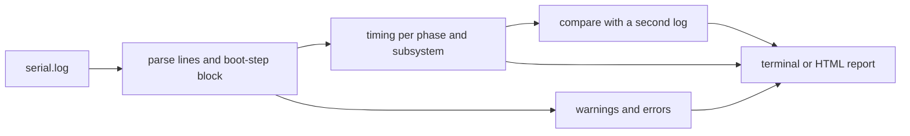

<!-- docs: covers=todo/14-host-tools/TODO-05-serial-analyze.md sources=src/kernel/boot_timing.c,tools/boot-timeline/boot_timeline.py,scripts/test-smoke.sh reviewed=2026-09-30 order=5 -->
# Boot Log Analyzer (serial-analyze)

## What is it?

`serial-analyze` is a planned host tool that reads a serial boot log and reports where the boot time went, which warnings and errors appeared, and what changed between two boots, as terminal text or an HTML report. None of its five sections has been built. Two pieces already cover part of the job: an offline renderer for the kernel's boot-timeline file, and the smoke test's log handling.

## How does it work?

**What the kernel prints today.** Every serial log line from the kernel logger has the same shape, which the tool will parse:

```text
[  4.250] [cpu:0] [ OK ] BOOT: --- Boot step timing (45 steps, base=step0) ---
[  4.250] [cpu:0] [ OK ] BOOT:   [PHASE0] +0ms 0x0011 SERIAL
[  4.260] [cpu:0] [ OK ] BOOT:   [PHASE0] +14ms 0x0026 BOOT_INFO
```

That is a timestamp in seconds, the CPU (absent on the earliest lines), a level tag (`[INFO]` for debug, `[ OK ]` for info, `[WARN]`, `[FAIL]` for errors, or `[CRIT]` for a fatal error that halts the machine), the subsystem and the message. The boot-step block above comes from `boot_timing_print_steps()` in [`src/kernel/boot_timing.c`](../../src/kernel/boot_timing.c): one line per step with its phase, offset from the first step in milliseconds, POST code and name. It is printed once, after the `Boot complete in N.NNNs` line. Earlier, each step also prints a bare `[PHASEn] NAME (0xNNNN)` progress line with no timestamp.

**What exists on the host today.**

- [`tools/boot-timeline/boot_timeline.py`](../../tools/boot-timeline/boot_timeline.py) renders the kernel's `X:\Perf\boot-timeline.json` artifact, not the serial log: `svg` draws a Gantt chart and `trace` writes Chrome Trace Event JSON for `chrome://tracing` or Perfetto. Its format is documented in the [boot timeline schema](../boot/boot-timeline-schema.md).
- [`scripts/test-smoke.sh`](../../scripts/test-smoke.sh) strips ANSI colour codes into `build/smoke-test.stripped.log` and checks the log for its pass and fail markers.
- The repository's `diagnose-serial-log` skill reads a log with an agent, looking for crashes, races, leaks, policy breaches and regressions against a baseline log.

**Planned design.**

1. **Parse** each line into timestamp, level, subsystem and message; pick out phase transitions, POST codes and the boot-step block; strip ANSI codes from VirtualBox logs.
2. **Timing**: totals per phase, the five slowest subsystems, anything over 2 seconds, and the timer calibration tier.
3. **Highlight** warnings and errors, grouped as hardware, firmware, driver or subsystem, with counts.
4. **Compare** two logs: per-phase and per-subsystem deltas (flagging slowdowns over 20%), new warnings, and subsystems that disappeared.
5. **Report**: an ASCII waterfall in the terminal and an HTML report with `--html`.



## What are its interfaces?

| Interface | Status |
| --- | --- |
| Serial line format and the boot-step timing block | Shipped |
| `boot_timeline.py svg` and `trace` on `boot-timeline.json` | Shipped |
| `build/smoke-test.stripped.log` from the smoke test | Shipped |
| `serial-analyze <log>` | Planned in sections 1 to 3 |
| `serial-analyze --compare old.log new.log` | Planned in section 4 |
| `serial-analyze --html report.html <log>` | Planned in section 5 |

## How do I use it?

Until the tool exists, the same questions can be answered with standard tools:

```bash
bash scripts/test-smoke.sh
grep -A50 'Boot step timing' build/smoke-test.stripped.log
grep -E '\[(WARN|FAIL|CRIT)\]' build/smoke-test.stripped.log
python3 tools/boot-timeline/boot_timeline.py svg boot-timeline.json -o boot.svg
```

In the smoke run of 2026-09-30 the stripped log had 421 `[ OK ]`, 130 `[INFO]`, 35 `[WARN]` and 1 `[FAIL]` line; the `[FAIL]` is a boot-time budget report, not a crash. The `boot-timeline.json` input comes from the BlackBox partition (see [BlackBox Log Extractor](blackbox-extractor.md)).

## What is not implemented yet?

- [Log Parser](../../todo/14-host-tools/TODO-05-serial-analyze.md#1-log-parser)
- [Timing Analysis](../../todo/14-host-tools/TODO-05-serial-analyze.md#2-timing-analysis)
- [Warning/Error Highlighter](../../todo/14-host-tools/TODO-05-serial-analyze.md#3-warningerror-highlighter)
- [Boot Comparison](../../todo/14-host-tools/TODO-05-serial-analyze.md#4-boot-comparison)
- [HTML Report](../../todo/14-host-tools/TODO-05-serial-analyze.md#5-html-report)

The roadmap's example names level tags `OK`, `WARN`, `INFO` and `ERROR`; the kernel's error tag is `[FAIL]`, and a fatal error prints `[CRIT]` just before the machine halts, which the smoke test treats as a failure on sight. It also describes the timing block as `BOOT: [PHASE0] +Nms`, which matches the lines above apart from the leading timestamp and CPU. Its per-subsystem timings and boot comparison overlap the shipped timeline renderer and the planned `blackbox boot --compare` in the [BlackBox extractor roadmap](../../todo/14-host-tools/TODO-08-blackbox-log-extractor.md#6-blackbox-boot----show-boot-timeline-from-json), which works from the same data in JSON form; building one comparison engine for both is the cheaper route.

## How does it compare with Windows 11 and Linux?

Windows records boot performance with the Windows Performance Recorder and shows it in Windows Performance Analyzer; Linux has `systemd-analyze blame`, `critical-chain` and `plot`, and `dmesg` with levels. Both work from structured data the OS records, which is what the timeline renderer already does here. `serial-analyze` adds analysis of the plain serial text, which is the only record left when a boot never reaches the disk.

## See also

- [Boot log analyzer roadmap](../../todo/14-host-tools/TODO-05-serial-analyze.md)
- [Boot Timeline Schema](../boot/boot-timeline-schema.md)
- [Boot Performance and Health Observability](../boot/boot-performance-health.md)
- [Serial Log Cleanliness](../kernel/serial-log-cleanliness.md)
- [Crash Decoder](crash-decode.md)
