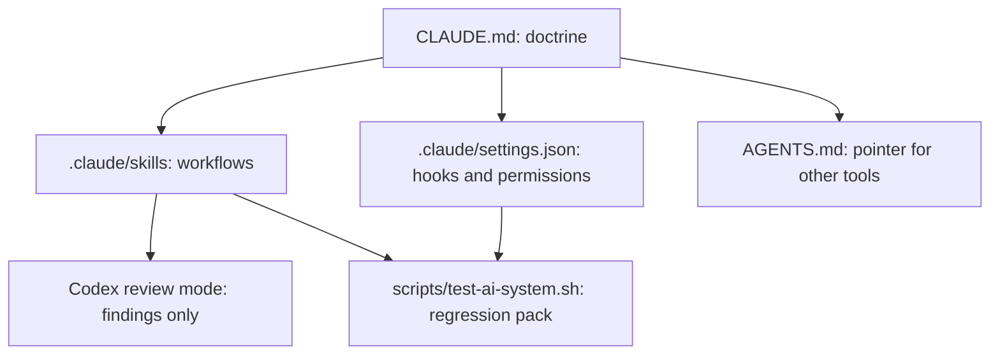

<!-- docs: covers=todo/00-infrastructure/TODO-02-ai-development-system.md sources=CLAUDE.md,AGENTS.md,.claude/skills/README.md,.claude/skills/TEMPLATE.md,scripts/test-ai-system.sh reviewed=2026-09-29 order=3 -->
# AI Development System

## What is it?

The AI development system is the set of files that tells Claude Code how to work in this repository: the doctrine, the skills, the harness hooks, the reviewer contract and the boundary on autonomous agents. It exists so that AI-assisted work follows one written rulebook with one owner per rule, instead of overlapping instructions that contradict each other. Claude Code is the only implementation tool; Codex is used only as a read-only reviewer. The detailed ownership map is [AI Development System reference](ai-system.md).

## How does it work?

Each kind of rule lives in exactly one place, and a fixed authority order decides conflicts.



- **Doctrine.** [`CLAUDE.md`](../../CLAUDE.md) holds the project rules and wins any conflict with a skill, a hook or a tool-local file.
- **Workflows.** Skills under [`.claude/skills/`](../../.claude/skills/) each own one workflow (implement a section, review it, validate a roadmap file). New skills start from [`TEMPLATE.md`](../../.claude/skills/TEMPLATE.md) and are listed in the [skill catalog](../../.claude/skills/README.md). There are no parallel skill trees for other tools.
- **Harness policy.** [`.claude/settings.json`](../../.claude/settings.json) wires the hooks that remind or block at tool-call time, plus the shared permission list. Personal overrides go in the gitignored `.claude/settings.local.json`.
- **Reviewer contract.** Codex reviews diffs and returns findings; it never edits the tree. Every finding is verified at `file:line` and classified Fix, Reject or Accept before anything changes.
- **Cross-tool pointer.** [`AGENTS.md`](../../AGENTS.md) follows the AGENTS.md convention and points other tools at `CLAUDE.md` without restating any rule.
- **Regression pack.** [`scripts/test-ai-system.sh`](../../scripts/test-ai-system.sh) checks that the catalog, the authority order, the commit policy and the agent boundary still match the doctrine.

Git hooks in `.githooks/` are a separate layer owned by the [developer tooling stack](developer-tooling-stack.md).

## What are its interfaces?

| File or command | Purpose |
| --------------- | ------- |
| [`CLAUDE.md`](../../CLAUDE.md) | Project doctrine and mandatory skill triggers |
| [`.claude/skills/README.md`](../../.claude/skills/README.md) | Catalog of every live skill |
| [`.claude/settings.json`](../../.claude/settings.json) | Hook wiring and shared permissions |
| [`.claude/hooks/MANIFEST.md`](../../.claude/hooks/MANIFEST.md) | One row per harness hook |
| [`.claude/agents/`](../../.claude/agents/) | Read-only specialist agents the skills delegate to |
| [`scripts/codex-dispatch.sh`](../../scripts/codex-dispatch.sh) | The single-argument Codex review dispatch wrapper |
| `make test-ai-system` | Runs the AI workflow regression pack |

## How do I use it?

Run the regression pack after changing a skill, a hook or the doctrine:

```bash
bash scripts/test-ai-system.sh
# ==== AI WORKFLOW REGRESSION PASS ====
#      79 checks passed, 0 failed
```

That result was measured on 2026-09-28. To add or retire a skill, follow the [Skill Authoring Lifecycle](skill-authoring.md): a new skill needs a row in both the `CLAUDE.md` table and the catalog, or the pack fails. To request a review, dispatch through the wrapper with the review kind as a literal first token:

```bash
bash scripts/codex-dispatch.sh '[review-kind: adversarial] <todo-path> section <N> <prompt>'
```

Commits carry no AI-attribution trailer; the reasoning is in the AI-Assisted Commit Policy in [`CONTRIBUTING.md`](../../CONTRIBUTING.md).

## What is not implemented yet?

Nothing is open in this roadmap file: all nine sections have shipped. Later hook and automation work (new hook codes, the Codex invocation guard, skill-step telemetry) is owned by [Automation Hardening](automation-hardening.md).

## How does it compare with Windows 11 and Linux?

Windows projects on GitHub use `.github/copilot-instructions.md` and chat modes for repo instructions; the Linux kernel added an `Assisted-by:` commit trailer in December 2025, and AGENTS.md is an emerging cross-tool convention. Neither ecosystem commonly defines a reviewer contract, a formal boundary on autonomous agents or a regression suite for the AI workflow itself. This repository has all three, and deliberately uses a zero-trailer commit policy instead of the kernel's trailer.

## See also

- [AI Development System roadmap](../../todo/00-infrastructure/TODO-02-ai-development-system.md)
- [AI Development System reference](ai-system.md): authority hierarchy, hook routing matrix, reviewer contract, agent boundary
- [Skill Authoring Lifecycle](skill-authoring.md)
- [Automation Hardening](automation-hardening.md)
