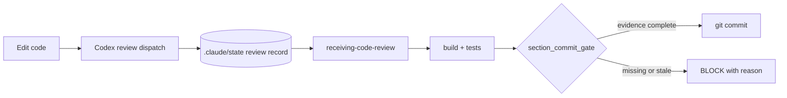

<!-- docs: covers=todo/00-infrastructure/TODO-08-automation-hardening.md sources=.claude/hooks/MANIFEST.md,scripts/audit-hooks.sh,scripts/audit-ai-system.sh,.claude/hooks/section_commit_gate.py,.claude/hooks/receiving_review_required.py,.claude/hooks/codex_model_flag_block.py reviewed=2026-09-29 order=9 -->
# Automation Hardening

## What is it?

Automation hardening turns the repository's AI workflow rules from reminders into gates. Where a hook once printed "remember to run the review", it now refuses the commit until the review ran, was received, and still matches the code being committed. The same work wires both MCP servers into Codex, stops Claude from overriding Codex's model settings, and adds audits that fail when the hook set or the cross-tool configuration drifts from its documentation.

## How does it work?

Claude Code runs hook scripts from [`.claude/hooks/`](../../.claude/hooks/) before and after tool calls, as wired in [`.claude/settings.json`](../../.claude/settings.json). A hook that blocks exits with status 2 and a message naming what is missing. Review evidence is recorded in state files under `.claude/state/` (gitignored), so a later gate can check that an earlier step happened.



- **Codex invocation policy.** [`codex_model_flag_block.py`](../../.claude/hooks/codex_model_flag_block.py) refuses any Codex dispatch that passes a model or effort flag; the user sets those centrally. See [Codex Invocation Policy](codex-invocation-policy.md).
- **Review reception gate.** [`receiving_review_required.py`](../../.claude/hooks/receiving_review_required.py) blocks further edits after a Codex review until its findings have been received and classified.
- **Section commit gate.** [`section_commit_gate.py`](../../.claude/hooks/section_commit_gate.py) refuses a section-ship commit without a fresh build and reviews bound to the staged content.
- **Step telemetry.** Skill steps are recorded as they happen and survive context compaction, so a skill cannot claim a step it never ran.
- **Content lints.** [`scripts/lint.sh`](../../scripts/lint.sh) flags tautological tests, stubs behind a completion stamp, and roadmap sections whose stamps or OS Comparison rows are incomplete.
- **Audits.** [`scripts/audit-hooks.sh`](../../scripts/audit-hooks.sh) checks every wired hook against [`MANIFEST.md`](../../.claude/hooks/MANIFEST.md), and [`scripts/audit-ai-system.sh`](../../scripts/audit-ai-system.sh) checks the Claude and Codex configurations against each other.

## What are its interfaces?

| Interface | Purpose |
| --------- | ------- |
| [`.claude/hooks/MANIFEST.md`](../../.claude/hooks/MANIFEST.md) | One row per hook: event, matcher, purpose and whether it blocks |
| [Hook Message Codes](hook-codes.md) | What each block code means and how to clear it |
| `SKIP_REVIEW_HOOK=1` with `SKIP_REVIEW_HOOK_REASON="..."` | The logged opt-out for a legitimate false positive (revert, stamp-only commit) |
| `bash scripts/audit-hooks.sh` | Hook wiring versus the manifest |
| `bash scripts/audit-ai-system.sh` | Cross-tool configuration drift |
| [`scripts/codex-dispatch.sh`](../../scripts/codex-dispatch.sh) | The review dispatch shape the gates recognise |

Opt-outs are recorded in `.claude/state/skip-log.jsonl`, and using one resets the review record so it cannot be reused.

## How do I use it?

Run both audits after adding or changing a hook; the commit hook also runs the first automatically when a commit touches `.claude/hooks/` or `.claude/settings.json`:

```bash
bash scripts/audit-hooks.sh      # audit-hooks.sh: PASS (no drift)
bash scripts/audit-ai-system.sh  # audit-ai-system.sh: PASS (7/7 checks)
```

Both outputs were measured on 2026-09-28, when `.claude/hooks/` held 91 Python files, helper modules included. When a gate blocks, read its code in [Hook Message Codes](hook-codes.md) and supply the missing evidence rather than opting out. To decide what to do with a review finding, follow [Triage Codex Finding](triage-codex-finding.md).

## What is not implemented yet?

- **Codex MCP in non-interactive runs.** The servers are configured for Codex, but every MCP call from a non-interactive Codex path is cancelled by an upstream Codex bug: [Codex MCP Wiring](../../todo/00-infrastructure/TODO-08-automation-hardening.md#1-codex-mcp-wiring--cross-config-drift-validator).
- **Stronger review binding.** The reception gate expires on a one-hour timer rather than on a HEAD or tree change, and findings are not parsed into structured records: [receiving-code-review Hard Gate](../../todo/00-infrastructure/TODO-08-automation-hardening.md#3-receiving-code-review-hard-gate-state-file--post-codex-hook-block).
- **Per-section review state.** Review records are keyed per file, not per section, pending an operator decision: [Four-Dispatch Enforcement](../../todo/00-infrastructure/TODO-08-automation-hardening.md#5-review-todo-section-four-dispatch-enforcement).
- **Shell grammar.** Gate exemptions split commands with a hand-written walk that fails closed on some constructs; replacing it with a real shell grammar is operator-gated: [Grammar-Accurate Shell Segmentation](../../todo/00-infrastructure/TODO-08-automation-hardening.md#32-grammar-accurate-shell-segmentation-for-the-gate-exemptions).

## How does it compare with Windows 11 and Linux?

Neither Windows nor Linux development has an equivalent, because neither is built around an AI agent working through hooks. The closest analogues are CI checks and linters that run after the fact; the gates here run at the moment of the edit or commit and refuse it with a reason.

## See also

- [Automation Hardening roadmap](../../todo/00-infrastructure/TODO-08-automation-hardening.md)
- [AI Development System](ai-development-system.md)
- [Hook Message Codes](hook-codes.md)
- [Codex Invocation Policy](codex-invocation-policy.md)
- [Superpowers Plugin Policy](superpowers-policy.md)
- [MCP Usage](mcp-usage.md)
