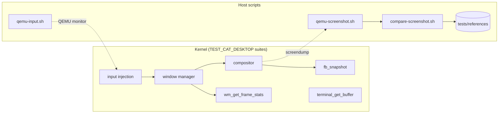

<!-- docs: covers=todo/00-infrastructure/TODO-05-desktop-ui-test-framework.md sources=include/kernel/drivers/framebuffer.h,include/desktop/wm.h,include/desktop/terminal.h,scripts/test-desktop.sh,scripts/compare-screenshot.sh,scripts/test-visual-regression.sh reviewed=2026-09-28 order=6 -->
# Desktop and UI Test Framework

## What is it?

The desktop and UI test framework tests the graphical desktop automatically: it captures the screen, injects keyboard and mouse input, reads back terminal text and window-manager state, and compares screenshots against reference images. It replaces "boot it, look at the screen, move the mouse" with checks that run in CI: today they catch a black or unrendered desktop and exercise the input, terminal and window-manager APIs in isolation, while end-to-end interaction tests against a running shell are still planned.

## How does it work?

There are two halves. Kernel-side hooks let unit tests in the `desktop` category drive the real input path and inspect the result. Host-side scripts drive a running QEMU through its monitor and judge what it displays.



- **Capture.** `fb_snapshot()` copies the back buffer as tightly packed 32-bit pixels in the native GOP channel order (BGRX on shipping hardware, RGBX also accepted), with no alpha guarantee; treat the bytes as raw framebuffer data, as the [header](../../include/kernel/drivers/framebuffer.h) says. It works on any platform, including bare metal. On the host, [`qemu-screenshot.sh`](../../scripts/qemu-screenshot.sh) uses QEMU's `screendump` and converts the result to PNG.
- **Input.** Test helpers wrap the real keyboard and mouse injection points, so a synthetic key press travels the same path a hardware interrupt would. [`qemu-input.sh`](../../scripts/qemu-input.sh) sends the same events from the host.
- **Readback.** Terminal text is read from the terminal's cell buffer rather than by OCR, and the window manager reports window count, focus and geometry.
- **Frame timing.** `wm_get_frame_stats()` returns presented, late and dropped frame counters under a seqlock, so a test can assert that rendering kept up.
- **Determinism.** A headless compositor mode (`compositor=headless` in `boot.conf`) lets a test step exactly N frames without real VSYNC; it is refused on bare metal. Input can be recorded to JSONL and replayed, including Unicode and IME text.
- **Isolation.** The runner calls `test_desktop_reset()` before every desktop suite, so one test's windows and input state cannot leak into the next.

## What are its interfaces?

| Interface | Purpose |
| --------- | ------- |
| `fb_snapshot()`, `fb_snapshot_size()` | Kernel-side screen capture ([`framebuffer.h`](../../include/kernel/drivers/framebuffer.h)) |
| `wm_get_window_count()`, `wm_get_focused_window()`, `wm_get_window_rect()` | Window-manager state ([`wm.h`](../../include/desktop/wm.h)) |
| `wm_get_frame_stats()` | Frame timing and drop counters ([`wm.h`](../../include/desktop/wm.h)) |
| `terminal_get_buffer()`, `terminal_buffer_contains()` | Terminal text readback ([`terminal.h`](../../include/desktop/terminal.h)) |
| `input_record_begin()`, `input_replay_from_jsonl()` | Input record and replay ([`input_record.h`](../../include/kernel/test/input_record.h)) |
| `test_desktop_reset()` | Per-suite isolation ([`test_desktop_reset.h`](../../include/kernel/test/test_desktop_reset.h)) |
| [`scripts/test-desktop.sh`](../../scripts/test-desktop.sh) | Boot, capture, and check the screen is rendered |
| [`scripts/compare-screenshot.sh`](../../scripts/compare-screenshot.sh) | Pixel, SSIM or SSIMULACRA2 comparison, plus region needles through [`needle-compare.py`](../../scripts/needle-compare.py) |
| [`scripts/test-visual-regression.sh`](../../scripts/test-visual-regression.sh) | The visual regression suite CI runs |

## How do I use it?

```bash
make test-desktop                  # kernel-side desktop suites (bash scripts/test.sh SUITE=desktop)
bash scripts/test-desktop.sh       # smoke test: "Desktop smoke test: PASS (rendered, N% non-black)"
make test-visual                   # compare live captures against tests/references/
make update-ui-refs                # re-seed the references from a live boot, then review and commit
```

The repository does not yet commit reference images (`tests/references/` holds only its README), so `make test-visual` reports each scenario as ungated and still exits 0 until reviewed references are seeded and committed. A comparison prints `Visual match: <pct>% identical (threshold: <T>%)` on success and exits 5 with `Visual MISMATCH` on failure. In CI, [`visual-regression.yml`](../../.github/workflows/visual-regression.yml) runs the suite and uploads the diff images when it fails. Live suite counts for [`test_desktop.c`](../../src/kernel/test/test_desktop.c) are on the [Kernel Test Coverage](../test-coverage/coverage.md) page.

## What is not implemented yet?

- **Multi-monitor and DPI matrix.** The per-output snapshot API exists, but only one output is available until a multi-output virtio-gpu driver lands, so most matrix cells skip: [Multi-Monitor and DPI Scaling Test Matrix](../../todo/00-infrastructure/TODO-05-desktop-ui-test-framework.md#13-multi-monitor-and-dpi-scaling-test-matrix).
- **WCAG sweep.** `make test-wcag` runs a scaffold that reports a pending result until the UI automation tree provider exists: [WCAG Sweep Over Automation Tree](../../todo/00-infrastructure/TODO-05-desktop-ui-test-framework.md#14-wcag-sweep-over-automation-tree).
- **Live interaction.** Desktop suites run in the kernel test phase, before the shell starts, so the terminal `dir` roundtrip test synthesises the shell's output instead of driving the real `cmd.exe`. A late-phase harness that runs after desktop init is planned in the [Desktop Test Late-Phase Harness](../../todo/09-desktop-shell/TODO-14-desktop-test-late-phase-harness.md#1-post-desktop-init-test-harness), with failure capture ([section 2](../../todo/09-desktop-shell/TODO-14-desktop-test-late-phase-harness.md#2-failure-capture-hook-and-artifact-bundle)) and lock-safe snapshots of the framebuffer and terminal ([section 4](../../todo/09-desktop-shell/TODO-14-desktop-test-late-phase-harness.md#4-snapshot-time-read-side-sync)).
- **Visual references.** No reference screenshots are committed yet, so visual regression is advisory: the suite skips every scenario without a reference and passes. Seeding them is `make update-ui-refs` plus a reviewed commit.
- Host-side capture and input use the QEMU monitor, so they do not work on VirtualBox or bare metal; the kernel-side hooks do.

## How does it compare with Windows 11 and Linux?

Windows 11 has UI Automation and `DwmGetCompositionTimingInfo`, and Linux distributions use openQA needles and libinput record and replay. Pixel-level visual regression wired into public CI (advisory here until references are committed), perceptual diffing with SSIMULACRA2, and a headless compositor with a stepped clock are not standard in either. This framework has those, while multi-monitor and WCAG coverage are still partial.

## See also

- [Desktop and UI Test Framework roadmap](../../todo/00-infrastructure/TODO-05-desktop-ui-test-framework.md)
- [Kernel Test Harness](kernel-test-harness.md): the runner these suites use
- [Shell Specification](../design/shell.md): the reference the screenshots are judged against
