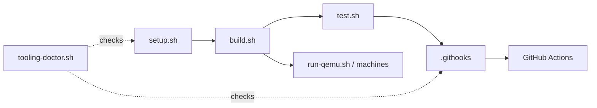

<!-- docs: covers=todo/00-infrastructure/TODO-01-developer-tooling-stack.md sources=scripts/setup.sh,scripts/build.sh,scripts/test.sh,scripts/lint.sh,scripts/tooling-doctor.sh,scripts/install-hooks.sh reviewed=2026-09-30T14:20 order=2 -->
# Developer Tooling Stack

## What is it?

The developer tooling stack is the set of host-side scripts that set up a machine, build the image, run it, test it and gate commits, all behind one contract. It exists so that a laptop, the devcontainer and GitHub Actions run the same commands with the same flags and write the same logs, instead of each drifting its own way. This page is the overview; the full reference is [Development Tooling](development-tooling.md), and the launcher catalogue is the [Machine Matrix](machine-matrix.md).

## How does it work?

Every task goes through a small number of wrapper scripts. Each wrapper owns its log file and its exit code, so a caller (a person, a git hook or a CI job) only has to read one line to know the outcome.



- **Bootstrap.** [`scripts/setup.sh`](../../scripts/setup.sh) installs the toolchain through [`scripts/setup-deps.sh`](../../scripts/setup-deps.sh) and, with `--verify`, fails closed when a required tool is missing or older than its version floor.
- **Wrappers.** [`scripts/build.sh`](../../scripts/build.sh), [`scripts/test.sh`](../../scripts/test.sh), [`scripts/lint.sh`](../../scripts/lint.sh), [`scripts/run-qemu.sh`](../../scripts/run-qemu.sh) and [`scripts/debug.sh`](../../scripts/debug.sh) are the five canonical entry points. Each answers `--help`. Raw `make` is not the supported interface.
- **Launchers.** [`scripts/machines/`](../../scripts/machines/) holds one launcher per hypervisor and scenario (KVM, TCG, WHPX, VirtualBox, storage, filesystem, Secure Boot, bare metal), all taking the same `-ExtraArgs` surface.
- **Hooks.** [`scripts/install-hooks.sh`](../../scripts/install-hooks.sh) points git at the tracked [`.githooks/`](../../.githooks/) directory: pre-commit lint and post-commit bookkeeping are always on, and the build and test pre-push gate is opt-in.
- **Boot assertions.** [`tools/post16-manifest/generate.sh`](../../tools/post16-manifest/generate.sh) turns the `POST16_*` boot-phase codes into a manifest, so the smoke test asserts codes rather than fragile log strings.
- **Health.** [`scripts/tooling-doctor.sh`](../../scripts/tooling-doctor.sh) is a read-only health check of the whole stack, and [`scripts/test-tooling.sh`](../../scripts/test-tooling.sh) is the regression pack that tests the scripts themselves.

## What are its interfaces?

| Command | Purpose |
| ------- | ------- |
| `bash scripts/setup.sh [--verify\|--versions\|--check-versions]` | Install dependencies; verify presence and version floors |
| `bash scripts/build.sh [clean\|run]` | Incremental or clean build, or build and boot in QEMU |
| `bash scripts/test.sh [SUITE=<cat>] [QUIET=1]` | Kernel and user-mode tests, optionally one category |
| `bash scripts/test-smoke.sh` / `bash scripts/test-smoke-matrix.sh` | Boot to the command prompt on one, or four, QEMU configurations |
| `bash scripts/lint.sh` | Repository lint, the same checks the pre-commit hook runs |
| `bash scripts/install-hooks.sh [--status\|--with-pre-push\|--remove]` | Manage the tracked git hooks |
| `bash scripts/tooling-doctor.sh [--quiet\|--json]` | One-command health check |

The GitHub workflows in [`.github/workflows/`](../../.github/workflows/) call the same wrappers; [GitHub Setup](github-setup.md) documents each workflow.

## How do I use it?

On a fresh host:

```bash
bash scripts/setup.sh            # install the toolchain
bash scripts/setup.sh --verify   # prints "All required tools meet their minimum version floors."
bash scripts/install-hooks.sh    # enable the tracked hooks
bash scripts/build.sh            # tail -1 build/build.log shows "=== BUILD OK ==="
bash scripts/test.sh QUIET=1     # summary line only
```

To check that the stack itself is healthy:

```bash
bash scripts/tooling-doctor.sh --quiet
# tooling-doctor: HEALTHY (31 checks, 0 warning(s))
```

That output was measured on 2026-09-28. Before pushing, `CI_PARITY=1 bash scripts/test.sh` runs the suite under the same QEMU package and TCG engine that CI uses; the pre-push hook enforces it.

## What is not implemented yet?

- The root `Makefile` defines `run-test` and `run-debug` twice, so `make` prints overriding-recipe warnings. Reconciling them, and a lint check that stops the class returning, is parked in [Duplicate-Recipe Sweep in the Root Makefile](../../todo/00-infrastructure/TODO-01-developer-tooling-stack.md#13-duplicate-recipe-sweep-in-the-root-makefile) because the Makefile is operator-only surface for the unattended runner.

Everything else in the roadmap file has shipped.

## How does it compare with Windows 11 and Linux?

Mature Windows and Linux projects commonly have build wrappers and CI policy, and Linux projects often ship devcontainers and managed hooks. Driver and kernel setups on Windows (WDK, HLK) are heavier and less scripted. What is rare in either world is a one-command tooling doctor, lint gates that stop cross-reference drift, and boot smoke tests that assert phase codes instead of matching log strings; those are the parts this stack adds.

## See also

- [Developer Tooling Stack roadmap](../../todo/00-infrastructure/TODO-01-developer-tooling-stack.md)
- [Development Tooling](development-tooling.md): the full reference, including host profiles and the local CI hooks
- [Machine Matrix](machine-matrix.md): every launcher and debug profile
- [GitHub Setup](github-setup.md): workflows and repository settings
