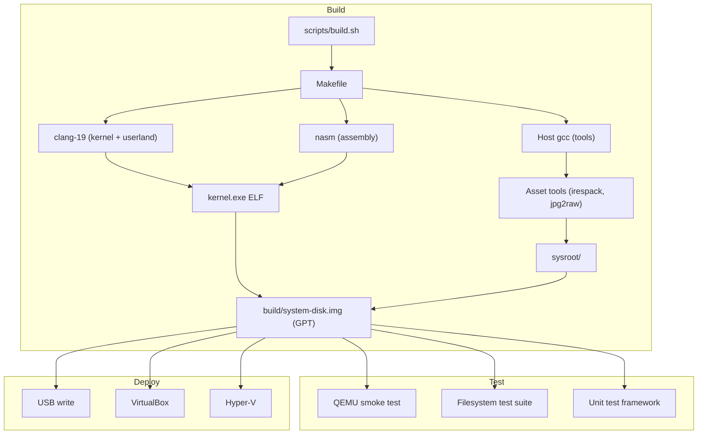
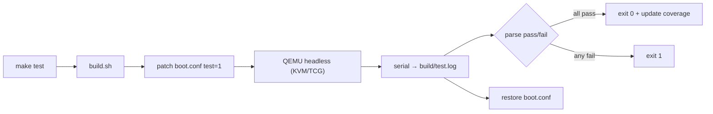
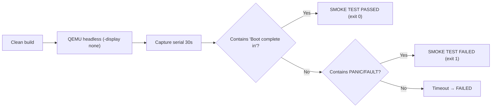
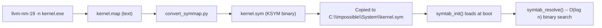

# Development Tooling & Automation

> Complete build system, test framework, asset pipeline, and development utilities for Impossible OS.

This page is the canonical reference for the repo-local developer tooling contract. `README.md` and `CLAUDE.md` link here instead of restating setup commands. Roadmap ownership for this contract lives in the [Developer Tooling Stack TODO](../../todo/00-infrastructure/TODO-01-developer-tooling-stack.md) (file-path link; section anchors inside that TODO may renumber as the plan evolves).

## Host Bootstrap Contract

The one-command setup contract for a new development machine. Parity work extends this with host profiles, wrappers, hooks, CI alignment, and a self-diagnosing doctor (see the [Scope Boundary](#scope-boundary) table below for the current owners).

### Canonical Commands

| Command                             | Purpose                                                       |
| ----------------------------------- | ------------------------------------------------------------- |
| `bash scripts/setup.sh`             | Install distro packages, verify required tools, verification build. |
| `bash scripts/setup.sh --verify`    | Read-only sentinel check. No install, no build. Safe to re-run. |
| `bash scripts/setup.sh --help`      | Print usage, required tools, supported distros, and scope boundary. |
| `bash scripts/setup-deps.sh`        | Dependency installer only (called by `setup.sh`; idempotent). |

### Supported Distros

`scripts/setup-deps.sh` detects the distro from `/etc/os-release` and installs the matching package set:

| Family        | Examples                               | Package manager | Out-of-the-box? |
| ------------- | -------------------------------------- | --------------- | --------------- |
| Debian-based  | Ubuntu, Debian, Linux Mint, Pop!_OS    | `apt-get`       | Yes             |
| Fedora-based  | Fedora, RHEL, CentOS, Rocky, Alma      | `dnf`           | Manual shim     |
| Arch-based    | Arch, Manjaro, EndeavourOS             | `pacman`        | Manual shim     |

Ubuntu/Debian is the out-of-the-box reference today because the Makefile hardcodes version-suffixed LLVM binaries (`clang-19`, `ld.lld-19`, `llvm-objcopy-19`, `llvm-ar-19`, `llvm-nm-19`) and the Debian-style `/usr/share/OVMF/OVMF_CODE_4M.fd` / `OVMF_VARS_4M.fd` paths. Fedora and Arch detection runs, but the default packages in those distros install unversioned LLVM binaries and OVMF at `/usr/share/OVMF/OVMF_CODE.fd` -- `bash scripts/setup.sh --verify` will flag the mismatch until a symlink/shim is added. The full support-tier matrix (fully supported vs. best-effort vs. unsupported) is documented in [Supported Host Profiles and Reproducible Environments](#supported-host-profiles-and-reproducible-environments) below.

Unsupported distros: `setup-deps.sh` exits with the required package list printed so the operator can install manually.

### Required Tools (Sentinel Set)

`bash scripts/setup.sh --verify` asserts each of these is reachable. Every entry maps 1:1 to a Makefile command or path; keeping the sentinel list authoritative prevents doc/script drift.

| Sentinel                                  | Source (Debian package) | Makefile consumer                        |
| ----------------------------------------- | ----------------------- | ---------------------------------------- |
| `clang-19`                                | `clang-19`              | `CC := clang-19`                         |
| `ld.lld-19`                               | `lld-19`                | `LD := ld.lld-19`                        |
| `llvm-objcopy-19`                         | `llvm-19`               | `OBJCOPY := llvm-objcopy-19`             |
| `llvm-ar-19`                              | `llvm-19`               | `AR := llvm-ar-19` (userland archives)   |
| `llvm-nm-19`                              | `llvm-19`               | `kernel.map` generation (Makefile L187)  |
| `nasm`                                    | `nasm`                  | `AS := nasm`                             |
| `gcc`                                     | `build-essential`       | `HOST_CC := gcc` (builds irespack, jpg2raw, mkfs-ixfs host tools) |
| `python3`                                 | `python3`               | Asset pipeline (`validate-assets.py`, `convert_symmap.py`, `convert_icon.py`, `convert_bsod_icon.py`, `convert_boot_font.py`) |
| `qemu-system-x86_64`                      | `qemu-system-x86`       | `QEMU := qemu-system-x86_64`             |
| `mcopy` (mtools)                          | `mtools`                | FAT image population (EFI + logs parts)  |
| `mmd` (mtools)                            | `mtools`                | BlackBox FAT directory creation (Makefile L391-L392) |
| `mkfs.fat` (dosfstools)                   | `dosfstools`            | FAT32 partition formatting               |
| `/usr/share/OVMF/OVMF_CODE_4M.fd`         | `ovmf`                  | `OVMF_CODE := /usr/share/OVMF/OVMF_CODE_4M.fd` |
| `/usr/share/OVMF/OVMF_VARS_4M.fd`         | `ovmf`                  | `OVMF_VARS := /usr/share/OVMF/OVMF_VARS_4M.fd` |

The OVMF paths are checked as exact file paths, not a fallback set, because the Makefile hardcodes these filenames. Fedora/Arch install OVMF at a different path; the [Fedora / Arch Shim Procedure](#fedora--arch-shim-procedure) section below documents the symlink step needed to pass `--verify`.

### Optional Tools

Installed by `setup-deps.sh` for full developer experience but not required for a clean build:

| Tool             | Purpose                                                |
| ---------------- | ------------------------------------------------------ |
| `bear`           | Generates `compile_commands.json` for clangd intel.    |
| `clangd-19`      | Editor LSP for C intelligence.                         |
| `cppcheck`       | Static analysis.                                       |
| `python3-pil`    | Asset pipeline JPEG decode (optional).                 |
| `xorriso`        | Legacy ISO image path (retained for compatibility).    |
| `parted`         | Partition table utilities.                             |

### Idempotence

Both scripts are re-run safe:

- `setup-deps.sh` checks `command -v` (or file path for OVMF) before issuing `apt/dnf/pacman install`. Already-present packages print as `already installed` and are skipped; nothing is uninstalled.
- `setup.sh` delegates to `setup-deps.sh`, then runs `--verify`, then `bash scripts/build.sh clean`. A second run reuses the same package set and produces the same `=== BUILD OK ===` sentinel in `build/build.log`.
- `bash scripts/build.sh clean` invokes the Makefile `clean:` rule, which removes `$(BUILD_DIR)` (`build/`) and the auto-generated, `.gitignore`d `include/build_info.h`. Both are regenerated on the next build from git metadata and `.build_number`; no user-authored source is touched.

### Scope Boundary

Owned here (this contract): repo-local dev bootstrap -- host package install, required-tool verification, verification build.

Owned elsewhere. Each row links to the owning TODO *file*; section anchors inside those TODOs may renumber as the plan evolves, so we deliberately avoid `§N` shorthand here:

| Capability                                    | Owner                                                                                                                           |
| --------------------------------------------- | ------------------------------------------------------------------------------------------------------------------------------- |
| Cross-compiler toolchain, SDK build system    | [SDK Build System TODO](../../todo/14-host-tools/TODO-01-sdk-build-system.md)                                                   |
| Host profile matrix + reproducible container  | [Supported Host Profiles and Reproducible Environments](#supported-host-profiles-and-reproducible-environments) (below)         |
| Build/test/lint/run wrapper contract          | [Developer Tooling Stack TODO](../../todo/00-infrastructure/TODO-01-developer-tooling-stack.md) -- "wrapper contract" section   |
| VM/bare-metal launcher matrix                 | [Developer Tooling Stack TODO](../../todo/00-infrastructure/TODO-01-developer-tooling-stack.md) -- "machine launcher" section   |
| Git hook lifecycle                            | [Developer Tooling Stack TODO](../../todo/00-infrastructure/TODO-01-developer-tooling-stack.md) -- "git hooks" section          |
| CI workflow alignment                         | [Developer Tooling Stack TODO](../../todo/00-infrastructure/TODO-01-developer-tooling-stack.md) -- "GitHub Actions" section     |
| One-command `scripts/tooling-doctor.sh`       | [Developer Tooling Stack TODO](../../todo/00-infrastructure/TODO-01-developer-tooling-stack.md) -- "tooling doctor" section     |

The SDK Build System TODO ships the SDK cross-tool build experience (user-mode programs, host utilities in `sdk/src/`). It explicitly does *not* own the kernel-side `scripts/build.sh` entry point or the host package install flow.

---

## Supported Host Profiles and Reproducible Environments

The [Host Bootstrap Contract](#host-bootstrap-contract) above defines *what must be on the machine*; this section defines *which machines are supported, at what support tier, and how to reproduce them*.

### Profile Matrix

| Profile                         | Tier                        | Notes                                                                                                 |
| ------------------------------- | --------------------------- | ----------------------------------------------------------------------------------------------------- |
| Native Ubuntu/Debian (24.04+)   | ✅ Fully supported          | Reference profile. `setup.sh` installs all packages directly; version-suffixed LLVM-19 available.     |
| WSL2 + Ubuntu (24.04+)          | ✅ Fully supported          | Same as native Ubuntu for build, lint, unit tests (TCG). No WHPX/KVM; runtime validation done from the Windows host via the machine-launcher matrix (see the [Scope Boundary](#scope-boundary) row for its owning TODO). |
| GitHub Actions `ubuntu-latest`  | ✅ Fully supported          | CI profile. `setup.sh` runs unmodified. GitHub Actions workflow alignment is tracked in the [Developer Tooling Stack TODO](../../todo/00-infrastructure/TODO-01-developer-tooling-stack.md). |
| `.devcontainer` (Ubuntu base)   | ✅ Fully supported          | Committed reproducible environment -- see below. Same entry points as native Ubuntu.                  |
| Native Fedora (40+)             | ⚠️ Best-effort              | `setup-deps.sh` installs unversioned LLVM and OVMF under a different path. Needs manual shims (see below) until tracked owner lands. |
| Native Arch / Manjaro           | ⚠️ Best-effort              | Same as Fedora: unversioned `clang`/`lld`/`llvm-objcopy` and OVMF path drift require shims.           |
| Native Windows (PowerShell/cmd) | ❌ Unsupported              | No `bash scripts/setup.sh` path. Use WSL2 instead.                                                    |
| macOS                           | ❌ Unsupported              | No tracked owner for toolchain port. Would need cross-compiler changes in the [SDK Build System TODO](../../todo/14-host-tools/TODO-01-sdk-build-system.md). |

**Out-of-the-box** means `bash scripts/setup.sh` followed by `bash scripts/build.sh` succeeds with no manual steps. Best-effort profiles detect correctly but need the documented shim before `--verify` passes.

### Minimum Versions and Verification

Each required-sentinel tool has an expected version floor. `bash scripts/setup.sh --versions` reports actual versions alongside expectations.

| Tool                  | Minimum   | Verification command                                | Rationale                                                      |
| --------------------- | --------- | --------------------------------------------------- | -------------------------------------------------------------- |
| `clang-19`            | 19.1.0    | `clang-19 --version`                                | Makefile uses `CC := clang-19`; major must match.              |
| `ld.lld-19`           | 19.1.0    | `ld.lld-19 --version`                               | Paired with clang-19; major must match.                        |
| `llvm-objcopy-19`     | 19.1.0    | `llvm-objcopy-19 --version`                         | Paired with clang-19; major must match.                        |
| `llvm-ar-19`          | 19.1.0    | `llvm-ar-19 --version`                              | Paired with clang-19; major must match.                        |
| `llvm-nm-19`          | 19.1.0    | `llvm-nm-19 --version`                              | Paired with clang-19; major must match.                        |
| `nasm`                | 2.15.05   | `nasm -v`                                           | Modern x86-64 syntax; older versions miss `BND` encodings.     |
| `gcc`                 | 11.0      | `gcc --version`                                     | `HOST_CC := gcc` needs C17 support for host tools.             |
| `python3`             | 3.8       | `python3 --version`                                 | f-strings, `pathlib`, asset-pipeline tool scripts.             |
| `qemu-system-x86_64`  | 7.0       | `qemu-system-x86_64 --version`                      | UEFI + AHCI + VirtIO + NVMe + HPET; WHPX accelerator on 7.0+.  |
| `mcopy`               | 4.0       | `mcopy -V`                                          | Offset syntax `image@@offset` for partition-local FAT writes.  |
| `mmd`                 | 4.0       | `mmd -V`                                            | BlackBox FAT directory creation (Makefile L391-L392).          |
| `mkfs.fat`            | 4.0       | `mkfs.fat --help \| tail -1`                        | `--offset` flag required for partition-local format.           |
| OVMF `*_4M.fd`        | presence  | `ls -l /usr/share/OVMF/OVMF_{CODE,VARS}_4M.fd`      | 4M firmware layout. The Debian `ovmf` package since 2022.02 ships these exact paths; `--versions` only asserts presence and size since the firmware binaries expose no standardized version string. |
| `bear`                | 3.0       | `bear --version`                                    | Optional; generates `compile_commands.json` for clangd.        |

`bash scripts/setup.sh --versions` walks the sentinel set and reports version strings for anything that exposes `--version`/`-v`/`-V`. Output is **purely advisory**: the command always exits 0, so optional tools (`bear`) and below-floor entries do not gate wrappers or CI. `--verify` remains the hard pass/fail contract.

### Reproducible Environment (`.devcontainer`)

A committed VS Code devcontainer lives at `.devcontainer/devcontainer.json`. It brings up an Ubuntu 24.04 base, runs `bash scripts/setup.sh` in `postCreateCommand`, and leaves a container where every wrapper (`scripts/build.sh`, `scripts/test.sh`, `scripts/lint.sh`, `scripts/setup.sh --verify`) works identically to a native Ubuntu host.

| Property            | Value                                                                    |
| ------------------- | ------------------------------------------------------------------------ |
| Base image          | `mcr.microsoft.com/devcontainers/base:ubuntu-24.04`                      |
| Post-create command | `bash scripts/setup.sh`                                                  |
| Included extensions | `llvm-vs-code-extensions.vscode-clangd`                                  |
| Forwarded ports     | none                                                                     |
| Privileged mode     | no (no `--cap-add`, no `seccomp=unconfined`; bootstrap profile only)     |

**Usage:** open the repo in VS Code / Cursor with the Dev Containers extension installed, then "Reopen in Container". Equivalent CLI path: `devcontainer up --workspace-folder .` (Dev Containers CLI).

### Container vs Non-Container Validation Boundary

Containers reproduce *host-side* work exactly:

| Reproducible inside container              | Needs native/VM host                                    |
| ------------------------------------------ | ------------------------------------------------------- |
| `scripts/setup.sh` + dependency install    | QEMU with WHPX (Windows)                                |
| `scripts/build.sh` + `build.sh clean`      | QEMU with KVM (Linux, needs `/dev/kvm` passthrough)     |
| `scripts/setup.sh --verify` / `--versions` | VirtualBox runtime                                      |
| `scripts/lint.sh` (static checks)          | Bare-metal USB boot                                     |
| `scripts/test.sh` on TCG (slow path)       | Hardware-accelerated QEMU test runs                     |
| Asset pipeline + docs generation           | Secure-boot shim validation                             |

Containers cover host bootstrap and static checks. Runtime validation on hardware accelerators and bare metal stays with the named machine profiles owned by the [Developer Tooling Stack TODO](../../todo/00-infrastructure/TODO-01-developer-tooling-stack.md) (see the [Scope Boundary](#scope-boundary) row for the "VM/bare-metal launcher matrix").

### Unsupported-Host Policy

**Native Windows (PowerShell/cmd.exe)** and **macOS** are unsupported paths for local development today. No checklist item owns porting the build system to either. Contributors on those operating systems must use WSL2 (Windows) or a supported Linux host / devcontainer (all platforms).

If a tracked owner later adds a supported native-Windows or macOS path, it lands as a new profile row in the matrix above and a new `setup-*` script; this section is the single gate for that promotion.

### Fedora / Arch Shim Procedure

Until the best-effort profiles are promoted to full support, hosts in those families need:

```sh
# LLVM-19 symlinks (Fedora: dnf install llvm-toolset-19 clang-tools-extra lld; Arch: pacman -S llvm19 lld19 clang19 or AUR)
sudo ln -s $(command -v clang) /usr/local/bin/clang-19
sudo ln -s $(command -v ld.lld) /usr/local/bin/ld.lld-19
sudo ln -s $(command -v llvm-objcopy) /usr/local/bin/llvm-objcopy-19
sudo ln -s $(command -v llvm-ar) /usr/local/bin/llvm-ar-19
sudo ln -s $(command -v llvm-nm) /usr/local/bin/llvm-nm-19

# OVMF 4M paths (Fedora/Arch use /usr/share/OVMF/OVMF_CODE.fd by default)
sudo ln -sf /usr/share/OVMF/OVMF_CODE.fd /usr/share/OVMF/OVMF_CODE_4M.fd
sudo ln -sf /usr/share/OVMF/OVMF_VARS.fd /usr/share/OVMF/OVMF_VARS_4M.fd
```

After shimming, `bash scripts/setup.sh --verify` should report 14/14 OK.

---

## Overview

Impossible OS uses a single-script build system (`bash scripts/build.sh`) that wraps a Makefile-based pipeline. The toolchain is Clang-19/LLD-19 targeting `x86_64-elf` in freestanding mode. The development environment includes incremental builds with parallel compilation, automated QEMU testing, a kernel unit test framework, an asset pipeline with validation, and code intelligence via clangd + Srclight.



---

## Build System

### Toolchain

| Tool          | Binary                                        | Purpose                                    |
| ------------- | --------------------------------------------- | ------------------------------------------ |
| C compiler    | `clang-19 --target=x86_64-elf`                | Kernel + userland C code                   |
| Assembler     | `nasm`                                        | x86-64 assembly (`.asm`)                   |
| Linker        | `ld.lld-19`                                   | ELF linking (kernel, user programs)        |
| Object tools  | `llvm-objcopy-19`, `llvm-ar-19`, `llvm-nm-19` | Binary manipulation                        |
| Host compiler | `gcc`                                         | Build tools only (jpg2raw, irespack, etc.) |

> [!NOTE]
> Migrated from GCC to Clang-19/LLD-19 for 8% smaller kernel binary (2,649,920 bytes vs 2,880,648 bytes GCC) and slightly faster builds (6.8s vs 8.0s clean at -j12). NASM pipeline is untouched -- assembly files remain compiled by NASM.

### Compiler Flags

```
CFLAGS := -Wall -Wextra -Werror -ffreestanding -nostdlib -nostdinc \
          --target=x86_64-elf -fno-stack-protector -fno-pie -mno-red-zone \
          -mno-mmx -mno-sse -mno-sse2 -mcmodel=kernel -std=gnu11 -O2 -g \
          -MMD -MP
```

Key flags:
- `-MMD -MP` -- generates `.d` dependency files for incremental builds
- `--target=x86_64-elf` -- cross-compilation target
- `-ffreestanding -nostdlib -nostdinc` -- no standard library, no host headers

### Build Script

All builds go through `scripts/build.sh` -- never raw `make` commands.

| Command                           | Description         |
| --------------------------------- | ------------------- |
| `bash scripts/build.sh`           | Incremental build   |
| `bash scripts/build.sh clean`     | Full clean build    |
| `bash scripts/build.sh run`       | Build + launch QEMU |
| `bash scripts/build.sh clean run` | Clean build + QEMU  |

**Features:**
- Live progress bar during compilation
- Auto-creates `build/` directory
- Writes log to `build/build.log` with `=== BUILD OK ===` or `=== BUILD FAILED ===` sentinel
- Wraps kernel build with `bear --append --` on clean builds (generates `compile_commands.json`)

### Incremental Builds

Uses `-MMD -MP` dependency tracking:


| Scenario                       | Time  | Speedup               |
| ------------------------------ | ----- | --------------------- |
| Clean build (-j12)             | 8.0s  | Baseline              |
| Incremental (single .c change) | 3.3s  | **5.8× faster**       |
| Header change (printk.h)       | 12.1s | 71/96 files (correct) |

### Parallel Compilation

Default: `-j$(nproc)`. Override with `--jobs=N`.

| Configuration      | Time                    |
| ------------------ | ----------------------- |
| `-j1` clean        | 19.6s                   |
| `-j12` clean       | 8.0s (**2.5× speedup**) |
| `-j12` kernel only | 3.7s (**3.6× speedup**) |

> [!NOTE]
> Generated headers (`os_logo.h`, `bsod_icon.h`, `boot_splash_font_data.h`) use order-only prerequisites (`| $(GENERATED_HDRS)`) to prevent races on first clean build.

### Build Version & Metadata

Version is auto-generated using CalVer: `YY.M.D` (e.g., `26.3.17`).

**Auto-generated `include/build_info.h`:**

| Define            | Source                            | Example                |
| ----------------- | --------------------------------- | ---------------------- |
| `BUILD_NUMBER`    | `.build_number` (auto-increment)  | `809`                  |
| `BUILD_COMMIT`    | `git rev-parse --short HEAD`      | `d1016ab`              |
| `BUILD_BRANCH`    | `git rev-parse --abbrev-ref HEAD` | `main`                 |
| `BUILD_TIMESTAMP` | `date -u +%Y-%m-%dT%H:%M:%SZ`     | `2026-03-17T16:13:00Z` |
| `BUILD_VERSION`   | CalVer from build date            | `26.3.17`              |

**Where version appears:**
- Boot log first line: `Impossible OS v26.3.17 (build 809, main@d1016ab, ...)`
- Shell `ver` command: same format
- BSOD crash screen: version footer in dim color

> [!IMPORTANT]
> `include/build_info.h` is auto-generated by the Makefile's `.FORCE` target and uses `cmp -s` to avoid rewriting when content is unchanged (prevents full recompilation). It is in `.gitignore`.

### Output

The build produces a bootable GPT disk image: `build/system-disk.img`

| Partition  | Size      | Format        | Contents                               |
| ---------- | --------- | ------------- | -------------------------------------- |
| EFI System | 64 MiB    | FAT32         | `BOOTX64.EFI`, `kernel.exe`            |
| Logs       | 16 MiB    | FAT32         | Runtime debug logs                     |
| IXFS       | Remaining | IXFS (custom) | System files, fonts, icons, wallpapers |

---

## Toolchain & Dependency Management

### Clang/LLD Migration

Migrated from GCC to Clang-19/LLD-19:

| Aspect             | Before (GCC)     | After (Clang-19)                 |
| ------------------ | ---------------- | -------------------------------- |
| Compiler           | `x86_64-elf-gcc` | `clang-19 --target=x86_64-elf`   |
| Linker             | `ld`             | `ld.lld-19`                      |
| Kernel size        | 2,880,648 bytes  | 2,649,920 bytes (**8% smaller**) |
| Clean build (-j12) | 8.0s             | 6.8s                             |

> [!CAUTION]
> **UEFI bootloader PE/COFF conversion:** `llvm-objcopy` does NOT support `--target efi-app-x86_64`. The pipeline uses GNU `objcopy` for the EFI conversion step: Clang → ELF → GNU objcopy → PE/COFF.

> [!WARNING]
> Clang is stricter about `-Wunused-function` on static inline helpers. 11 port I/O helpers across 7 driver files needed `__attribute__((unused))`.

### System Dependency Installer

`scripts/setup-deps.sh` -- detects distro and installs all build dependencies:

| Distro        | Package Manager |
| ------------- | --------------- |
| Ubuntu/Debian | `apt`           |
| Fedora        | `dnf`           |
| Arch          | `pacman`        |

**Packages installed:**
- Build: `nasm`, `clang-19`, `lld-19`, `llvm-19`
- Disk: `xorriso`, `mtools`, `dosfstools`, `parted`
- Test: `qemu-system-x86`, `ovmf`
- Tools: `python3`, `python3-pil`, `bear`, `clangd-19`, `cppcheck`

Idempotent -- checks `command -v` before installing. Colored output with ✓/·/✗ status.

### One-Command Setup

```bash
git clone https://github.com/rizonesoft/impossible-os.git
cd impossible-os
bash scripts/setup.sh    # installs deps + verification build
bash scripts/build.sh run
```

`scripts/setup.sh` runs `setup-deps.sh` then does a verification `build.sh clean`.

---

## Emulator Testing Scripts

### QEMU Test Runner

`scripts/run-qemu.sh` -- primary test environment.

| Feature       | Flag/Setting                              |
| ------------- | ----------------------------------------- |
| UEFI firmware | `-bios OVMF.fd` (auto-copied to `build/`) |
| Disk          | AHCI controller                           |
| Serial        | `-serial stdio`                           |
| Resolution    | VGA mode                                  |

`bash scripts/build.sh run` wraps this: build + auto-launch.

### VirtualBox Test Runner

`scripts/machines/run-vbox.sh` -- cross-platform VirtualBox launcher.

| Setting  | Value                     |
| -------- | ------------------------- |
| VM Name  | `ImpossibleOS`            |
| Firmware | EFI                       |
| Storage  | AHCI                      |
| Graphics | VMSVGA, 1280×720          |
| Memory   | 2048 MB                   |
| CPUs     | 4                         |
| Mouse    | PS/2 (no Guest Additions) |

**Features:**
- Converts raw `system-disk.img` → VDI on each run
- Properly unregisters old VDI before re-converting (avoids UUID mismatch)
- `--headless` flag for CI
- `--debug` injects DEBUG flag via `mcopy`

### Hyper-V Test Runner

See [TODO-008-Hyper-V-Runner](../../todo/000-Infrastructure/TODO-008-Hyper-V-Runner.md) -- dedicated runner with VMBus, synthetic devices, and Gen 2 VM support.

---

## Hardware Deployment Scripts

### USB Write (Windows)

`scripts/deploy/write-usb.ps1` -- GPT-partitioned USB via PowerShell.

Creates EFI (FAT32) + System (FAT32) + Logs (FAT32) partitions. Auto-detects USB drive with safety prompts.

### USB Write (Linux)

`scripts/deploy/write-usb.sh` -- raw `dd` write with double confirmation.


> [!CAUTION]
> Requires root (`sudo`). The image already contains GPT + all partitions -- no `parted`/`mkfs` needed. Double confirmation prevents accidents.

### USB Log Reader

`scripts/deploy/read-usb-log.sh` -- retrieves debug logs from USB boot.

| Feature   | Description                                                    |
| --------- | -------------------------------------------------------------- |
| Mount     | Read-only (`-o ro`) -- safe for forensic collection             |
| Detection | Auto-detects third partition (`/dev/sdX3` or `/dev/nvme0n1p3`) |
| Output    | Copies to `build/logs/<timestamp>/`                            |
| Scanning  | Highlights panic/BSOD/fault keywords in red                    |

---

## Test Framework

### Kernel Unit Test Framework

Header: `include/kernel/test/test.h`, implementation: `src/kernel/test/test_runner.c`

**API:**

| Function                        | Purpose                                   |
| ------------------------------- | ----------------------------------------- |
| `TEST_ASSERT(cond, msg)`        | Assert condition, log pass/fail to serial |
| `test_suite_register(name, fn)` | Register a test suite                     |
| `test_runner_init()`            | Initialize + register all suites          |
| `test_runner_run()`             | Run all suites, print summary             |

**Output format:**
```
[ OK ] TEST: [ OK ] PMM: alloc+free :: pmm_alloc_frame returns non-zero
[FAIL] TEST: [FAIL] Heap: no overlap :: allocations overlap  (test_heap.c:45)
[ OK ] TEST: === 59 tests passed, 0 failed ===
```

> [!IMPORTANT]
> All test code is inside `#ifdef KERNEL_TESTS`. `-DKERNEL_TESTS` is always in CFLAGS -- test code compiles unconditionally but only runs when `test=1` or `debug=1` is set in boot.conf.

### Core Subsystem Tests

9 test files in `src/kernel/test/`, 38 test suites, 96 assertions:

| File               | Suites | Assertions | What's Tested                                                         |
| ------------------ | ------ | ---------- | --------------------------------------------------------------------- |
| `test_pmm.c`       | 2      | 5          | alloc+free frame reuse, contiguous allocation, page alignment         |
| `test_heap.c`      | 4      | 9          | kmalloc+kfree, zero-byte→NULL, no-overlap, krealloc preserves data   |
| `test_vfs.c`       | 3      | 9          | create/write/read/close, open nonexistent, mkdir+rmdir               |
| `test_sched.c`     | 1      | 1          | thread_create returns valid TID                                      |
| `test_registry.c`  | 2      | 8          | set/get REG_DWORD, set/get REG_SZ (Win32 API)                       |
| `test_boot_init.c` | 8      | 19         | boot_result_t values, subsystem readiness, BOOT_REQUIRE, POST codes  |
| `test_klog.c`      | 6      | 9          | ring buffer write/wrap, per-subsystem level filter, global override   |
| `test_ob.c`        | 7      | 23         | alloc+header, refcount lifecycle, handles, namespace, NtDuplicate     |
| `test_security.c`  | 5      | 13         | SID compare/format, ACL roundtrip, system token, privilege lookup     |

> [!NOTE]
> Coverage report auto-generated on every build: `docs/test-coverage/coverage.md`. Manual: `bash scripts/test-coverage.sh`.

### Make Test Target

`make test` -- single command to build, boot QEMU headless, run all unit tests, and report pass/fail:

```bash
make test                  # run all suites
make test SUITE=pmm        # filter to PMM suites only
bash scripts/test.sh       # same with colored output
```

`scripts/test.sh` handles:
- Incremental build
- Patches boot.conf with `test=1` (auto-restored after)
- Auto-detects KVM acceleration (falls back to TCG with warning)
- Boots QEMU headless, serial to `build/test.log`
- Parses `=== N tests passed, M failed ===` summary
- Updates `docs/test-coverage/` on success
- Exits 0 (pass) or 1 (fail/timeout)



### Automated QEMU Smoke Test

`scripts/test-smoke.sh` -- headless boot verification (legacy, superseded by `make test`).



- Uses KVM acceleration when available (`/dev/kvm`)
- Serial output to file (avoids buffering issues)
- Shows boot time on pass, last 10 serial lines on fail

### Filesystem Test Suite

`scripts/test-fs.sh` -- tests filesystem drivers against real disk images.

| Image Source               | Filesystems                                               |
| -------------------------- | --------------------------------------------------------- |
| `tools/make-test-disks.sh` | FAT32, exFAT, ext2/3/4, NTFS, IXFS, ISO 9660, Joliet, UDF |

Each test: fresh OVMF vars, 20s timeout, KVM when available. Optical media (ISO/UDF) attached as ATAPI CD via `ide-cd` on AHCI port 1. Logs saved per-filesystem in `build/fs-tests/<name>.log`.

Selective testing: `bash scripts/test-fs.sh fat32 ext4`

---

## Development Utilities

### Symbol Map Generator

Provides `func_name+0xoffset` in BSOD stack traces.



| Detail     | Value                                            |
| ---------- | ------------------------------------------------ |
| Format     | KSYM: 8-byte addr + 32-byte name (packed)        |
| Size       | ~40 KB for ~1000 symbols                         |
| Lookup     | O(log n) binary search -- safe in panic context   |
| Allocation | PMM (not kmalloc)                                |
| Filters    | Only T/t/D/d symbols, skips `.` and `$` prefixes |

### Code Size Tracking

`scripts/size-report.sh` -- tracks binary sizes across builds.

| Metric            | Current | Threshold    |
| ----------------- | ------- | ------------ |
| `kernel.exe`      | ~2.6 MB | Warn at 8 MB |
| `system-disk.img` | 512 MB  | Warn at 1 GB |

Features: top 10 largest `.o` files, section breakdown via `llvm-size-19`, delta tracking with colored output (red = grew, green = shrank), CSV history in `build/size-history.csv`.

### Code Style Linter

`scripts/lint.sh` -- 6 automated style checks.

| Check                  | Type    | Notes                                         |
| ---------------------- | ------- | --------------------------------------------- |
| snake_case functions   | Error   | Excludes Win32 API wrappers (`Reg*`, `HKEY*`) |
| UPPER_CASE macros      | Error   | Flags pure lowercase `#define`                |
| `#pragma once`         | Error   | Required in every `.h`                        |
| Lines ≤ 120 chars      | Error   | Excludes comment lines                        |
| No trailing whitespace | Error   | --                                             |
| Functions ≤ 50 lines   | Warning | Doesn't fail build                            |

Excludes auto-generated files (`build_info.h`, `os_logo.h`, etc.) and third-party code (`stb_truetype`, `stb_image`).

Supports path filtering: `bash scripts/lint.sh src/kernel/mm/`

### GDB Debug Script

`scripts/debug.sh` -- enhanced GDB debugging.

| Feature             | Flag                                   |
| ------------------- | -------------------------------------- |
| Default breakpoints | `kernel_main`, `panic`, fault handlers |
| Custom breakpoint   | `--breakpoint=<function>`              |
| Skip defaults       | `--no-default-bp`                      |

Auto-generates `build/.gdbinit-kernel` with Intel syntax, pagination off, symbol count banner. Auto-builds kernel if not found. Cleans up QEMU on GDB exit.

### clangd + Bear (Code Intelligence)

Provides deep C code intelligence for editors.

| Component | File                       | Notes                                                |
| --------- | -------------------------- | ---------------------------------------------------- |
| Config    | `.clangd` (repo root)      | `--target=x86_64-elf`, `-nostdlib`, `-ffreestanding` |
| Database  | `compile_commands.json`    | Generated by Bear on `build.sh clean` (200 entries)  |
| Editor    | VS Code + clangd extension | `clangd.path` → `/usr/bin/clangd-19`                 |

> [!WARNING]
> **clangd is LSP, not MCP.** Attempting to add clangd as an MCP server causes it to hang -- the protocols are incompatible. Use clangd via the VS Code/Cursor clangd extension (LSP).

> [!NOTE]
> Bear only wraps the kernel build step (not userland/host tools) to avoid PIPESTATUS issues. Uses `bear --append --` to accumulate entries. `.clangd` uses `Index.Background: Build` for faster indexing.

---

## Asset Pipeline

### Build Target

`make assets` groups 7 sub-targets with stamp-file dependency tracking:

| Sub-target           | Source                                 | Output                                |
| -------------------- | -------------------------------------- | ------------------------------------- |
| `os-logo`            | `resources/icons/color/*.png`          | `include/os_logo.h` (BGRA C array)    |
| `bsod-icon`          | `resources/icons/bsod/bsod_icon.png`   | `include/bsod_icon.h`                 |
| `boot-font`          | Font data                              | `include/boot_splash_font_data.h`     |
| `sysroot-fonts`      | `resources/fonts/*.ttf` (11 files)     | `sysroot/Impossible/Fonts/`           |
| `sysroot-wallpapers` | `resources/backgrounds/background.jpg` | `sysroot/Impossible/Wallpapers/`      |
| `sysroot-cursors`    | `resources/cursors/` (Adwaita XCursor) | `sysroot/Impossible/System/Cursors/`  |
| `sysroot-icons`      | `resources/icons/color/`               | `sysroot/Impossible/Icons/icons.ires` |

> [!NOTE]
> Cursors are Adwaita XCursor format (not BMP) -- the kernel's cursor driver reads XCursor natively. Icon packing uses the `irespack` host tool to create IRES bundles.

### Asset Validation

`make validate-assets` runs `tools/validate-assets.py` **before** any asset conversion:

| Asset Type     | Count | Validation                                  |
| -------------- | ----- | ------------------------------------------- |
| PNG icons      | 14    | Expected dimensions, RGBA, size < 1 MB      |
| TTF fonts      | 11    | Parseable, glyph count > 0, sfVersion check |
| XCursor        | 11    | Dimensions ≤ 256, hotspot within bounds     |
| JPEG wallpaper | 1     | SOI/EOI markers + Pillow decode (optional)  |

No external dependencies (stdlib only, Pillow optional for JPEG). Negative test confirmed: corrupted PNG → exit 1.

---

## Local CI Hooks

### Pre-Commit Lint Hook

`.githooks/pre-commit` -- opt-in lint checking on commit.

**Setup:** `git config core.hooksPath .githooks`

| Behavior      | Detail                             |
| ------------- | ---------------------------------- |
| Scope         | Only staged `.c`/`.h` files        |
| Fast path     | No C files staged → exits in < 1ms |
| Errors        | Block commit (exit 1)              |
| Warnings      | Don't block                        |
| Deleted files | Skipped (`--diff-filter=d`)        |

### Pre-Push Test Hook

`scripts/hooks/pre-push` -- opt-in test run before push.

**Setup:** `bash scripts/install-hooks.sh` (remove: `bash scripts/install-hooks.sh --remove`)

| Behavior        | Detail                                      |
| --------------- | ------------------------------------------- |
| Build check     | `bash scripts/build.sh` -- fast fail on error |
| Test run        | `bash scripts/test.sh` -- full unit tests    |
| On failure      | Push blocked with "run `make test` to see details" |
| KVM requirement | Needs `/dev/kvm` access for fast QEMU       |

---

## Scripts Directory Structure

```
scripts/
├── build.sh                 ← Core build (daily) -- auto-updates coverage
├── run-qemu.sh              ← QEMU launcher (daily)
├── debug.sh                 ← GDB debug (daily)
├── setup.sh                 ← One-command setup
├── setup-deps.sh            ← Dependency installer
├── test.sh                  ← Headless unit test runner (make test)
├── test-smoke.sh            ← Boot smoke test (legacy)
├── test-fs.sh               ← Filesystem test suite
├── test-coverage.sh         ← Test coverage scanner → docs/test-coverage/
├── patch-boot-conf.sh       ← Patch boot.conf in disk image (test=1, debug=1)
├── install-hooks.sh         ← Install/remove git hooks (pre-push)
├── sign-efi.sh              ← EFI binary signing
├── size-report.sh           ← Binary size tracker
├── lint.sh                  ← Code style linter
├── hooks/
│   └── pre-push             ← Optional: run tests before push
├── deploy/
│   ├── write-usb.ps1        ← USB write (Windows)
│   ├── write-usb.bat
│   ├── write-usb.sh         ← USB write (Linux)
│   └── read-usb-log.sh      ← USB log reader
├── vm/
│   ├── run-vbox.sh          ← VirtualBox (Linux)
│   ├── run-vbox.ps1         ← VirtualBox (Windows)
│   ├── run-vbox.bat
│   ├── run-qemu-kvm.sh      ← QEMU KVM (Linux)
│   ├── run-qemu-kvm.bat
│   ├── run-qemu-tcg.sh      ← QEMU TCG (Linux)
│   ├── run-qemu-tcg.bat
│   ├── run-qemu-debug.bat   ← QEMU WHPX with debug=1 (Windows)
│   └── run-qemu.ps1         ← QEMU (Windows)
└── secure-boot/
    └── build-shim.sh        ← Shim build (one-time)
```

---

## Key Files

| File                            | Purpose                                         |
| ------------------------------- | ----------------------------------------------- |
| `scripts/build.sh`              | Core build script with progress bar + sentinel  |
| `scripts/run-qemu.sh`           | Primary QEMU launcher                           |
| `scripts/debug.sh`              | GDB debug with symbol-aware breakpoints         |
| `scripts/setup.sh`              | One-command dev environment setup               |
| `scripts/setup-deps.sh`         | System dependency installer                     |
| `scripts/test-smoke.sh`         | Headless QEMU boot verification                 |
| `scripts/test-fs.sh`            | Filesystem driver test suite                    |
| `scripts/size-report.sh`        | Binary size tracker + CSV history               |
| `scripts/lint.sh`               | Code style linter (6 checks)                    |
| `tools/convert_symmap.py`       | nm → KSYM binary symbol table                   |
| `tools/validate-assets.py`      | Build-time asset validation (37 assets)         |
| `include/build_info.h`          | Auto-generated build metadata (in `.gitignore`) |
| `.clangd`                       | clangd language server config                   |
| `compile_commands.json`         | Bear compilation database (generated)           |
| `.githooks/pre-commit`          | Pre-commit lint hook (opt-in)                   |
| `scripts/test.sh`               | Headless test runner (make test backend)         |
| `scripts/test-coverage.sh`      | Test coverage scanner → docs/test-coverage/      |
| `scripts/patch-boot-conf.sh`    | Patch boot.conf in disk image without rebuild    |
| `scripts/install-hooks.sh`      | Install/remove git hooks (pre-push)              |
| `scripts/hooks/pre-push`        | Pre-push hook: run tests before push             |
| `src/kernel/test/test_runner.c` | Unit test framework runner                       |
| `src/kernel/test/test_*.c`      | 9 test files, 38 suites, 96 assertions           |
| `docs/test-coverage/coverage.md`| Auto-generated test coverage report              |

---

## Gotchas

> [!CAUTION]
> **`llvm-objcopy` cannot produce EFI binaries.** The UEFI bootloader pipeline must use GNU `objcopy` for the `--target efi-app-x86_64` conversion. Do not replace with `llvm-objcopy-19`.

> [!CAUTION]
> **clangd speaks LSP, not MCP.** Adding clangd as an MCP server causes infinite "refreshing" hang. Use clangd via editor LSP extensions only.

> [!WARNING]
> **`command_status` gets stuck on builds.** The tool falsely reports `RUNNING` after builds finish. Use sentinel-based checking via `tail -1 build/build.log` instead.

> [!NOTE]
> **Generated header race condition.** On fresh clean builds with `-j12+`, generated headers (`os_logo.h`, `bsod_icon.h`, `boot_splash_font_data.h`) must use order-only prerequisites (`| $(GENERATED_HDRS)`) to avoid compilation races.

---

## OS Comparison

| Feature                        | 🪟 Windows 11 (WDK/VS)       | 🐧 Linux Kernel                | 🚀 Impossible OS                                |
| ------------------------------ | --------------------------- | ----------------------------- | -------------------------------------------------- |
| Build system                   | ✅ MSBuild / WDK             | ✅ Kbuild (make)               | ✅ Make + build.sh wrapper                      |
| Incremental builds             | ✅ MSBuild deps              | ✅ `.d` dependency files       | ✅ `-MMD -MP` + `.d` includes                   |
| Parallel compilation           | ✅ `/MP` flag                | ✅ `make -j$(nproc)`           | ✅ `-j$(nproc)` default + `--jobs=N`            |
| Build version metadata         | ✅ Resource files (.rc)      | ✅ `uname -r` + git describe   | ✅ `include/build_info.h` (auto-generated)      |
| Compiler toolchain             | ✅ MSVC (WDK)                | ✅ GCC (Kbuild)                | ✅ Clang-19/LLD-19 (`--target=x86_64-elf`)      |
| One-command dev setup          | ❌ Manual VS + WDK install   | ⚠️ `make defconfig && make`    | ✅ `bash scripts/setup.sh` -- **beats both**     |
| Automated smoke test           | ✅ HCK/HLK test framework    | ✅ kselftest + CI bots         | ✅ `scripts/test-smoke.sh` (headless QEMU)      |
| Unit test framework (kernel)   | ✅ WDK test framework        | ✅ KUnit                       | ✅ `test.h` + `test_runner.c` (38 suites, 96 assertions) |
| CI/CD build on push            | ✅ Azure DevOps              | ✅ GitHub Actions + kernel.org | ✅ [GitHub Actions](github-setup.md#build--smoke-test-buildyml) |
| Symbol map + debug symbols     | ✅ PDB files                 | ✅ vmlinux + kallsyms          | ✅ `kernel.sym` + `symtab_resolve()` (O(log n)) |
| Code size tracking             | ⚠️ Manual / third-party      | ✅ `bloat-o-meter`             | ✅ `scripts/size-report.sh` + CSV history       |
| Pre-commit linting             | ⚠️ Optional VS extensions    | ✅ checkpatch.pl               | ✅ `.githooks/pre-commit` (opt-in, staged only) |
| Language server (code intel)   | ✅ IntelliSense (MSVC)       | ✅ clangd + compile_commands   | ✅ clangd-19 + Bear (200 entries)               |
| Asset pipeline                 | ✅ MSBuild resource compiler | ⚠️ Manual `make` targets       | ✅ `make assets` (7 sub-targets + stamps)       |
| Asset validation               | ❌ Runtime discovery         | ❌ No built-in                 | ✅ 37 assets validated at build time            |
| **Zero-install build wrapper** | ❌ Requires VS + WDK         | ❌ Requires toolchain install  | ✅ **build.sh -- single script, no IDE**         |
| **QEMU auto-test loop**        | ❌ Manual VM setup           | ✅ virtme + kselftest          | ✅ **build.sh run -- build + boot + verify**     |

---

## References

- Source: `scripts/`, `tools/`, `src/kernel/test/`, `include/kernel/test/`
- Makefile: `Makefile` (root)
- Build info: `include/build_info.h` (auto-generated)
- Spec: [UEFI 2.10](../specs/hardware/firmware/uefi-2.10.md)
