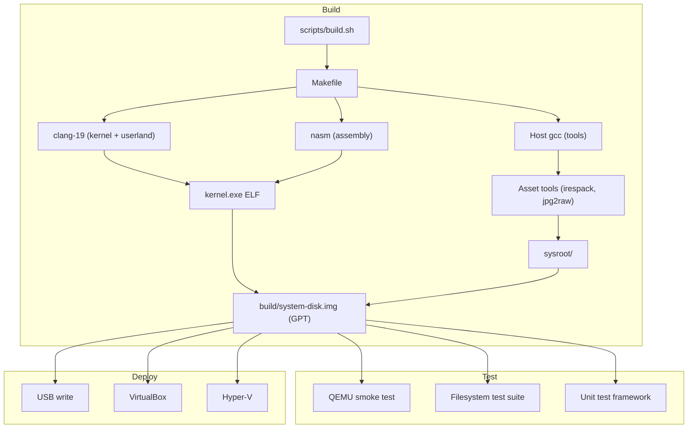
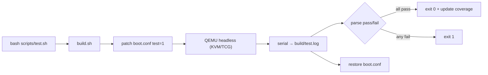
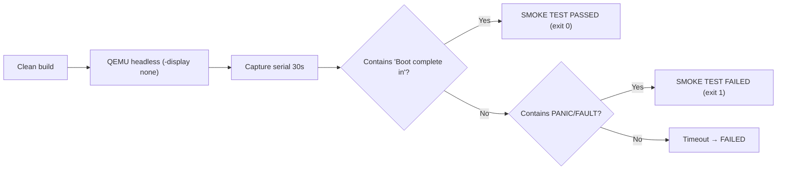
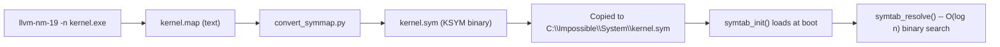

# Development Tooling & Automation

> Complete build system, test framework, asset pipeline, and development utilities for Impossible OS.

This page is the canonical reference for the repo-local developer tooling contract. `README.md` and `CLAUDE.md` link here instead of restating setup commands. Roadmap ownership for this contract lives in the [Developer Tooling Stack TODO](../../todo/00-infrastructure/TODO-01-developer-tooling-stack.md) (file-path link; section anchors inside that TODO may renumber as the plan evolves).

## Host Bootstrap Contract

The one-command setup contract for a new development machine. Parity work extends this with host profiles, wrappers, hooks, CI alignment, and a self-diagnosing doctor (see the [Scope Boundary](#scope-boundary) table below for the current owners).

### Canonical Commands

| Command                             | Purpose                                                       |
| ----------------------------------- | ------------------------------------------------------------- |
| `bash scripts/setup.sh`             | Install distro packages, verify required tools, verification build. |
| `bash scripts/setup.sh --verify`    | Read-only sentinel check. No install, no build. Safe to re-run. |
| `bash scripts/setup.sh --help`      | Print usage, required tools, supported distros, and scope boundary. |
| `bash scripts/setup-deps.sh`        | Dependency installer only (called by `setup.sh`; idempotent). |

### Supported Distros

`scripts/setup-deps.sh` detects the distro from `/etc/os-release` and installs the matching package set:

| Family        | Examples                               | Package manager | Out-of-the-box? |
| ------------- | -------------------------------------- | --------------- | --------------- |
| Debian-based  | Ubuntu, Debian, Linux Mint, Pop!_OS    | `apt-get`       | Yes             |
| Fedora-based  | Fedora, RHEL, CentOS, Rocky, Alma      | `dnf`           | Manual shim     |
| Arch-based    | Arch, Manjaro, EndeavourOS             | `pacman`        | Manual shim     |

Ubuntu/Debian is the out-of-the-box reference today because the Makefile hardcodes version-suffixed LLVM binaries (`clang-19`, `ld.lld-19`, `llvm-objcopy-19`, `llvm-ar-19`, `llvm-nm-19`) and the Debian-style `/usr/share/OVMF/OVMF_CODE_4M.fd` / `OVMF_VARS_4M.fd` paths. Fedora and Arch detection runs, but the default packages in those distros install unversioned LLVM binaries and OVMF at `/usr/share/OVMF/OVMF_CODE.fd` -- `bash scripts/setup.sh --verify` will flag the mismatch until a symlink/shim is added. The full support-tier matrix (fully supported vs. best-effort vs. unsupported) is documented in [Supported Host Profiles and Reproducible Environments](#supported-host-profiles-and-reproducible-environments) below.

Unsupported distros: `setup-deps.sh` exits with the required package list printed so the operator can install manually.

### Required Tools (Sentinel Set)

`bash scripts/setup.sh --verify` asserts each of these is reachable. Every entry maps 1:1 to a Makefile command or path; keeping the sentinel list authoritative prevents doc/script drift.

| Sentinel                                  | Source (Debian package) | Makefile consumer                        |
| ----------------------------------------- | ----------------------- | ---------------------------------------- |
| `clang-19`                                | `clang-19`              | `CC := clang-19`                         |
| `ld.lld-19`                               | `lld-19`                | `LD := ld.lld-19`                        |
| `llvm-objcopy-19`                         | `llvm-19`               | `OBJCOPY := llvm-objcopy-19`             |
| `llvm-ar-19`                              | `llvm-19`               | `AR := llvm-ar-19` (userland archives)   |
| `llvm-nm-19`                              | `llvm-19`               | `kernel.map` generation (Makefile L187)  |
| `nasm`                                    | `nasm`                  | `AS := nasm`                             |
| `gcc`                                     | `build-essential`       | `HOST_CC := gcc` (builds irespack, jpg2raw, mkfs-ixfs host tools) |
| `python3`                                 | `python3`               | Asset pipeline (`validate-assets.py`, `convert_symmap.py`, `convert_icon.py`, `convert_bsod_icon.py`, `convert_boot_font.py`) |
| `qemu-system-x86_64`                      | `qemu-system-x86`       | `QEMU := qemu-system-x86_64`             |
| `mcopy` (mtools)                          | `mtools`                | FAT image population (EFI + logs parts)  |
| `mmd` (mtools)                            | `mtools`                | BlackBox FAT directory creation (Makefile L391-L392) |
| `mkfs.fat` (dosfstools)                   | `dosfstools`            | FAT32 partition formatting               |
| `/usr/share/OVMF/OVMF_CODE_4M.fd`         | `ovmf`                  | `OVMF_CODE := /usr/share/OVMF/OVMF_CODE_4M.fd` |
| `/usr/share/OVMF/OVMF_VARS_4M.fd`         | `ovmf`                  | `OVMF_VARS := /usr/share/OVMF/OVMF_VARS_4M.fd` |

The OVMF paths are checked as exact file paths, not a fallback set, because the Makefile hardcodes these filenames. Fedora/Arch install OVMF at a different path; the [Fedora / Arch Shim Procedure](#fedora--arch-shim-procedure) section below documents the symlink step needed to pass `--verify`.

### Optional Tools

Installed by `setup-deps.sh` for full developer experience but not required for a clean build:

| Tool             | Purpose                                                |
| ---------------- | ------------------------------------------------------ |
| `bear`           | Generates `compile_commands.json` for clangd intel.    |
| `clangd-19`      | Editor LSP for C intelligence.                         |
| `cppcheck`       | Static analysis.                                       |
| `python3-pil`    | Asset pipeline JPEG decode (optional).                 |
| `xorriso`        | Legacy ISO image path (retained for compatibility).    |
| `parted`         | Partition table utilities.                             |

### Idempotence

Both scripts are re-run safe:

- `setup-deps.sh` checks `command -v` (or file path for OVMF) before issuing `apt/dnf/pacman install`. Already-present packages print as `already installed` and are skipped; nothing is uninstalled.
- `setup.sh` delegates to `setup-deps.sh`, then runs `--verify`, then `bash scripts/build.sh clean`. A second run reuses the same package set and produces the same `=== BUILD OK ===` sentinel in `build/build.log`.
- `bash scripts/build.sh clean` invokes the Makefile `clean:` rule, which removes `$(BUILD_DIR)` (`build/`) and the auto-generated, `.gitignore`d `include/build_info.h`. Both are regenerated on the next build from git metadata and `.build_number`; no user-authored source is touched.

### Scope Boundary

Owned here (this contract): repo-local dev bootstrap -- host package install, required-tool verification, verification build.

Owned elsewhere. Each row links to the owning TODO *file*; section anchors inside those TODOs may renumber as the plan evolves, so we deliberately avoid `§N` shorthand here:

| Capability                                    | Owner                                                                                                                           |
| --------------------------------------------- | ------------------------------------------------------------------------------------------------------------------------------- |
| Cross-compiler toolchain, SDK build system    | [SDK Build System TODO](../../todo/14-host-tools/TODO-01-sdk-build-system.md)                                                   |
| Host profile matrix + reproducible container  | [Supported Host Profiles and Reproducible Environments](#supported-host-profiles-and-reproducible-environments) (below)         |
| Build/test/lint/run wrapper contract          | [Developer Tooling Stack TODO](../../todo/00-infrastructure/TODO-01-developer-tooling-stack.md) -- "wrapper contract" section   |
| VM/bare-metal launcher matrix                 | [`machine-matrix.md`](machine-matrix.md) -- canonical table (owned by [TODO-01 §4](../../todo/00-infrastructure/TODO-01-developer-tooling-stack.md#4-machine-launcher-and-debug-profile-matrix)) |
| Git hook lifecycle                            | [Developer Tooling Stack TODO](../../todo/00-infrastructure/TODO-01-developer-tooling-stack.md) -- "git hooks" section          |
| CI workflow alignment                         | [GitHub Actions Workflows](#github-actions-workflows) -- canonical section (owned by the [GitHub Actions roadmap section](../../todo/00-infrastructure/TODO-01-developer-tooling-stack.md#6-github-actions-and-artifact-policy-alignment)) |
| One-command `scripts/tooling-doctor.sh`       | [Developer Tooling Stack TODO](../../todo/00-infrastructure/TODO-01-developer-tooling-stack.md) -- "tooling doctor" section     |

The SDK Build System TODO ships the SDK cross-tool build experience (user-mode programs, host utilities in `sdk/src/`). It explicitly does *not* own the kernel-side `scripts/build.sh` entry point or the host package install flow.

---

## Supported Host Profiles and Reproducible Environments

The [Host Bootstrap Contract](#host-bootstrap-contract) above defines *what must be on the machine*; this section defines *which machines are supported, at what support tier, and how to reproduce them*.

### Profile Matrix

| Profile                         | Tier                        | Notes                                                                                                 |
| ------------------------------- | --------------------------- | ----------------------------------------------------------------------------------------------------- |
| Native Ubuntu/Debian (24.04+)   | ✅ Fully supported          | Reference profile. `setup.sh` installs all packages directly; version-suffixed LLVM-19 available.     |
| WSL2 + Ubuntu (24.04+)          | ✅ Fully supported          | Same as native Ubuntu for build, lint, unit tests. KVM works when the Windows host has nested virtualization enabled; opt in with `sudo usermod -aG kvm $USER` then `newgrp kvm` (or reopen the shell). Without KVM, wrappers fall back to TCG; full `scripts/test.sh` hangs on TCG, but `scripts/test-smoke.sh` boots to desktop in a couple of seconds. Interactive GUI runs stay on the Windows host via the machine-launcher matrix. |
| GitHub Actions `ubuntu-latest`  | ✅ Fully supported          | CI profile. Workflows invoke `bash scripts/setup.sh --verify` + `build.sh clean` + `test.sh QUIET=1` -- the same wrappers contributors run locally (lint is held back until the legacy-XREF sweep closes; see [GitHub Actions Workflows](#github-actions-workflows)). |
| `.devcontainer` (Ubuntu base)   | ✅ Fully supported          | Committed reproducible environment -- see below. Same entry points as native Ubuntu.                  |
| Native Fedora (40+)             | ⚠️ Best-effort              | `setup-deps.sh` installs unversioned LLVM and OVMF under a different path. Needs manual shims (see below) until tracked owner lands. |
| Native Arch / Manjaro           | ⚠️ Best-effort              | Same as Fedora: unversioned `clang`/`lld`/`llvm-objcopy` and OVMF path drift require shims.           |
| Native Windows (PowerShell/cmd) | ❌ Unsupported              | No `bash scripts/setup.sh` path. Use WSL2 instead.                                                    |
| macOS                           | ❌ Unsupported              | No tracked owner for toolchain port. Would need cross-compiler changes in the [SDK Build System TODO](../../todo/14-host-tools/TODO-01-sdk-build-system.md). |

**Out-of-the-box** means `bash scripts/setup.sh` followed by `bash scripts/build.sh` succeeds with no manual steps. Best-effort profiles detect correctly but need the documented shim before `--verify` passes.

### Minimum Versions and Verification

Each required-sentinel tool has an expected version floor. `bash scripts/setup.sh --versions` reports actual versions alongside expectations.

| Tool                  | Minimum   | Verification command                                | Rationale                                                      |
| --------------------- | --------- | --------------------------------------------------- | -------------------------------------------------------------- |
| `clang-19`            | 19.1.0    | `clang-19 --version`                                | Makefile uses `CC := clang-19`; major must match.              |
| `ld.lld-19`           | 19.1.0    | `ld.lld-19 --version`                               | Paired with clang-19; major must match.                        |
| `llvm-objcopy-19`     | 19.1.0    | `llvm-objcopy-19 --version`                         | Paired with clang-19; major must match.                        |
| `llvm-ar-19`          | 19.1.0    | `llvm-ar-19 --version`                              | Paired with clang-19; major must match.                        |
| `llvm-nm-19`          | 19.1.0    | `llvm-nm-19 --version`                              | Paired with clang-19; major must match.                        |
| `nasm`                | 2.15.05   | `nasm -v`                                           | Modern x86-64 syntax; older versions miss `BND` encodings.     |
| `gcc`                 | 11.0      | `gcc --version`                                     | `HOST_CC := gcc` needs C17 support for host tools.             |
| `python3`             | 3.8       | `python3 --version`                                 | f-strings, `pathlib`, asset-pipeline tool scripts.             |
| `qemu-system-x86_64`  | 7.0       | `qemu-system-x86_64 --version`                      | UEFI + AHCI + VirtIO + NVMe + HPET; WHPX accelerator on 7.0+.  |
| `mcopy`               | 4.0       | `mcopy -V`                                          | Offset syntax `image@@offset` for partition-local FAT writes.  |
| `mmd`                 | 4.0       | `mmd -V`                                            | BlackBox FAT directory creation (Makefile L391-L392).          |
| `mkfs.fat`            | 4.0       | `mkfs.fat --help \| tail -1`                        | `--offset` flag required for partition-local format.           |
| OVMF `*_4M.fd`        | presence  | `ls -l /usr/share/OVMF/OVMF_{CODE,VARS}_4M.fd`      | 4M firmware layout. The Debian `ovmf` package since 2022.02 ships these exact paths; `--versions` only asserts presence and size since the firmware binaries expose no standardized version string. |
| `bear`                | 3.0       | `bear --version`                                    | Optional; generates `compile_commands.json` for clangd.        |

`bash scripts/setup.sh --versions` walks the sentinel set and reports version strings for anything that exposes `--version`/`-v`/`-V`. Output is **purely advisory**: the command always exits 0, so optional tools (`bear`) and below-floor entries do not gate wrappers or CI. `--verify` remains the hard pass/fail contract.

### Reproducible Environment (`.devcontainer`)

A committed VS Code devcontainer lives at `.devcontainer/devcontainer.json`. It brings up an Ubuntu 24.04 base, runs `bash scripts/setup.sh` in `postCreateCommand`, and leaves a container where every wrapper (`scripts/build.sh`, `scripts/test.sh`, `scripts/lint.sh`, `scripts/setup.sh --verify`) works identically to a native Ubuntu host.

| Property            | Value                                                                    |
| ------------------- | ------------------------------------------------------------------------ |
| Base image          | `mcr.microsoft.com/devcontainers/base:ubuntu-24.04`                      |
| Post-create command | `bash scripts/setup.sh`                                                  |
| Included extensions | `llvm-vs-code-extensions.vscode-clangd`                                  |
| Forwarded ports     | none                                                                     |
| Privileged mode     | no (no `--cap-add`, no `seccomp=unconfined`; bootstrap profile only)     |

**Usage:** open the repo in VS Code / Cursor with the Dev Containers extension installed, then "Reopen in Container". Equivalent CLI path: `devcontainer up --workspace-folder .` (Dev Containers CLI).

### Container vs Non-Container Validation Boundary

Containers reproduce *host-side* work exactly:

| Reproducible inside container              | Needs native/VM host                                    |
| ------------------------------------------ | ------------------------------------------------------- |
| `scripts/setup.sh` + dependency install    | QEMU with WHPX (Windows)                                |
| `scripts/build.sh` + `build.sh clean`      | QEMU with KVM (Linux, needs `/dev/kvm` passthrough)     |
| `scripts/setup.sh --verify` / `--versions` | VirtualBox runtime                                      |
| `scripts/lint.sh` (static checks)          | Bare-metal USB boot                                     |
| `scripts/test.sh` on TCG (slow path)       | Hardware-accelerated QEMU test runs                     |
| Asset pipeline + docs generation           | Secure-boot shim validation                             |

Containers cover host bootstrap and static checks. Runtime validation on hardware accelerators and bare metal stays with the named machine profiles owned by the [Developer Tooling Stack TODO](../../todo/00-infrastructure/TODO-01-developer-tooling-stack.md) (see the [Scope Boundary](#scope-boundary) row for the "VM/bare-metal launcher matrix").

### Unsupported-Host Policy

**Native Windows (PowerShell/cmd.exe)** and **macOS** are unsupported paths for local development today. No checklist item owns porting the build system to either. Contributors on those operating systems must use WSL2 (Windows) or a supported Linux host / devcontainer (all platforms).

If a tracked owner later adds a supported native-Windows or macOS path, it lands as a new profile row in the matrix above and a new `setup-*` script; this section is the single gate for that promotion.

### Fedora / Arch Shim Procedure

Until the best-effort profiles are promoted to full support, hosts in those families need:

```sh
# LLVM-19 symlinks (Fedora: dnf install llvm-toolset-19 clang-tools-extra lld; Arch: pacman -S llvm19 lld19 clang19 or AUR)
sudo ln -s $(command -v clang) /usr/local/bin/clang-19
sudo ln -s $(command -v ld.lld) /usr/local/bin/ld.lld-19
sudo ln -s $(command -v llvm-objcopy) /usr/local/bin/llvm-objcopy-19
sudo ln -s $(command -v llvm-ar) /usr/local/bin/llvm-ar-19
sudo ln -s $(command -v llvm-nm) /usr/local/bin/llvm-nm-19

# OVMF 4M paths (Fedora/Arch use /usr/share/OVMF/OVMF_CODE.fd by default)
sudo ln -sf /usr/share/OVMF/OVMF_CODE.fd /usr/share/OVMF/OVMF_CODE_4M.fd
sudo ln -sf /usr/share/OVMF/OVMF_VARS.fd /usr/share/OVMF/OVMF_VARS_4M.fd
```

After shimming, `bash scripts/setup.sh --verify` should report 14/14 OK.

---

## Wrapper Contract

Five canonical bash wrappers form the stable developer interface to the repo. Every wrapper supports `--help` and writes its output/logs to a documented location. **Never invoke raw `make` for builds**; `bash scripts/build.sh` is the contract. `make test*` shorthand targets are thin passthroughs to `bash scripts/test.sh` and remain supported.

| Wrapper                  | Canonical command                         | Primary output                       | Success sentinel / exit code                                            |
| ------------------------ | ----------------------------------------- | ------------------------------------ | ----------------------------------------------------------------------- |
| `scripts/build.sh`       | `bash scripts/build.sh [clean] [run\|run-usb\|run-nvme\|run-usb-ci\|run-nvme-ci] [--jobs=N]` | `build/system-disk.img`, `build/build.log` | `tail -1 build/build.log` == `=== BUILD OK ===`; exit 0 OK, 1 fail       |
| `scripts/test.sh`        | `bash scripts/test.sh [SUITE=<cat>] [QUIET=1]` (env `TIMEOUT=60`) | `build/test.log`, filtered stdout    | `=== N tests passed ===` summary line in serial log; exit 0 OK, 1 fail  |
| `scripts/lint.sh`        | `bash scripts/lint.sh [<path>]`           | stderr: `<file>:<line>:<type>:<msg>` | `LINT CLEAN` banner + `0 error(s)`; exit 0 OK, 1 errors                 |
| `scripts/run-qemu.sh`    | `bash scripts/run-qemu.sh [--debug] [--headless] [--debug-tests] [--test-only] [--single-cpu]` | interactive QEMU session, serial to stdio | no sentinel (interactive); exit 1 if disk or OVMF missing               |
| `scripts/debug.sh`       | `bash scripts/debug.sh [--breakpoint=<fn>] [--no-default-bp]` | `build/.gdbinit-kernel`, QEMU + GDB session | no sentinel (interactive); exit 0 on clean GDB detach                   |
| `scripts/setup.sh`       | `bash scripts/setup.sh [--verify\|--versions]` | see [Host Bootstrap Contract](#host-bootstrap-contract) | install: build sentinel; `--verify` exit 0 OK, 1 drift; `--versions` always exit 0 (advisory) |

### Input and Output Paths

Every wrapper reads from and writes to a small set of well-known paths. Treat these as the contract surface; any wrapper change that moves one must update this table.

| Path                                    | Producer                                | Consumers                                              |
| --------------------------------------- | --------------------------------------- | ------------------------------------------------------ |
| `build/build.log`                       | `scripts/build.sh`                      | CI, hooks, doc `tail -1` check, `scripts/test.sh`      |
| `build/system-disk.img`                 | `scripts/build.sh` (GPT: EFI + BlackBox + IXFS) | `run-qemu.sh`, `test.sh`, `test-smoke.sh`, machine launchers |
| `build/kernel.exe`                      | `scripts/build.sh`                      | `scripts/debug.sh`, `llvm-addr2line-19`                |
| `build/kernel.map`                      | `scripts/build.sh` (`llvm-nm-19 -n`)    | `scripts/debug.sh`, BSS-collision check                |
| `build/kernel.sym`                      | `scripts/build.sh` (`tools/convert_symmap.py`) | kernel BSOD resolver (loaded at boot)                  |
| `build/test.log`                        | `scripts/test.sh` (QEMU serial file:)   | test.sh parse step, coverage scanner                   |
| `build/smoke-test.log`                  | `scripts/test-smoke.sh`                 | smoke test summary/tail                                |
| `build/OVMF_VARS_4M.fd`                 | copy of `/usr/share/OVMF/OVMF_VARS_4M.fd` | all QEMU launchers (writable EFI variable store)      |
| `build/.gdbinit-kernel`                 | `scripts/debug.sh`                      | GDB --command= argument                                |
| `compile_commands.json` (repo root)     | `scripts/build.sh clean` via `bear`     | clangd LSP                                             |
| `docs/test-coverage/coverage.{md,json}` | `scripts/test-coverage.sh` (auto on build + test) | coverage browsing                                      |

### Sentinels and Exit Codes

- `build/build.log` last line is **always** `=== BUILD OK ===` or `=== BUILD FAILED ===`. Scripts and hooks should probe with `tail -1 build/build.log` -- never `$?` of the make process (it's tee'd).
- `scripts/test.sh` looks for `=== N tests passed ===` in `build/test.log`. Timeout before that line = exit 1.
- `scripts/lint.sh` prints `LINT CLEAN` on success. Errors increment counter; exit code is 1 if any error (warnings don't block).
- Interactive wrappers (`run-qemu.sh`, `debug.sh`) do not produce sentinels; they exit with whatever QEMU/GDB returned.

### Machine-Specific Launchers

`scripts/run-qemu.sh` is the generic-use launcher. Specialist launchers under `scripts/machines/` provide pinned configurations for WHPX/KVM/TCG/VirtualBox/secure-boot/NVMe/USB; the full matrix with artifact paths, debugger entry points, and bare-metal bring-up lives in [`machine-matrix.md`](machine-matrix.md). Prefer those over ad hoc `qemu-system-x86_64 ...` invocations:

```text
scripts/machines/
├── run-qemu-kvm.sh            KVM-forced (Linux / WSL2)
├── run-qemu-kvm.bat           WHPX-forced (Windows -- name is misleading)
├── run-qemu-tcg.{sh,bat}      TCG-forced (slow, portable)
├── run-qemu-1cpu.bat          Single-CPU bisect profile (WHPX)
├── run-qemu.ps1               Windows QEMU launcher (underlying .bat dispatch)
├── run-vbox.{sh,ps1,bat}      VirtualBox
├── reset-qemu-nvram.{bat,ps1} Clear OVMF_VARS for fresh firmware state
├── storage/                   AHCI / VirtIO / NVMe / USB storage scenarios
└── fs/                        Filesystem-specific harnesses
scripts/debug/
└── run-secureboot.bat         Secure Boot (TCG + q35 + SMM + pflash)
```

---

## Overview

Impossible OS uses a single-script build system (`bash scripts/build.sh`) that wraps a Makefile-based pipeline. The toolchain is Clang-19/LLD-19 targeting `x86_64-elf` in freestanding mode. The development environment includes incremental builds with parallel compilation, automated QEMU testing, a kernel unit test framework, an asset pipeline with validation, and code intelligence via clangd + Srclight.



---

## Build System

### Toolchain

| Tool          | Binary                                        | Purpose                                    |
| ------------- | --------------------------------------------- | ------------------------------------------ |
| C compiler    | `clang-19 --target=x86_64-elf`                | Kernel + userland C code                   |
| Assembler     | `nasm`                                        | x86-64 assembly (`.asm`)                   |
| Linker        | `ld.lld-19`                                   | ELF linking (kernel, user programs)        |
| Object tools  | `llvm-objcopy-19`, `llvm-ar-19`, `llvm-nm-19` | Binary manipulation                        |
| Host compiler | `gcc`                                         | Build tools only (jpg2raw, irespack, etc.) |

> [!NOTE]
> Migrated from GCC to Clang-19/LLD-19 for 8% smaller kernel binary (2,649,920 bytes vs 2,880,648 bytes GCC) and slightly faster builds (6.8s vs 8.0s clean at -j12). NASM pipeline is untouched -- assembly files remain compiled by NASM.

### Compiler Flags

```
CFLAGS := -Wall -Wextra -Werror -ffreestanding -nostdlib -nostdinc \
          --target=x86_64-elf -fno-stack-protector -fno-pie -mno-red-zone \
          -mno-mmx -mno-sse -mno-sse2 -mcmodel=kernel -std=gnu11 -O2 -g \
          -MMD -MP
```

Key flags:
- `-MMD -MP` -- generates `.d` dependency files for incremental builds
- `--target=x86_64-elf` -- cross-compilation target
- `-ffreestanding -nostdlib -nostdinc` -- no standard library, no host headers

### Build Script

All builds go through `scripts/build.sh` -- never raw `make` commands.

| Command                           | Description         |
| --------------------------------- | ------------------- |
| `bash scripts/build.sh`           | Incremental build   |
| `bash scripts/build.sh clean`     | Full clean build    |
| `bash scripts/build.sh run`       | Build + launch QEMU |
| `bash scripts/build.sh clean run` | Clean build + QEMU  |

**Features:**
- Live progress bar during compilation
- Auto-creates `build/` directory
- Writes log to `build/build.log` with `=== BUILD OK ===` or `=== BUILD FAILED ===` sentinel
- Wraps kernel build with `bear --append --` on clean builds (generates `compile_commands.json`)

### Incremental Builds

Uses `-MMD -MP` dependency tracking:


| Scenario                       | Time  | Speedup               |
| ------------------------------ | ----- | --------------------- |
| Clean build (-j12)             | 8.0s  | Baseline              |
| Incremental (single .c change) | 3.3s  | **5.8× faster**       |
| Header change (printk.h)       | 12.1s | 71/96 files (correct) |

### Parallel Compilation

Default: `-j$(nproc)`. Override with `--jobs=N`.

| Configuration      | Time                    |
| ------------------ | ----------------------- |
| `-j1` clean        | 19.6s                   |
| `-j12` clean       | 8.0s (**2.5× speedup**) |
| `-j12` kernel only | 3.7s (**3.6× speedup**) |

> [!NOTE]
> Generated headers (`os_logo.h`, `bsod_icon.h`, `boot_splash_font_data.h`) use order-only prerequisites (`| $(GENERATED_HDRS)`) to prevent races on first clean build.

### Build Version & Metadata

Version is auto-generated using CalVer: `YY.M.D` (e.g., `26.3.17`).

**Auto-generated `include/build_info.h`:**

| Define            | Source                            | Example                |
| ----------------- | --------------------------------- | ---------------------- |
| `BUILD_NUMBER`    | `.build_number` (auto-increment)  | `809`                  |
| `BUILD_COMMIT`    | `git rev-parse --short HEAD`      | `d1016ab`              |
| `BUILD_BRANCH`    | `git rev-parse --abbrev-ref HEAD` | `main`                 |
| `BUILD_TIMESTAMP` | `date -u +%Y-%m-%dT%H:%M:%SZ`     | `2026-03-17T16:13:00Z` |
| `BUILD_VERSION`   | CalVer from build date            | `26.3.17`              |

**Where version appears:**
- Boot log first line: `Impossible OS v26.3.17 (build 809, main@d1016ab, ...)`
- Shell `ver` command: same format
- BSOD crash screen: version footer in dim color

> [!IMPORTANT]
> `include/build_info.h` is auto-generated by the Makefile's `.FORCE` target and uses `cmp -s` to avoid rewriting when content is unchanged (prevents full recompilation). It is in `.gitignore`.

### Output

The build produces a bootable GPT disk image: `build/system-disk.img` (512 MiB).

| Partition  | Size      | Format        | Contents                                                         |
| ---------- | --------- | ------------- | ---------------------------------------------------------------- |
| EFI System | 64 MiB    | FAT32         | `BOOTX64.EFI`, `kernel.exe`, shim (secure boot), `MOK.cer`       |
| BlackBox   | 128 MiB   | FAT32 (`X:\`) | Runtime logs, crash dumps, WER data, diag output (see TODO-17)   |
| IXFS       | Remaining | IXFS (custom) | `C:\` system volume: fonts, icons, wallpapers, kernel.sym, apps  |

---

## Toolchain & Dependency Management

### Clang/LLD Migration

Migrated from GCC to Clang-19/LLD-19:

| Aspect             | Before (GCC)     | After (Clang-19)                 |
| ------------------ | ---------------- | -------------------------------- |
| Compiler           | `x86_64-elf-gcc` | `clang-19 --target=x86_64-elf`   |
| Linker             | `ld`             | `ld.lld-19`                      |
| Kernel size        | 2,880,648 bytes  | 2,649,920 bytes (**8% smaller**) |
| Clean build (-j12) | 8.0s             | 6.8s                             |

> [!CAUTION]
> **UEFI bootloader PE/COFF conversion:** `llvm-objcopy` does NOT support `--target efi-app-x86_64`. The pipeline uses GNU `objcopy` for the EFI conversion step: Clang → ELF → GNU objcopy → PE/COFF.

> [!WARNING]
> Clang is stricter about `-Wunused-function` on static inline helpers. 11 port I/O helpers across 7 driver files needed `__attribute__((unused))`.

### System Dependency Installer

`scripts/setup-deps.sh` -- detects distro and installs all build dependencies:

| Distro        | Package Manager |
| ------------- | --------------- |
| Ubuntu/Debian | `apt`           |
| Fedora        | `dnf`           |
| Arch          | `pacman`        |

**Packages installed:**
- Build: `nasm`, `clang-19`, `lld-19`, `llvm-19`
- Disk: `xorriso`, `mtools`, `dosfstools`, `parted`
- Test: `qemu-system-x86`, `ovmf`
- Tools: `python3`, `python3-pil`, `bear`, `clangd-19`, `cppcheck`

Idempotent -- checks `command -v` before installing. Colored output with ✓/·/✗ status.

### One-Command Setup

```bash
git clone https://github.com/rizonesoft/impossible-os.git
cd impossible-os
bash scripts/setup.sh    # installs deps + verification build
bash scripts/build.sh run
```

`scripts/setup.sh` runs `setup-deps.sh` then does a verification `build.sh clean`.

---

## Emulator Testing Scripts

The full machine-launcher matrix (WHPX, KVM, TCG, VirtualBox, secure-boot, NVMe, USB, bare-metal) lives in [`machine-matrix.md`](machine-matrix.md); this section only lists the entry points.

### QEMU via the canonical wrapper

`scripts/run-qemu.sh` boots `build/system-disk.img` via AHCI under UEFI (OVMF 4M firmware). `bash scripts/build.sh run` is the one-command build+launch variant. See `bash scripts/run-qemu.sh --help` for mode flags (`--debug`, `--headless`, `--single-cpu`, `--debug-tests`, `--test-only`).

### Specialist launchers

The full launcher matrix -- with accelerator semantics, artifact paths, debugger entry points, known limitations per profile, and a bare-metal bring-up row -- lives in [`machine-matrix.md`](machine-matrix.md). That is the canonical reference when picking between QEMU/KVM, QEMU/TCG, WHPX, VirtualBox, secure-boot, single-CPU, storage, and filesystem scenarios. The quick summary below points at the main entries:

| Launcher                                  | Purpose                                                    |
| ----------------------------------------- | ---------------------------------------------------------- |
| `scripts/machines/run-qemu-kvm.sh`        | KVM-forced (Linux / WSL2, fast)                            |
| `scripts/machines/run-qemu-kvm.bat`       | WHPX-forced (Windows, despite the name -- see matrix)      |
| `scripts/machines/run-qemu-tcg.sh/.bat`   | TCG-forced (deterministic, slow, portable)                 |
| `scripts/machines/run-qemu-1cpu.bat`      | Single-CPU profile for bisecting SMP bugs                  |
| `scripts/machines/run-qemu.ps1`           | Windows PowerShell QEMU launcher (accel, smp, test flags)  |
| `scripts/machines/run-vbox.sh/.ps1/.bat`  | VirtualBox (raw -> VDI conversion on each run)             |
| `scripts/debug/run-secureboot.bat`        | Secure Boot (TCG + q35 + SMM + pflash; see matrix)         |
| `scripts/machines/reset-qemu-nvram.*`     | Clear OVMF_VARS (fresh EFI variable state)                 |
| `scripts/machines/storage/`               | AHCI / VirtIO / NVMe / USB storage scenarios               |
| `scripts/machines/fs/`                    | Filesystem-specific harnesses                              |

Hyper-V certification is owned by release validation ([D15 T04 §3](../../todo/15-installer-release/TODO-04-release-qa.md)), not the developer matrix.

---

## Hardware Deployment Scripts

### USB Write (Windows)

`scripts/deploy/write-usb.ps1` -- GPT-partitioned USB via PowerShell.

The image already contains GPT + all partitions (EFI / BlackBox / IXFS); the script performs a raw write, not a re-partition. Auto-detects USB drive with safety prompts.

### USB Write (Linux)

`scripts/deploy/write-usb.sh` -- raw `dd` write with double confirmation.


> [!CAUTION]
> Requires root (`sudo`). The image already contains GPT + all partitions -- no `parted`/`mkfs` needed. Double confirmation prevents accidents.

### USB Log Reader

`scripts/deploy/read-usb-log.sh` -- retrieves debug logs from USB boot.

| Feature   | Description                                                    |
| --------- | -------------------------------------------------------------- |
| Mount     | Read-only (`-o ro`) -- safe for forensic collection             |
| Detection | Auto-detects third partition (`/dev/sdX3` or `/dev/nvme0n1p3`) |
| Output    | Copies to `build/logs/<timestamp>/`                            |
| Scanning  | Highlights panic/BSOD/fault keywords in red                    |

---

## Test Framework

### Kernel Unit Test Framework

Header: `include/kernel/test/test.h`, implementation: `src/kernel/test/test_runner.c`.

**API:**

| Function                                        | Purpose                                                      |
| ----------------------------------------------- | ------------------------------------------------------------ |
| `TEST_ASSERT(cond, msg)`                        | Assert condition, log pass/fail to serial                    |
| `TEST_ASSERT_EQ(a, b, msg)`                     | Value-comparison assert (prints got vs expected on fail)     |
| `TEST_PENDING(cond, msg)`                       | Mark deferred-feature sentinel; shows `[STUB]` in log        |
| `TEST_SKIP(msg)`                                | Skip hardware-dependent tests                                |
| `test_suite_register_cat(name, fn, TEST_CAT_*)` | Register a test suite into a category                        |
| `test_runner_init()`                            | Initialize + register all suites                             |
| `test_runner_run()`                             | Run all suites, print summary                                |

Test categories (`TEST_CAT_*`): `mm`, `fs`, `sched`, `ob`, `security`, `ipc`, `boot`, `abi`, `storage`, `exec`, `x86`. Run a specific category with `bash scripts/test.sh SUITE=<cat>`.

**Output format:**
```
[ OK ] TEST: [ OK ] PMM: alloc+free :: pmm_alloc_frame returns non-zero
[FAIL] TEST: [FAIL] Heap: no overlap :: allocations overlap  (test_heap.c:45)
[STUB] TEST: [STUB] Registry: NtNotifyChangeKey pending
[ OK ] TEST: === 1400+ tests passed, 0 failed ===
```

> [!IMPORTANT]
> All test code is inside `#ifdef KERNEL_TESTS`. `-DKERNEL_TESTS` is always in CFLAGS -- test code compiles unconditionally but only runs when `test=1` or `debug=1` is set in `boot.conf`.

### Core Subsystem Tests

28 test files in `src/kernel/test/` covering 11 categories; ~1,400 `TEST_ASSERT*` calls total (growing). Test files are named `test_<subsystem>.c` and register their suites via `test_suite_register_cat()`. For the up-to-date suite breakdown and coverage map, see the auto-generated report at [`docs/test-coverage/coverage.md`](../test-coverage/coverage.md).

**Safety rules** (see CLAUDE.md "Test Code -- No Live Boot Infrastructure Calls"): test files must never call `boot_progress`, `vpd_stage_*`, `panic`, `_init()`, or any live boot-path function. A pre-commit hook enforces this. Use pure helpers + readiness oracles.

> [!NOTE]
> Coverage report auto-generated on every build: `docs/test-coverage/coverage.md`. Manual: `bash scripts/test-coverage.sh`.

### Test Wrapper

`bash scripts/test.sh` is the canonical test entry point. `make test` and per-category shorthand targets (`make test-mm`, `make test-fs`, ...) delegate to it.

```bash
bash scripts/test.sh                  # all categories
bash scripts/test.sh SUITE=mm         # Memory Management only
bash scripts/test.sh QUIET=1          # summary only (suppress per-test PASS)
bash scripts/test.sh --help           # usage + category list + exit codes
```

`scripts/test.sh` handles:
- Incremental build (delegates to `scripts/build.sh`)
- Patches `boot.conf` with `test=1` (plus `test_suite=<cat>` / `test_quiet=1`), auto-restores on exit
- Picks KVM when available, falls back to TCG with a visible warning
- Boots QEMU headless, captures serial to `build/test.log`
- Parses `=== N tests passed ===` summary
- Updates `docs/test-coverage/` on success
- Exits 0 on pass, 1 on fail or timeout



### Automated QEMU Smoke Test

`scripts/test-smoke.sh` -- headless boot verification (legacy; superseded by `bash scripts/test.sh`). Boots `build/system-disk.img` via AHCI, scans the serial log for the `Boot complete in` sentinel, and fails on panic/fault patterns.



- Uses KVM acceleration when available (`/dev/kvm`)
- Serial output to file (avoids buffering issues)
- Shows boot time on pass, last 10 serial lines on fail

### Filesystem Test Suite

`scripts/test-fs.sh` -- tests filesystem drivers against real disk images.

| Image Source               | Filesystems                                               |
| -------------------------- | --------------------------------------------------------- |
| `tools/make-test-disks.sh` | FAT32, exFAT, ext2/3/4, NTFS, IXFS, ISO 9660, Joliet, UDF |

Each test: fresh OVMF vars, 20s timeout, KVM when available. Optical media (ISO/UDF) attached as ATAPI CD via `ide-cd` on AHCI port 1. Logs saved per-filesystem in `build/fs-tests/<name>.log`.

Selective testing: `bash scripts/test-fs.sh fat32 ext4`

---

## Development Utilities

### Symbol Map Generator

Provides `func_name+0xoffset` in BSOD stack traces.



| Detail     | Value                                            |
| ---------- | ------------------------------------------------ |
| Format     | KSYM: 8-byte addr + 32-byte name (packed)        |
| Size       | ~40 KB for ~1000 symbols                         |
| Lookup     | O(log n) binary search -- safe in panic context   |
| Allocation | PMM (not kmalloc)                                |
| Filters    | Only T/t/D/d symbols, skips `.` and `$` prefixes |

### Code Size Tracking

`scripts/size-report.sh` -- tracks binary sizes across builds.

| Metric            | Current | Threshold    |
| ----------------- | ------- | ------------ |
| `kernel.exe`      | ~2.6 MB | Warn at 8 MB |
| `system-disk.img` | 512 MB  | Warn at 1 GB |

Features: top 10 largest `.o` files, section breakdown via `llvm-size-19`, delta tracking with colored output (red = grew, green = shrank), CSV history in `build/size-history.csv`.

### Code Style Linter

`scripts/lint.sh` -- 5 automated checks. See `bash scripts/lint.sh --help` for the current list. (Reduced from 7 on 2026-04-17: two warn-only style checks -- function length and lowercase defines -- were dropped because they duplicated signal already covered by Codex adversarial review and the domain code-quality skills. Lint now focuses on structural drift checks that nothing else watches.)

| Check                                          | Type    | Notes                                              |
| ---------------------------------------------- | ------- | -------------------------------------------------- |
| `#pragma once` or include guard in every `.h`  | Error   | --                                                 |
| Lines <= 120 characters                        | Error   | Excludes comment lines                             |
| No trailing whitespace                         | Error   | --                                                 |
| Functions <= 50 lines                          | Warning | Doesn't fail build                                 |
| snake_case function definitions                | Warning | Excludes Win32 API wrappers (`Reg*`, `HKEY*`)      |
| UPPER_CASE macros                              | Warning | Flags pure-lowercase `#define`                     |
| Numeric TODO shorthand outside `todo/**`       | Error   | `TODO-NN sectionN`, `DNN TNN`; allowlisted legacy files warn instead |

Excludes auto-generated files (`build_info.h`, `os_logo.h`, etc.) and third-party code (`stb_truetype`, `stb_image`, `cJSON`).

Path filtering: `bash scripts/lint.sh src/kernel/mm/`. When a path is given, the numeric-TODO scan is skipped (it's a repo-wide check).

### GDB Debug Script

`scripts/debug.sh` -- enhanced GDB debugging.

| Feature             | Flag                                   |
| ------------------- | -------------------------------------- |
| Default breakpoints | `kernel_main`, `panic`, fault handlers |
| Custom breakpoint   | `--breakpoint=<function>`              |
| Skip defaults       | `--no-default-bp`                      |

Auto-generates `build/.gdbinit-kernel` with Intel syntax, pagination off, symbol count banner. Auto-builds kernel if not found. Cleans up QEMU on GDB exit.

### clangd + Bear (Code Intelligence)

Provides deep C code intelligence for editors.

| Component | File                       | Notes                                                |
| --------- | -------------------------- | ---------------------------------------------------- |
| Config    | `.clangd` (repo root)      | `--target=x86_64-elf`, `-nostdlib`, `-ffreestanding` |
| Database  | `compile_commands.json`    | Generated by Bear on `build.sh clean` (200 entries)  |
| Editor    | VS Code + clangd extension | `clangd.path` → `/usr/bin/clangd-19`                 |

> [!WARNING]
> **clangd is LSP, not MCP.** Attempting to add clangd as an MCP server causes it to hang -- the protocols are incompatible. Use clangd via the VS Code/Cursor clangd extension (LSP).

> [!NOTE]
> Bear only wraps the kernel build step (not userland/host tools) to avoid PIPESTATUS issues. Uses `bear --append --` to accumulate entries. `.clangd` uses `Index.Background: Build` for faster indexing.

---

## Asset Pipeline

### Build Target

`make assets` groups 7 sub-targets with stamp-file dependency tracking:

| Sub-target           | Source                                 | Output                                |
| -------------------- | -------------------------------------- | ------------------------------------- |
| `os-logo`            | `resources/icons/color/*.png`          | `include/os_logo.h` (BGRA C array)    |
| `bsod-icon`          | `resources/icons/bsod/bsod_icon.png`   | `include/bsod_icon.h`                 |
| `boot-font`          | Font data                              | `include/boot_splash_font_data.h`     |
| `sysroot-fonts`      | `resources/fonts/*.ttf` (11 files)     | `sysroot/Impossible/Fonts/`           |
| `sysroot-wallpapers` | `resources/backgrounds/background.jpg` | `sysroot/Impossible/Wallpapers/`      |
| `sysroot-cursors`    | `resources/cursors/` (Adwaita XCursor) | `sysroot/Impossible/System/Cursors/`  |
| `sysroot-icons`      | `resources/icons/color/`               | `sysroot/Impossible/Icons/icons.ires` |

> [!NOTE]
> Cursors are Adwaita XCursor format (not BMP) -- the kernel's cursor driver reads XCursor natively. Icon packing uses the `irespack` host tool to create IRES bundles.

### Asset Validation

`make validate-assets` runs `tools/validate-assets.py` **before** any asset conversion:

| Asset Type     | Count | Validation                                  |
| -------------- | ----- | ------------------------------------------- |
| PNG icons      | 14    | Expected dimensions, RGBA, size < 1 MB      |
| TTF fonts      | 11    | Parseable, glyph count > 0, sfVersion check |
| XCursor        | 11    | Dimensions ≤ 256, hotspot within bounds     |
| JPEG wallpaper | 1     | SOI/EOI markers + Pillow decode (optional)  |

No external dependencies (stdlib only, Pillow optional for JPEG). Negative test confirmed: corrupted PNG → exit 1.

---

## Local CI Hooks

### Install path

One command configures every git hook this repo ships:

```bash
bash scripts/install-hooks.sh                # idempotent; sets core.hooksPath=.githooks
bash scripts/install-hooks.sh --with-pre-push  # same + enables the opt-in pre-push gate
bash scripts/install-hooks.sh --status       # print current state
bash scripts/install-hooks.sh --remove       # unset core.hooksPath + drop pre-push sentinel
```

`core.hooksPath=.githooks` points git at the repo-tracked `.githooks/` directory so every contributor sees the exact same hook tree without needing a symlink setup per clone. The `.git/hooks/` directory becomes inert once `core.hooksPath` is set -- manual edits there will not fire. The `install-hooks.sh --remove` path also prunes any legacy symlinks that earlier versions of the script left in `.git/hooks/`.

### Hook lifecycle

| Hook | Path | Default | Blocks | Re-run manually |
| ---- | ---- | ------- | ------ | --------------- |
| `pre-commit` | [`.githooks/pre-commit`](../../.githooks/pre-commit) | **always on** once `core.hooksPath` is set | commit, on lint failure | `bash scripts/lint.sh` |
| `post-commit` | [`.githooks/post-commit`](../../.githooks/post-commit) | **always on** | nothing (amends commit with `COUNT.md`) | `bash .githooks/post-commit` (will amend `HEAD`) |
| `pre-push` | [`.githooks/pre-push`](../../.githooks/pre-push) -> [`scripts/hooks/pre-push`](../../scripts/hooks/pre-push) | **opt-in** via `.git/.impossible-os-prepush` sentinel | push, on build or test failure | `bash scripts/build.sh && bash scripts/test.sh` |

Mandatory (`always on`) vs opt-in matters because wall-clock cost differs:
- `pre-commit` runs in under a millisecond when no C/H files are staged, and over staged files only when they actually changed.
- `post-commit` regenerates the source-line tally in `COUNT.md` and amends -- silent on success.
- `pre-push` rebuilds and runs the full test suite (~10s on KVM, longer on TCG). That is why it is opt-in. GitHub Actions is the mandatory gate at PR time; `--with-pre-push` is for contributors who prefer to catch failures locally before the push leaves their machine.

### Pre-commit lint gate (always on)

| Behavior      | Detail                                           |
| ------------- | ------------------------------------------------ |
| Scope         | Only staged `.c`/`.h` files                      |
| Fast path     | No C files staged -> exits in < 1ms              |
| Errors        | Block commit (exit 1)                            |
| Warnings      | Don't block                                      |
| Deleted files | Skipped (`--diff-filter=d`)                      |
| Live-call ban | Test files cannot call forbidden boot functions  |

Bypass for one commit: `git commit --no-verify ...` (strongly discouraged; lint is fast).

### Post-commit COUNT.md refresh (always on)

Regenerates [`COUNT.md`](../../COUNT.md) after every commit and amends the commit to include the refresh. Recurses once via `SKIP_COUNT=1` when amending. Silent on success. Disable for one commit with `SKIP_COUNT=1 git commit ...`.

### Pre-push build + test gate (opt-in)

Enable with `bash scripts/install-hooks.sh --enable-pre-push`; disable with `--disable-pre-push`. When enabled, every `git push` runs:

| Step        | Detail                                                              |
| ----------- | ------------------------------------------------------------------- |
| Build check | `bash scripts/build.sh` -- exits 1 on build failure                 |
| Test run    | `bash scripts/test.sh` -- exits 1 on any test failure               |
| On failure  | Push blocked; prints `"Run 'bash scripts/test.sh' to see details."` |
| KVM         | Needs `/dev/kvm` for acceptable wall-clock (falls back to TCG)      |

Bypass for one push: `git push --no-verify ...` (CI remains the mandatory gate).

### Claude Code harness hooks (separate system)

The Claude Code agent harness has its own PostToolUse hooks configured in [`.claude/settings.json`](../../.claude/settings.json) that run after a successful `git commit` inside an agent session:
- Unit-test advisory: `bash scripts/test.sh QUIET=1` when any `.c/.h/.asm/.ld` is touched.
- Boot-path smoke advisory: `bash scripts/test-smoke.sh` when the commit touches `src/boot/`, `src/kernel/main/boot_*`, `idt.c`, `gdt.c`, `msr.c`, `smp/`, `mm/pmm.c|vmm.c|heap.c`, or selected drivers.
These are harness-side advisories, not git hooks. They surface test results to the agent (not the human terminal) and are independent of the git-hook system above. Documented here so nobody wastes time grepping `.git/hooks/` for them.

### Hook-manager decision

The repo stays on **shell-managed** hooks (bash scripts under `.githooks/` routed via `core.hooksPath`) rather than adopting a declarative hook manager (lefthook, husky, pre-commit). Rationale: contributors already need `bash`, `clang-19`, `nasm`, and `qemu-system-x86_64` to build; adding a node/python hook-manager layer for two tiny scripts is net cost. If the hook count grows past ~5 or cross-language (YAML/markdown/Rust) gates land, this decision is revisited -- file that migration as a new TODO-01 §5 follow-up, not a silent swap.

---

## GitHub Actions Workflows

CI mirrors the local wrapper contract: every workflow that builds or tests the OS invokes the same `bash scripts/{setup,build,test,lint}.sh` commands a contributor runs locally. That mapping is what makes "green on CI" actionable -- a reviewer can reproduce a failure with one copy-paste.

### Workflow classification

| Workflow | Trigger | Class | Required check? |
| --- | --- | --- | --- |
| [`build.yml`](../../.github/workflows/build.yml) | `push` to main + `pull_request` to main | Required on PRs | **Yes** -- PR green gate |
| [`release.yml`](../../.github/workflows/release.yml) | `push` on tag `v*` | Release-only | N/A (triggers on tag, not PR) |
| [`pages.yml`](../../.github/workflows/pages.yml) | `push` to main when `gh-pages/**` changes, plus `workflow_dispatch` | Maintenance | No |
| [`labeler.yml`](../../.github/workflows/labeler.yml) | `pull_request` (opened / synchronize) | Maintenance | No |
| [`stale.yml`](../../.github/workflows/stale.yml) | `schedule` daily 01:30 UTC | Maintenance | No |

### Wrapper-contract alignment

Every build/test workflow must invoke the canonical wrappers. Inline `apt-get`, `make`, or `qemu-system-x86_64 ...` calls are drift -- fix the workflow, not the doc.

| Workflow | Uses wrappers | Notes |
| --- | --- | --- |
| `build.yml` | `scripts/setup.sh --verify`, `scripts/build.sh clean`, `scripts/test.sh QUIET=1` | LLVM-19 install is inline + cached (apt.llvm.org repo) before `setup.sh --verify` runs; `--verify` then catches drift between the inline install and the 14-sentinel contract. **Not yet wired:** `scripts/lint.sh` -- the tree currently carries legacy numeric-TODO shorthand outside `todo/` (tracked on the [legacy-XREF sweep](../../todo/00-infrastructure/TODO-01-developer-tooling-stack.md#7-tooling-doctor-and-regression-pack) item). Lint becomes a required gate once that cleanup closes. |
| `release.yml` | Same as above + `scripts/generate-changelog.sh` | Runs tests before packaging so a tag push with a post-main regression cannot ship. Lint is held back for the same reason as `build.yml`. |
| `pages.yml` / `labeler.yml` / `stale.yml` | N/A | No build/test; purely docs or repo-metadata automation. |

### Artifact and retention policy

| Workflow | Artifact | Retention | Purpose |
| --- | --- | --- | --- |
| `build.yml` | `system-disk.img` | 7 days | Download and run the exact PR/commit build in QEMU. |
| `build.yml` | `build.log` (always, even on failure) | 7 days | Failure diagnosis from CI without re-running locally. |
| `release.yml` | `impossible-os-{tag}.zip` (attached to GitHub Release) | Permanent | Public release -- `system-disk.img` + `.vdi` + guides + `CHANGELOG.md`. |
| `pages.yml` | Pages deployment | (managed by `actions/deploy-pages`) | Docs site. |

Retention rules: PR-time artifacts keep **7 days** (enough to triage a failed run without paying for dead weight); release zips are attached to the release and live as long as the release does. Short retentions should never be shortened again without a stated reason -- "save quota" is not sufficient when 1-day retention blocks failure diagnosis after a weekend.

### Runner tier

GitHub-hosted `ubuntu-latest` is sufficient for everything in this matrix today: the wrappers build and run unit tests against QEMU TCG in CI (KVM is not reliably available on GHA hosts). Expected wall-clock: build ~2-3 min, full unit test run ~30-60 s on TCG.

The developer machine matrix ([machine-matrix.md](machine-matrix.md)) defines the accelerator/scenario matrix for WHPX, KVM, VirtualBox, secure-boot, and bare metal. **None of that is CI's job today** -- release validation of those paths is owned by the [release QA roadmap](../../todo/15-installer-release/TODO-04-release-qa.md) (QEMU, Hyper-V, VirtualBox, and real-hardware certification sections). A self-hosted runner would only be needed if we wanted CI to cover bare-metal or KVM-specific behavior, and there is no tracked owner for that runner today. Do not add a self-hosted runner without filing the operational plan (maintenance, secrets scope, kill switch) under the [developer tooling roadmap GitHub Actions section](../../todo/00-infrastructure/TODO-01-developer-tooling-stack.md#6-github-actions-and-artifact-policy-alignment) first.

### Manual dispatch and matrix expansion

- `pages.yml` supports `workflow_dispatch` -- use from the GitHub Actions tab if a docs change did not re-deploy automatically.
- None of the other workflows expose a `workflow_dispatch` trigger today. If you need a one-off run of `build.yml` against a branch, either push a throwaway commit or wait for a PR.
- **Matrix expansion rules:** before adding an OS / toolchain / runner matrix, write the reason into the [developer tooling roadmap GitHub Actions section](../../todo/00-infrastructure/TODO-01-developer-tooling-stack.md#6-github-actions-and-artifact-policy-alignment) (or a follow-up section) with the specific drift or parity gap the matrix is meant to catch. Undocumented matrix expansion is the exact anti-pattern this TODO exists to prevent -- "we might want to also run on 22.04" is not sufficient.

### Troubleshooting a red build

1. Open the failing run; the `Run unit tests` or `Verify toolchain sentinels` step is usually the first signal.
2. Download the `build-log` artifact -- `tail -30` of `build.log` appears inline on the `Verify build sentinel` step if that was the failure, but full diagnostics require the artifact.
3. Reproduce locally with the exact wrapper the workflow calls: `bash scripts/setup.sh --verify && bash scripts/build.sh clean && bash scripts/test.sh QUIET=1`. If it passes locally but fails in CI, the drift is in the workflow; if it fails locally, it is a real bug in the PR. (Local `bash scripts/lint.sh` is available for staged-file checks but is not part of the CI gate yet -- see the wrapper-alignment table above.)
4. For release-only failures (`release.yml`), the tag is still in the repo; re-push the tag after the fix lands on main and the workflow re-runs.

---

## Scripts Directory Structure

```
scripts/
├── build.sh                 ← Canonical build wrapper (see Wrapper Contract above)
├── test.sh                  ← Canonical test wrapper
├── lint.sh                  ← Canonical lint wrapper
├── run-qemu.sh              ← Generic QEMU launcher (boots system-disk.img via AHCI)
├── debug.sh                 ← QEMU + GDB with kernel symbols
├── setup.sh                 ← Host bootstrap wrapper (see Host Bootstrap Contract)
├── setup-deps.sh            ← Distro package installer (called by setup.sh)
├── test-smoke.sh            ← End-to-end boot smoke test (KVM preferred, TCG fallback)
├── test-fs.sh               ← Filesystem driver test suite
├── test-coverage.sh         ← Coverage scanner → docs/test-coverage/
├── patch-boot-conf.sh       ← Patch boot.conf in EFI partition (test=1, debug=1)
├── install-hooks.sh         ← Configure core.hooksPath + toggle opt-in pre-push
├── sign-efi.sh              ← EFI binary signing (uses MOK keys if present)
├── size-report.sh           ← Binary size tracker + CSV history
├── debug/                   ← Debug-scenario runner .bat files (Windows)
├── hooks/
│   └── pre-push             ← Pre-push build+test gate (delegated from .githooks/pre-push)
├── deploy/
│   ├── write-usb.ps1        ← USB write (Windows)
│   ├── write-usb.bat
│   ├── write-usb.sh         ← USB write (Linux)
│   └── read-usb-log.sh      ← USB log reader
├── machines/                ← Machine-specific launchers (owned by §4 matrix)
│   ├── run-qemu-kvm.{sh,bat}
│   ├── run-qemu-tcg.{sh,bat}
│   ├── run-qemu-1cpu.bat
│   ├── run-qemu.ps1
│   ├── run-vbox.{sh,ps1,bat}
│   ├── reset-qemu-nvram.{bat,ps1}
│   ├── storage/             ← AHCI / VirtIO / NVMe / USB scenarios
│   └── fs/                  ← Filesystem-specific harnesses
└── secure-boot/
    └── build-shim.sh        ← Shim build (one-time)
```

---

## Key Files

| File                              | Purpose                                              |
| --------------------------------- | ---------------------------------------------------- |
| `scripts/build.sh`                | Canonical build wrapper (progress bar, sentinel log) |
| `scripts/test.sh`                 | Canonical test wrapper (`make test*` delegates here) |
| `scripts/lint.sh`                 | Canonical lint wrapper (5 checks)                    |
| `scripts/run-qemu.sh`             | Generic QEMU launcher (boots `system-disk.img`)      |
| `scripts/debug.sh`                | QEMU + GDB with kernel symbols                       |
| `scripts/setup.sh`                | Host bootstrap wrapper                               |
| `scripts/setup-deps.sh`           | Distro package installer                             |
| `scripts/test-smoke.sh`           | Legacy headless boot smoke test                      |
| `scripts/test-fs.sh`              | Filesystem driver test suite                         |
| `scripts/test-coverage.sh`        | Coverage scanner -> `docs/test-coverage/`            |
| `scripts/patch-boot-conf.sh`      | Patch `boot.conf` in EFI partition without rebuild   |
| `scripts/size-report.sh`          | Binary size tracker + CSV history                    |
| `scripts/install-hooks.sh`        | Install/remove repo-tracked git hooks                |
| `tools/convert_symmap.py`         | `nm` -> KSYM binary symbol table                     |
| `tools/validate-assets.py`        | Build-time asset validation                          |
| `include/build_info.h`            | Auto-generated build metadata (`.gitignore`d)        |
| `.clangd`                         | clangd language server config                        |
| `compile_commands.json`           | Bear compilation database (generated on clean build) |
| `.githooks/pre-commit`            | Active pre-commit lint hook                          |
| `.githooks/post-commit`           | Active `COUNT.md` refresh hook                       |
| `src/kernel/test/test_runner.c`   | Unit test framework runner                           |
| `src/kernel/test/test_*.c`        | 28 test files covering 10 `TEST_CAT_*` categories    |
| `docs/test-coverage/coverage.md`  | Auto-generated test coverage report                  |

---

## Gotchas

> [!CAUTION]
> **`llvm-objcopy` cannot produce EFI binaries.** The UEFI bootloader pipeline must use GNU `objcopy` for the `--target efi-app-x86_64` conversion. Do not replace with `llvm-objcopy-19`.

> [!CAUTION]
> **clangd speaks LSP, not MCP.** Adding clangd as an MCP server causes infinite "refreshing" hang. Use clangd via editor LSP extensions only.

> [!WARNING]
> **`command_status` gets stuck on builds.** The tool falsely reports `RUNNING` after builds finish. Use sentinel-based checking via `tail -1 build/build.log` instead.

> [!NOTE]
> **Generated header race condition.** On fresh clean builds with `-j12+`, generated headers (`os_logo.h`, `bsod_icon.h`, `boot_splash_font_data.h`) must use order-only prerequisites (`| $(GENERATED_HDRS)`) to avoid compilation races.

---

## OS Comparison

| Feature                        | 🪟 Windows 11 (WDK/VS)       | 🐧 Linux Kernel                 | 🚀 Impossible OS                                           |
| ------------------------------ | --------------------------- | ------------------------------- | ---------------------------------------------------------- |
| Build system                   | ✅ MSBuild / WDK            | ✅ Kbuild (make)                 | ✅ Make + `scripts/build.sh` wrapper                        |
| Incremental builds             | ✅ MSBuild deps             | ✅ `.d` dependency files          | ✅ `-MMD -MP` + `.d` includes                               |
| Parallel compilation           | ✅ `/MP` flag               | ✅ `make -j$(nproc)`              | ✅ `-j$(nproc)` default + `--jobs=N`                        |
| Build version metadata         | ✅ Resource files (.rc)     | ✅ `uname -r` + git describe      | ✅ `include/build_info.h` (auto-generated, CalVer)          |
| Compiler toolchain             | ✅ MSVC (WDK)               | ✅ GCC (Kbuild)                   | ✅ Clang-19 / LLD-19 (`--target=x86_64-elf`)                |
| One-command dev setup          | ❌ Manual VS + WDK install  | ⚠️ `make defconfig && make`       | ✅ `bash scripts/setup.sh` (install + verify + build)       |
| Automated smoke test           | ✅ HCK/HLK                  | ✅ kselftest + CI bots            | ✅ `scripts/test.sh` (headless QEMU, category-filterable)   |
| Unit test framework (kernel)   | ✅ WDK test framework       | ✅ KUnit                          | ✅ `test.h` + 28 files across 10 categories                 |
| CI/CD build on push            | ✅ Azure DevOps             | ✅ GitHub Actions + kernel.org    | ✅ GitHub Actions ([build.yml](github-setup.md))            |
| Symbol map + debug symbols     | ✅ PDB files                | ✅ vmlinux + kallsyms             | ✅ `kernel.sym` + `symtab_resolve()` (O(log n))             |
| Code size tracking             | ⚠️ Manual / third-party     | ✅ `bloat-o-meter`                | ✅ `scripts/size-report.sh` + CSV history                   |
| Pre-commit linting             | ⚠️ Optional VS extensions   | ✅ checkpatch.pl                  | ✅ `.githooks/pre-commit` (staged-only, fast path)          |
| Language server (code intel)   | ✅ IntelliSense (MSVC)      | ✅ clangd + compile_commands      | ✅ clangd-19 + Bear                                         |
| Asset pipeline                 | ✅ MSBuild resource compiler | ⚠️ Manual `make` targets          | ✅ `make assets` (validated + stamped sub-targets)          |
| **Zero-install build wrapper** | ❌ Requires VS + WDK        | ❌ Requires toolchain install     | ✅ `bash scripts/build.sh` -- single script, no IDE         |
| **One-command build + boot**   | ❌ Manual VM setup          | ✅ virtme + kselftest              | ✅ `bash scripts/build.sh run` -- build + boot + verify     |
| **Host bootstrap contract**    | ❌ Ad hoc                   | ⚠️ Distro docs + scripts          | ✅ `--verify` sentinel set + `--versions` advisory report   |

---

## References

- Source: `scripts/`, `tools/`, `src/kernel/test/`, `include/kernel/test/`
- Makefile: `Makefile` (root)
- Build info: `include/build_info.h` (auto-generated)
- Spec: [UEFI 2.10](../specs/hardware/firmware/uefi-2.10.md)
