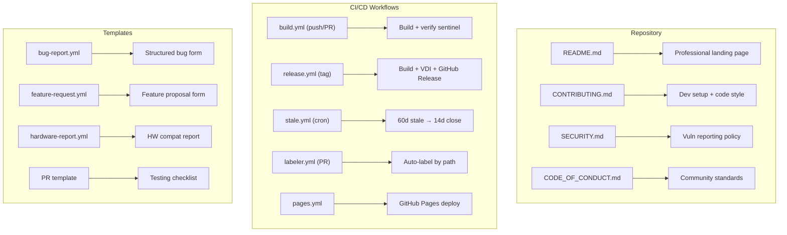
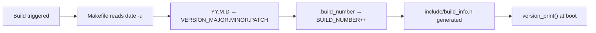
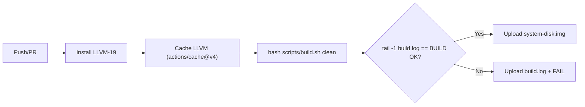
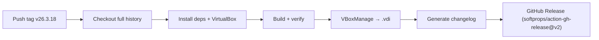

<!-- docs: covers=todo/00-infrastructure/TODO-09-repository-transfer-rizonetech.md sources=.github/workflows/build.yml,.github/workflows/release.yml,.github/workflows/pages.yml,.github/workflows/site-live.yml,.github/workflows/linkcheck.yml,.github/workflows/stale.yml,.github/workflows/labeler.yml,scripts/build.sh reviewed=2026-09-28 -->
# GitHub Repository Setup

> Professional GitHub repository infrastructure for Impossible OS -- CI/CD, templates, security policies, and community assets.

## Overview

The `rizonesoft/impossible-os` GitHub repository is configured with CI/CD pipelines, automated release management, issue/PR templates, branch protection, and community documentation. A secondary archived repo (`rizonesoft/impossible-os-bootloader`) exists but all development happens in the main repo.

> **Repository ownership and org policy.** [`todo/00-infrastructure/TODO-09`](../../todo/00-infrastructure/TODO-09-repository-transfer-rizonetech.md) tracks the completed transfer (executed **2026-04-27**) from `rizonesoft/impossible-os` to `rizonesoft/impossible-os` (enterprise org), plus the §8 future move-back / public-visibility runbook ([`repository-move-back-runbook.md`](repository-move-back-runbook.md)).
>
> **Moved back and made public 2026-09-27:** owner is `rizonesoft` (personal account), visibility **public**, `rizonetech/impossible-os` 301-redirects here. Custom domain `impossibleos.co` (apex A records on GitHub Pages IPs, cert approved, HTTPS **enforced**). The admin bypass on the `Default Branch Security` ruleset is restored. Secret scanning and push protection are enabled. Execution record: [move-back and public-visibility runbook](../../todo/00-infrastructure/TODO-09-repository-transfer-rizonetech.md#8-move-back-and-public-visibility-runbook).
>
> **DNS:** the `www` CNAME targets `rizonesoft.github.io` (flipped 2026-09-27; re-checked 2026-09-28 through a public resolver, and `https://www.impossibleos.co/` returns 301 to the apex). **Operator-pending:** the autonomous-agent boundary check (Settings -> Copilot -> Access policies) is an operator-only UI check with no public API.
>
> The pre-transfer current-state baseline -- repository identity, Pages source mode, DNS, Actions/secrets/rulesets, hard-coded owner references, risk register -- is captured once in [`repository-transfer-preflight.md`](repository-transfer-preflight.md) so the §5 / §7 audits and the eventual §8 move-back compare against a single source of truth.

---

## Repository Structure

| Repository                            | Visibility | Purpose                                    |
| ------------------------------------- | ---------- | ------------------------------------------ |
| `rizonesoft/impossible-os`            | Public     | Kernel, bootloader, desktop, drivers, apps |
| `rizonesoft/impossible-os-bootloader` | Public     | Superseded pre-release stopgap -- retire post-acceptance (see Secure Boot note) |

> **Secure Boot release plan (decided 2026-06-16).** At public release, the shim-review / Microsoft 3rd-party UEFI CA submission uses the **main source** (`rizonesoft/impossible-os`, which builds `BOOTX64.EFI` from `src/boot/uefi/`), NOT a separate bootloader repo. `rizonesoft/impossible-os-bootloader` was only ever a pre-release stopgap; it is not part of the future signing path. Retire it once the release main-source submission is accepted. Do not delete it while any upstream `rhboot/shim-review` submission referencing it is still open. The local `bootloader` git remote was removed 2026-06-16 (nothing syncs to it; the `BOOTLOADER_REPO_TOKEN` secret is orphaned with no consumer).

---

## README & Community Documents

### Professional README

`README.md` -- the project's public face. Features:

| Section           | Content                                                             |
| ----------------- | ------------------------------------------------------------------- |
| Hero              | Logo, tagline, badge row (License, Platform, Boot, Language, LOC)   |
| Feature Table     | 20-row table showcasing implemented OS capabilities                 |
| Quick Start       | 4-line build instructions: clone → setup.sh → build.sh run          |
| Architecture      | ASCII diagrams: boot chain, memory model, storage stack             |
| Project Structure | Full directory tree with descriptions                               |
| Testing           | Matrix: QEMU, VirtualBox, Hyper-V, real hardware                    |
| Acknowledgments   | Credits: stb_truetype, SerenityOS, OVMF, OSDev Wiki, Adwaita, Inter |

**Badges (shields.io):**

| Badge         | Status                                              |             |
| ------------- | --------------------------------------------------- | ----------- |
| Build Status  | Deferred -- links to CI workflow when available      |             |
| License       | `GPL-3.0-only`                                      |             |
| Platform      | `x86_64`                                            |             |
| Boot          | `UEFI`                                              |             |
| Language      | `C                                                  | x86-64 ASM` |
| Lines of Code | `84k+` -- auto-tracked via COUNT.md post-commit hook |             |

### CONTRIBUTING.md

Contributor guidelines (160+ lines):

| Section           | Content                                                            |
| ----------------- | ------------------------------------------------------------------ |
| Quick Start       | `setup.sh` + git hooks setup                                       |
| Code Style        | snake_case, UPPER_CASE macros, `#pragma once`, ≤120 chars, <50 LOC |
| Commit Format     | `"scope: description"` -- 10+ scopes with examples                  |
| PR Process        | Fork → branch → implement → test → PR (6-step checklist)           |
| Finding Work      | `todo/TODO-00-INDEX.md` + "Good First Issues" suggestions         |
| Memory Allocation | kmalloc ≤4 KB vs PMM table + CAUTION callout                       |
| Release Tags      | CalVer format table                                                |
| Branch Naming     | `feature/*`, `fix/*`, `docs/*`, `refactor/*`                       |

### SECURITY.md

Vulnerability reporting policy:

| Item               | Detail                                                  |
| ------------------ | ------------------------------------------------------- |
| Contact            | `derick@rizonetech.com` (not public issues)             |
| Response timeline  | 48h acknowledge → 7d assess → 14–30d fix                |
| Threat categories  | Bootloader bypass, privilege escalation, memory corrupt |
| MOK key compromise | 6-step revoke/re-sign/release procedure                 |

> [!CAUTION]
> **MOK Private Key Security:** The MOK private key (`MOK.key`) MUST NEVER be committed to any repository. Store in encrypted vault or hardware token. Compromise allows signing malware that bypasses Secure Boot on enrolled machines.

### CODE_OF_CONDUCT.md

Contributor Covenant v2.1. Contact: `derick@rizonetech.com`.

### LICENSE

GPL-3.0-only (changed from MIT in commit `474abac`).

---

## Versioning System

### CalVer (Calendar Versioning)

Version scheme: `YY.M.D.BUILD` (e.g., `26.3.17.819`).

| Component       | Source                            | Example   |
| --------------- | --------------------------------- | --------- |
| `VERSION_MAJOR` | `date -u '+%y'`                   | `26`      |
| `VERSION_MINOR` | `date -u '+%-m'`                  | `3`       |
| `VERSION_PATCH` | `date -u '+%-d'`                  | `17`      |
| `VERSION_BUILD` | `.build_number` (auto-increment)  | `819`     |
| `BUILD_COMMIT`  | `git rev-parse --short HEAD`      | `d1016ab` |
| `BUILD_BRANCH`  | `git rev-parse --abbrev-ref HEAD` | `main`    |

> [!NOTE]
> CalVer was chosen over SemVer because Impossible OS is in rapid development with no stable API to version against. Can migrate to SemVer when releases become meaningful.

### Git Tag Conventions

| Format                    | Example            | Type        |
| ------------------------- | ------------------ | ----------- |
| `v{YY}.{M}.{D}`           | `v26.3.18`         | Release     |
| `v{YY}.{M}.{D}-alpha.{N}` | `v26.3.18-alpha.1` | Pre-release |
| `v{YY}.{M}.{D}-beta.{N}`  | `v26.3.18-beta.1`  | Pre-release |
| `v{YY}.{M}.{D}-rc.{N}`    | `v26.3.18-rc.1`    | Pre-release |

Tags are annotated: `git tag -a v26.3.18 -m "Release v26.3.18"`

### Changelog Generation

`scripts/generate-changelog.sh` -- 175 lines, 20+ category mappings.

- Parses `git log` between tags
- Groups by commit prefix: Features, Fixes, Build, Drivers, Desktop, Kernel
- Outputs markdown with short commit hashes
- Generates 794+ lines from full history
- Integrated into release workflow

---

## CI/CD Workflows

### Build & Smoke Test (`build.yml`)

Triggers on **push to `main`** and **pull requests**.

| Setting       | Value                                                       |
| ------------- | ----------------------------------------------------------- |
| Runner        | `ubuntu-latest`, 15-minute timeout                          |
| Cache key     | `llvm-19-Linux-v1` (bump suffix to invalidate)              |
| Disk artifact | `system-disk.img` -- 14-day retention                        |
| Log artifact  | `build.log` -- 7-day retention, always uploaded              |
| Smoke test    | Commented out -- uncomment after `test-smoke.sh` integration |

**Dependencies installed:**
- `clang-19`, `lld-19` (from `apt.llvm.org` snapshot repo)
- `nasm`, `mtools`, `dosfstools`, `ovmf`, `gcc`, `qemu-system-x86`

> [!NOTE]
> LLVM 19 is not in ubuntu-latest by default -- installed from `apt.llvm.org`. `gcc` is HOST_CC for host tools (`mkfs-ixfs`, `make-system-disk`). `dosfstools` provides `mkfs.fat`, `mtools` provides `mcopy`.

### Automated Release (`release.yml`)

Triggers on **tag push matching `v*`**.

**Release assets:**

| Asset                                | Description                    |
| ------------------------------------ | ------------------------------ |
| `build/system-disk.img`              | Raw GPT image (QEMU, USB boot) |
| `build/system-disk.vdi`              | VirtualBox native format       |
| `docs/getting-started/qemu.md`       | QEMU setup guide               |
| `docs/getting-started/virtualbox.md` | VirtualBox setup guide         |
| `build/build.log`                    | Build log                      |

| Setting        | Detail                                                  |      |             |
| -------------- | ------------------------------------------------------- | ---- | ----------- |
| Pre-release    | Auto-detected via regex: `-(alpha                       | beta | rc)` in tag |
| Changelog      | `git log --pretty` between previous tag and HEAD        |      |             |
| VDI conversion | `VBoxManage convertfromraw` (from `virtualbox` package) |      |             |
| Permissions    | `contents: write` (for release creation)                |      |             |
| LLVM cache     | Shared key with `build.yml`                             |      |             |

### Stale Issue Cleanup (`stale.yml`)

Uses `actions/stale@v9`. Runs daily at 01:30 UTC.

| Setting       | Value                                        |
| ------------- | -------------------------------------------- |
| Stale after   | 60 days of inactivity → `stale` label        |
| Close after   | 14 days after stale label                    |
| Exempt labels | `pinned`, `security`, `help-wanted`          |
| Rate limit    | `operations-per-run: 30` (GitHub API limits) |
| Permissions   | `issues: write`, `pull-requests: write`      |

### Auto-Label PRs (`labeler.yml`)

Uses `actions/labeler@v5` with `changed-files` / `any-glob-to-any-file` syntax.

Triggers on `pull_request` (opened, synchronize).

| Label           | Path Glob                |
| --------------- | ------------------------ |
| `kernel`        | `src/kernel/**`          |
| `bootloader`    | `src/boot/**`            |
| `desktop`       | `src/desktop/**`         |
| `drivers`       | `src/kernel/drivers/**`  |
| `build`         | `scripts/**`, `Makefile` |
| `documentation` | `docs/**`, `*.md`        |

---

## Issue & PR Templates

### Issue Templates

Located in `.github/ISSUE_TEMPLATE/`:

| Template        | File                  | Auto-Label        | Key Fields                                                       |
| --------------- | --------------------- | ----------------- | ---------------------------------------------------------------- |
| Bug Report      | `bug-report.yml`      | `bug`             | Description, steps, expected/actual, environment, component, log |
| Feature Request | `feature-request.yml` | `enhancement`     | Description, use case, implementation, component, roadmap check  |
| Hardware Report | `hardware-report.yml` | `hardware-compat` | Model, CPU, RAM, GPU, storage, boot result, boot log             |

**`config.yml`:** Blank issues disabled -- directs to Discussions + TODO roadmap.

**Environment dropdown options:** QEMU, VirtualBox, Hyper-V, VMware, Real Hardware

**Component dropdown options:** Kernel, Bootloader, Desktop, Drivers, Filesystem, Networking, Userland, Build System

### PR Template

`.github/PULL_REQUEST_TEMPLATE.md` -- includes:
- Description section
- Related TODO reference
- Testing checklist (build.sh clean + run + serial check)
- Type of Change checkboxes
- Screenshots/Serial Output section

---

## Labels & Project Board

### Label Taxonomy

**Priority labels (red gradient):**

| Label         | Color     | Description                       |
| ------------- | --------- | --------------------------------- |
| `P0-critical` | `#B60205` | Blocks development or breaks boot |
| `P1-high`     | `#D93F0B` | Important, fix soon               |
| `P2-medium`   | `#FBCA04` | Normal priority                   |
| `P3-low`      | `#0E8A16` | Polish, someday                   |

**Component labels (blue gradient):**

| Label        | Color     | Description                       |
| ------------ | --------- | --------------------------------- |
| `kernel`     | `#0075ca` | Kernel core, memory, scheduler    |
| `bootloader` | `#006b75` | UEFI boot chain                   |
| `desktop`    | `#1d76db` | Window manager, compositor, shell |
| `drivers`    | `#5319e7` | Hardware drivers (AHCI, USB, NIC) |
| `filesystem` | `#0052cc` | VFS, FAT32, IXFS                  |
| `networking` | `#0e8a16` | TCP/IP, DNS, HTTP                 |
| `apps`       | `#c5def5` | Built-in apps                     |

**Type labels:**

| Label             | Color     | Description             |
| ----------------- | --------- | ----------------------- |
| `bug`             | `#d73a4a` | Something is broken     |
| `enhancement`     | `#a2eeef` | New feature/improvement |
| `documentation`   | `#0075ca` | Documentation only      |
| `question`        | `#d876e3` | Question or discussion  |
| `hardware-compat` | `#e4e669` | Hardware compat report  |

**Status labels:**

| Label              | Color     | Description               |
| ------------------ | --------- | ------------------------- |
| `help-wanted`      | `#008672` | Looking for contributors  |
| `good-first-issue` | `#7057ff` | Good for newcomers        |
| `wontfix`          | `#ffffff` | Not going to fix          |
| `duplicate`        | `#cfd3d7` | Duplicate issue           |
| `stale`            | `#ededed` | Auto-applied by stale bot |
| `pinned`           | `#006b75` | Exempt from stale cleanup |

### GitHub Project Board

"Impossible OS Development" -- GitHub Projects v2.

| Column      | Purpose                       |
| ----------- | ----------------------------- |
| Backlog     | Unstarted work items          |
| In Progress | Currently being worked on     |
| In Review   | PR submitted, awaiting review |
| Done        | Merged and verified           |

**Milestones (matching TODO phases):**

| Milestone                    | TODO Range   |
| ---------------------------- | ------------ |
| Phase 01: Kernel Foundations | TODO-010–050 |
| Phase 02: GFX & UI Framework | TODO-110–150 |
| Phase 03: Core Services      | TODO-230–300 |
| Phase 04: Desktop Shell      | TODO-160–220 |
| Phase 05: Core Apps          | TODO-310–370 |
| Phase 06: Multimedia         | TODO-380–390 |
| Phase 07: Networking         | TODO-400–450 |

---

## Branch Protection & Policies

### Branch Protection Rules (`main`)

| Rule                             | Status                              |
| -------------------------------- | ----------------------------------- |
| Required status checks (`build`) | ✅ Enabled                           |
| Linear history (rebase only)     | ✅ Enabled                           |
| Signed commits (GPG/SSH)         | ⏭️ Skipped (not configured locally) |
| Disallow force push              | ✅ Enabled                           |
| Disallow deletions               | ✅ Enabled                           |

### Branch Naming Convention

| Prefix       | Purpose          | Example                     |
| ------------ | ---------------- | --------------------------- |
| `feature/*`  | New features     | `feature/usb-mass-storage`  |
| `fix/*`      | Bug fixes        | `fix/fat32-lfn-overflow`    |
| `docs/*`     | Documentation    | `docs/ahci-architecture`    |
| `refactor/*` | Code refactoring | `refactor/vfs-path-resolve` |

### CODEOWNERS

`.github/CODEOWNERS` -- `@derickpayne` as default owner.

Critical path explicit ownership:
- `src/boot/` -- bootloader
- `src/kernel/memory/` -- memory management
- `src/kernel/sched/` -- scheduler
- `linker.ld` -- linker scripts
- `Makefile` -- build system
- `scripts/build.sh` -- build script

---

## GitHub Pages

The landing page, the design mockups and the documentation site, generated by `scripts/site/build.py` from `gh-pages/` templates and `docs/`. Nothing generated is committed; the old `gh-pages` branch is dormant and kept.

| Feature    | Detail                                                                           |
| ---------- | -------------------------------------------------------------------------------- |
| Content    | Landing page (countdown, feature cards, donate), design mockups, docs            |
| Deploy     | `.github/workflows/pages.yml` ("GitHub Pages"): check, build, deploy, verify     |
| Live check | `site-live.yml` every 6 hours: live site byte-identical to `main`, else redeploy |
| Link check | `linkcheck.yml` every Monday: external links in `docs/` and `gh-pages/`          |
| Trigger    | Every push to `main`, full history (the docs freshness table needs it)           |
| URL        | `https://impossibleos.co/` (custom domain, HTTPS enforced)                       |
| Facts      | `project.json`: owner, URLs, release date, PayPal `donate_url`, About box        |

---

## Key Files

| File                                         | Purpose                       |
| -------------------------------------------- | ----------------------------- |
| `README.md`                                  | Professional project README   |
| `CONTRIBUTING.md`                            | Contributor guidelines        |
| `CODE_OF_CONDUCT.md`                         | Contributor Covenant v2.1     |
| `SECURITY.md`                                | Security vulnerability policy |
| `LICENSE`                                    | GPL-3.0-only license          |
| `CHANGELOG.md`                               | Auto-generated changelog      |
| `.github/CODEOWNERS`                         | Code review ownership         |
| `.github/PULL_REQUEST_TEMPLATE.md`           | PR description template       |
| `.github/ISSUE_TEMPLATE/bug-report.yml`      | Bug report form               |
| `.github/ISSUE_TEMPLATE/feature-request.yml` | Feature request form          |
| `.github/ISSUE_TEMPLATE/hardware-report.yml` | Hardware compat report        |
| `.github/ISSUE_TEMPLATE/config.yml`          | Issue template config         |
| `.github/labeler.yml`                        | PR auto-label definitions     |
| `.github/workflows/build.yml`                | CI build + smoke test         |
| `.github/workflows/release.yml`              | Disk image release on tag     |
| `.github/workflows/stale.yml`                | Stale issue cleanup           |
| `.github/workflows/labeler.yml`              | PR auto-labeler               |
| `.github/workflows/pages.yml`                | GitHub Pages deploy + verify  |
| `.github/workflows/site-live.yml`            | Live site drift + redeploy    |
| `.github/workflows/linkcheck.yml`            | Weekly external link check    |
| `scripts/generate-changelog.sh`              | Changelog generator           |

---

## Gotchas

> [!CAUTION]
> **MOK key in version control.** The `MOK.key` private key must NEVER be committed. Store in encrypted vault or hardware token.

> [!WARNING]
> **LLVM-19 not in ubuntu-latest.** CI must install from `apt.llvm.org` snapshot repo. Cache key `llvm-19-Linux-v1` -- bump suffix to invalidate.

> [!WARNING]
> **VBoxManage in CI.** Release workflow installs the `virtualbox` package for VDI conversion. This adds ~2 min to CI runtime.

> [!NOTE]
> **Build CI smoke test.** Currently commented out in `build.yml` -- uncomment when `scripts/test-smoke.sh` is integrated into CI pipeline.

> [!NOTE]
> **License change.** License was changed from MIT to GPL-3.0-only (commit `474abac`). All badges and documentation reflect GPL-3.0-only.

---

## OS Comparison

| Feature                      | 🐧 Linux Kernel (GitHub) | 🌊 SerenityOS          | 🚀 Impossible OS                         |
| ---------------------------- | ----------------------- | --------------------- | --------------------------------------- |
| Professional README          | ✅ Extensive             | ✅ Screenshots + GIF   | ✅ Badges + feature table + architecture |
| Badges (build, version, LOC) | ⚠️ Minimal              | ✅ Build badge         | ✅ 6 badges including LOC auto-tracking  |
| Semantic versioning          | ✅ `uname -r`            | ✅ Date-based          | ✅ CalVer `YY.M.D.BUILD`                 |
| Auto-generated changelog     | ✅ `git log`             | ⚠️ Manual             | ✅ 20+ category script                   |
| CI build on push             | ✅ kernel.org CI         | ✅ GitHub Actions      | ✅ LLVM-19 cached build                  |
| Automated releases           | ✅ kernel.org tarballs   | ✅ Nightly builds      | ✅ Tag-triggered with VDI + docs         |
| Issue templates (YAML forms) | ❌ Mailing list          | ✅ Bug + feature forms | ✅ 3 forms + config                      |
| PR template                  | ❌ Mailing list          | ✅ Template            | ✅ Checklist + screenshots               |
| Branch protection            | ✅ Strict                | ✅ Main protected      | ✅ Status checks + linear history        |
| CODEOWNERS                   | ✅ MAINTAINERS file      | ⚠️ Implied            | ✅ Critical path ownership               |
| CONTRIBUTING.md              | ✅ Extensive             | ✅ Detailed            | ✅ 160+ lines with memory rules          |
| SECURITY.md                  | ✅ security@kernel.org   | ⚠️ No formal policy   | ✅ 48h ack + MOK procedure               |
| Hardware compat reports      | ❌ Separate DB           | ❌ None                | ✅ **Unique -- structured YAML form**     |
| Stale issue bot              | ❌ N/A (mailing list)    | ⚠️ Manual             | ✅ 60d/14d auto-cleanup                  |
| Auto-label by path           | ❌ N/A                   | ⚠️ Manual labels      | ✅ 6 labels via glob patterns            |
| Project website              | ✅ kernel.org            | ✅ serenityos.org      | ✅ GitHub Pages landing page             |

---

## References

- Repository: [rizonesoft/impossible-os](https://github.com/rizonesoft/impossible-os)
- CI config: `.github/workflows/`
- Templates: `.github/ISSUE_TEMPLATE/`
- Related: [Development Tooling](development-tooling.md)
