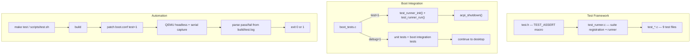
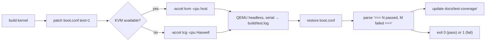

# Kernel Test Framework

> Automated kernel unit test system: 9 test files, 38 suites, 96 assertions, with `make test` headless runner, pre-push hooks, and coverage tracking.

## Overview

Impossible OS has a built-in kernel unit test framework that runs during boot. Tests are compiled into the kernel unconditionally (`-DKERNEL_TESTS`) and gated by boot.conf flags: `test=1` runs unit tests then shuts down (CI mode), `debug=1` runs unit tests plus boot integration tests then continues to desktop.



---

## Test API

Header: `include/kernel/test/test.h` | Implementation: `src/kernel/test/test_runner.c`

| Function | Purpose |
|---|---|
| `TEST_ASSERT(cond, msg)` | Assert condition; logs `[ OK ]` or `[FAIL]` with file:line |
| `test_suite_register(name, fn)` | Register a test suite (name + void function) |
| `test_runner_init()` | Initialize framework, register all built-in suites |
| `test_runner_run()` | Run all suites, print per-suite results + summary |

### Writing a Test

```c
#ifdef KERNEL_TESTS

#include "kernel/test/test.h"
#include "kernel/subsystem.h"

static void test_feature(void)
{
    TEST_ASSERT(some_function() == expected, "description of check");
}

void test_register_subsystem(void)
{
    test_suite_register("Subsystem: feature", test_feature);
}

#endif /* KERNEL_TESTS */
```

Then add to `test_runner_init()` in `test_runner.c`:
```c
extern void test_register_subsystem(void);
// ...
test_register_subsystem();
```

The Makefile auto-discovers new `.c` files — no build system changes needed.

### Output Format

```
[ OK ] TEST: === Running 38 test suite(s) ===
[ OK ] TEST: --- Suite: PMM: alloc+free ---
[ OK ] TEST: [ OK ] PMM: alloc+free :: pmm_alloc_frame returns non-zero
[ OK ] TEST: [ OK ] PMM: alloc+free :: allocated frame is page-aligned
[FAIL] TEST: [FAIL] Heap: overlap :: allocations overlap  (test_heap.c:45)
[ OK ] TEST: === 95 tests passed, 1 failed ===
```

---

## Test Suites

9 test files, 38 suites, 96 assertions (auto-tracked in `docs/test-coverage/coverage.md`):

| File | Suites | Assertions | Subsystem |
|---|---|---|---|
| `test_pmm.c` | 2 | 5 | Physical memory: alloc+free, contiguous, alignment |
| `test_heap.c` | 4 | 9 | Kernel heap: kmalloc, kfree, zero-byte, no-overlap, krealloc |
| `test_vfs.c` | 3 | 9 | Virtual filesystem: create/write/read, open nonexistent, mkdir+rmdir |
| `test_sched.c` | 1 | 1 | Scheduler: thread_create returns valid TID |
| `test_registry.c` | 2 | 8 | Win32 registry: DWORD and string set/get via RegSetValueEx/RegGetValue |
| `test_boot_init.c` | 8 | 19 | Boot init: result values, subsystem readiness, BOOT_REQUIRE, POST codes |
| `test_klog.c` | 6 | 9 | Kernel logging: ring buffer, level filtering, global override, rate limit API |
| `test_ob.c` | 7 | 23 | Object Manager: alloc+header roundtrip, refcount, handles, namespace, NtDuplicate |
| `test_security.c` | 5 | 13 | Security: SID compare/format, ACL roundtrip, system token, privilege lookup |

---

## Running Tests

### Local: `make test`

```bash
make test                  # run all suites
make test SUITE=pmm        # filter to PMM suites only
bash scripts/test.sh       # same with colored output + KVM auto-detect
```

`scripts/test.sh` handles the full pipeline:



### Boot modes

| boot.conf | What runs | After tests |
|---|---|---|
| `test=1` | Unit tests only (38 suites) | `acpi_shutdown()` — QEMU exits |
| `debug=1` | Unit tests + boot integration tests | Desktop continues |
| Both `0` | Nothing | Desktop directly |

### Pre-push hook (optional)

```bash
bash scripts/install-hooks.sh         # install
bash scripts/install-hooks.sh --remove # remove
```

When installed, `git push` runs `make test` first. Push is blocked if tests fail.

> [!NOTE]
> Requires KVM access for fast QEMU. Add user to kvm group: `sudo usermod -aG kvm $USER`

---

## Test Coverage Tracking

`scripts/test-coverage.sh` scans `src/kernel/test/test_*.c` for `TEST_ASSERT` and `test_suite_register` calls.

```bash
bash scripts/test-coverage.sh           # print table to terminal
bash scripts/test-coverage.sh --save    # update docs/test-coverage/
```

Output files (tracked in git):
- `docs/test-coverage/coverage.md` — markdown table
- `docs/test-coverage/coverage.json` — machine-readable for trend analysis

Coverage auto-regenerates on every `bash scripts/build.sh` and on every successful `make test`.

---

## Key Files

| File | Purpose |
|---|---|
| `include/kernel/test/test.h` | Test framework API (TEST_ASSERT, registration) |
| `src/kernel/test/test_runner.c` | Suite runner: init, run, summary |
| `src/kernel/test/test_*.c` | 9 test files (38 suites, 96 assertions) |
| `src/kernel/main/boot_tests.c` | Boot-time test orchestration (test=1 / debug=1 gate) |
| `scripts/test.sh` | Headless test runner (make test backend) |
| `scripts/test-coverage.sh` | Coverage scanner → docs/test-coverage/ |
| `scripts/patch-boot-conf.sh` | Patch boot.conf in disk image without rebuild |
| `scripts/install-hooks.sh` | Install/remove pre-push hook |
| `scripts/hooks/pre-push` | Pre-push hook: build + test before push |
| `resources/boot/boot.conf` | `test=1` / `debug=1` flags |
| `docs/test-coverage/coverage.md` | Auto-generated coverage report |
| `Makefile` | `make test` target (line 421) |

---

## Gotchas

> [!CAUTION]
> **KVM required for fast tests.** Without `/dev/kvm` access, QEMU falls back to TCG which is ~10x slower. A full boot may not complete within the 60s timeout under TCG. Fix: `sudo usermod -aG kvm $USER` then restart WSL.

> [!WARNING]
> **Tests modify shared kernel state.** Tests that change subsystem readiness (boot_init tests) or log levels (klog tests) must save and restore the original state. Failure to restore causes cascading test failures.

> [!NOTE]
> **Rate limiter tests are timing-dependent.** The klog rate limiter uses tick-based windows (100 ticks = 1s). On fast WHPX systems, 150 messages may complete within a single window before rate limiting engages. The rate limit API test verifies the interface, not the timing behavior.

> [!NOTE]
> **`-DKERNEL_TESTS` is always on.** Test code compiles unconditionally into the kernel. The `#ifdef KERNEL_TESTS` guards mean test functions exist but are only called when `test=1` or `debug=1`. This is intentional — zero-overhead in production (dead code elimination).

---

## OS Comparison

| Feature | Win11 | Linux | Impossible OS |
|---|---|---|---|
| Kernel unit test framework | KUnit + WHQL HLK | KUnit + kselftest | `test.h` + `test_runner.c` (38 suites, 96 assertions) |
| CI build verification | Internal CI | kernel.org CI | GitHub Actions `build.yml` |
| Local headless test runner | Manual VM setup | `make kselftest` | `make test` + `scripts/test.sh` (KVM auto-detect) |
| Test filtering | HLK suite selection | KUnit module param | `make test SUITE=pmm` |
| Pre-push test hook | Not standard | Optional | `scripts/install-hooks.sh` (optional) |
| Coverage tracking | Internal tooling | lcov (optional) | `scripts/test-coverage.sh` → `docs/test-coverage/` |
| Boot-gated test modes | N/A | N/A | `test=1` (CI) vs `debug=1` (interactive) |

---

## References

- Source: `src/kernel/test/`, `include/kernel/test/`
- Boot integration: `src/kernel/main/boot_tests.c`
- Scripts: `scripts/test.sh`, `scripts/test-coverage.sh`, `scripts/install-hooks.sh`
- Coverage: `docs/test-coverage/coverage.md`
- Parent doc: [Development Tooling](development-tooling.md)
