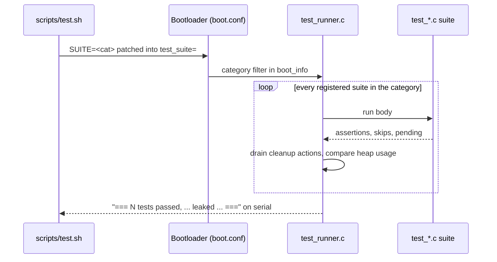

<!-- docs: covers=todo/00-infrastructure/TODO-03-kernel-test-harness.md sources=include/kernel/test/test.h,src/kernel/test/test_runner.c,include/kernel/mm/heap.h,include/kernel/test/race_barrier.h,include/kernel/test/scratch.h,scripts/test.sh reviewed=2026-09-28 order=4 -->
# Kernel Test Harness

## What is it?

The kernel test harness runs unit tests inside the real kernel at boot and reports the results over the serial line, where `scripts/test.sh` reads them. Beyond plain assertions, it gives tests the tools to reach code a normal boot never exercises: forced allocation failures, ordered two-thread interleavings, large scratch buffers and per-test leak detection. It exists because many error paths were untested simply because no infrastructure could drive them.

## How does it work?

Test files under [`src/kernel/test/`](../../src/kernel/test/) register suites with a category. At boot, the runner in [`test_runner.c`](../../src/kernel/test/test_runner.c) runs every suite in the selected category, cleans up after each one, checks the heap for leaks, and prints a summary line. On the host, [`scripts/test.sh`](../../scripts/test.sh) builds the image, boots it in QEMU, and parses that line.



- **Categories.** `test_category_t` in [`test.h`](../../include/kernel/test/test.h) lists 17 categories, from `TEST_CAT_MM` to `TEST_CAT_QUOTA`. Each has a `make test-<cat>` target.
- **Cleanup registry.** `test_add_action()` pushes a cleanup callback onto a per-suite LIFO stack that the runner drains after the suite body, whether it passed or failed. Scratch buffers and log suppression are built on it.
- **Fault injection.** Countdown setters in [`heap.h`](../../include/kernel/mm/heap.h) make the Nth `kmalloc` return NULL; the same shape extends to the PMM, the VMM and user-copy helpers, and can be scoped to one task.
- **Race barrier.** [`race_barrier.h`](../../include/kernel/test/race_barrier.h) holds two threads at a rendezvous point and releases them in a chosen order, so a test can aim at one interleaving instead of hoping a race happens. The ordering is reliable on one CPU but best-effort across CPUs; the header explains how to add a join or a completion flag when a test needs strict cross-CPU order.
- **Leak detection.** The runner compares heap usage before and after each suite (after the cleanup drain). An unexplained difference is counted as a leak, and the host treats any leak as a failure.

## What are its interfaces?

| Interface | Purpose |
| --------- | ------- |
| `test_suite_register_cat(name, fn, cat)` | Register a suite in a category ([`test.h`](../../include/kernel/test/test.h)) |
| `TEST_ASSERT`, `TEST_ASSERT_EQ(a, b, msg)`, `TEST_ASSERT_NULL` and friends | Assertions that record file and line on failure |
| `TEST_SKIP(msg)` | Record a skip (for absent hardware); it does not leave the suite, so `return` after it |
| `TEST_PENDING(cond, msg)` | Mark a contract for a feature that is not implemented yet; shows `[STUB]` and counts as pending, not failed |
| `test_add_action(fn, ctx)` | Register a cleanup that runs after the suite |
| `TEST_EXPECT_LEAK(bytes, reason)`, `TEST_LEAK_IGNORE(reason)` | Declare an intentional allocation that outlives the suite |
| `kmalloc_fail_countdown_set(n)`, `kmalloc_fail_next()` | Force an allocation failure ([`heap.h`](../../include/kernel/mm/heap.h)) |
| `TEST_SCRATCH_KBUF(name, size)` | Auto-freed scratch buffer larger than the kernel stack allows ([`scratch.h`](../../include/kernel/test/scratch.h)) |
| `TEST_KLOG_SUPPRESS(subsystem)` | Quiet a subsystem's expected log noise for one test ([`klog_suppress.h`](../../include/kernel/test/klog_suppress.h)) |
| `test_suite=` and `test_quiet=` in `boot.conf` | Category filter and verbosity, parsed by the bootloader |

Test files must not call live boot infrastructure (`panic`, `boot_progress`, a subsystem's `_init`); the rule and its opt-out are in the [Test Code Policy](test-policy.md).

## How do I use it?

```bash
bash scripts/test.sh              # every category
bash scripts/test.sh SUITE=mm     # one category
make test-mm                      # the same, as a make target
bash scripts/test.sh QUIET=1      # summary only
CI_PARITY=1 bash scripts/test.sh  # the QEMU package and TCG engine CI uses
```

The run ends with the runner's summary line, printed by [`test_runner.c`](../../src/kernel/test/test_runner.c) in this form:

```text
=== N tests passed, 0 failed, S skipped, P pending, L leaked, Q quota-leaked (T s) ===
```

A minimal suite looks like this:

```c
static void test_widget_rejects_null(void) {
    TEST_ASSERT_EQ(widget_open(NULL), STATUS_INVALID_PARAMETER, "NULL name refused");
}

void test_register_widget(void) {
    test_suite_register_cat("widget_rejects_null", test_widget_rejects_null, TEST_CAT_OB);
}
```

Live suite and assertion counts per file are on the generated [Kernel Test Coverage](../test-coverage/coverage.md) page.

## What is not implemented yet?

- The audit of the leak failures that per-test leak detection first surfaced is closed on QEMU (KVM, TCG) and WHPX, but its VirtualBox and bare-metal legs need an operator: [Audit and Classify the Leak Failures](../../todo/00-infrastructure/TODO-03-kernel-test-harness.md#9-audit--classify-the-50-leak-failures-8-surfaced).

Every other section of the roadmap file has shipped.

## How does it compare with Windows 11 and Linux?

Linux has in-kernel unit testing through KUnit, fault injection through `failslab` and `fail_page_alloc`, and leak reporting through kmemleak, which scans periodically rather than per test. Windows offers Driver Verifier's low-resources simulation for fault injection, but its kernel test infrastructure is not public. This harness combines all of these in one boot: task-scoped fault injection across several allocators, an ordered race barrier, and a leak count that fails the run in CI.

## See also

- [Kernel Test Harness roadmap](../../todo/00-infrastructure/TODO-03-kernel-test-harness.md)
- [Test Code Policy](test-policy.md)
- [Kernel Test Coverage](../test-coverage/coverage.md)
- [User-Mode Test Framework](usermode-test-framework.md)
- [Desktop and UI Test Framework](desktop-ui-test-framework.md)
