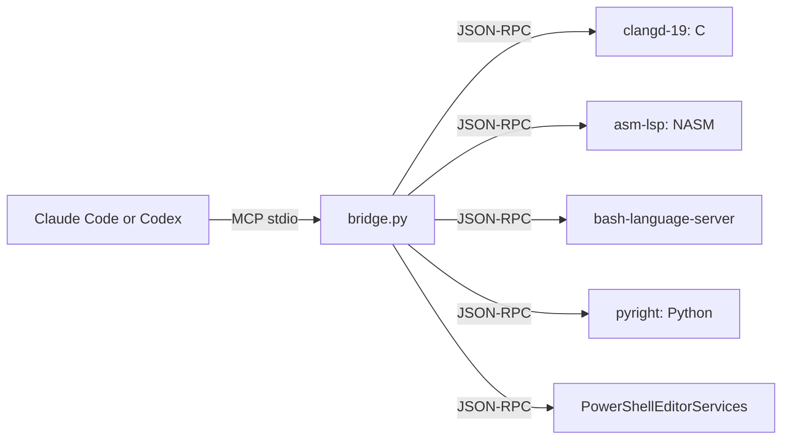

<!-- docs: covers=todo/00-infrastructure/TODO-07-lsp-mcp-bridge.md sources=scripts/lsp-mcp/bridge.py,scripts/lsp-mcp/lsp_client.py,scripts/lsp-mcp/logger.py,scripts/lsp-mcp/tests,.mcp.json reviewed=2026-09-28 order=8 -->
# LSP to MCP Bridge

## What is it?

The LSP to MCP bridge gives AI agents the same code intelligence an editor has. It is a host-side Model Context Protocol server that starts language servers on demand and exposes their read-only answers (go to definition, find references, hover, diagnostics and more) as MCP tools. An agent asking "where is `kmalloc` defined" gets the compiler's answer through clangd instead of a page of grep matches to disambiguate.

## How does it work?



- **Server.** [`bridge.py`](../../scripts/lsp-mcp/bridge.py) is the MCP server. It routes each tool call to the language server for the file's extension and starts that server the first time it is needed, so an idle bridge costs nothing.
- **Client.** [`lsp_client.py`](../../scripts/lsp-mcp/lsp_client.py) speaks JSON-RPC to one language server subprocess, with reader and stderr-drain threads and per-instance locks so different languages run in parallel.
- **Read-only boundary.** The client refuses LSP methods that change files (`textDocument/rename`, `workspace/applyEdit`, `workspace/executeCommand`), and a separate test audits the source for that list.
- **Lifecycle.** A crashed language server is restarted with exponential backoff (1, 2, 4 seconds and so on, capped at 30), and on shutdown the bridge reaps each server's process group so ordinary helpers do not outlive the session. A descendant that deliberately leaves its session can still escape; see the limits below.
- **Logging.** [`logger.py`](../../scripts/lsp-mcp/logger.py) writes structured JSON lines with a correlation ID per call.

Registering clangd directly as an MCP server hung the harness, which is why the bridge exists as a separate process that owns the language servers.

## What are its interfaces?

The bridge registers 17 tools, confirmed by `--self-test` on 2026-09-28:

| Group | Tools |
| ----- | ----- |
| Core | `definition`, `references`, `hover`, `diagnostics`, `document_symbol`, `workspace_symbol` |
| Extended | `completion`, `signature_help`, `type_definition`, `implementation`, `declaration`, `call_hierarchy_incoming`, `call_hierarchy_outgoing`, `code_action` |
| Type hierarchy | `type_hierarchy_supertypes`, `type_hierarchy_subtypes` |
| Meta | `_health` |

It is registered for Claude Code in the repository's [`.mcp.json`](../../.mcp.json), which starts it with the C and Python servers warming in the background. Codex is configured with the same server set, but MCP calls from non-interactive Codex runs currently fail on an upstream Codex bug; that wiring and its status are part of [Automation Hardening](automation-hardening.md).

## How do I use it?

Check that the bridge starts:

```bash
python3 scripts/lsp-mcp/bridge.py --self-test
# [lsp-mcp] OK: 0 LSPs spawned, 17 tools registered, bridge ready
```

Run its tests:

```bash
bash scripts/lsp-mcp/tests/test_bridge.sh     # unit tests
bash scripts/lsp-mcp/tests/test_boundary.sh   # read-only boundary audit
```

In a Claude Code session the tools appear as `mcp__lsp-bridge__definition`, `mcp__lsp-bridge__references` and so on. Prefer them over text search for symbol questions. In a headless session the MCP servers may not have connected yet; the fallbacks for that case are in [MCP Usage](mcp-usage.md). The five language servers and their install commands are listed in the roadmap file's Format Quick Reference.

## What is not implemented yet?

- **Scale plan.** Partitioning clangd across several workspaces is planned but deliberately not built; it activates only when the repository crosses thresholds such as 2,000,000 core lines. See [Scale Roadmap](../../todo/00-infrastructure/TODO-07-lsp-mcp-bridge.md#19-scale-roadmap-deferred).
- **Teardown hardening.** Reaping a non-dumpable descendant whose session leader already exited needs a cgroup the bridge cannot create unprivileged ([section 23](../../todo/00-infrastructure/TODO-07-lsp-mcp-bridge.md#23-injected-clock-deadline-coverage-and-the-non-dumpable-child-reap-blind-spot)), which also parks closing the spawn-publication window against termination. That item, and recovering a record claimed mid-termination, wait on a process-wide signal design ([section 25](../../todo/00-infrastructure/TODO-07-lsp-mcp-bridge.md#25-restart-publish-confirmed-dead-gate-and-single-flight-teardown)). Separating claimed-in-use from retired spawn records is operator-gated ([section 26](../../todo/00-infrastructure/TODO-07-lsp-mcp-bridge.md#26-teardown-verdict-propagation-and-a-non-reaping-liveness-probe)).
- The bridge is verified on WSL2; native Linux and macOS runs are still pending.

## How does it compare with Windows 11 and Linux?

On Windows, clangd and other language servers reach AI assistants only through editor extensions, and Copilot's integration is closed. On Linux, editors such as Neovim and Emacs each run their own LSP client, and third-party MCP bridges exist but often expose editing methods. This bridge offers one read-only surface over five languages, with on-demand startup and automatic restart.

## See also

- [LSP to MCP Bridge roadmap](../../todo/00-infrastructure/TODO-07-lsp-mcp-bridge.md)
- [MCP Usage](mcp-usage.md)
- [TODO Metadata Layer and Graph](todo-metadata-layer.md): the other MCP server
- [Automation Hardening](automation-hardening.md)
