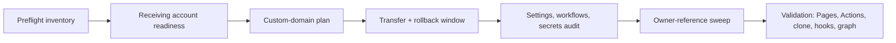

<!-- docs: covers=todo/00-infrastructure/TODO-09-repository-transfer-rizonetech.md sources=project.json,docs/infrastructure/repository-transfer-preflight.md,docs/infrastructure/repository-move-back-runbook.md,.github/workflows/pages.yml reviewed=2026-09-29 order=10 -->
# Repository Ownership and Transfers

## Where does the repository live?

The repository lives at [`rizonesoft/impossible-os`](https://github.com/rizonesoft/impossible-os) and is public. It moved to the `rizonetech` organization on 2026-04-27, then moved back and was made public on 2026-09-27; the old `rizonetech/impossible-os` path redirects here. The canonical owner, repository URL and site URL are recorded once in [`project.json`](../../project.json), and every published page derives them from there.

## How did the transfers work?

Both moves followed a written runbook with a baseline taken first, so every setting that GitHub does not carry across a transfer could be checked afterwards.



- **Preflight.** [Repository Transfer Preflight](repository-transfer-preflight.md) records the starting state: repository identity, Pages source, DNS, Actions and secrets, rulesets and every hard-coded owner reference.
- **Custom domain.** `impossibleos.co` is served by GitHub Pages. The apex uses GitHub's Pages A records and `www` is a CNAME to the owner's `github.io` host, so a transfer means re-verifying the domain and flipping the CNAME.
- **Settings that do not travel.** Rulesets can arrive with their bypass actors emptied, and organization teams do not map onto a personal account. Each was audited by before-and-after comparison.
- **Owner references.** First-party links were rewritten, and [`scripts/site/build.py --check`](../../scripts/site/build.py) now fails any live repository URL that names a non-canonical owner. Files that record the history on purpose are listed under `historical_owner_files` in `project.json`.
- **The tombstone rule.** Never create a repository or fork at a previous owner's path: GitHub then deletes that path's redirect permanently.

## What are its interfaces?

| Artifact | Purpose |
| -------- | ------- |
| [`project.json`](../../project.json) | Current owner, repository and site URLs; historical owners |
| [Repository Transfer Preflight](repository-transfer-preflight.md) | Baseline inventory and risk register |
| [Repository Move-Back Runbook](repository-move-back-runbook.md) | The return path and the public-visibility flip, step by step |
| [GitHub Setup](github-setup.md) | Contributor-facing record of the current owner state, workflows and branch protection |
| [`.github/workflows/pages.yml`](../../.github/workflows/pages.yml) | Builds and deploys the site after a move |

## How do I check the current state?

```bash
gh repo view rizonesoft/impossible-os --json nameWithOwner,visibility
curl -sI https://www.impossibleos.co/ | head -1   # HTTP/2 301 (to the apex)
python3 scripts/site/build.py --check              # site: OK, no stale owner URLs
```

On 2026-09-28 a public resolver returned `rizonesoft.github.io` as the `www` CNAME, and the `www` host answered 301. After cloning from an old URL, re-point the remote with `git remote set-url origin https://github.com/rizonesoft/impossible-os.git`.

## What is not implemented yet?

The documentation and both moves are complete; the remaining items are operator checks.

- Several validation items in the roadmap file still describe the intermediate `rizonetech` state (organization readiness, a DNS TTL restore, org-level Copilot policy). Reconciling them with the move-back needs an operator verdict and is filed in [Move-Back and Public-Visibility Runbook](../../todo/00-infrastructure/TODO-09-repository-transfer-rizonetech.md#8-move-back-and-public-visibility-runbook).
- Confirming that autonomous coding-agent pull requests stay disabled is a settings-page check with no public API: [Post-Transfer Settings Audit](../../todo/00-infrastructure/TODO-09-repository-transfer-rizonetech.md#5-post-transfer-settings-workflows-secrets-and-environments-audit).

## How does it compare with Windows 11 and Linux?

Windows is closed source, so there is no public equivalent. Open-source projects that change hosts, including Linux subsystems, usually handle it per project with mailing-list announcements and ad hoc link fixes. The difference here is a written, repeatable runbook with a rollback window, and a build check that keeps owner references from drifting afterwards.

## See also

- [Repository Transfer roadmap](../../todo/00-infrastructure/TODO-09-repository-transfer-rizonetech.md)
- [GitHub Setup](github-setup.md)
- [Repository Move-Back Runbook](repository-move-back-runbook.md)
- [Repository Transfer Preflight](repository-transfer-preflight.md)
- [Documentation Site](documentation-site.md)
