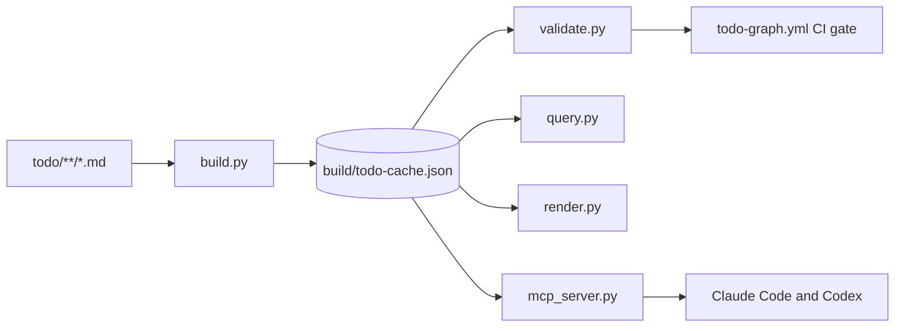

<!-- docs: covers=todo/00-infrastructure/TODO-06-todo-metadata-layer.md sources=scripts/todo-graph/build.py,scripts/todo-graph/validate.py,scripts/todo-graph/query.py,scripts/todo-graph/mcp_server.py,scripts/todo-graph/build-and-validate.sh,.github/workflows/todo-graph.yml reviewed=2026-09-28 order=7 -->
# TODO Metadata Layer and Graph

## What is it?

The TODO metadata layer turns the Markdown roadmap under `todo/` into a queryable graph without making Markdown any less canonical. Each roadmap file carries a small YAML frontmatter block with a stable ID; a generator reads every file (frontmatter, Implementation Order tables, cross-references and stamps) and writes a derived JSON cache. Tools then answer "what is ready to work on", "what blocks this", and "what references this section" from the cache instead of from fragile grep sweeps.

## How does it work?



- **Frontmatter.** Each file starts with fields such as `id`, `domain`, `status` and `title`. The authoritative spec is [TODO Frontmatter Spec](todo-metadata.md), with a machine-readable [JSON Schema](todo-metadata.schema.json).
- **Generator.** [`build.py`](../../scripts/todo-graph/build.py) parses every roadmap file and emits `build/todo-cache.json`, which is gitignored and always regenerated, never edited.
- **Validator.** [`validate.py`](../../scripts/todo-graph/validate.py) checks the cache for broken cross-references, duplicate IDs, dangling in-file anchors and similar structural faults.
- **Queries.** [`query.py`](../../scripts/todo-graph/query.py) answers questions over the cache, with TSV, Markdown or JSON output and a hard output ceiling that fails closed rather than truncating.
- **Rendering.** [`render.py`](../../scripts/todo-graph/render.py) draws the graph as Mermaid, Graphviz, ASCII or a Gantt view; the result is published as [TODO Dependency Graph](todo-graph.md).
- **MCP server.** [`mcp_server.py`](../../scripts/todo-graph/mcp_server.py) exposes the read-only query verbs to AI agents; see [MCP Usage](mcp-usage.md).

Dependencies are tracked at two levels. File-level `depends_on` frontmatter is supported but unused today, while the `Depends On` column of every Implementation Order table carries section-level dependencies across files. On 2026-09-28, `query.py stats` reported 233 roadmap files and 715 cross-file section dependencies.

## What are its interfaces?

| Command | Purpose |
| ------- | ------- |
| `bash scripts/todo-graph/build-and-validate.sh` | Rebuild the cache and run the validator (`make todo-graph`) |
| `python3 scripts/todo-graph/query.py section-ready` | Open sections that waited on another file and no longer do (sections with no cross-file dependency are excluded by design, so this is not a list of all runnable work) |
| `python3 scripts/todo-graph/query.py section-blocked` / `section-blocking` | What waits on what, ranked |
| `python3 scripts/todo-graph/query.py backlinks <id>` | Every reference to a roadmap file |
| `python3 scripts/todo-graph/query.py deferred-by <id>` | Stamps that parked work on a file |
| `python3 scripts/todo-graph/query.py code <id>` | Source files a roadmap file names |
| `python3 scripts/todo-graph/query.py stats` | Totals by status and domain |
| `make todo-graph-render-mermaid` | Regenerate the published graph page |
| `make todo-graph-mcp` | Run the MCP server in the foreground |

The CI gate is [`todo-graph.yml`](../../.github/workflows/todo-graph.yml), which rebuilds and validates on every push that touches `todo/`.

## How do I use it?

After editing any roadmap file, rebuild the cache as the last step before committing, because the pre-commit lint refuses a stale cache:

```bash
bash scripts/todo-graph/build-and-validate.sh --keep-cache
# [validate.py] 10/10 checks passed, 0 failure(s), 0 warning(s)
```

Then query it:

```bash
python3 scripts/todo-graph/query.py section-ready --limit 5
python3 scripts/todo-graph/query.py backlinks documentation-site --format markdown
```

A full rebuild of all 233 files took 2.2 seconds on the WSL2 development host on 2026-09-28.

## What is not implemented yet?

The remaining gaps are parked and operator-gated:

- **Parser residuals.** The Markdown scanner does not model multi-line link reference definitions or the interaction of lazy continuation lines with nested containers; both need a backtracking block parser, and three attempts were reverted on measurement. See [HTML Blocks Join the Tracker](../../todo/00-infrastructure/TODO-06-todo-metadata-layer.md#42-html-blocks-join-the-tracker-and-the-terminal-contract-carries-the-block-kind).
- **Control-plane parsers.** Several hooks and runner scripts still carry their own fence and clause parsing instead of the shared tracker, and the rewrite hook still swallows two failure classes; all are control-plane edits parked for an operator: [section 37](../../todo/00-infrastructure/TODO-06-todo-metadata-layer.md#37-one-clause-parser-decides-how-many-destinations-a-clause-names), [section 38](../../todo/00-infrastructure/TODO-06-todo-metadata-layer.md#38-every-gate-parser-adopts-the-shared-fence-tracker), [section 29](../../todo/00-infrastructure/TODO-06-todo-metadata-layer.md#29---fix-line-numbers-reports-success-over-targets-it-could-not-resolve). Whether Check 7 should delegate unresolved symbols to the LSP bridge is an operator decision: [section 11](../../todo/00-infrastructure/TODO-06-todo-metadata-layer.md#11-count-what-check-7-cannot-resolve-instead-of-skipping-it).
- **Inline scanner.** The code-span scanner still marks span ends with an in-band NUL character; no roadmap line triggers it today, but a NUL outside a code span would. One Accepted stamp in another roadmap file names a tier rather than a section number, so its reference is dropped from the graph until that stamp is corrected. Both are parked in [section 44](../../todo/00-infrastructure/TODO-06-todo-metadata-layer.md#44-the-inline-scanner-honours-commonmark-precedence-and-the-table-cell-reaches-it-unmodified).
- **Push-hook fixture.** The pre-push hook passes the pushed commit to the identity gate, and that caller contract is pinned, but no end-to-end fixture yet pushes a commit whose OID differs from `HEAD`. See [The Hook Certifies Repository HEAD](../../todo/00-infrastructure/TODO-06-todo-metadata-layer.md#57-the-hook-certifies-repository-head-not-the-commit-being-pushed).

## How does it compare with Windows 11 and Linux?

Windows teams track work in project-board databases and use CODEOWNERS for ownership; the Linux kernel uses the `MAINTAINERS` file with `get_maintainer.pl` and coordinates dependencies in patch cover letters. Neither keeps a validated, in-tree dependency graph over its plans, with CI refusing a broken cross-reference and a query surface that AI agents can call directly.

## See also

- [TODO Metadata Layer roadmap](../../todo/00-infrastructure/TODO-06-todo-metadata-layer.md)
- [TODO Frontmatter Spec](todo-metadata.md)
- [TODO Dependency Graph](todo-graph.md)
- [MCP Usage](mcp-usage.md)
- [LSP to MCP Bridge](lsp-mcp-bridge.md)
