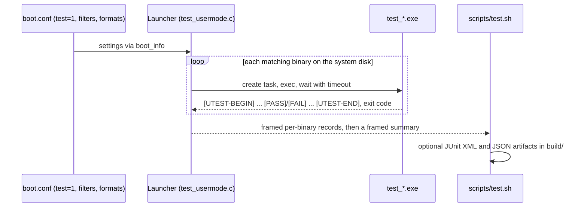

<!-- docs: covers=todo/00-infrastructure/TODO-04-usermode-test-framework.md sources=user/include/test.h,user/test,src/kernel/test/test_usermode.c,include/kernel/test/test_usermode.h,scripts/test.sh reviewed=2026-09-28 order=5 -->
# User-Mode Test Framework

## What is it?

The user-mode test framework tests the operating system from the outside, the way applications see it. Test programs are ordinary `test_*.exe` user-mode binaries, built into the system disk; after boot the kernel launches each one through the real loader and syscall path, collects its verdict and reports the run over serial. It is modelled on Linux kselftest and the Windows Hardware Lab Kit, and it catches bugs that in-kernel unit tests cannot see: a broken syscall ABI, a loader regression or a Win32 thunk that returns the wrong value.

## How does it work?



- **Test binaries.** Each file in [`user/test/`](../../user/test/) exercises one area: syscalls, the C library, IPC, processes, file I/O, Win32 thunks, the ELF, PE32+ and EIF loaders, fault injection, stress and performance. They are built by the normal build and copied onto the system disk.
- **Assertion header.** [`user/include/test.h`](../../user/include/test.h) is a header-only set of macros (`UTEST_BEGIN`, `UTEST_ASSERT`, `UTEST_SKIP`, `UTEST_END`) that print markers over `SYS_WRITE` and count results; `UTEST_END` reports the counts to the kernel, and `main` returns the failure count as its exit code. No kernel headers are involved; a test sees only the user ABI.
- **Launcher.** [`test_usermode.c`](../../src/kernel/test/test_usermode.c) scans the disk for `test_*.exe`, runs the binaries one at a time with a timeout, and classifies each result from its exit status, the timeout, and the counters `UTEST_END` submits through the `SYS_TEST_REPORT` syscall. The printed markers are diagnostics for people, not verdict inputs. A binary that exits 0 without reaching `UTEST_END` still counts as passed, and is tallied as unreported.
- **Output formats.** Plain text is always on; TAP, JUnit XML and JSON are opt-in. The formats and their gates are described in [User-Mode Test Output Formats](../testing/usermode-output-formats.md).
- **Kernel-side coverage.** The launcher's pure helpers have their own unit tests in [`test_usermode_launcher.c`](../../src/kernel/test/test_usermode_launcher.c), run by the [kernel test harness](kernel-test-harness.md).

## What are its interfaces?

| Interface | Purpose |
| --------- | ------- |
| `UTEST_BEGIN(name)`, `UTEST_ASSERT(cond, msg)`, `UTEST_SKIP(msg)`, `UTEST_END()` | Write a test binary ([`test.h`](../../user/include/test.h)) |
| `UTEST_PERF(metric, value_ns)` | Report a performance measurement |
| `test_usermode_run()`, `test_usermode_set_filter()`, `test_usermode_set_timeout_ms()` | Launcher entry points ([`test_usermode.h`](../../include/kernel/test/test_usermode.h)) |
| `test=1`, `utest_filter=<glob>`, `utest_timeout_ms=`, `tap=1`, `xml=1`, `json=1` | `boot.conf` keys that select and format a run |
| `UTEST_FILTER=<glob>`, `TAP=1`, `XML=1`, `JSON=1` | The same settings as [`scripts/test.sh`](../../scripts/test.sh) arguments |

## How do I use it?

A minimal test binary:

```c
#include "test.h"

UTEST_DEFINE_STATE();

int main(void) {
    UTEST_BEGIN("test_example");
    UTEST_ASSERT(1 + 1 == 2, "arithmetic works");
    UTEST_END();
    return g_fail;
}
```

Run every kernel and user-mode test, or narrow the user-mode side to some binaries:

```bash
bash scripts/test.sh                               # kernel suites, then every test_*.exe
bash scripts/test.sh UTEST_FILTER='test_loader_*'  # only the loader binaries
bash scripts/test.sh JSON=1                        # also writes build/test-results.json
```

The launcher ends the user-mode run with a summary of the form `=== N passed, N failed, N skipped of N total ===`, logged under a per-boot framed tag (`UTEST-<8 hex digits>:`) rather than a bare `UTEST:`. A test binary writes to the same serial line and could print a lookalike, so `scripts/test.sh` accepts only records carrying the frame; consumers must do the same, as [User-Mode Test Output Formats](../testing/usermode-output-formats.md) describes. Which platforms are expected to pass which binaries, and how to treat known-flaky patterns, is in the [User-Mode Test Environment Matrix](../testing/usermode-env-matrix.md).

## What is not implemented yet?

The core framework has shipped; nine review-spawned sections are parked with named blockers:

- **Fault selectors.** The PEB-frames fault site has no positive ring-3 regression ([section 20](../../todo/00-infrastructure/TODO-04-usermode-test-framework.md#20-site-targeted-and-pmm-countdown-fault-selectors)), and ordinal selectors are not yet migration-safe ([section 21](../../todo/00-infrastructure/TODO-04-usermode-test-framework.md#21-naming-forks-child-pml4-allocation-and-failing-that-fork-closed)).
- **ABI fingerprint.** The fingerprint hashes syscall numbers but not argument counts, so a signature change does not bump it: [section 41](../../todo/00-infrastructure/TODO-04-usermode-test-framework.md#41-post-ship-follow-up-backfill-orphan-cohort-2026-07-31).
- **Loader mismatch proof.** The identity-mismatch branch and the timeout integration are not proven end to end with a sacrificial binary: [section 47](../../todo/00-infrastructure/TODO-04-usermode-test-framework.md#47-end-to-end-proof-of-the-loaders-identity-mismatch-branch).
- **Saturated klog ring.** The fix for ring-dependent assertions is not proven at a saturated ring: [section 55](../../todo/00-infrastructure/TODO-04-usermode-test-framework.md#55-klog-ring-assertions-that-depend-on-how-much-the-boot-logged).
- **Degraded reap.** Whether a degraded capture-tree reap should poison the rest of the boot awaits a policy decision, and the abort cause is not yet in the machine artifacts: [section 56](../../todo/00-infrastructure/TODO-04-usermode-test-framework.md#56-fork-publication-interlocked-with-the-capture-tree-reap).
- **Clock-independent waits.** Launcher waits have deadlines but no escape that survives a stalled monotonic clock: [section 58](../../todo/00-infrastructure/TODO-04-usermode-test-framework.md#58-launcher-waits-bounded-independently-of-the-monotonic-clock).
- **Capture reconciliation.** A provisional capture report is not reconciled against the record census before refusing a run: [section 59](../../todo/00-infrastructure/TODO-04-usermode-test-framework.md#59-capture-reconciliation-runs-on-the-default-test-path-not-only-for-artifacts).
- **Retention holds.** A record whose lease census can never complete can hold disk forever: [section 62](../../todo/00-infrastructure/TODO-04-usermode-test-framework.md#62-detaching-an-age-candidate-before-classifying-it).

## How does it compare with Windows 11 and Linux?

Windows validates user-mode behaviour with the Hardware Lab Kit and TAEF, and Linux with kselftest, which emits TAP only. This framework emits TAP, JUnit XML and JSON from one run, tests three executable formats (ELF, PE32+ and EIF) through one loader, and runs statically linked Win32 tests natively rather than under an emulation layer such as Wine.

## See also

- [User-Mode Test Framework roadmap](../../todo/00-infrastructure/TODO-04-usermode-test-framework.md)
- [User-Mode Test Output Formats](../testing/usermode-output-formats.md)
- [User-Mode Test Environment Matrix](../testing/usermode-env-matrix.md)
- [Kernel Test Harness](kernel-test-harness.md)
