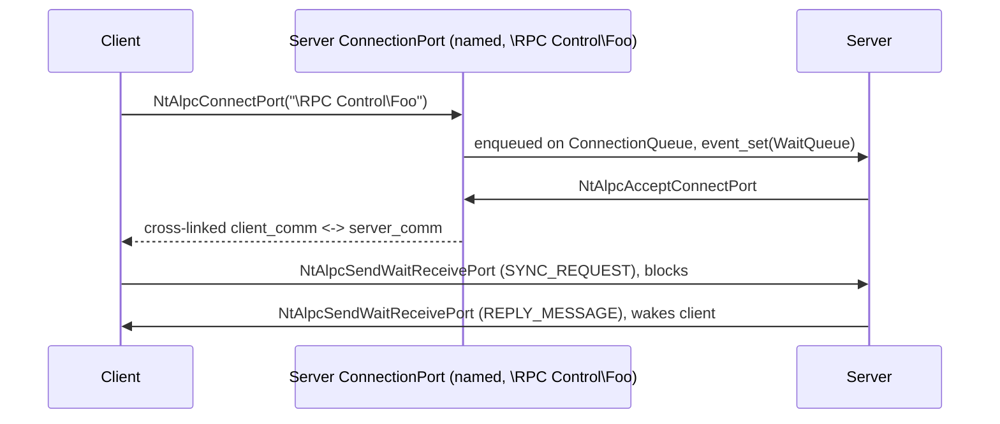

<!-- docs: covers=todo/02-kernel-core/TODO-24-alpc-message-ports.md sources=include/kernel/ipc/alpc.h,include/kernel/ipc/alpc_port.h,src/kernel/ipc/alpc.c,src/kernel/ipc/alpc_port.c,src/kernel/nt/nt_alpc.c,include/kernel/nt/nt_alpc.h,src/kernel/test/test_alpc.c reviewed=2026-09-28 order=24 -->
# ALPC and Message Ports

## What is it?

Advanced Local Procedure Call (ALPC) is the kernel's connection-oriented message-passing substrate: a typed, reference-counted port object, a three-way connect/accept handshake, and synchronous send-wait-reply semantics with a server able to wait for exactly one client's reply. It is the primitive the Win32 subsystem server (CSRSS), RPC's local transport, and COM local activation all build on; the existing pipe/shared-memory/signal IPC has no connection-oriented reply routing to substitute for it. Six of the sixteen `NtAlpc*` syscalls are real engine-backed handlers; the other ten are registered stubs waiting on later sections of the same roadmap file.

## How does it work?

`ALPC_PORT` is a plain Object Manager body (`ObpAlpcPortType`, registered by `alpc_port_init()` from `alpc_init()` in `boot_phase3`) with three subtypes: a named server connection port, and the unnamed client/server communication ports each side gets after a handshake ([`alpc_port.h`](../../include/kernel/ipc/alpc_port.h)). `AlpcCreatePort()` publishes a named port under `\RPC Control\<name>` in the Object Manager namespace. `AlpcConnectPort()` builds a connection-request record and enqueues it on the server's `ConnectionQueue` under an `event_t`; `AlpcAcceptConnectPort()` dequeues it, and on accept cross-links a fresh `server_comm`/`client_comm` pair (`ConnectedPort` on each pointing at the other, each holding a reference) so the two communication ports are the two ends of the same conversation.



`NtAlpcSendWaitReceivePort` implements three paths over that connection: receive-only (dequeue `MessageQueue` under `port->Lock`), datagram send (allocate a `PORT_MESSAGE_ENTRY`, enqueue on the peer, no wait), and synchronous request (enqueue with `WaitingForReply=true`, block the caller's own `event_t` until a matching `MessageId` reply arrives or the port disconnects). Two-port operations (a sync send touching both the sender's `PendingQueue` and the peer's `MessageQueue`) always lock both ports in address order to avoid deadlocking against a concurrent disconnect. Asynchronous delivery works through the existing I/O completion port machinery rather than a mapped ring buffer: `NtAlpcSetInformation(AlpcAssociateCompletionPortInformation)` attaches an IOCP to a port, and every send additionally posts a notification packet there while the message body stays on `MessageQueue`. A port created with `ALPC_PORTFLG_WAITABLE_PORT` also exposes a manual-reset `event_t` that `NtWaitForSingleObject` can wait on directly.

Client identity is captured at connect time: the connecting thread's effective token (impersonation token, or the task's primary token) is Ob-referenced onto the connection request, duplicated at accept with the negotiated QoS level (`min(client, listener)`, so a listener can never raise a client's exposure), and stored on the server communication port before its handle is published. `AlpcImpersonateClientOfPort()` lets the server adopt that token on its own thread, gated by a non-amplification check (same principal, integrity level not raised, no elevation gained, privileges and groups a subset) unless the server holds `SeImpersonatePrivilege`.

Large-data transfer through mapped port sections (§6), most of the `NtAlpcQueryInformation`/`SetInformation`/`CancelMessage` info classes (§9), the CSRSS `\Windows\ApiPort` bootstrap (§10), message zones and resource reserves (§11), and the live port monitor (§12) are all specified but unbuilt, gated by one shared decision: `SSDT_HANDLER` and `zw_dispatch` cap every syscall at six `uint64_t` arguments, and the real ALPC ABI needs eight to eleven (`NtAlpcConnectPort` alone takes eleven). Widening that transport is an ABI change reserved for an operator decision, so the six shipped handlers deliberately discard the arguments (`PortContext`, `ConnectionMessage`, `ConnMsgAttr`) that would not fit.

## What are its interfaces?

| Interface | Purpose |
| --- | --- |
| `ALPC_PORT`, `PORT_MESSAGE`, `ALPC_PORT_ATTRIBUTES` | The port object and wire message ABI ([`alpc.h`](../../include/kernel/ipc/alpc.h), [`alpc_port.h`](../../include/kernel/ipc/alpc_port.h)) |
| `AlpcCreatePort()`, `AlpcConnectPort()`, `AlpcAcceptConnectPort()`, `AlpcDisconnectPort()` | The connection handshake ([`alpc_port.c`](../../src/kernel/ipc/alpc_port.c)) |
| `AlpcAllocateMessage()`, `AlpcFreeMessage()`, `AlpcSendWaitReceivePort()` | The message pool and the send/wait/receive/reply engine |
| `AlpcAssociateCompletionPort()` | Attach an I/O completion port as the async notification channel |
| `AlpcImpersonateClientOfPort()` | Server-side client token impersonation |
| `NtAlpcCreatePort` (`0x010F`), `NtAlpcConnectPort` (`0x0110`), `NtAlpcAcceptConnectPort` (`0x0112`), `NtAlpcSendWaitReceivePort` (`0x0113`), `NtAlpcDisconnectPort` (`0x0114`) | The five real syscalls ([`nt_alpc.c`](../../src/kernel/nt/nt_alpc.c)) |
| `NtAlpcSetInformation` (`0x011D`) | Real for `AlpcAssociateCompletionPortInformation` only |

## How do I use it?

ALPC starts on every boot in Phase 3 as part of `alpc_init()`; there is nothing to enable.

```bash
bash scripts/test.sh SUITE=ipc    # or: make test-ipc
```

The suite lives in [`test_alpc.c`](../../src/kernel/test/test_alpc.c). A kernel-resident server creates a named port with `AlpcCreatePort()`, a client connects by name with `AlpcConnectPort()`, and both sides exchange messages through `AlpcSendWaitReceivePort()` after the server accepts. From user mode, the same handshake goes through the five real `NtAlpc*` syscalls above; `NtAlpcSetInformation` is real for completion-port association only, and the other ten registered slots return `STATUS_NOT_IMPLEMENTED`.

## What is not implemented yet?

- **The 6-word SSDT transport for the full ALPC ABI.** An operator-reserved ABI decision; blocks `ZwAlpc*` aliases, full-width connect/accept negotiation, and `NtAlpcConnectPortEx` ([NtAlpc* SSDT Registration & Stub Retrofit](../../todo/02-kernel-core/TODO-24-alpc-message-ports.md#8-ntalpc-ssdt-registration--stub-retrofit)).
- **Large data transfer through mapped port sections.** `NtAlpcCreatePortSection`/`NtAlpcCreateSectionView` remain stubs; the design contract (cross-port section capability, object-direct view mapping) is written but no code shipped ([Large Data: Port Sections & View Mapping](../../todo/02-kernel-core/TODO-24-alpc-message-ports.md#6-large-data-port-sections--view-mapping)).
- **Most `NtAlpcQueryInformation`/`SetInformation` info classes and `NtAlpcCancelMessage`.** Blocked on the same transport cap or on the §6 message-attribute ABI ([NtAlpc QueryInformation, SetInformation & CancelMessage](../../todo/02-kernel-core/TODO-24-alpc-message-ports.md#9-ntalpc-queryinformation-setinformation--cancelmessage)).
- **The CSRSS `\Windows\ApiPort` bootstrap.** No `src/apps/csrss/` exists yet; the section is cascade-blocked on the §8 full-width connect negotiation ([CSRSS ApiPort Bootstrap](../../todo/02-kernel-core/TODO-24-alpc-message-ports.md#10-csrss-apiport-bootstrap)).
- **Message zones and resource reserves (pre-allocated buffers).** Cascade-blocked on the §9 info-class bodies and the §10 default `\Windows\ApiPort` zone ([Message Zones & Resource Reserves](../../todo/02-kernel-core/TODO-24-alpc-message-ports.md#11-message-zones--resource-reserves-pre-allocated-buffers)).
- **The live port monitor (`alpcmon.exe`) and per-port latency histogram.** No `src/apps/alpcmon/` exists yet; cascade-blocked on §8-§10 ([Live Port Monitor & IPC Profiler](../../todo/02-kernel-core/TODO-24-alpc-message-ports.md#12-live-port-monitor--ipc-profiler)).
- **In-message `ALPC_SECURITY_ATTR`, `NtAlpcCreateSecurityContext`/`DeleteSecurityContext`, and per-message token/work-on-behalf provenance.** Need the §6 message-attribute dispatcher ([Security: Client Token Capture & Impersonation](../../todo/02-kernel-core/TODO-24-alpc-message-ports.md#7-security-client-token-capture--impersonation)).

## How does it compare with Windows 11 and Linux?

The shipped core (connection-oriented ports, synchronous send-wait-reply with typed routing, async delivery, client identity capture and impersonation) matches Windows' ALPC model and already exceeds Linux's closest equivalent, `SOCK_SEQPACKET` Unix domain sockets, which has no typed reply routing and only `SCM_CREDENTIALS` for peer identity rather than full impersonation. What is missing is everything that turns the engine into a working subsystem: large data via port sections, the CSRSS bootstrap that would let a Win32 subsystem server exist, and the six-plus-argument syscalls the full ABI needs. The `\RPC Control\` port namespace, per-message SID query, and open-sender-process/thread calls have no Linux analogue at all. The planned live port monitor with a per-port P50/P99 latency histogram is a stated Impossible OS exclusive: neither Windows (WinObj is read-only, ETW needs a separate trace capture) nor Linux ships an always-on IPC latency profiler.

## See also

- [ALPC / Message Ports roadmap](../../todo/02-kernel-core/TODO-24-alpc-message-ports.md)
- [Object Manager](object-manager.md)
- [Native API and SSDT](native-api-ssdt.md)
