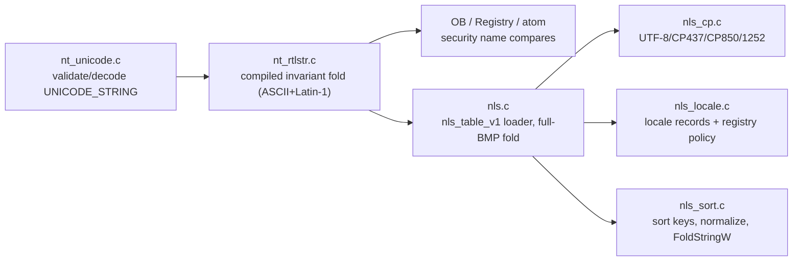

<!-- docs: covers=todo/02-kernel-core/TODO-13-atom-nls-locale-subsystem.md sources=include/kernel/nt/nls.h,include/kernel/nt/nls_cp.h,include/kernel/nt/nls_locale.h,include/kernel/nt/nls_sort.h,include/kernel/nt/nt_rtlstr.h,include/kernel/nt/nt_unicode.h,include/kernel/nt/nls_syscall_info.h,src/kernel/nt/nls.c,src/kernel/nt/nls_cp.c,src/kernel/nt/nls_locale.c,src/kernel/nt/nls_sort.c,src/kernel/nt/nt_rtlstr.c,src/kernel/nt/nt_unicode.c,src/kernel/nt/nt_misc.c,src/kernel/test/test_nls.c,src/kernel/env.c reviewed=2026-09-28 order=13 -->
# Atom, NLS and Locale Subsystem

## What is it?

The Atom, NLS (National Language Support) and Locale subsystem is the kernel's answer to "are these two names the same string". It gives the Object Manager, the Registry and the atom table one shared, invariant case-fold so `\BaseNamedObjects\Foo` and `\BaseNamedObjects\foo` resolve to the same object, and it gives user-mode code the Win32 primitives (atoms, code pages, locale metadata, sort keys) that sit on top of that fold. A global atom table interns short strings for window messages and classes. Everything here is kernel-resident and stateless except the atom table and the loaded NLS table, both of which are internally locked or published once at boot.

## How does it work?

Five layers build on each other. `nt_unicode.c` validates a caller's `UNICODE_STRING` and decodes it into a kernel buffer (`nt_decode_unicode_string`), so nothing downstream touches user memory directly. `nt_rtlstr.c` is the single compiled, invariant case-fold authority: `rtl_upcase_char` folds ASCII a-z and the Latin-1 Supplement (never Turkish dotless-i or German sharp-s, which stay a user-mode `LCMapStringEx` concern), and `RtlEqualUnicodeString`/`RtlCompareUnicodeString`/`CompareStringOrdinal` build on it. The Object Manager, Registry and atom table all fold names through this compiled authority for security-relevant compares, never through disk-sourced data. The per-task environment block is the exception: `env.c` has its own ASCII-only case-insensitive comparator, so two variable names that differ only in a non-ASCII letter (`Ä` and `ä`) stay distinct.

`nls.c` loads an optional `nls_table_v1` blob from `C:\Impossible\System\NLS\invariant.nls` at Phase 2 boot (`nls_init()`, subsystem `SUBSYS_NLS`), after the registry mounts. `nls_table_parse()` validates the blob (magic, version, CRC32, in-bounds chunks, no duplicate chunk type) before publishing it with a release store; a missing or invalid table falls back to a compiled ASCII+Latin-1 table with no boot failure. The loaded table extends the invariant fold to the full BMP (`nls_upcase_char`) for non-security paths such as display and sort keys; code points below U+0100 always route through the compiled `rtl_upcase_char`, so a tampered on-disk table can never change how two secured object names compare.

`nls_cp.c` converts between UTF-16LE and UTF-8, CP437, CP850 and Windows-1252, with strict, replace and best-fit modes, and answers `GetACP`/`GetOEMCP`-style policy questions from `HKLM\SYSTEM\Nls`. `nls_locale.c` holds six compiled locale records (invariant plus en-US, en-GB, de-DE, fr-FR, es-ES) with BCP-47 names, code pages and format strings, and binds the system/user/UI-language registry policy that `NtQueryDefaultLocale` reads. `nls_sort.c` builds memcmp-comparable sort keys, an explicit opt-in NFC/NFD normalizer over ASCII and Latin-1, and a narrow `FoldStringW` (digit and compatibility-zone folding only). Finally, the global atom table in `nt_misc.c` (16-bit IDs from `NT_STRING_ATOM_BASE`, string interning with refcounts) folds its lookups through the same `rtl_upcase_char` authority and gates the locked scan with a per-slot hash, so a slot whose hash or length differs costs one compare; an equal-hash, equal-length slot still costs a full name compare, so the worst case stays proportional to table size times name length.



## What are its interfaces?

| Interface | Purpose |
| --- | --- |
| `nt_decode_unicode_string()`, `nt_encode_unicode_string()` | Bounded UNICODE_STRING validate/decode/encode ([`nt_unicode.h`](../../include/kernel/nt/nt_unicode.h)) |
| `RtlUpcaseUnicodeString()`, `RtlEqualUnicodeString()`, `RtlCompareUnicodeString()`, `CompareStringOrdinal()` | The compiled invariant fold and compare authority ([`nt_rtlstr.h`](../../include/kernel/nt/nt_rtlstr.h)) |
| `nls_init()`, `nls_table_parse()`, `nls_upcase_char()`, `nls_char_type()`, `nls_get_version()` | NLS table loader, validator, full-BMP fold and classification ([`nls.h`](../../include/kernel/nt/nls.h)) |
| `nls_cp_to_utf16()`, `nls_cp_from_utf16()`, `nls_cp_get_acp()`, `nls_cp_get_oemcp()`, `nls_cp_get_info()` | Code page conversion and metadata ([`nls_cp.h`](../../include/kernel/nt/nls_cp.h)) |
| `nls_locale_by_lcid()`, `nls_locale_by_bcp47()`, `nls_locale_ui_fallback()` | Locale record lookup and MUI fallback chain ([`nls_locale.h`](../../include/kernel/nt/nls_locale.h)) |
| `nls_sort_key()`, `nls_normalize()`, `nls_fold_string()` | Invariant sort keys, opt-in normalization, narrow FoldStringW ([`nls_sort.h`](../../include/kernel/nt/nls_sort.h)) |
| `NtAddAtom`, `NtFindAtom`, `NtDeleteAtom`, `NtQueryInformationAtom` | Global atom table syscalls (`nt_misc.c`, wired in the [Native API TODO](../../todo/02-kernel-core/TODO-12-native-api-ssdt.md)) |
| `NtQueryDefaultLocale`, `NtQueryDefaultUILanguage` | Locale queries (`nt_misc.c`); `NtSetDefaultLocale` is registered but always returns `STATUS_PRIVILEGE_NOT_HELD` |
| `NtQuerySystemInformation(SystemNlsInformation)` | ACP/OEMCP/LCID/NLS-version snapshot ([`nls_syscall_info.h`](../../include/kernel/nt/nls_syscall_info.h)) |
| `NtIsUILanguageComitted`, `NtGetMUIRegistryInfo` | MUI queries (`nt_misc.c`); `NtFlushInstallUILanguage` is registered but always returns `STATUS_PRIVILEGE_NOT_HELD` |

## How do I use it?

The subsystem starts unconditionally in Phase 2 of every boot; there is no setting to enable it. `nls_init()` tries to load `C:\Impossible\System\NLS\invariant.nls` and falls back silently to the compiled table when the file is absent or invalid.

```bash
bash scripts/test.sh SUITE=nls    # or: make test-nls
```

A kernel consumer that needs a case-insensitive name compare calls `RtlEqualUnicodeString()` or folds through `rtl_upcase_char_inline()` in a hot loop; it must never call the disk-backed `nls_upcase_char()` for a security decision. A consumer that needs display-quality full-BMP casing, sorting or code-page conversion uses the `nls_upcase_char()`/`nls_sort_key()`/`nls_cp_*` family instead. The tests live in [`test_nls.c`](../../src/kernel/test/test_nls.c).

## What is not implemented yet?

- Changing the system or user locale and UI language: `NtSetDefaultLocale` and `NtFlushInstallUILanguage` fail closed with `STATUS_PRIVILEGE_NOT_HELD` whatever the caller holds, until the privilege check and per-user policy binding land ([Locale and LCID Metadata](../../todo/02-kernel-core/TODO-13-atom-nls-locale-subsystem.md#6-locale-and-lcid-metadata)).
- `NtGetNlsSectionPtr` (a read-only per-process-mapped NLS section) is blocked on SECTION objects and a per-process address space ([Native Atom/NLS/Locale Syscalls](../../todo/02-kernel-core/TODO-13-atom-nls-locale-subsystem.md#8-native-atomnlslocale-syscalls)).
- The full-BMP compatibility corpus (a generated `invariant.nls` from the Unicode Character Database) does not exist yet, so `GetStringTypeW`, public `FoldStringW` and OB/registry case-insensitivity above U+00FF stay narrow ([Tests and Compatibility Corpus](../../todo/02-kernel-core/TODO-13-atom-nls-locale-subsystem.md#10-tests-and-compatibility-corpus)).
- `LCMapStringEx`/`CompareStringEx` over the section-7 sort keys are not exposed, and the 2-band sort key format forecloses diacritic-drop and word-sort flags until it is redesigned ([Native Atom/NLS/Locale Syscalls](../../todo/02-kernel-core/TODO-13-atom-nls-locale-subsystem.md#8-native-atomnlslocale-syscalls)).
- `CP_THREAD_ACP` still resolves to the system ACP; per-thread locale storage does not exist ([Locale and LCID Metadata](../../todo/02-kernel-core/TODO-13-atom-nls-locale-subsystem.md#6-locale-and-lcid-metadata)).
- `NtCreateFile`/`NtOpenFile` still cast a `UNICODE_STRING` buffer to `char*` with no real UTF-16 decode ([Retrofit Kernel Consumers](../../todo/02-kernel-core/TODO-13-atom-nls-locale-subsystem.md#9-retrofit-kernel-consumers)).
- OB lookup is unconditionally case-insensitive; `OBJ_CASE_INSENSITIVE` is not read ([Retrofit Kernel Consumers](../../todo/02-kernel-core/TODO-13-atom-nls-locale-subsystem.md#9-retrofit-kernel-consumers)).
- Per-process LOCAL atom tables are user-mode, not kernel: they are owned by [`12-user-platform-sdk/TODO-04-ntdll-user-runtime.md`](../../todo/12-user-platform-sdk/TODO-04-ntdll-user-runtime.md), not this file.

## How does it compare with Windows 11 and Linux?

Windows ships the deepest surface here: per-locale `.nls` tables, linguistic collation, and full normalization, but its case-insensitivity is wired directly into the kernel object manager. Linux pushes almost all of this to user space (glibc/ICU) and keeps its VFS strictly byte-wise case-sensitive. Impossible OS centralizes one compiled kernel case-fold authority that the Object Manager, Registry and atom table all consume, ships the same `nls_table_v1` loader-plus-fallback pattern as Windows' `l_intl.nls`, and deliberately keeps culture-aware collation and full normalization in user mode rather than the kernel, matching the NT design rather than extending it. Code page and sort-key coverage (UTF-8, CP437/CP850/1252, invariant `LCMAP_SORTKEY`) is complete for the three code pages it targets; full-BMP casing and DBCS providers are the open gap against Windows 11.

## See also

- [Atom, NLS & Locale Subsystem roadmap](../../todo/02-kernel-core/TODO-13-atom-nls-locale-subsystem.md)
- [Object Manager](object-manager.md)
- [PEB, TEB and the User-Mode ABI](peb-teb-user-abi.md)
- [Registry](registry.md)
