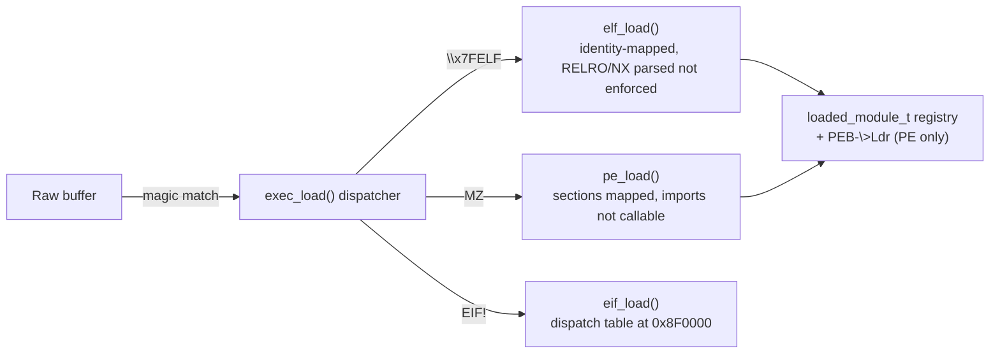

<!-- docs: covers=todo/02-kernel-core/TODO-17-binary-system.md sources=src/kernel/exec.c,include/kernel/exec.h,src/kernel/elf.c,include/kernel/elf.h,src/kernel/pe.c,include/kernel/pe.h,src/kernel/eif.c,include/kernel/eif.h,specs/eif-format.md,src/kernel/sched/task.c reviewed=2026-09-28 order=17 -->
# Binary Format System

## What is it?

The binary format system is the multi-format executable loader every user-mode program goes through. `exec_load()` auto-detects a binary's format from its magic bytes and dispatches to the matching loader: ELF (`\x7FELF`), PE32+ (`MZ`), or EIF (`EIF!`), Impossible OS's own native format. It replaces a direct call to the ELF loader that used to be hardwired into process creation, so the same entry point handles a Linux-compatible binary, a Windows-compatible binary, and a native binary without the caller knowing which one it got.

## How does it work?

`exec_init()` runs in boot Phase 3 and registers three formats in a fixed 8-slot table (`EXEC_MAX_FORMATS`, [`exec.h`](../../include/kernel/exec.h)): ELF, EIF, and PE32+, each an `exec_format_t` pairing a magic pattern with a loader function. `exec_load()` (and its format-name-returning variant `exec_load_fmt()`) matches the buffer's leading bytes against the table and calls the winning loader, returning `ENOEXEC` for an unrecognized magic. `task_exec()` in [`task.c`](../../src/kernel/sched/task.c) calls `exec_load_fmt()` in place of the old direct ELF call, and is format-agnostic downstream: it locates the loaded image's page range with `exec_find_module_by_pc()` rather than hardcoding the ELF address window, so PE and EIF binaries flow through the same process-setup path as ELF.

The **ELF loader** (`elf_load()`, [`elf.c`](../../src/kernel/elf.c)) accepts `ET_EXEC` and `ET_DYN` (PIE), validates every `PT_LOAD` segment falls inside the user range (`USER_ELF_BASE`..`USER_ELF_END`), and copies segments in a two-pass sequence: validate every program header first, copy only after all pass, so a malformed ELF never mutates a live user frame. It parses `PT_GNU_STACK`, `PT_GNU_RELRO` and `PT_GNU_PROPERTY` (CET IBT/SHSTK flags) into an `elf_load_result`, but `elf_exec_wrapper()` (the function `exec_init()` actually registers) only checks the `success` flag and discards that result, so NX-stack, RELRO and CET are parsed and logged, never enforced. Segments are written at their fixed user addresses. Each process does have its own PML4: a fork-then-exec first moves the image window onto private zeroed frames, and a launcher-spawned task gets a fresh one from `vmm_create_user_pml4()`, although its image pages are still backed by kernel identity-mapped frames. What does not exist yet is a per-segment mapping call (`vmm_map_pages()`) that would give each segment its own R/W/X permissions.

The **EIF loader** (`eif_load()`, [`eif.c`](../../src/kernel/eif.c)) reads a 64-byte header (magic `0x21464945`, spec at [`specs/eif-format.md`](../../specs/eif-format.md)), validates segment and import tables against a set of untrusted-input rules (count caps, non-overlapping ranges, entry point inside an executable segment), copies segments, and writes a syscall dispatch table (an array of `{syscall_id, available}` pairs, up to `EIF_MAX_IMPORTS`) at the fixed user address `0x8F0000`, inside the image window; the program reads a service number from it and issues `SYSCALL` itself. It logs the measured load time in microseconds after the timed region ends, so the log write itself is never inside the measurement.

The **PE32+ loader** goes furthest in header parsing but the shortest distance into being runnable. `pe_validate()` ([`pe.c`](../../src/kernel/pe.c)) checks the DOS/COFF/optional headers, rejects a 32-bit PE (`Magic 0x10B`) and non-x86-64 machine types, and returns zero-copy pointers into the buffer. `pe_load()` maps each section with permissions derived from `Characteristics`, maps the PE headers read-only for introspection, and registers `.pdata` (`DataDirectory[3]`) with the module registry so the exception-dispatch unwinder can find it later. The import resolver walks the Import Directory and resolves names against small built-in `kernel32.dll` (14 exports) and `ntdll.dll` (96 exports) tables by binary search, but it writes the raw SSDT service number into the IAT slot rather than a callable address: a PE binary that actually calls one of its imports faults, because nothing yet provides the user-mode SYSCALL trampoline that would make the IAT entry executable code.

A loaded image is registered as a `loaded_module_t` ([`exec.h`](../../include/kernel/exec.h)) in a spinlock-protected, 64-entry global table sorted by base address (`pe_load()` registers PE images itself; `task_exec` registers ELF and EIF images only when no module already covers the entry address, so a re-exec in the same window can keep the previous entry), consumed by the crash-dump module stream and by `exec_find_module_by_pc()` for address-to-module lookup. PE modules are additionally linked into all three `PEB->Ldr` lists (`InLoadOrder`, `InMemoryOrder`, `InInitializationOrder`).



## What are its interfaces?

| Interface | Purpose |
| --- | --- |
| `exec_load()`, `exec_load_fmt()`, `exec_load_path()` | Detect format and dispatch; `_path` reads via VFS ([`exec.h`](../../include/kernel/exec.h)) |
| `exec_register_format()`, `exec_init()` | Register a format handler at boot; up to 8 formats |
| `elf_load()`, `elf_validate()` | ELF64 header/segment validation and load ([`elf.h`](../../include/kernel/elf.h)) |
| `pe_validate()`, `pe_load()`, `pe_lookup_export()` | PE32+ header validation, section load, export lookup ([`pe.h`](../../include/kernel/pe.h)) |
| `eif_load()` | EIF header/segment/import validation and load ([`eif.h`](../../include/kernel/eif.h)) |
| `exec_register_module()`, `exec_find_module_by_pc()`, `exec_iterate_modules()` | The `loaded_module_t` registry: register, address lookup, enumerate |

## How do I use it?

The dispatcher and all three loaders are always on; there is no setting.

```bash
bash scripts/test.sh SUITE=exec     # or: make test-exec
```

`task_exec()` calls `exec_load_fmt()` automatically on every process creation; nothing else needs to invoke it directly. The suite in [`test_exec.c`](../../src/kernel/test/test_exec.c) covers magic-based routing, `ENOEXEC`/`ENOENT` handling, ELF segment validation and the malformed-ELF rejection tests, and the PE32+ header parser.

## What is not implemented yet?

- Per-segment mapping and permissions: there is no `vmm_map_pages()`, so segments are not mapped with their own R/W/X permissions, and a launcher-spawned image still sits on kernel identity-mapped frames rather than private ones ([Enhanced ELF Loader](../../todo/02-kernel-core/TODO-17-binary-system.md#2-enhanced-elf-loader)).
- NX stack, RELRO write-protection, and CET enforcement for ELF are parsed but never applied: `elf_exec_wrapper()` discards the security fields `elf_load()` computed ([ELF Security Segments](../../todo/02-kernel-core/TODO-17-binary-system.md#3-elf-security-segments-gnu_stack-relro-gnu_property)).
- PE imports are not callable: the IAT holds a raw SSDT service number rather than a trampoline, so no PE binary can actually invoke an imported function yet ([PE32+ Import Table Resolver](../../todo/02-kernel-core/TODO-17-binary-system.md#9-pe32-import-table-resolver-win32-dispatch)).
- PE base relocation, TLS directory processing, and Load Config/CFG parsing are all unimplemented, each blocked on a shared "mapped-aware reads" prerequisite in the section loader ([PE32+ Base Relocation](../../todo/02-kernel-core/TODO-17-binary-system.md#10-pe32-base-relocation), [TLS](../../todo/02-kernel-core/TODO-17-binary-system.md#11-pe32-tls-directory-processing), [Load Config](../../todo/02-kernel-core/TODO-17-binary-system.md#12-pe32-load-config-and-cfg-bitmap)).
- The ELF dynamic linker (shared library loading), ASLR for all three formats, and ELF `PT_TLS` are unimplemented, all blocked on per-segment mapping into a process's own address space ([ELF Dynamic Linker](../../todo/02-kernel-core/TODO-17-binary-system.md#14-elf-dynamic-linker), [ASLR](../../todo/02-kernel-core/TODO-17-binary-system.md#15-aslr----address-space-layout-randomization), [PT_TLS](../../todo/02-kernel-core/TODO-17-binary-system.md#18-elf-pt_tls-template-loading)).
- `elf2eif`, the host-side ELF-to-EIF converter, and EIF code signing are both unimplemented ([elf2eif](../../todo/02-kernel-core/TODO-17-binary-system.md#13-elf2eif-host-side-converter), [EIF Code Signing](../../todo/02-kernel-core/TODO-17-binary-system.md#17-eif-code-signing)).
- Shebang (`#!`) dispatch is unimplemented; it needs caller-argv passing through `exec_load()`, which does not exist yet ([Script/Shebang Interpreter Support](../../todo/02-kernel-core/TODO-17-binary-system.md#16-scriptshebang-interpreter-support)).

## How does it compare with Windows 11 and Linux?

Windows loads only PE32+ natively; Linux loads only ELF natively. Impossible OS's dispatcher already recognizes all three formats by magic and routes each to a real loader, which neither of the other two does at the kernel level. Where Impossible OS is behind both: Windows and Linux each run their native format end to end (imports callable, relocations applied, TLS working); today only EIF programs run end to end, because EIF deliberately has no name-based imports: a program reads SSDT service numbers from its dispatch table and issues `SYSCALL` itself, and EIF relocation and TLS directories are still planned extensions of the format. ELF loads and runs but without full physical isolation, NX, or RELRO enforcement. PE parses correctly but cannot yet execute an imported call.

## See also

- [Binary Format System roadmap](../../todo/02-kernel-core/TODO-17-binary-system.md)
- [Kernel Image and Module Registry](kernel-image-module-registry.md)
- [PEB, TEB and the User-Mode ABI](peb-teb-user-abi.md)
- [Native API and SSDT](native-api-ssdt.md)
- [Kernel Security Hardening](kernel-security-hardening.md)
